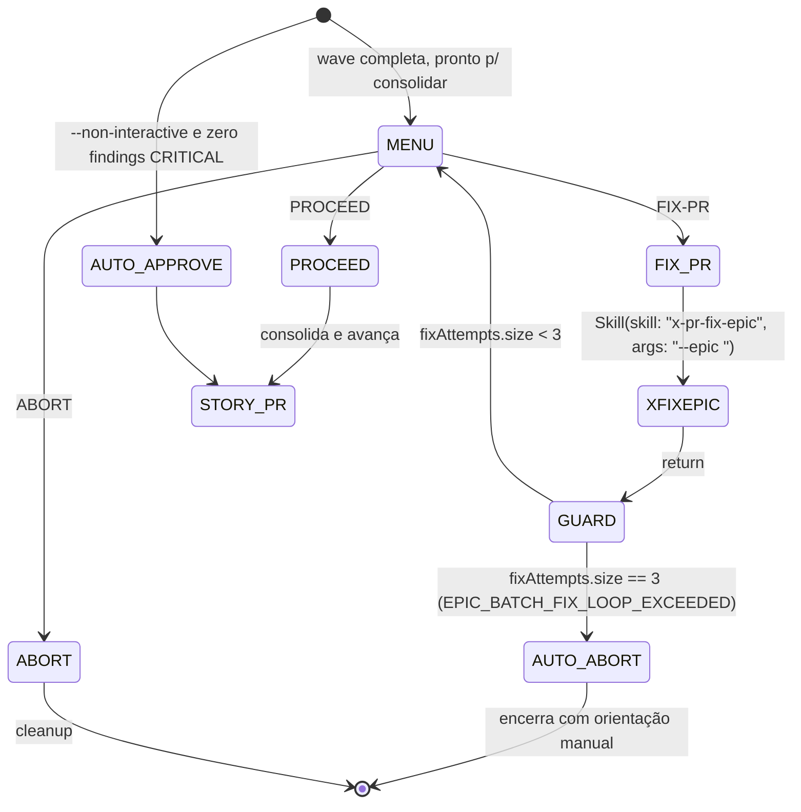

# História: Retrofit `x-epic-implement` Batch PR Gate

**ID:** story-0043-0004
**Chave Jira:** —
**Status:** Pendente

## 1. Dependências

| Blocked By | Blocks |
| :--- | :--- |
| story-0043-0001 | — |

> Paralela com story-0043-0002, 0043-0003, 0043-0005, 0043-0006 após story-0043-0001 concluir. **Nota:** TASK-0043-0004-001 tem dependência COALESCED com TASK-0043-0003-004 (ambas mexem em `x-epic-implement/SKILL.md`).

## 2. Regras Transversais Aplicáveis

| ID | Título |
| :--- | :--- |
| RULE-001 | Source-of-Truth Invariant |
| RULE-002 | Fixed-Option Menu Canônico |
| RULE-003 | Default Interactive, Opt-out via `--non-interactive` |
| RULE-004 | FIX-PR Loop-Back Obrigatório |
| RULE-005 | Rule 13 Invocation Patterns |
| RULE-006 | Atomic, Reversible Commits |
| RULE-007 | State File Schema Uniforme |

## 3. Descrição

Como **tech lead executando `/x-epic-implement`**, eu quero que a consolidação de PRs de wave (batch approval gate) abra menu estruturado por default, e que a opção FIX-PR invoque `x-pr-fix-epic` (que varre todos os PRs do epic de uma vez) e retorne ao mesmo menu.

Hoje o gate de batch PR consolidation é auto-approve quando nenhuma finding CRITICAL existe, e opt-in via `--manual-batch-approval` caso contrário. A auto-approve silenciosa é adequada para tech-debt pipelines mas esconde oportunidades de correção em lote (findings não-CRITICAL mas úteis). Esta história inverte: menu sempre aberto; `--non-interactive` ativa auto-approve; `--manual-batch-approval` depreciado.

### 3.1 Localização da Mudança

- Arquivo primário: `java/src/main/resources/targets/claude/skills/core/dev/x-epic-implement/SKILL.md`
- Pontos de inserção (do arquivo atual):
  - Bloco de batch consolidation approval (~linhas 752–768)
- **Coordenação:** TASK-0043-0003-004 também altera este arquivo (ajusta invocação de `x-story-implement` com `--non-interactive`). As tasks devem ser COALESCED (Rule 15) ou sequenciadas com cuidado para evitar conflito de golden regen.

### 3.2 Comportamento Após Retrofit

- Default: menu com PROCEED (consolida e auto-merge do story-level PR) / FIX-PR (invoca `x-pr-fix-epic --epic <ID>`, loop-back) / ABORT (encerra epic com cleanup + estado preservado para resume)
- `--non-interactive` → auto-approve comportamento atual (sem findings CRITICAL)
- `--manual-batch-approval` depreciado com warning
- 3 FIX-PR consecutivos → gate encerra automaticamente com `EPIC_BATCH_FIX_LOOP_EXCEEDED` e orientação textual para retomada manual (nenhuma 4ª opção adicionada ao menu, per RULE-002)
- State file `plans/epic-<ID>/execution-state.json` ganha `batchGate.lastGateDecision` e `batchGate.fixAttempts[]`

### 3.3 Backward Compatibility

- Legacy `execution-state.json` (sem `batchGate`) lidos com fallback `null` / `[]`
- Epics em `planningSchemaVersion == "1.0"` continuam respeitados (Rule 19) — o batch gate só aplica comportamento novo quando schema é 2.0

## 3.5 Entrega de Valor

- **Valor Principal:** Tech lead vê findings não-CRITICAL em um menu acionável em vez de aceitá-las silenciosamente. FIX-PR em lote fica trivial.
- **Métrica de Sucesso:** 100% das execuções interativas de `x-epic-implement` abrem menu no gate de wave; `x-pr-fix-epic` invocável de dentro da skill sem sair.
- **Impacto no Negócio:** Reduz dívida técnica acumulada em PRs de tasks de epic (comentários não-blocker que hoje são ignorados em batch approval silencioso).

## 4. Definições de Qualidade Locais

### DoR Local (Definition of Ready)

- [ ] Rule 20 publicada (STORY-0043-0001 merged)
- [ ] `x-pr-fix-epic/SKILL.md` confirmado operacional com args `--epic <ID>`
- [ ] Frontmatter de `x-epic-implement/SKILL.md` confirmado com `Skill` + `AskUserQuestion`
- [ ] Coordenação com TASK-0043-0003-004 acordada (COALESCED — landam juntas)

### DoD Local (Definition of Done)

- [ ] Gate de batch consolidation reescrito: menu default com 3 opções
- [ ] FIX-PR handler: `Skill(skill: "x-pr-fix-epic", args: "--epic <EPIC_ID>")`
- [ ] `--non-interactive` documentado
- [ ] `--manual-batch-approval` depreciado com warning
- [ ] `execution-state.json` do epic estendido com `batchGate` subobject
- [ ] Golden regenerado + audit Rule 13 verde + audit Rule 20 parcial verde

### Global Definition of Done (DoD)

- **Cobertura:** não aplicável
- **Testes Automatizados:** golden diff do `x-epic-implement/SKILL.md`
- **Relatório de Cobertura:** JaCoCo
- **Documentação:** diff + CHANGELOG Unreleased
- **Persistência:** `batchGate` extension do `execution-state.json`
- **Performance:** não aplica

## 5. Contratos de Dados (Data Contract)

### 5.1 `plans/epic-<ID>/execution-state.json` — Extensão `batchGate`

| Campo | Tipo | M/O | Validações | Exemplo |
| :--- | :--- | :--- | :--- | :--- |
| `batchGate.lastGateDecision` | `Enum \| null` | M (novo) | sempre presente; `null` antes da 1ª interação; depois `PROCEED` \| `FIX_PR` \| `ABORT` | `"FIX_PR"` |
| `batchGate.fixAttempts` | `List<FixAttempt>` | O (novo, default `[]`) | ≤ 3 | ver Rule 20 §5.1 (com `delegateSkill = "x-pr-fix-epic"`) |
| `batchGate.waveIndex` | `Integer` | O | ≥ 0 (qual wave do epic está no gate) | `2` |

### 5.2 Error Codes

| Código | Condição | Mensagem (pt-BR) |
| :--- | :--- | :--- |
| `EPIC_BATCH_FIX_LOOP_EXCEEDED` | 3 FIX-PR consecutivos no batch gate | `"Loop de fix excedeu 3 tentativas no epic ${EPIC_ID} wave ${WAVE}; gate encerrado com ABORT automático. Retomar manualmente via --non-interactive ou edição do state file."` |

### 5.3 Event Schema

> Não se aplica.

## 6. Diagramas

### 6.1 Batch Consolidation Gate



## 7. Critérios de Aceite (Gherkin)

```gherkin
Cenario: Degenerate - auto-approve em pipeline orquestrado
  DADO /x-epic-implement EPIC-XXXX --non-interactive
  E zero findings CRITICAL na wave
  QUANDO batch consolidation gate alcancado
  ENTAO nenhum menu e exibido
  E consolidacao prossegue automaticamente

Cenario: Happy path - FIX-PR batch com x-pr-fix-epic
  DADO /x-epic-implement EPIC-XXXX sem flags
  E wave 2 completa com 3 PRs de task com comentarios
  QUANDO batch gate alcancado
  ENTAO menu com PROCEED/FIX-PR/ABORT exibido
  QUANDO operador seleciona FIX-PR
  ENTAO Skill(skill: "x-pr-fix-epic", args: "--epic XXXX") invocado
  E batchGate.fixAttempts recebe 1 entrada {delegateSkill: "x-pr-fix-epic", outcome: "applied"}
  E menu reapresenta
  QUANDO operador seleciona PROCEED
  ENTAO story-level PR e consolidado e wave 2 encerra

Cenario: Error - --manual-batch-approval deprecado
  DADO /x-epic-implement EPIC-XXXX --manual-batch-approval
  QUANDO skill inicia
  ENTAO warning DEPRECATED_FLAG emitido uma unica vez
  E comportamento identico ao default

Cenario: Boundary - 3 FIX-PR em sequencia encerram o gate com auto-ABORT
  DADO batch gate com 2 FIX-PR ja ocorridos
  QUANDO operador seleciona FIX-PR (3a)
  ENTAO apos retorno de x-pr-fix-epic o gate encerra automaticamente
  E log EPIC_BATCH_FIX_LOOP_EXCEEDED emitido
  E menu nao e reapresentado (nenhuma 4a opcao adicionada — RULE-002)
  E stdout contem orientacao textual para retomada manual

Cenario: Boundary - legacy execution-state.json sem batchGate
  DADO execution-state.json sem subobject batchGate
  QUANDO batch gate alcancado
  ENTAO campos lidos com fallback (lastGateDecision null, fixAttempts [])
  E proxima escrita inclui batchGate completo
```

### 7.1 Scenario Ordering (TPP)

Degenerate (auto-approve non-interactive) → Happy FIX-PR batch → Error deprecated → Boundary 3x → Boundary legacy state.

### 7.2 Mandatory Scenario Categories

- [x] Degenerate cases
- [x] Happy path
- [x] Error paths
- [x] Boundary values

### 7.3 TDD Implementation Notes

- Acceptance test: golden diff de `x-epic-implement/SKILL.md` (região do batch gate). Cuidar coalesce com TASK-0043-0003-004.

## 8. Tasks

### TASK-0043-0004-001: Reescrever batch consolidation gate em `x-epic-implement/SKILL.md`

- **Layer:** Doc (SKILL.md)
- **Test Type:** Verification
- **Size:** M
- **Dependencies:** —
- **Branch:** `feat/task-0043-0004-001-batch-gate-menu`
- **Testability:** COALESCED with TASK-0043-0003-004 (ambas no mesmo arquivo; commit único para garantir golden regen único)
- **Inputs:**
  - Rule 20 §Canonical Option Menu + FIX-PR handler
  - Atual batch consolidation (~linhas 752–768)
- **Outputs:**
  - `grep -n "AskUserQuestion" java/src/main/resources/targets/claude/skills/core/dev/x-epic-implement/SKILL.md` retorna match na região de batch gate
  - FIX-PR handler usa INLINE-SKILL `Skill(skill: "x-pr-fix-epic", args: "--epic <EPIC_ID>")`
  - `--manual-batch-approval` marcado DEPRECATED
- **Acceptance Criteria:**
  - [ ] Menu default com 3 opções PROCEED/FIX-PR/ABORT
  - [ ] Loop-back após retorno de `x-pr-fix-epic`
  - [ ] 3 fixes consecutivos → gate encerra com `EPIC_BATCH_FIX_LOOP_EXCEEDED` (nenhuma 4ª opção, per RULE-002)
  - [ ] `--non-interactive` equivale ao auto-approve atual

### TASK-0043-0004-002: Estender schema `execution-state.json` com `batchGate`

- **Layer:** Doc
- **Test Type:** Verification
- **Size:** S
- **Dependencies:** TASK-0043-0004-001
- **Branch:** `feat/task-0043-0004-002-state-batch-gate`
- **Testability:** REQUIRES_MOCK of TASK-0043-0001-002 (Rule 20 §5.1)
- **Inputs:**
  - Rule 20 §5.1
  - Atual schema em `x-epic-implement/SKILL.md`
- **Outputs:**
  - `grep -q "batchGate" java/src/main/resources/targets/claude/skills/core/dev/x-epic-implement/SKILL.md`
  - `grep -q "EPIC_BATCH_FIX_LOOP_EXCEEDED" java/src/main/resources/targets/claude/skills/core/dev/x-epic-implement/SKILL.md`
- **Acceptance Criteria:**
  - [ ] Exemplo JSON atualizado com subobject `batchGate`
  - [ ] Migração silenciosa documentada

### TASK-0043-0004-003: Regenerar golden de `x-epic-implement`

- **Layer:** Test
- **Test Type:** Verification
- **Size:** S
- **Dependencies:** TASK-0043-0004-001, TASK-0043-0004-002, TASK-0043-0003-004 (coalesced)
- **Branch:** `feat/task-0043-0004-003-regen-golden`
- **Testability:** INDEPENDENT
- **Inputs:**
  - Sources atualizados
- **Outputs:**
  - `.claude/skills/x-epic-implement/SKILL.md` byte-idêntico ao source
  - `mvn test -Dtest=*GoldenDiff*` verde
- **Acceptance Criteria:**
  - [ ] Escopo do diff contido em batch gate + invocação ajustada de `x-story-implement`
  - [ ] Audit Rule 13 green
  - [ ] Audit Rule 20 parcial green
