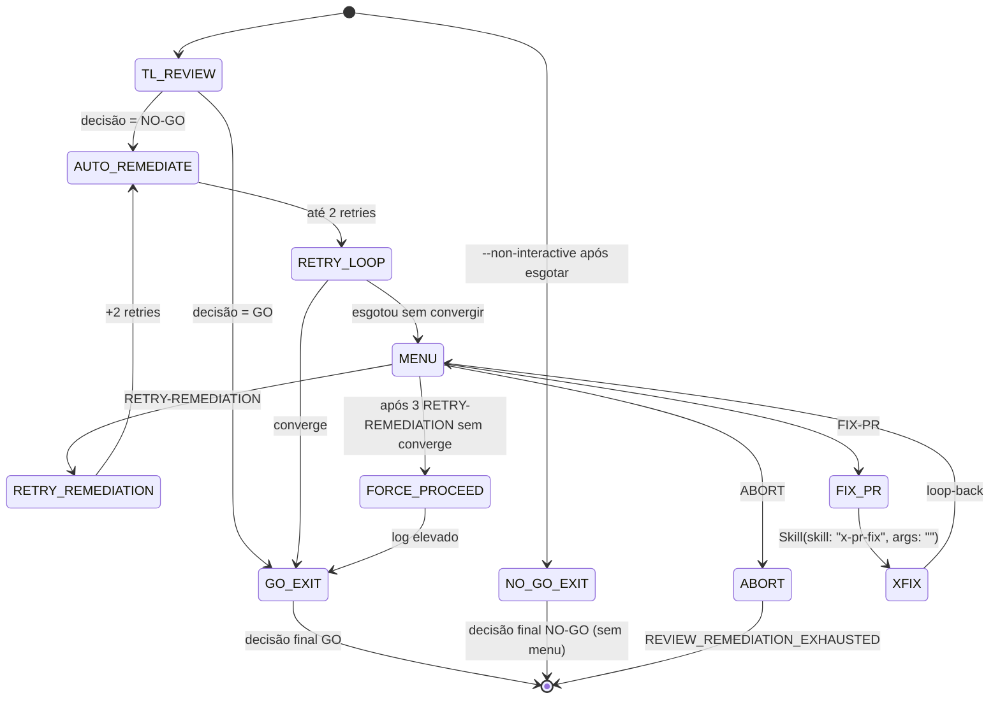

# História: Retrofit `x-review-pr` Exhausted-Retry Gate

**ID:** story-0043-0005
**Chave Jira:** —
**Status:** Pendente

## 1. Dependências

| Blocked By | Blocks |
| :--- | :--- |
| story-0043-0001 | — |

> Paralela com story-0043-0002, 0043-0003, 0043-0004, 0043-0006 após story-0043-0001 concluir.

## 2. Regras Transversais Aplicáveis

| ID | Título |
| :--- | :--- |
| RULE-001 | Source-of-Truth Invariant |
| RULE-002 | Fixed-Option Menu Canônico |
| RULE-003 | Default Interactive, Opt-out via `--non-interactive` |
| RULE-004 | FIX-PR Loop-Back Obrigatório |
| RULE-005 | Rule 13 Invocation Patterns |
| RULE-006 | Atomic, Reversible Commits |
| RULE-007 | State File Schema Uniforme |

## 3. Descrição

Como **desenvolvedor executando `/x-review-pr`**, eu quero que após esgotar os retries automáticos de auto-remediation (quando TL retorna NO-GO e os 2 retry-loops não convergem), a skill me apresente um menu estruturado em vez de terminar silenciosamente, para que eu possa escolher entre tentar mais uma rodada de remediation, fazer fix manual via `x-pr-fix`, ou abortar o review.

Hoje quando o Tech Lead Review devolve NO-GO, `x-review-pr` dispara auto-remediation agents (para `TEST_FAILURE`, `COVERAGE_GAP`, `CODE_QUALITY`) com até 2 retries. Se nenhum retry converge, a skill termina retornando NO-GO sem ação adicional. O operador descobre pelo log e precisa decidir manualmente o que fazer — sem nenhum atalho no fluxo. Esta história adiciona um gate ao fim do retry loop: menu com RETRY-REMEDIATION (dispara mais 2 retries / refresh de estado) / FIX-PR (invoca `x-pr-fix` no PR atual, loop-back ao menu) / ABORT (encerra com NO-GO final). Não altera o comportamento de auto-remediation dentro dos retries — apenas captura o fim da cadeia.

### 3.1 Localização da Mudança

- Arquivo primário: `java/src/main/resources/targets/claude/skills/core/review/x-review-pr/SKILL.md`
- Ponto de inserção: no fim da seção de NO-GO auto-remediation (~linhas 249–308), imediatamente antes do return/exit atual
- **Nuance:** skill hoje não tem state file persistente do review. Esta story introduz arquivo opcional `plans/review/<pr-number>/state.json` com schema Rule 20 §5.1 (apenas para resume via `--resume-review <pr>`).

### 3.2 Comportamento Após Retrofit

- Retry auto-remediation esgotado (2 retries sem convergir) → menu com 3 opções
  - **RETRY-REMEDIATION** (renomeado PROCEED no contexto desta skill): dispara novo par de retries via auto-remediation agents; ao fim, reapresenta menu
  - **FIX-PR**: `Skill(skill: "x-pr-fix", args: "<PR>")`; loop-back
  - **ABORT**: encerra com decisão final NO-GO + code `REVIEW_REMEDIATION_EXHAUSTED`
- `--non-interactive` → comportamento atual (exit com NO-GO sem menu)
- 3 RETRY-REMEDIATION consecutivos sem converge → FORCE-PROCEED aparece (marca review como GO com log elevado e responsabilidade humana)

### 3.3 Backward Compatibility

- Skill hoje é stateless entre invocações; o novo state file é opt-in (apenas escrito quando operador escolhe FIX-PR no menu)
- Chamadas existentes sem interação humana (pipelines orquestrados) passam `--non-interactive` e funcionam como antes

## 3.5 Entrega de Valor

- **Valor Principal:** NO-GO não vira dead-end. Operador tem 3 ações acionáveis dentro da skill.
- **Métrica de Sucesso:** 100% dos NO-GO com retry exhausted em invocações manuais resultam em menu em vez de exit silencioso.
- **Impacto no Negócio:** Reduz custo de contexto-switch em reviews que precisam fix manual (dev não precisa sair da skill, abrir outro terminal, rodar x-pr-fix, decidir próximo passo).

## 4. Definições de Qualidade Locais

### DoR Local (Definition of Ready)

- [ ] Rule 20 publicada (STORY-0043-0001 merged)
- [ ] Frontmatter de `x-review-pr/SKILL.md` confirmado com `Skill` + `AskUserQuestion`
- [ ] Linhas atuais de auto-remediation (~linhas 249–308) revalidadas no source
- [ ] Auto-remediation classificações `TEST_FAILURE`/`COVERAGE_GAP`/`CODE_QUALITY` continuam válidas

### DoD Local (Definition of Done)

- [ ] Gate adicionado ao fim do retry loop com 3 opções (RETRY-REMEDIATION / FIX-PR / ABORT)
- [ ] FIX-PR handler: Pattern 1 INLINE-SKILL `Skill(skill: "x-pr-fix", args: "<PR>")`
- [ ] `--non-interactive` documentado (preserva NO-GO silencioso atual)
- [ ] State file opt-in `plans/review/<pr>/state.json` documentado com schema Rule 20 §5.1
- [ ] Flag `--resume-review <pr>` documentada
- [ ] Error code `REVIEW_REMEDIATION_EXHAUSTED` para ABORT
- [ ] Golden regenerado + audit Rule 13/20 verde

### Global Definition of Done (DoD)

- **Cobertura:** não aplicável
- **Testes Automatizados:** golden diff do `x-review-pr/SKILL.md`
- **Relatório de Cobertura:** JaCoCo
- **Documentação:** diff + CHANGELOG Unreleased
- **Persistência:** novo state file opt-in
- **Performance:** não aplica

## 5. Contratos de Dados (Data Contract)

### 5.1 `plans/review/<pr>/state.json` — Novo (opt-in)

Schema completo per Rule 20 §5.1 (conteúdo idêntico). `delegateSkill` em `fixAttempts` é sempre `"x-pr-fix"` nesta skill.

### 5.2 Error Codes

| Código | Condição | Mensagem (pt-BR) |
| :--- | :--- | :--- |
| `REVIEW_REMEDIATION_EXHAUSTED` | Operador escolheu ABORT após retry loop esgotado | `"Review NO-GO final: operador abortou após ${N} tentativas de remediation no PR ${PR}"` |
| `REVIEW_FIX_LOOP_EXCEEDED` | 3 FIX-PR consecutivos | `"Loop de fix excedeu 3 tentativas no review do PR ${PR}; apresentando opção FORCE-PROCEED"` |

### 5.3 Event Schema

> Não se aplica.

## 6. Diagramas

### 6.1 Exhausted-Retry Gate



## 7. Critérios de Aceite (Gherkin)

```gherkin
Cenario: Degenerate - TL retorna GO em primeira passagem
  DADO /x-review-pr 402 e TL retorna GO sem findings
  QUANDO skill termina
  ENTAO nenhum menu e exibido
  E exit code 0

Cenario: Happy path - retry converge sem menu
  DADO /x-review-pr 402 e TL retorna NO-GO por TEST_FAILURE
  QUANDO auto-remediation converge em retry 1
  ENTAO TL e reinvocado e retorna GO
  E skill encerra sem menu

Cenario: Happy path - retry esgotado e FIX-PR
  DADO /x-review-pr 402 e TL retorna NO-GO por CODE_QUALITY
  QUANDO auto-remediation esgota 2 retries sem convergir
  ENTAO menu com RETRY-REMEDIATION/FIX-PR/ABORT e exibido
  QUANDO operador seleciona FIX-PR
  ENTAO Skill(skill: "x-pr-fix", args: "402") invocado
  E fixAttempts recebe 1 entrada
  E menu reapresenta
  QUANDO operador seleciona RETRY-REMEDIATION
  ENTAO novo par de retries dispara

Cenario: Error - --non-interactive mantem NO-GO silencioso
  DADO /x-review-pr 402 --non-interactive e retry esgotado
  QUANDO loop termina
  ENTAO nenhum menu e exibido
  E exit code NO-GO

Cenario: Boundary - 3 RETRY-REMEDIATION ativam FORCE-PROCEED
  DADO menu apos retry esgotado
  QUANDO operador seleciona RETRY-REMEDIATION 3 vezes sem converge
  ENTAO menu apresenta 4a opcao FORCE-PROCEED
  E log REVIEW_FIX_LOOP_EXCEEDED emitido
  QUANDO operador seleciona FORCE-PROCEED
  ENTAO review e marcado como GO com log elevado

Cenario: Boundary - ABORT gera code REVIEW_REMEDIATION_EXHAUSTED
  DADO menu exibido apos retry esgotado
  QUANDO operador seleciona ABORT
  ENTAO skill sai com code REVIEW_REMEDIATION_EXHAUSTED
  E state file plans/review/402/state.json nao e criado (ABORT sem persistir)
```

### 7.1 Scenario Ordering (TPP)

Degenerate (TL GO imediato) → Happy retry converge → Happy retry esgotado + FIX-PR → Error `--non-interactive` → Boundary FORCE-PROCEED → Boundary ABORT.

### 7.2 Mandatory Scenario Categories

- [x] Degenerate cases
- [x] Happy path
- [x] Error paths
- [x] Boundary values

### 7.3 TDD Implementation Notes

- Acceptance test: golden diff de `x-review-pr/SKILL.md` (escopo contido ao fim da seção de auto-remediation).
- Complementar: audit Rule 13 + Rule 20.

## 8. Tasks

### TASK-0043-0005-001: Adicionar exhausted-retry gate em `x-review-pr/SKILL.md`

- **Layer:** Doc (SKILL.md)
- **Test Type:** Verification
- **Size:** M
- **Dependencies:** —
- **Branch:** `feat/task-0043-0005-001-exhausted-gate`
- **Testability:** INDEPENDENT
- **Inputs:**
  - Rule 20 §Canonical Option Menu + FIX-PR handler
  - Atual bloco de auto-remediation (~linhas 249–308)
- **Outputs:**
  - `grep -n "AskUserQuestion" java/src/main/resources/targets/claude/skills/core/review/x-review-pr/SKILL.md` retorna match ao fim da seção de auto-remediation
  - FIX-PR handler INLINE-SKILL (verificação: `grep -qE 'Skill\(skill: "x-pr-fix"' java/src/main/resources/targets/claude/skills/core/review/x-review-pr/SKILL.md`)
- **Acceptance Criteria:**
  - [ ] Menu com 3 opções (RETRY-REMEDIATION/FIX-PR/ABORT)
  - [ ] Loop-back após `x-pr-fix`
  - [ ] 3 RETRY-REMEDIATION consecutivos → FORCE-PROCEED aparece
  - [ ] `--non-interactive` preserva exit silencioso atual

### TASK-0043-0005-002: Documentar state file opt-in + `--resume-review`

- **Layer:** Doc
- **Test Type:** Verification
- **Size:** S
- **Dependencies:** TASK-0043-0005-001
- **Branch:** `feat/task-0043-0005-002-state-resume`
- **Testability:** REQUIRES_MOCK of TASK-0043-0001-002 (Rule 20 §5.1)
- **Inputs:**
  - Rule 20 §5.1
  - Layout canônico `plans/<skill-domain>/<id>/state.json` da Rule 20 §3.7
- **Outputs:**
  - `grep -q "plans/review/" java/src/main/resources/targets/claude/skills/core/review/x-review-pr/SKILL.md`
  - `grep -q "resume-review" java/src/main/resources/targets/claude/skills/core/review/x-review-pr/SKILL.md`
  - `grep -q "REVIEW_REMEDIATION_EXHAUSTED" java/src/main/resources/targets/claude/skills/core/review/x-review-pr/SKILL.md`
- **Acceptance Criteria:**
  - [ ] Seção nova "State File (opt-in)" documenta schema e ciclo de vida
  - [ ] Flag `--resume-review <pr>` documentada
  - [ ] Error codes `REVIEW_REMEDIATION_EXHAUSTED` e `REVIEW_FIX_LOOP_EXCEEDED` listados

### TASK-0043-0005-003: Regenerar golden + smoke

- **Layer:** Test
- **Test Type:** Verification
- **Size:** S
- **Dependencies:** TASK-0043-0005-001, TASK-0043-0005-002
- **Branch:** `feat/task-0043-0005-003-regen-golden`
- **Testability:** INDEPENDENT
- **Inputs:**
  - Source atualizado
- **Outputs:**
  - `.claude/skills/x-review-pr/SKILL.md` byte-idêntico
  - `mvn test -Dtest=*GoldenDiff*` verde
- **Acceptance Criteria:**
  - [ ] Escopo do diff contido na seção de auto-remediation + nova seção State File
  - [ ] Audit Rule 13 green
  - [ ] Audit Rule 20 parcial green (ainda há outras skills retrofitando em paralelo)
