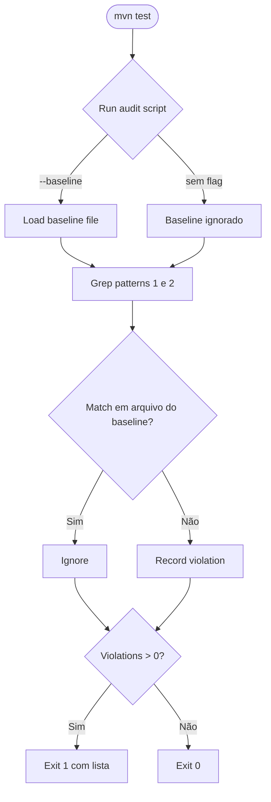

# História: CI Audit — Rule 20 Enforcement

**ID:** story-0043-0006
**Chave Jira:** —
**Status:** Concluída

## 1. Dependências

| Blocked By | Blocks |
| :--- | :--- |
| story-0043-0001 | — |

> Pode rodar em paralelo com 0043-0002, 0043-0003, 0043-0004, 0043-0005. Entretanto, **o audit só passa verde quando TODAS as retrofits estiverem concluídas**. Antes disso, o audit é executado em modo `--baseline` (permite pending waivers em skills ainda não retrofitadas) para não bloquear CI durante a migração.

## 2. Regras Transversais Aplicáveis

| ID | Título |
| :--- | :--- |
| RULE-001 | Source-of-Truth Invariant |
| RULE-002 | Fixed-Option Menu Canônico |
| RULE-003 | Default Interactive, Opt-out via `--non-interactive` |
| RULE-005 | Rule 13 Invocation Patterns |
| RULE-008 | Audit Enforcement |

## 3. Descrição

Como **mantenedor do repositório**, eu quero um audit automatizado (análogo ao da Rule 13) que rode em `mvn test` e reprova qualquer PR que reintroduza: (a) mensagem `HALT` textual em um SKILL.md sem `AskUserQuestion` emparelhado no mesmo arquivo, (b) uso de flags depreciadas (`--interactive`, `--manual-task-approval`, `--manual-contract-approval`, `--manual-batch-approval`) fora das seções `## Triggers` e `## Examples`.

Sem esse audit, a convenção da Rule 20 é aspiracional — qualquer futuro retrofit ou nova skill pode reintroduzir o anti-padrão que este épico elimina. O audit é o guard-rail que torna a convenção enforcement-grade.

### 3.1 Escopo do Audit

- **Diretório alvo:** `java/src/main/resources/targets/claude/skills/core/{ops,dev,review}/**` apenas. **Explicitamente excluído:** `core/lib/**` (skills utilitárias que não são gates interativos — ex.: `core/lib/x-lib-group-verifier/SKILL.md` usa `HALT` legitimamente em contexto não-gate). Qualquer expansão do escopo requer edição do script + justificativa.
- **Arquivos SKILL.md:** audit estrito — ambas as regras aplicam.
- **Arquivos `references/*.md`:** audit **diferenciado** — esses arquivos são documentação e legitimamente mencionam flags em headings, tabelas, prose (ex.: `core/ops/x-release/references/approval-gate-workflow.md` tem seção `## Interactive Workflow (--interactive)`). Regex 1 (HALT sem menu) continua aplicando; Regex 2 (flags depreciadas) aplica APENAS em blocos que pareçam instruções executáveis/delegação (linhas começando com `Skill(`, `Invoke`, bullets operacionais, snippets bash `$ `) — menções em prose/headings/tabelas são ignoradas.
- **Allowlist universal:** seções `## Triggers` e `## Examples` são allowlisted em todos os arquivos (bare-slash legítimo — usuário tipando no chat).
- **Regex 1 (HALT textual sem menu):** arquivos que contêm a palavra `HALT` em contexto de pause/exit sem `AskUserQuestion` no mesmo bloco (janela de ~30 linhas), aplicada aos arquivos no escopo acima.
- **Regex 2 (flags depreciadas — precisão tokenizada):** padrões que exigem **fim de token** para não casar sufixos. Em vez de `\b` (que casa `--interactive-merge`), usar lookahead por caractere terminador:
  - `--interactive(?=$|[\s\]\)},.:;!?])`
  - `--manual-task-approval(?=$|[\s\]\)},.:;!?])`
  - `--manual-contract-approval(?=$|[\s\]\)},.:;!?])`
  - `--manual-batch-approval(?=$|[\s\]\)},.:;!?])`
  - Aplicados apenas em contexto executável (ver regra diferenciada para `references/*.md` acima). Isso garante que `--interactive-merge` (usado em `core/dev/x-epic-implement/SKILL.md`) não seja incorretamente detectado como a flag depreciada `--interactive`.

### 3.2 Entregas

- Script `scripts/audit-interactive-gates.sh` executável em bash puro (portabilidade macOS + Linux CI)
- Teste Java wrapper `InteractiveGatesAuditTest` em `java/src/test/java/**/audit/` que executa o script via ProcessBuilder e asserta exit 0
- Integração ao pipeline `mvn test` (perfil `audits` ou direto conforme convenção atual)
- `--baseline` mode (flag do script): lê arquivo `audits/interactive-gates-baseline.txt` com SKILL.md ainda não retrofitados e **ignora matches** nesses arquivos. Permite CI verde enquanto retrofits estão em curso. Ao final do épico, baseline fica vazio.

### 3.3 Baseline File

**Localização:** `audits/interactive-gates-baseline.txt`

**Conteúdo inicial (pré-retrofits):**
```
core/ops/x-release/SKILL.md
core/ops/x-release/references/approval-gate-workflow.md
core/dev/x-story-implement/SKILL.md
core/dev/x-epic-implement/SKILL.md
core/review/x-review-pr/SKILL.md
```

**Processo de esvaziamento:** cada PR de retrofit (stories 0002–0005) remove a entrada correspondente após golden diff verde.

### 3.4 Backward Compatibility

- Sem flag: audit em modo estrito (zero matches em qualquer arquivo fora da allowlist)
- Com `--baseline`: tolera matches em arquivos listados em `audits/interactive-gates-baseline.txt`
- `mvn test` do CI usa `--baseline` durante a migração; remoção do flag vira tarefa do último PR (STORY-0043-0005 ou PR de fechamento do épico)

## 3.5 Entrega de Valor

- **Valor Principal:** Guard-rail permanente contra regressão. Qualquer tentativa futura de adicionar HALT textual ou flag `--interactive` reprova CI no PR.
- **Métrica de Sucesso:** Audit rodando em `mvn test` na main branch retorna exit 0 após epic fechado; injeção deliberada de HALT textual reprova CI.
- **Impacto no Negócio:** Convenção da Rule 20 vira enforcement-grade (antes disso é só doc). Custo marginal por PR = ~1s de grep.

## 4. Definições de Qualidade Locais

### DoR Local (Definition of Ready)

- [ ] Rule 20 publicada (STORY-0043-0001 merged)
- [ ] Diretório `scripts/` e `audits/` existem no projeto ou são criados (confirmar)
- [ ] Teste Java wrapper de audit já existente para Rule 13 localizado (referência de estilo)
- [ ] Perfil de `mvn test` que executa audits identificado

### DoD Local (Definition of Done)

- [ ] `scripts/audit-interactive-gates.sh` criado e executável
- [ ] `audits/interactive-gates-baseline.txt` criado com 5 arquivos iniciais
- [ ] `InteractiveGatesAuditTest` criado e verde em `mvn test`
- [ ] Script documentado dentro da Rule 20 §Audit Command (atualiza §Audit Command da rule para referenciar o script)
- [ ] Execução manual do script a partir da raiz: exit 0 com baseline ativo; exit 1 sem baseline (até retrofits completarem)
- [ ] CI pipeline atualizado para executar o audit

### Global Definition of Done (DoD)

- **Cobertura:** teste Java wrapper pode ficar abaixo do limite se for apenas ProcessBuilder — documentar exceção no PR
- **Testes Automatizados:** `InteractiveGatesAuditTest` + teste negativo (simular HALT injetado e assertar exit 1)
- **Relatório de Cobertura:** JaCoCo
- **Documentação:** Rule 20 §Audit Command referencia script; CHANGELOG Unreleased
- **Persistência:** `audits/interactive-gates-baseline.txt` versionado
- **Performance:** audit completo < 2s em hardware médio

## 5. Contratos de Dados (Data Contract)

### 5.1 `audits/interactive-gates-baseline.txt` — Formato

Arquivo texto plano, uma linha por caminho relativo a partir de `java/src/main/resources/targets/claude/skills/`. Comentários com `#`. Linhas vazias ignoradas.

**Exemplo:**
```
# Skills pendentes de retrofit (EPIC-0043)
core/ops/x-release/SKILL.md
core/dev/x-story-implement/SKILL.md
```

### 5.2 Script Output Format

Exit codes:
- `0` — audit passed (zero matches fora do baseline)
- `1` — audit failed (matches não-whitelisted)
- `2` — erro de execução (grep ausente, diretório inválido)

Stdout em sucesso: `AUDIT PASSED: N files scanned, 0 violations`

Stdout em falha:
```
AUDIT FAILED: M violations
  core/ops/x-some-skill/SKILL.md:123: HALT without AskUserQuestion in same block
  core/dev/x-other/SKILL.md:456: deprecated flag --interactive in delegation context
```

### 5.3 Event Schema

> Não se aplica.

## 6. Diagramas

### 6.1 Flow do Audit



## 7. Critérios de Aceite (Gherkin)

```gherkin
Cenario: Degenerate - repo limpo retorna exit 0
  DADO todas retrofits EPIC-0043 concluidas e baseline vazio
  QUANDO scripts/audit-interactive-gates.sh executa
  ENTAO exit code 0
  E stdout contem "AUDIT PASSED"

Cenario: Happy path - baseline cobre skills pendentes
  DADO baseline contem core/ops/x-release/SKILL.md (ainda nao retrofit)
  E x-release/SKILL.md contem HALT textual legado
  QUANDO scripts/audit-interactive-gates.sh --baseline executa
  ENTAO exit code 0
  E stdout lista 5 arquivos no baseline sendo ignorados

Cenario: Error - HALT injetado em SKILL.md nao-baseline reprova
  DADO repo limpo com baseline vazio
  E alguem adiciona HALT textual em core/dev/x-task-implement/SKILL.md
  QUANDO audit executa
  ENTAO exit code 1
  E stdout menciona x-task-implement:linha
  E mensagem "HALT without AskUserQuestion in same block"

Cenario: Error - flag depreciada em delegacao reprova
  DADO repo com baseline vazio
  E alguem usa --manual-task-approval em um skill body
  QUANDO audit executa
  ENTAO exit code 1
  E stdout menciona match com "deprecated flag"

Cenario: Boundary - match dentro de ## Triggers e ignorado
  DADO SKILL.md com "--interactive" em ## Triggers section
  QUANDO audit executa
  ENTAO nenhum match e reportado
  E exit code 0

Cenario: Boundary - --interactive-merge nao e falso positivo para --interactive
  DADO core/dev/x-epic-implement/SKILL.md contem "--interactive-merge" em bloco executavel
  QUANDO audit executa
  ENTAO nenhum match e reportado para Regex 2 (flag depreciada)
  E exit code 0
  NOTA regex usa lookahead por caractere terminador ao inves de \b para nao casar sufixos

Cenario: Boundary - HALT em core/lib/ nao e escaneado
  DADO core/lib/x-lib-group-verifier/SKILL.md contem "HALT" legitimo (skill nao e gate interativo)
  QUANDO audit executa
  ENTAO arquivo nao e escaneado (escopo restrito a core/{ops,dev,review})
  E exit code 0

Cenario: Boundary - --interactive em heading de references/*.md e ignorado
  DADO core/ops/x-release/references/approval-gate-workflow.md tem heading "## Interactive Workflow (--interactive)"
  QUANDO audit executa
  ENTAO Regex 2 nao casa (contexto documentacional, nao executavel)
  E exit code 0

Cenario: Boundary - script sem grep instalado retorna exit 2
  DADO sistema sem grep disponivel
  QUANDO audit executa
  ENTAO exit code 2
  E stderr contem "grep not found"
```

### 7.1 Scenario Ordering (TPP)

Degenerate (repo limpo) → Happy baseline → Error injetado HALT → Error flag depreciada → Boundary Triggers allowlist → Boundary `--interactive-merge` não é falso positivo → Boundary `core/lib/` fora de escopo → Boundary references heading ignorado → Boundary grep ausente.

### 7.2 Mandatory Scenario Categories

- [x] Degenerate cases
- [x] Happy path
- [x] Error paths
- [x] Boundary values

### 7.3 TDD Implementation Notes

- TDD Red: escrever `InteractiveGatesAuditTest.auditFailsWithInjectedHalt` primeiro, assertando exit 1.
- Green: implementar script até teste passar.
- Refactor: extrair padrões regex para constantes no topo do script.

## 8. Tasks

### TASK-0043-0006-001: Criar `scripts/audit-interactive-gates.sh`

- **Layer:** Infrastructure (script)
- **Test Type:** Unit (via wrapper Java)
- **Size:** M
- **Dependencies:** —
- **Branch:** `feat/task-0043-0006-001-audit-script`
- **Testability:** INDEPENDENT
- **Inputs:**
  - Rule 20 §Audit Command (padrões regex)
  - Rule 13 audit como referência de estilo
- **Outputs:**
  - Arquivo `scripts/audit-interactive-gates.sh` existe com bit executável (verificação: `test -x scripts/audit-interactive-gates.sh`)
  - Execução retorna exit 0/1/2 conforme §5.2 (verificação: `bash scripts/audit-interactive-gates.sh --help` retorna mensagem de uso)
- **Acceptance Criteria:**
  - [ ] Script em bash puro (portabilidade mac+linux)
  - [ ] Flag `--baseline` consome `audits/interactive-gates-baseline.txt`
  - [ ] Flag `--help` imprime uso
  - [ ] Escopo restrito a `core/{ops,dev,review}/**` (excluindo `core/lib/**`)
  - [ ] Regex 1 (HALT) aplica em SKILL.md e `references/*.md` uniformemente
  - [ ] Regex 2 (flags) usa lookahead por caractere terminador em vez de `\b` (evita casar `--interactive-merge`)
  - [ ] Regex 2 em `references/*.md` aplica apenas em blocos executáveis (detectável via padrões como `Skill(`, linhas começando com `$ ` ou bullets operacionais)
  - [ ] Stdout formato conforme §5.2

### TASK-0043-0006-002: Criar `audits/interactive-gates-baseline.txt`

- **Layer:** Config
- **Test Type:** Verification
- **Size:** S
- **Dependencies:** —
- **Branch:** `feat/task-0043-0006-002-baseline-file`
- **Testability:** INDEPENDENT
- **Inputs:**
  - Lista atual das skills não-retrofitadas (5 arquivos)
- **Outputs:**
  - Arquivo `audits/interactive-gates-baseline.txt` existe com 5 entradas (verificação: `wc -l < audits/interactive-gates-baseline.txt` retorna ≥ 5)
- **Acceptance Criteria:**
  - [ ] 5 arquivos listados: x-release/SKILL.md, x-release/references/approval-gate-workflow.md, x-story-implement/SKILL.md, x-epic-implement/SKILL.md, x-review-pr/SKILL.md
  - [ ] Header com comentário explicando propósito + data + link para épico

### TASK-0043-0006-003: Criar `InteractiveGatesAuditTest`

- **Layer:** Test
- **Test Type:** Unit
- **Size:** M
- **Dependencies:** TASK-0043-0006-001, TASK-0043-0006-002
- **Branch:** `feat/task-0043-0006-003-audit-test`
- **Testability:** INDEPENDENT
- **Inputs:**
  - Script de audit (TASK-001)
  - Baseline (TASK-002)
  - Test wrapper existente para Rule 13 como referência
- **Outputs:**
  - `grep -q "class InteractiveGatesAuditTest" java/src/test/java/**/*.java`
  - `mvn test -Dtest=InteractiveGatesAuditTest` verde
- **Acceptance Criteria:**
  - [ ] Teste `audit_withBaseline_returnsZero` verde
  - [ ] Teste `audit_withInjectedHalt_returnsOne` (simula HALT em fixture + asserta exit 1)
  - [ ] Teste `audit_withDeprecatedFlag_returnsOne`
  - [ ] Teste `audit_triggersSection_isAllowlisted`
  - [ ] Teste `audit_coreLib_isOutOfScope` (HALT em fixture sob core/lib/ não reprova)
  - [ ] Teste `audit_interactiveMergeFlag_isNotFalsePositive` (fixture com `--interactive-merge` não casa Regex 2)
  - [ ] Teste `audit_referencesHeadingMention_isIgnored` (`## Interactive Workflow (--interactive)` em reference não casa)
  - [ ] Naming segue convenção `[method]_[scenario]_[expectedBehavior]` (`RULE-005`)

### TASK-0043-0006-004: Atualizar Rule 20 §Audit Command para referenciar script

- **Layer:** Doc
- **Test Type:** Verification
- **Size:** S
- **Dependencies:** TASK-0043-0006-001, TASK-0043-0006-003
- **Branch:** `feat/task-0043-0006-004-rule-20-audit-ref`
- **Testability:** INDEPENDENT
- **Inputs:**
  - Rule 20 (criada em STORY-0043-0001)
  - Script de audit
- **Outputs:**
  - `grep -q "scripts/audit-interactive-gates.sh" java/src/main/resources/targets/claude/rules/20-interactive-gates.md`
- **Acceptance Criteria:**
  - [ ] §Audit Command da Rule 20 passa a apontar o script como source-of-truth e o grep inline fica como alternativa de debug
  - [ ] Referência cruzada para `InteractiveGatesAuditTest`
  - [ ] Regen golden da Rule 20 via `mvn process-resources` (nota: coordenar para não conflitar com golden original da STORY-0043-0001 — se STORY-0043-0001 já landou, esta task apenas atualiza; se landa depois, STORY-0043-0001 deve publicar a Rule 20 com bloco `TBD — preenchido por STORY-0043-0006`)

### TASK-0043-0006-005: Integrar audit ao pipeline `mvn test`

- **Layer:** Config (pom.xml)
- **Test Type:** Integration
- **Size:** S
- **Dependencies:** TASK-0043-0006-003
- **Branch:** `feat/task-0043-0006-005-pipeline-integration`
- **Testability:** INDEPENDENT
- **Inputs:**
  - Atual `pom.xml` com perfil de testes
- **Outputs:**
  - `mvn test` executa `InteractiveGatesAuditTest` (verificação: output de `mvn test` contém `InteractiveGatesAuditTest`)
- **Acceptance Criteria:**
  - [ ] `pom.xml` sem regressão em tempo de build
  - [ ] Audit roda em CI via mesmo perfil que roda audit da Rule 13
  - [ ] Baseline mode ativo durante retrofits (documentado em comment do pom ou README)
