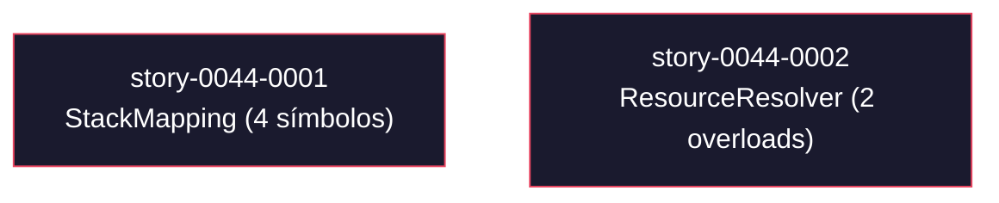
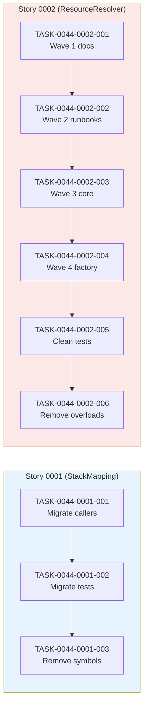

# Mapa de Implementação — EPIC-0044 (Remoção de Código Deprecated)

**Gerado a partir das dependências BlockedBy/Blocks de cada história do epic-0044.**

---

## 1. Matriz de Dependências

| Story | Título | Chave Jira | Blocked By | Blocks | Status |
| :--- | :--- | :--- | :--- | :--- | :--- |
| story-0044-0001 | Remover símbolos deprecated de `StackMapping` (4 símbolos, 1 arquivo de produção) | — | — | — | Concluida |
| story-0044-0002 | Remover `ResourceResolver.resolveResourcesRoot(...)` deprecated (2 overloads, 23 assemblers) | — | — | — | Pendente |

> **Valores de Status:** `Pendente` (padrão) · `Em Andamento` · `Concluída` · `Falha` · `Bloqueada` · `Parcial`

> **Nota:** As duas histórias são estrutural e funcionalmente independentes — atuam em arquivos distintos (`StackMapping.java` vs `ResourceResolver.java`) e em callers disjuntos (`PermissionCollector` vs 23 assemblers). Não há dependência técnica entre elas, mas recomenda-se execução sequencial (0001 antes de 0002) para isolar diffs de review e validar o padrão de migração em menor escala antes de aplicá-lo aos 23 assemblers.

---

## 2. Fases de Implementação

> As histórias são agrupadas em fases. Dentro de cada fase, as histórias podem ser implementadas **em paralelo**. Uma fase só pode iniciar quando todas as dependências das fases anteriores estiverem concluídas.

```
╔══════════════════════════════════════════════════════════════════════════╗
║              FASE 0 — Remoção de Deprecated (paralelo)                 ║
║                                                                        ║
║   ┌─────────────────────┐             ┌─────────────────────┐          ║
║   │  story-0044-0001    │             │  story-0044-0002    │          ║
║   │  StackMapping       │             │  ResourceResolver   │          ║
║   │  (4 símbolos)       │             │  (2 overloads)      │          ║
║   └─────────────────────┘             └─────────────────────┘          ║
║        XS — 2 prod + 9 test            M — 23 prod + 20+ test           ║
╚══════════════════════════════════════════════════════════════════════════╝
```

---

## 3. Caminho Crítico

> O caminho crítico (a sequência mais longa de dependências) determina o tempo mínimo de implementação do projeto.

```
story-0044-0001  (StackMapping)
story-0044-0002  (ResourceResolver)
     Fase 0
```

**1 fase no caminho crítico, 1 história na cadeia mais longa (as duas histórias estão na mesma fase).**

O projeto não tem dependências sequenciais. O tempo calendário mínimo é dominado por `story-0044-0002` (4 waves de migração + 1 task de limpeza de testes + 1 task de remoção = 6 tasks sequenciais internas) se executada sozinha. Se executada em paralelo com `story-0044-0001`, o tempo calendário cai para o máximo das duas — e `story-0044-0001` (XS, 3 tasks) cabe dentro do tempo de uma única wave de `story-0044-0002`.

---

## 4. Grafo de Dependências (Mermaid)



---

## 5. Resumo por Fase

| Fase | Histórias | Camada | Paralelismo | Pré-requisito |
| :--- | :--- | :--- | :--- | :--- |
| 0 | story-0044-0001, story-0044-0002 | Domain + Application (cross-cutting refactor) | 2 paralelas | — |

**Total: 2 histórias em 1 fase.**

> **Nota:** Epic com paralelismo máximo na única fase. Recomendação operacional: sequenciar (0001 primeiro) apesar da independência técnica, para validar o padrão de migração em escala pequena antes de aplicá-lo aos 23 assemblers. Em caso de pressão de prazo, ambas podem sair do backlog simultaneamente sem conflito de merge (arquivos disjuntos, exceto `CHANGELOG.md`, que requer rebase trivial).

---

## 6. Detalhamento por Fase

### Fase 0 — Remoção de Deprecated

| Story | Escopo Principal | Artefatos Chave |
| :--- | :--- | :--- |
| story-0044-0001 | Migrar 1 caller de produção (`PermissionCollector`) e 9 arquivos de teste para `DatabaseSettingsMapping` (`RulesConditionals` já está migrado — verificado). Remover 4 símbolos deprecated de `StackMapping.java`. | `StackMapping.java` (removal), `PermissionCollector.java` (migrated), `StackMappingDeprecatedRemovedTest.java` (new), `CHANGELOG.md` (updated) |
| story-0044-0002 | Migrar 23 assemblers em 4 waves para `resolveResourceDir(String)`. Limpar 20+ referências em testes. Remover 2 overloads `resolveResourcesRoot` de `ResourceResolver.java`. | `ResourceResolver.java` (removal), 23 `*Assembler.java` (migrated), 20+ `*Test.java` (cleaned), `ResourceResolverDeprecatedRemovedTest.java` (new), golden files (unchanged or regenerated), `CHANGELOG.md` (updated) |

**Entregas da Fase 0:**

- 6 símbolos `@Deprecated(forRemoval=true)` removidos do código de produção.
- 24 arquivos de produção migrados para APIs substitutas (1 + 23).
- 29+ arquivos de teste migrados ou limpos.
- Zero warnings `[removal]` em `mvn clean compile`.
- `CHANGELOG.md` atualizado com as 6 remoções (seção `Removed`).
- 2 testes de reflexão novos validando ausência dos símbolos (um por arquivo).

---

## 7. Observações Estratégicas

### Gargalo Principal

`story-0044-0002` é o gargalo operacional. 23 assemblers migrados em 4 waves + limpeza de testes + remoção = 6 tasks internas com diff review a cada wave. O risco concentra-se em `ConstitutionAssembler` (único assembler com `depth=4`, diferente do `depth=3` padrão) — divergência de golden file é mais provável aí. Mitigação: task TASK-0044-0002-003 isola explicitamente o `ConstitutionAssembler` dentro da wave 3 com atenção destacada.

### Histórias Folha (sem dependentes)

Ambas as histórias são folhas — nenhuma bloqueia outras histórias dentro do epic, e nenhuma é bloqueada. O epic inteiro é composto apenas por folhas, o que maximiza paralelismo e tolerância a atrasos.

### Otimização de Tempo

- **Máximo paralelismo:** execução simultânea de 0001 e 0002 entrega o epic em tempo calendário igual a `max(tempo(0001), tempo(0002)) ≈ tempo(0002)` (XS é absorvido pelo tempo de M).
- **Início imediato:** ambas as histórias podem começar assim que a DoR global for satisfeita (baseline `mvn verify` verde). Não há task anterior a esperar.
- **Alocação sugerida:** 1 dev para as duas histórias em série (recomendado para projetos com 1 squad) — review mais simples. 2 devs em paralelo se pressão de prazo.

### Dependências Cruzadas

Nenhuma dependência cruzada técnica entre as histórias. O único ponto de convergência operacional é `CHANGELOG.md` — ambas as histórias adicionam entradas na seção `Removed`. Em execução paralela, o PR que mergear primeiro não conflita; o segundo resolve via rebase trivial.

### Marco de Validação Arquitetural

`story-0044-0001` serve como checkpoint de padrão. Ela exercita em escala pequena (2 callers) o ciclo completo do padrão de migração que `story-0044-0002` repete em escala (23 callers + 4 waves). Validações que DEVEM estar funcionando após 0001 e antes de iniciar 0002:

1. Sequência correta de commits: migração de callers → `mvn verify` verde → remoção do símbolo → `mvn verify` verde.
2. Teste de reflexão (`*DeprecatedRemovedTest.java`) validando ausência do símbolo via `NoSuchFieldException` / `NoSuchMethodException`.
3. `CHANGELOG.md` atualizado na seção `Removed`.
4. PR com prefixo `refactor(story-0044-NNNN):` (Rule 08 / RULE-005).
5. Branch `feat/story-0044-NNNN-<slug>` dentro de worktree `.claude/worktrees/story-0044-NNNN/` (Rule 14 / RULE-006).

Se qualquer item falhar na 0001, o padrão DEVE ser corrigido antes de iniciar 0002 — aplicar um padrão quebrado a 23 assemblers multiplica o custo de correção.

---

## 8. Dependências entre Tasks (Cross-Story)

> Esta seção é gerada automaticamente quando as histórias contêm tasks formais com IDs `TASK-XXXX-YYYY-NNN`. Se as histórias não possuem task IDs formais, esta seção é omitida.

### 8.1 Dependências Cross-Story entre Tasks

Nenhuma dependência cross-story — as 3 tasks de `story-0044-0001` e as 6 tasks de `story-0044-0002` operam em arquivos completamente disjuntos.

| Task | Depends On | Story Source | Story Target | Tipo |
| :--- | :--- | :--- | :--- | :--- |
| — | — | — | — | — |

> **Validação RULE-012:** Consistência preservada. Zero dependências cross-story declaradas e zero necessárias (verificado via análise de arquivos tocados por cada task).

### 8.2 Ordem de Merge (Topological Sort)

Duas cadeias independentes — podem mesclar em paralelo. Dentro de cada cadeia, a ordem é estritamente sequencial.

**Cadeia A (story-0044-0001):**

| Ordem | Task ID | Story | Parallelizável Com | Fase |
| :--- | :--- | :--- | :--- | :--- |
| 1 | TASK-0044-0001-001 | story-0044-0001 | qualquer task da cadeia B | 0 |
| 2 | TASK-0044-0001-002 | story-0044-0001 | qualquer task da cadeia B | 0 |
| 3 | TASK-0044-0001-003 | story-0044-0001 | qualquer task da cadeia B | 0 |

**Cadeia B (story-0044-0002):**

| Ordem | Task ID | Story | Parallelizável Com | Fase |
| :--- | :--- | :--- | :--- | :--- |
| 1 | TASK-0044-0002-001 | story-0044-0002 | qualquer task da cadeia A | 0 |
| 2 | TASK-0044-0002-002 | story-0044-0002 | qualquer task da cadeia A | 0 |
| 3 | TASK-0044-0002-003 | story-0044-0002 | qualquer task da cadeia A | 0 |
| 4 | TASK-0044-0002-004 | story-0044-0002 | qualquer task da cadeia A | 0 |
| 5 | TASK-0044-0002-005 | story-0044-0002 | qualquer task da cadeia A | 0 |
| 6 | TASK-0044-0002-006 | story-0044-0002 | qualquer task da cadeia A | 0 |

**Total: 9 tasks em 1 fase de execução (2 cadeias paralelas).**

### 8.3 Grafo de Dependências entre Tasks (Mermaid)


