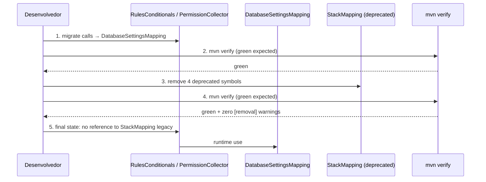

# História: Remover símbolos deprecated de `StackMapping`

**ID:** story-0044-0001
**Chave Jira:** —
**Status:** Pendente

## 1. Dependências

| Blocked By | Blocks |
| :--- | :--- |
| — | — |

## 2. Regras Transversais Aplicáveis

> Referência às regras definidas no Épico (seção 4). Listar apenas as regras que impactam esta história.

| ID | Título |
| :--- | :--- |
| RULE-001 | Migração antes de remoção |
| RULE-002 | Zero warnings `[removal]` pós-história |
| RULE-003 | Cobertura preservada |
| RULE-005 | Conventional Commits `refactor:` |
| RULE-006 | Git Flow + Worktree |
| RULE-007 | Teste-primeiro na migração |
| RULE-008 | CHANGELOG obrigatório |

## 3. Descrição

Como **engenheiro de plataforma**, eu quero remover os 4 símbolos `@Deprecated(forRemoval=true)` em `StackMapping.java`, garantindo que `DatabaseSettingsMapping` se torne a única fonte da verdade das tabelas de database/cache settings sem introduzir regressão em nenhum consumidor.

`StackMapping` era originalmente o hub de mapeamento de settings de stack. Epic-0023 introduziu `DatabaseSettingsMapping` como proprietário canônico das tabelas de database e cache settings e marcou as entradas equivalentes em `StackMapping` como deprecated `forRemoval`. A migração parou no meio: `DatabaseSettingsMapping` já é consumido em alguns pontos, mas 2 arquivos de produção (`RulesConditionals.java`, `PermissionCollector.java`) e 9+ arquivos de teste continuam chamando os símbolos legados. Esta história conclui a migração e remove os 4 símbolos.

Decisões de design:
- **Substituição 1-para-1.** Cada símbolo deprecated tem um substituto com assinatura equivalente em `DatabaseSettingsMapping`. Nenhuma refatoração de API adicional.
- **Migração em commit único quando possível.** Produção + testes de cada caller migram juntos para reduzir janela de inconsistência.
- **Remoção em commit separado.** Depois que `mvn verify` confirma que nenhum caller referencia mais os símbolos deprecated, um commit final remove os 4 símbolos.

### 3.1 Migração de `RulesConditionals.java`

- Arquivo: `java/src/main/java/dev/iadev/application/assembler/RulesConditionals.java` (linha 90)
- Alteração: trocar `StackMapping.CACHE_SETTINGS_MAP` por `DatabaseSettingsMapping.CACHE_SETTINGS_MAP`.
- Import: remover import não usado de `StackMapping` (se for o último uso no arquivo); adicionar import de `DatabaseSettingsMapping`.
- Comportamento: idêntico — ambas as constantes expõem a mesma `Map<String,String>`.

### 3.2 Migração de `PermissionCollector.java`

- Arquivo: `java/src/main/java/dev/iadev/application/assembler/PermissionCollector.java` (linhas 122, 128)
- Alteração: trocar `StackMapping.getDatabaseSettingsKey(...)` por `DatabaseSettingsMapping.getDatabaseSettingsKey(...)` e `StackMapping.getCacheSettingsKey(...)` por `DatabaseSettingsMapping.getCacheSettingsKey(...)`.
- Import: ajustar conforme necessário.

### 3.3 Migração de Testes

Arquivos com referências a símbolos deprecated de `StackMapping`:
- `java/src/test/java/dev/iadev/domain/stack/StackMappingTest.java` (linhas 340, 367, 374, 377, 380, 388, 391, 439, 461, 468, 475, 482)
- `java/src/test/java/dev/iadev/domain/stack/StackMappingSearchTest.java` (24, 31, 43, 50)
- `java/src/test/java/dev/iadev/knowledge/TimeseriesKnowledgeTest.java` (327, 336, 345)
- `java/src/test/java/dev/iadev/knowledge/NewsqlSettingsAndMappingTest.java` (122, 130)
- `java/src/test/java/dev/iadev/smoke/Epic0023IntegrationTest.java` (60, 67, 81)

Regra de tratamento:
- **Testes que validam o símbolo deprecated existir/funcionar:** remover. A cobertura equivalente é dada por `DatabaseSettingsMappingTest` e `DatabaseSettingsMappingSearchTest`.
- **Testes que validam invariantes de integração (ex: `Epic0023IntegrationTest`):** reapontar para `DatabaseSettingsMapping` preservando o cenário original.
- **Sem `@SuppressWarnings("removal")` em produção.** Em testes temporários durante a migração, aceitável por ≤ 1 commit.

### 3.4 Remoção dos Símbolos

Arquivo: `java/src/main/java/dev/iadev/domain/stack/StackMapping.java`
- Remover campo `DATABASE_SETTINGS_MAP` (linhas 207–211).
- Remover campo `CACHE_SETTINGS_MAP` (linhas 213–217).
- Remover método `getDatabaseSettingsKey(...)`.
- Remover método `getCacheSettingsKey(...)`.
- Remover imports órfãos resultantes.

## 3.5 Entrega de Valor

> O que esta história entrega de valor mensurável para o negócio?

- **Valor Principal:** Unificação da fonte da verdade para o mapa de settings de database/cache — única tabela, única API, um ponto de atualização. Elimina risco de drift silencioso entre `StackMapping.DATABASE_SETTINGS_MAP` e `DatabaseSettingsMapping.DATABASE_SETTINGS_MAP` (bug silencioso observável apenas em runtime quando uma das tabelas é atualizada e a outra não).
- **Métrica de Sucesso:** `grep -r "StackMapping\.\(DATABASE_SETTINGS_MAP\|CACHE_SETTINGS_MAP\|getDatabaseSettingsKey\|getCacheSettingsKey\)" java/src/` retorna 0 resultados. `mvn compile` sem warnings `[removal]` no escopo de `StackMapping`. Suite `mvn verify` verde com cobertura ≥ 95% line / ≥ 90% branch.
- **Impacto no Negócio:** Reduz superfície de manutenção (4 símbolos a menos para lembrar), reduz custo cognitivo de revisão de PRs que tocam em settings de stack, e habilita simplificação futura de `StackMapping` (fora do escopo desta história).

## 4. Definições de Qualidade Locais

### DoR Local (Definition of Ready)

- [ ] Baseline `mvn verify` verde antes de iniciar a história.
- [ ] `DatabaseSettingsMapping.DATABASE_SETTINGS_MAP`, `CACHE_SETTINGS_MAP`, `getDatabaseSettingsKey`, `getCacheSettingsKey` confirmados existentes e cobertos por testes verdes.
- [ ] Worktree criado em `.claude/worktrees/story-0044-0001/` a partir de branch `feature/epic-0044-story-0044-0001-remove-stackmapping-deprecated` (Rule 14).

### DoD Local (Definition of Done)

- [ ] 4 símbolos deprecated removidos de `StackMapping.java:207–217`.
- [ ] `RulesConditionals.java:90` e `PermissionCollector.java:122,128` migrados para `DatabaseSettingsMapping`.
- [ ] Testes citados em 3.3 migrados ou removidos com cobertura preservada via `DatabaseSettingsMappingTest`.
- [ ] `mvn compile` sem warnings `[removal]` relativos a símbolos desta história.
- [ ] `mvn verify` verde com cobertura ≥ 95% line / ≥ 90% branch.
- [ ] Pelo menos 1 teste automatizado validando o critério de aceite principal (ex: teste de verificação em `DatabaseSettingsMappingTest` cobrindo os casos que eram exclusivos de `StackMappingTest`).
- [ ] `CHANGELOG.md` atualizado em `Removed` listando os 4 símbolos (RULE-008).
- [ ] PR aberto targeting `develop` com título `refactor(epic-0044-0001): remove deprecated StackMapping symbols` (RULE-005).

### Global Definition of Done (DoD)

> Copiar do Épico. Mantido aqui para referência rápida durante code review.

- **Cobertura:** ≥ 95% Line, ≥ 90% Branch (Rule 05).
- **Testes Automatizados:** `mvn verify` verde. Pelo menos 1 teste automatizado validando o critério de aceite principal.
- **Relatório de Cobertura:** Jacoco XML em `java/target/site/jacoco/jacoco.xml`.
- **Documentação:** `CHANGELOG.md` seção `Removed`.
- **Persistência:** N/A.
- **Performance:** N/A.

## 5. Contratos de Dados (Data Contract)

> Esta história é um refactor interno sem mudança em contratos públicos. As tabelas expostas por `DatabaseSettingsMapping` permanecem idênticas antes e depois.

### 5.1 Superfície Pública Preservada

| Símbolo | Tipo | Antes | Depois |
| :--- | :--- | :--- | :--- |
| `DatabaseSettingsMapping.DATABASE_SETTINGS_MAP` | `public static final Map<String,String>` | Existente e usado | Existente e usado (sem alteração) |
| `DatabaseSettingsMapping.CACHE_SETTINGS_MAP` | `public static final Map<String,String>` | Existente e usado | Existente e usado (sem alteração) |
| `DatabaseSettingsMapping.getDatabaseSettingsKey(...)` | `public static String` | Existente | Existente (sem alteração) |
| `DatabaseSettingsMapping.getCacheSettingsKey(...)` | `public static String` | Existente | Existente (sem alteração) |

### 5.2 Superfície Removida

| Símbolo | Arquivo | Linha | Substituto |
| :--- | :--- | :--- | :--- |
| `StackMapping.DATABASE_SETTINGS_MAP` | `StackMapping.java` | 207–211 | `DatabaseSettingsMapping.DATABASE_SETTINGS_MAP` |
| `StackMapping.CACHE_SETTINGS_MAP` | `StackMapping.java` | 213–217 | `DatabaseSettingsMapping.CACHE_SETTINGS_MAP` |
| `StackMapping.getDatabaseSettingsKey(...)` | `StackMapping.java` | — | `DatabaseSettingsMapping.getDatabaseSettingsKey(...)` |
| `StackMapping.getCacheSettingsKey(...)` | `StackMapping.java` | — | `DatabaseSettingsMapping.getCacheSettingsKey(...)` |

### 5.3 Error Codes Mapeados

N/A — refactor interno sem endpoint HTTP.

## 6. Diagramas

### 6.1 Fluxo de Migração



## 7. Critérios de Aceite (Gherkin)

```gherkin
Cenario: degenerate — nenhum caller remanescente após migração
  DADO que a história está na etapa pós-migração de callers
  QUANDO executo grep -r "StackMapping\\.\\(DATABASE_SETTINGS_MAP\\|CACHE_SETTINGS_MAP\\|getDatabaseSettingsKey\\|getCacheSettingsKey\\)" em java/src/main e java/src/test
  ENTÃO o comando retorna zero resultados
  E a árvore de dependências legada para StackMapping está vazia

Cenario: happy path — build verde após remoção dos símbolos
  DADO que os 4 símbolos deprecated foram removidos de StackMapping.java
  E todos os callers foram migrados para DatabaseSettingsMapping
  QUANDO executo mvn clean verify
  ENTÃO o build completa com exit code 0
  E nenhum warning da categoria [removal] aparece referente aos símbolos removidos
  E a cobertura de linha permanece ≥ 95% e de branch ≥ 90%

Cenario: error path — caller não migrado bloqueia remoção
  DADO que os 4 símbolos deprecated estão removidos
  E existe pelo menos um caller não migrado referenciando StackMapping.DATABASE_SETTINGS_MAP
  QUANDO executo mvn compile
  ENTÃO o compilador falha com erro "cannot find symbol"
  E o PR é rejeitado pelo gate de CI
  E a ordem correta (migrar callers → verificar build → remover símbolos) é explicitada na descrição do PR

Cenario: boundary — cobertura no limite exato de 95% line / 90% branch
  DADO que a remoção dos símbolos elimina linhas que eram exercitadas por testes legados
  E a cobertura de linha cai para 94.9% antes de adicionar cobertura equivalente em DatabaseSettingsMappingTest
  QUANDO executo mvn verify com enforcer de cobertura
  ENTÃO o build falha por violação de threshold
  E a história adiciona casos de teste em DatabaseSettingsMappingTest para cobrir os cenários que StackMappingTest exercitava nos símbolos removidos
  E re-executar mvn verify resulta em cobertura ≥ 95% line / ≥ 90% branch com build verde
```

### 7.1 Scenario Ordering (TPP)

Os 4 cenários seguem ordem degenerate → happy → error → boundary, conforme Transformation Priority Premise. Cada cenário adiciona uma dimensão de complexidade ao anterior.

### 7.2 Mandatory Scenario Categories

- [x] Degenerate cases (null, empty, zero) — "nenhum caller remanescente"
- [x] Happy path (basic success) — "build verde após remoção"
- [x] Error paths (each error type) — "caller não migrado bloqueia remoção"
- [x] Boundary values (at-min, at-max, past-max) — "cobertura no limite exato"

### 7.3 TDD Implementation Notes

- **Double-Loop TDD:** O primeiro cenário (degenerate) vira acceptance test executável como `grep` verificado em CI ou como teste de reflexão em Java (ex: `StackMappingDeprecatedRemovedTest` que tenta `Class.forName(...).getDeclaredField("DATABASE_SETTINGS_MAP")` e espera `NoSuchFieldException`). Os demais cenários guiam testes unitários adicionados a `DatabaseSettingsMappingTest`.
- A primeira transformação (walking skeleton) é trocar uma única linha em `RulesConditionals.java:90` — menor diff possível que compila.

## 8. Tasks

> Each task is a formal, traceable unit of delivery following the 1 task = 1 branch = 1 PR model.
> Tasks MUST follow a valid testability pattern (SD-12) and respect sizing constraints (RULE-011).

### Valid Testability Patterns

| Pattern | Content | Test Type |
| :--- | :--- | :--- |
| Domain + UnitTest | Entity/VO/Engine + unit test | Unit |
| Config + VerificationTest | Configuration + verification test | Verification |

### TASK-0044-0001-001: Migrar `RulesConditionals.java` + `PermissionCollector.java` para `DatabaseSettingsMapping`

- **Layer:** Application
- **Test Type:** Unit + Integration
- **Size:** S (< 50 LOC)
- **Dependencies:** —
- **Branch:** `feat/task-0044-0001-001-migrate-stackmapping-callers`
- **Testability:** Domain + UnitTest
- **Files:**
  - `java/src/main/java/dev/iadev/application/assembler/RulesConditionals.java` (linha 90)
  - `java/src/main/java/dev/iadev/application/assembler/PermissionCollector.java` (linhas 122, 128)
  - `java/src/test/java/dev/iadev/application/assembler/RulesConditionalsTest.java` (atualizar referências se existirem)
  - `java/src/test/java/dev/iadev/application/assembler/PermissionCollectorTest.java` (idem)
- **Acceptance Criteria:**
  - [ ] `grep -r "StackMapping\\." java/src/main/java/dev/iadev/application/assembler/` retorna 0 matches para os 4 símbolos deprecated.
  - [ ] `mvn compile -pl java` verde sem warnings `[removal]` nos dois arquivos migrados.
  - [ ] Testes de `RulesConditionals` e `PermissionCollector` permanecem verdes.

### TASK-0044-0001-002: [Test] Migrar ou remover testes que referenciam símbolos deprecated de `StackMapping`

- **Layer:** Test
- **Test Type:** Unit + Smoke
- **Size:** M (50–150 LOC)
- **Dependencies:** TASK-0044-0001-001
- **Branch:** `feat/task-0044-0001-002-migrate-stackmapping-tests`
- **Testability:** Domain + UnitTest
- **Files:**
  - `java/src/test/java/dev/iadev/domain/stack/StackMappingTest.java` (remover casos exclusivos dos 4 símbolos — linhas 340, 367, 374, 377, 380, 388, 391, 439, 461, 468, 475, 482)
  - `java/src/test/java/dev/iadev/domain/stack/StackMappingSearchTest.java` (remover ou reapontar linhas 24, 31, 43, 50)
  - `java/src/test/java/dev/iadev/knowledge/TimeseriesKnowledgeTest.java` (reapontar linhas 327, 336, 345)
  - `java/src/test/java/dev/iadev/knowledge/NewsqlSettingsAndMappingTest.java` (reapontar linhas 122, 130)
  - `java/src/test/java/dev/iadev/smoke/Epic0023IntegrationTest.java` (reapontar linhas 60, 67, 81 preservando cenário de integração)
  - `java/src/test/java/dev/iadev/domain/stack/DatabaseSettingsMappingTest.java` (adicionar casos para cobrir cenários que `StackMappingTest` exercitava, se ainda não cobertos)
- **Acceptance Criteria:**
  - [ ] Nenhum arquivo de teste referencia os 4 símbolos deprecated.
  - [ ] `mvn test -pl java` verde.
  - [ ] Cobertura delta ≥ 0 vs baseline (RULE-003).
  - [ ] `Epic0023IntegrationTest` continua validando o cenário de integração original com as chamadas reapontadas.

### TASK-0044-0001-003: Remover 4 símbolos deprecated de `StackMapping.java` + atualizar `CHANGELOG.md`

- **Layer:** Domain
- **Test Type:** Verification + Smoke
- **Size:** S (< 50 LOC)
- **Dependencies:** TASK-0044-0001-001, TASK-0044-0001-002
- **Branch:** `feat/task-0044-0001-003-remove-stackmapping-deprecated`
- **Testability:** Config + VerificationTest
- **Files:**
  - `java/src/main/java/dev/iadev/domain/stack/StackMapping.java` (remover linhas 207–217 + métodos equivalentes)
  - `CHANGELOG.md` (seção `Removed` com 4 entradas)
  - `java/src/test/java/dev/iadev/domain/stack/StackMappingDeprecatedRemovedTest.java` (novo — teste de reflexão que valida ausência dos 4 símbolos)
- **Acceptance Criteria:**
  - [ ] `StackMapping.java` não contém `DATABASE_SETTINGS_MAP`, `CACHE_SETTINGS_MAP`, `getDatabaseSettingsKey`, `getCacheSettingsKey`.
  - [ ] `mvn clean verify` verde com exit code 0.
  - [ ] Zero warnings `[removal]` referentes a esses símbolos.
  - [ ] `StackMappingDeprecatedRemovedTest` passa (reflexão confirma ausência).
  - [ ] `CHANGELOG.md` atualizado conforme RULE-008.
  - [ ] Commit de remoção usa prefixo `refactor(story-0044-0001):` conforme RULE-005.
