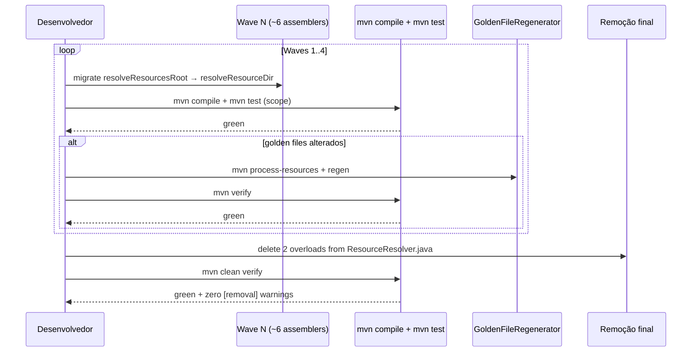
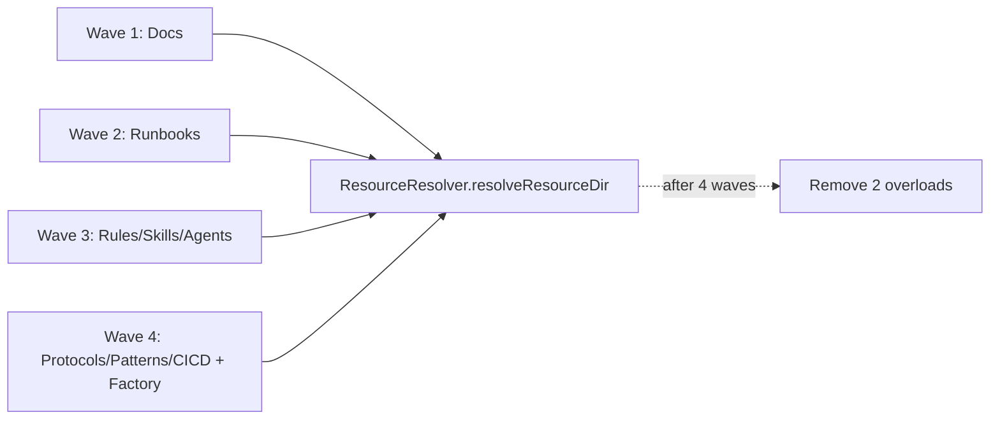

# História: Remover `ResourceResolver.resolveResourcesRoot(...)` deprecated

**ID:** story-0044-0002
**Chave Jira:** —
**Status:** Pendente

## 1. Dependências

| Blocked By | Blocks |
| :--- | :--- |
| — | — |

## 2. Regras Transversais Aplicáveis

> Referência às regras definidas no Épico (seção 4). Listar apenas as regras que impactam esta história.

| ID | Título |
| :--- | :--- |
| RULE-001 | Migração antes de remoção |
| RULE-002 | Zero warnings `[removal]` pós-história |
| RULE-003 | Cobertura preservada |
| RULE-004 | Golden files consistentes |
| RULE-005 | Conventional Commits `refactor:` |
| RULE-006 | Git Flow + Worktree |
| RULE-007 | Teste-primeiro na migração |
| RULE-008 | CHANGELOG obrigatório |

## 3. Descrição

Como **engenheiro de plataforma**, eu quero remover os 2 overloads `@Deprecated(forRemoval=true)` de `ResourceResolver.resolveResourcesRoot(...)`, garantindo que os 23 assemblers do projeto passem a usar exclusivamente o substituto depth-free `resolveResourceDir(String)` sem quebrar geração de artefatos nem golden files.

A API antiga `resolveResourcesRoot(String probe, int depth)` exigia que cada chamador soubesse a profundidade física do recurso no classpath, tornando os 23 assemblers frágeis a reorganizações de resources. `resolveResourceDir(String)` (introduzido em epic mais recente) é depth-free — localiza o marker probing a partir da raiz do classpath. Os dois overloads deprecated já têm `forRemoval=true` e aguardam a migração dos 23 callers de produção + 20+ callers de teste antes da remoção física.

Decisões de design:
- **Waves de migração, não big-bang.** 23 assemblers em 4 waves de ~6 para manter compile verde e diff reviewável. Cada wave: migrar + `mvn compile` + `mvn test` no escopo.
- **Golden files verificados a cada wave.** A migração remove `depth` — em teoria não altera resolução, mas se um assembler depender de layout inesperado, o golden file diverge; regenerar via `GoldenFileRegenerator` com `mvn process-resources` prévio (memória do projeto).
- **Remoção em task final.** Depois das 4 waves de migração, uma task remove os 2 overloads deprecated e adiciona teste de reflexão confirmando ausência.

### 3.1 Migração dos 23 Assemblers

Todos em `java/src/main/java/dev/iadev/application/assembler/`. Cada um declara uma constante de caminho e chama `ResourceResolver.resolveResourcesRoot(path, depth)`. A migração substitui por `ResourceResolver.resolveResourceDir(path)` e remove a constante `depth`.

**Wave 1 (assemblers de docs/templates):** `DocsAssembler`, `DocsAdrAssembler`, `DocsContributingAssembler`, `GrpcDocsAssembler`, `ReadmeAssembler`, `ReleaseChecklistAssembler`.

**Wave 2 (runbooks/incidents):** `OperationalRunbookAssembler`, `RunbookAssembler`, `IncidentTemplatesAssembler`, `SloSliTemplateAssembler`, `DataMigrationPlanAssembler`, `EpicReportAssembler`.

**Wave 3 (rules/skills/agents/hooks):** `RulesAssembler`, `SkillsAssembler`, `AgentsAssembler`, `HooksAssembler`, `SettingsAssembler`, `ConstitutionAssembler`.

**Wave 4 (protocols/patterns/cicd + factory):** `ProtocolsAssembler`, `PatternsAssembler`, `CicdAssembler`, `PlanTemplatesAssembler`, `AssemblerFactory`.

Após cada wave: `mvn compile` + `mvn test` no escopo do assembler + regenerar golden files se houver drift.

### 3.2 Migração de Testes

Arquivos com referências:
- `java/src/test/java/dev/iadev/util/ResourceResolverTest.java` — manter apenas testes de `resolveResourceDir(String)`. Remover testes dedicados aos 2 overloads deprecated (linhas 49, 62, 79, 92, 104, 115, 132, 135, 146, 149, 205).
- `java/src/test/java/dev/iadev/knowledge/TimeseriesKnowledgeTest.java` (linha 38) — reapontar.
- 18 `*AssemblerTest.java` em `java/src/test/java/dev/iadev/application/assembler/` — reapontar chamadas para `resolveResourceDir`.

### 3.3 Remoção dos Overloads

Arquivo: `java/src/main/java/dev/iadev/util/ResourceResolver.java`
- Remover `resolveResourcesRoot(String probe)` (linhas 116–119).
- Remover `resolveResourcesRoot(String probe, int depth)` (linhas 133–137).
- Remover Javadocs associadas.
- Manter `resolveResourceDir(String)` intacto.

## 3.5 Entrega de Valor

> O que esta história entrega de valor mensurável para o negócio?

- **Valor Principal:** Eliminação de parâmetro `depth` frágil em 23 assemblers. `resolveResourceDir(String)` é layout-agnostic — qualquer reorganização futura de recursos (ex: consolidação de diretórios, mudança de profile) não quebra assemblers silenciosamente. Também elimina ~40 warnings `[removal]` que hoje poluem cada `mvn compile`.
- **Métrica de Sucesso:** `grep -r "resolveResourcesRoot" java/src/` retorna 0 resultados. `mvn clean compile 2>&1 | grep "\[removal\]"` retorna 0 linhas. `mvn verify` verde com cobertura ≥ 95% line / ≥ 90% branch. Golden files byte-idênticos ou regenerados com justificativa por drift no PR.
- **Impacto no Negócio:** Reduz superfície de bugs em reorganização de classpath (risco operacional), reduz custo cognitivo de 23 assemblers (cada um perde 1 parâmetro mental), e deixa `mvn compile` limpo — habilita flag `-Werror` em CI no futuro sem refactor adicional.

## 4. Definições de Qualidade Locais

### DoR Local (Definition of Ready)

- [ ] Story-0044-0001 concluída OU executada em paralelo (histórias são independentes, mas é preferível sequenciar para review mais simples).
- [ ] Baseline `mvn verify` verde antes de iniciar.
- [ ] `resolveResourceDir(String)` confirmado existente e com cobertura verde em `ResourceResolverTest`.
- [ ] Golden files baseline regenerados e commitados antes do início (run `mvn process-resources` + `GoldenFileRegenerator` sem alterações esperadas).
- [ ] Worktree criado em `.claude/worktrees/story-0044-0002/` a partir de branch `feat/story-0044-0002-remove-resolveResourcesRoot` (Rule 14).

### DoD Local (Definition of Done)

- [ ] 2 overloads `resolveResourcesRoot(...)` removidos de `ResourceResolver.java:116–137`.
- [ ] 23 assemblers migrados para `resolveResourceDir(String)`.
- [ ] 20+ arquivos de teste migrados ou limpos.
- [ ] `mvn clean compile` com zero warnings `[removal]` referentes a `resolveResourcesRoot`.
- [ ] `mvn verify` verde com cobertura ≥ 95% line / ≥ 90% branch.
- [ ] Pelo menos 1 teste automatizado validando a remoção (teste de reflexão `ResourceResolverDeprecatedRemovedTest`).
- [ ] Golden files byte-idênticos OU regenerados com justificativa no PR (RULE-004).
- [ ] `CHANGELOG.md` atualizado em `Removed` listando os 2 overloads (RULE-008).
- [ ] PR aberto targeting `develop` com título `refactor(story-0044-0002): remove deprecated ResourceResolver.resolveResourcesRoot` (RULE-005).

### Global Definition of Done (DoD)

> Copiar do Épico. Mantido aqui para referência rápida durante code review.

- **Cobertura:** ≥ 95% Line, ≥ 90% Branch (Rule 05).
- **Testes Automatizados:** `mvn verify` verde.
- **Relatório de Cobertura:** Jacoco XML em `java/target/site/jacoco/jacoco.xml`.
- **Documentação:** `CHANGELOG.md` seção `Removed`.
- **Persistência:** N/A.
- **Performance:** N/A.

## 5. Contratos de Dados (Data Contract)

### 5.1 Superfície Pública Preservada

| Símbolo | Assinatura | Status |
| :--- | :--- | :--- |
| `ResourceResolver.resolveResourceDir(String)` | `public static Path resolveResourceDir(String probe)` | Inalterado — única API pública após a história |

### 5.2 Superfície Removida

| Símbolo | Arquivo | Linha | Substituto |
| :--- | :--- | :--- | :--- |
| `resolveResourcesRoot(String probe)` | `ResourceResolver.java` | 116–119 | `resolveResourceDir(String)` |
| `resolveResourcesRoot(String probe, int depth)` | `ResourceResolver.java` | 133–137 | `resolveResourceDir(String)` (descarta `depth`) |

### 5.3 Padrão de Migração (refactoring recipe)

Antes:
```java
private static final int DEPTH = 3;
private static final String TEMPLATE_PATH = "templates/foo.yaml";
Path root = ResourceResolver.resolveResourcesRoot(TEMPLATE_PATH, DEPTH);
```

Depois:
```java
private static final String TEMPLATE_PATH = "templates/foo.yaml";
Path root = ResourceResolver.resolveResourceDir(TEMPLATE_PATH);
```

O `depth` desaparece. `resolveResourceDir` localiza o diretório que contém o marker, depth-free.

### 5.4 Error Codes Mapeados

N/A — refactor interno.

## 6. Diagramas

### 6.1 Fluxo por Wave



### 6.2 Diagrama de Dependência dos Assemblers



## 7. Critérios de Aceite (Gherkin)

```gherkin
Cenario: degenerate — wave 1 migrada sem efeito colateral em outras waves
  DADO que apenas os 6 assemblers da wave 1 foram migrados para resolveResourceDir
  E os assemblers das waves 2..4 ainda usam resolveResourcesRoot(path, depth)
  QUANDO executo mvn compile
  ENTÃO o build completa com exit code 0
  E os warnings [removal] remanescentes são exclusivamente das waves 2..4
  E golden files dos assemblers da wave 1 permanecem byte-idênticos (ou foram regenerados com diff revisado no PR)

Cenario: happy path — build verde após 4 waves + remoção final
  DADO que os 23 assemblers foram migrados para resolveResourceDir
  E os 2 overloads deprecated foram removidos de ResourceResolver.java
  QUANDO executo mvn clean verify
  ENTÃO o build completa com exit code 0
  E nenhum warning da categoria [removal] referencia resolveResourcesRoot
  E todos os golden files passam comparação byte a byte
  E cobertura de linha ≥ 95% e de branch ≥ 90%

Cenario: error path — assembler migrado quebra devido a depth implícito
  DADO que um assembler (ex: ConstitutionAssembler, que usava depth=4) depende de layout específico
  E a migração para resolveResourceDir aponta para diretório diferente
  QUANDO executo o teste unitário do assembler afetado
  ENTÃO o teste falha com diff visível no golden file
  E a história adiciona ajuste ao probe (ex: mudar TEMPLATE_PATH) ou regenera o golden file com justificativa no PR
  E re-executar mvn test resulta em verde

Cenario: boundary — eliminação do último warning [removal] do escopo
  DADO que estão removidos 1 dos 2 overloads resolveResourcesRoot
  E existe ainda 1 caller de teste legado com @SuppressWarnings("removal")
  QUANDO a última referência é limpa e o último overload removido
  ENTÃO mvn clean compile retorna com zero warnings [removal] referentes a resolveResourcesRoot
  E o grep "resolveResourcesRoot" em java/src retorna zero resultados
  E o teste de reflexão ResourceResolverDeprecatedRemovedTest passa (NoSuchMethodException esperada para os 2 overloads)
```

### 7.1 Scenario Ordering (TPP)

Degenerate (1 wave isolada) → happy path (4 waves + remoção) → error path (drift inesperado) → boundary (último warning).

### 7.2 Mandatory Scenario Categories

- [x] Degenerate cases — "wave 1 isolada"
- [x] Happy path — "build verde após 4 waves + remoção"
- [x] Error paths — "assembler quebra por depth implícito"
- [x] Boundary values — "último warning eliminado"

### 7.3 TDD Implementation Notes

- **Double-Loop TDD:** O cenário boundary vira acceptance test como `ResourceResolverDeprecatedRemovedTest` (teste de reflexão). Os cenários de wave viram subtests de assembler executados a cada wave.
- Walking skeleton: a primeira migração é em `DocsAssembler` (wave 1, assembler mais simples com `depth=3` e `TEMPLATE_PATH` padrão) — menor diff que compila e produz golden file byte-idêntico, validando o padrão.
- Waves subsequentes repetem o padrão, com intervenção apenas quando golden file diverge.

## 8. Tasks

### Valid Testability Patterns

| Pattern | Content | Test Type |
| :--- | :--- | :--- |
| Domain + UnitTest | Utility class + unit test | Unit |
| Config + VerificationTest | Removed symbol + reflection test | Verification |

### TASK-0044-0002-001: Migrar wave 1 (6 assemblers de docs/templates)

- **Layer:** Application
- **Test Type:** Unit
- **Size:** M (50–150 LOC)
- **Dependencies:** —
- **Branch:** `feat/task-0044-0002-001-migrate-resolveResourcesRoot-wave1-docs`
- **Testability:** Domain + UnitTest
- **Files:**
  - `java/src/main/java/dev/iadev/application/assembler/DocsAssembler.java` (linha 99)
  - `java/src/main/java/dev/iadev/application/assembler/DocsAdrAssembler.java` (linha 258)
  - `java/src/main/java/dev/iadev/application/assembler/DocsContributingAssembler.java` (linha 102)
  - `java/src/main/java/dev/iadev/application/assembler/GrpcDocsAssembler.java` (linha 107)
  - `java/src/main/java/dev/iadev/application/assembler/ReadmeAssembler.java` (linha 232)
  - `java/src/main/java/dev/iadev/application/assembler/ReleaseChecklistAssembler.java` (linha 117)
  - Respectivos `*Test.java` em `java/src/test/java/dev/iadev/application/assembler/`
- **Acceptance Criteria:**
  - [ ] 6 assemblers chamam apenas `resolveResourceDir(String)`.
  - [ ] `mvn test -pl java -Dtest="Docs*,GrpcDocs*,Readme*,ReleaseChecklist*"` verde.
  - [ ] Golden files byte-idênticos OU regenerados com diff justificado.

### TASK-0044-0002-002: Migrar wave 2 (6 assemblers runbooks/incidents)

- **Layer:** Application
- **Test Type:** Unit
- **Size:** M
- **Dependencies:** TASK-0044-0002-001
- **Branch:** `feat/task-0044-0002-002-migrate-resolveResourcesRoot-wave2-runbooks`
- **Testability:** Domain + UnitTest
- **Files:**
  - `java/src/main/java/dev/iadev/application/assembler/OperationalRunbookAssembler.java` (linha 103)
  - `java/src/main/java/dev/iadev/application/assembler/RunbookAssembler.java` (linha 98)
  - `java/src/main/java/dev/iadev/application/assembler/IncidentTemplatesAssembler.java` (linha 157)
  - `java/src/main/java/dev/iadev/application/assembler/SloSliTemplateAssembler.java` (linha 116)
  - `java/src/main/java/dev/iadev/application/assembler/DataMigrationPlanAssembler.java` (linha 122)
  - `java/src/main/java/dev/iadev/application/assembler/EpicReportAssembler.java` (linha 128)
  - Respectivos `*Test.java`
- **Acceptance Criteria:**
  - [ ] 6 assemblers migrados.
  - [ ] Suite de testes correspondente verde.
  - [ ] Golden files consistentes.

### TASK-0044-0002-003: Migrar wave 3 (6 assemblers rules/skills/agents/hooks)

- **Layer:** Application
- **Test Type:** Unit
- **Size:** M
- **Dependencies:** TASK-0044-0002-002
- **Branch:** `feat/task-0044-0002-003-migrate-resolveResourcesRoot-wave3-core`
- **Testability:** Domain + UnitTest
- **Files:**
  - `java/src/main/java/dev/iadev/application/assembler/RulesAssembler.java` (linha 189)
  - `java/src/main/java/dev/iadev/application/assembler/SkillsAssembler.java` (linha 375)
  - `java/src/main/java/dev/iadev/application/assembler/AgentsAssembler.java` (linha 190)
  - `java/src/main/java/dev/iadev/application/assembler/HooksAssembler.java` (linha 145)
  - `java/src/main/java/dev/iadev/application/assembler/SettingsAssembler.java` (linha 210)
  - `java/src/main/java/dev/iadev/application/assembler/ConstitutionAssembler.java` (linha 192, depth=4 — atenção)
  - Respectivos `*Test.java`
- **Acceptance Criteria:**
  - [ ] 6 assemblers migrados.
  - [ ] `ConstitutionAssembler` validado com atenção (único `depth=4`).
  - [ ] Golden files consistentes, com regeneração documentada se necessário.

### TASK-0044-0002-004: Migrar wave 4 (5 assemblers protocols/patterns/cicd + factory)

- **Layer:** Application
- **Test Type:** Unit + Integration
- **Size:** M
- **Dependencies:** TASK-0044-0002-003
- **Branch:** `feat/task-0044-0002-004-migrate-resolveResourcesRoot-wave4-factory`
- **Testability:** Domain + UnitTest
- **Files:**
  - `java/src/main/java/dev/iadev/application/assembler/ProtocolsAssembler.java` (linha 229)
  - `java/src/main/java/dev/iadev/application/assembler/PatternsAssembler.java` (linha 230)
  - `java/src/main/java/dev/iadev/application/assembler/CicdAssembler.java` (linha 240)
  - `java/src/main/java/dev/iadev/application/assembler/PlanTemplatesAssembler.java` (linha 168)
  - `java/src/main/java/dev/iadev/application/assembler/AssemblerFactory.java` (linha 94)
  - Respectivos `*Test.java`
- **Acceptance Criteria:**
  - [ ] 5 assemblers migrados; `AssemblerFactory` é o último.
  - [ ] `mvn verify` verde após esta task (todas as 23 migrações completas).
  - [ ] `grep -r "resolveResourcesRoot" java/src/main/java/dev/iadev/application/assembler/` retorna 0 matches.

### TASK-0044-0002-005: [Test] Limpar referências de teste aos 2 overloads deprecated

- **Layer:** Test
- **Test Type:** Unit + Smoke
- **Size:** M
- **Dependencies:** TASK-0044-0002-004
- **Branch:** `feat/task-0044-0002-005-clean-resolveResourcesRoot-tests`
- **Testability:** Domain + UnitTest
- **Files:**
  - `java/src/test/java/dev/iadev/util/ResourceResolverTest.java` (remover linhas 49, 62, 79, 92, 104, 115, 132, 135, 146, 149, 205 que testam os deprecated; manter testes de `resolveResourceDir`)
  - `java/src/test/java/dev/iadev/knowledge/TimeseriesKnowledgeTest.java` (linha 38 — reapontar)
  - 18 `*AssemblerTest.java` em `java/src/test/java/dev/iadev/application/assembler/` (reapontar chamadas)
- **Acceptance Criteria:**
  - [ ] `grep -r "resolveResourcesRoot" java/src/test/` retorna 0 matches.
  - [ ] `mvn test -pl java` verde.
  - [ ] Cobertura de `ResourceResolver` ≥ baseline (todos os paths de `resolveResourceDir` cobertos).

### TASK-0044-0002-006: Remover 2 overloads deprecated de `ResourceResolver.java` + `CHANGELOG.md`

- **Layer:** Domain
- **Test Type:** Verification + Smoke
- **Size:** S
- **Dependencies:** TASK-0044-0002-005
- **Branch:** `feat/task-0044-0002-006-remove-resolveResourcesRoot`
- **Testability:** Config + VerificationTest
- **Files:**
  - `java/src/main/java/dev/iadev/util/ResourceResolver.java` (remover linhas 116–137)
  - `CHANGELOG.md` (seção `Removed` com 2 entradas)
  - `java/src/test/java/dev/iadev/util/ResourceResolverDeprecatedRemovedTest.java` (novo — teste de reflexão)
- **Acceptance Criteria:**
  - [ ] `ResourceResolver.java` não contém `resolveResourcesRoot`.
  - [ ] `mvn clean verify` verde com exit code 0.
  - [ ] `mvn clean compile 2>&1 | grep "\\[removal\\]" | grep resolveResourcesRoot` retorna 0 linhas.
  - [ ] `ResourceResolverDeprecatedRemovedTest` valida ausência via reflexão (espera `NoSuchMethodException` para os 2 overloads).
  - [ ] `CHANGELOG.md` atualizado conforme RULE-008.
  - [ ] Commit de remoção usa prefixo `refactor(story-0044-0002):` conforme RULE-005.
