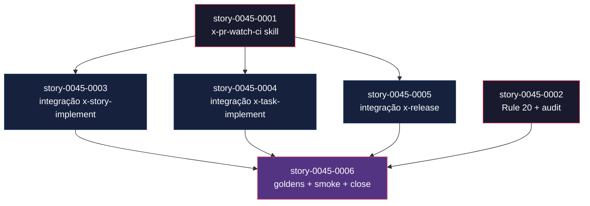
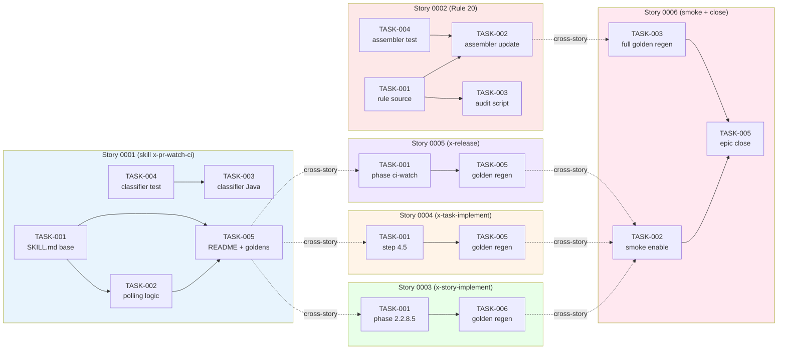

# Mapa de Implementação — EPIC-0045: CI Watch no Fluxo de PR

**Gerado a partir das dependências BlockedBy/Blocks de cada história do epic-0045.**

---

## 1. Matriz de Dependências

| Story | Título | Chave Jira | Blocked By | Blocks | Status |
| :--- | :--- | :--- | :--- | :--- | :--- |
| story-0045-0001 | Criar skill `x-pr-watch-ci` com polling de CI + detecção de Copilot review | — | — | story-0045-0003, story-0045-0004, story-0045-0005 | Pendente |
| story-0045-0002 | Adicionar Rule 20 (CI-Watch) + audit de regressão | — | — | story-0045-0006 | Pendente |
| story-0045-0003 | Integrar CI-Watch em `x-story-implement` Phase 2.2 | story-0045-0001, EPIC-0043 mergeado | story-0045-0006 | Pendente |
| story-0045-0004 | Integrar CI-Watch em `x-task-implement --worktree` standalone | story-0045-0001 | story-0045-0006 | Pendente |
| story-0045-0005 | Integrar CI-Watch opcional em `x-release` via `--ci-watch` | story-0045-0001 | story-0045-0006 | Pendente |
| story-0045-0006 | Golden diff regen + smoke test real contra PR | story-0045-0003, story-0045-0004, story-0045-0005 | — | Pendente |

> **Valores de Status:** `Pendente` (padrão) · `Em Andamento` · `Concluída` · `Falha` · `Bloqueada` · `Parcial`

> **Nota:** A dependência `EPIC-0043 mergeado em develop` de story-0045-0003 é uma precondição externa (não uma story deste épico). É trackeada no DoR Local da 0003 e na seção 3.4 da mesma story. Outras stories (0001, 0002, 0004, 0005) podem ser executadas em paralelo com o EPIC-0043 ainda em curso.

---

## 2. Fases de Implementação

> As histórias são agrupadas em fases. Dentro de cada fase, as histórias podem ser implementadas **em paralelo**. Uma fase só pode iniciar quando todas as dependências das fases anteriores estiverem concluídas.

```
╔══════════════════════════════════════════════════════════════════════════╗
║                   FASE 0 — Foundation (paralelo)                       ║
║                                                                        ║
║   ┌───────────────┐                   ┌───────────────┐                ║
║   │ story-0045-0001 │  skill nova        │ story-0045-0002 │  rule + audit   ║
║   └───────┬───────┘                   └───────┬───────┘                ║
╚═══════════╪═══════════════════════════════════╪════════════════════════╝
            │                                   │
            ▼                                   │
╔══════════════════════════════════════════════════════════════════════════╗
║                   FASE 1 — Orchestrator Integration (paralelo)         ║
║                                                                        ║
║   ┌─────────────┐   ┌─────────────┐   ┌─────────────┐                  ║
║   │story-0045-0003│ │story-0045-0004│ │story-0045-0005│                  ║
║   │ story-impl.   │ │  task-impl.   │ │   x-release   │                  ║
║   └──────┬──────┘   └──────┬──────┘   └──────┬──────┘                  ║
╚══════════╪═════════════════╪═════════════════╪═══════════════════════════╝
           │                 │                 │
           └─────────────────┼─────────────────┘
                             ▼
╔══════════════════════════════════════════════════════════════════════════╗
║                   FASE 2 — Validation + Closure                        ║
║                                                                        ║
║   ┌──────────────────────────────────────────────────────────┐         ║
║   │ story-0045-0006 — goldens + smoke + CHANGELOG + close    │         ║
║   │ (← 0003, 0004, 0005)                                     │         ║
║   └──────────────────────────────────────────────────────────┘         ║
╚══════════════════════════════════════════════════════════════════════════╝
```

---

## 3. Caminho Crítico

> O caminho crítico (a sequência mais longa de dependências) determina o tempo mínimo de implementação do projeto.

```
story-0045-0001 ─┐
                 ├──→ story-0045-0003 ──┐
                 ├──→ story-0045-0004 ──┼──→ story-0045-0006
                 └──→ story-0045-0005 ──┘
story-0045-0002 ────────────────────────┘   (contribui via audit — Fase 0 → Fase 2)

   Fase 0                 Fase 1                 Fase 2
```

**3 fases no caminho crítico, 3 histórias na cadeia mais longa (story-0045-0001 → story-0045-0003 → story-0045-0006).**

Atrasos em story-0045-0001 impactam diretamente a Fase 1 inteira (3 stories em paralelo ficam bloqueadas). Atrasos em qualquer uma das 3 stories da Fase 1 impactam story-0045-0006. A precondição externa `EPIC-0043 mergeado` pode estender o caminho crítico se ainda não estiver satisfeita quando Fase 1 iniciar.

---

## 4. Grafo de Dependências (Mermaid)



---

## 5. Resumo por Fase

| Fase | Histórias | Camada | Paralelismo | Pré-requisito |
| :--- | :--- | :--- | :--- | :--- |
| 0 | story-0045-0001, story-0045-0002 | Foundation (skill nova + rule) | 2 paralelas | — |
| 1 | story-0045-0003, story-0045-0004, story-0045-0005 | Orchestrator Integration | 3 paralelas | Fase 0 concluída + EPIC-0043 mergeado (só para 0003) |
| 2 | story-0045-0006 | Cross-cutting (validation + closure) | 1 | Fase 1 concluída + story-0045-0002 concluída |

**Total: 6 histórias em 3 fases.**

> **Nota:** Story-0045-0002 pertence à Fase 0 por não ter dependências, mas seu valor é consumido na Fase 2 (audit Rule 20 roda como parte do smoke/validation de story-0045-0006). Isso é o padrão de "story transversal" descrito em Layer 4 do guide de decomposição.

---

## 6. Detalhamento por Fase

### Fase 0 — Foundation

| Story | Escopo Principal | Artefatos Chave |
| :--- | :--- | :--- |
| story-0045-0001 | Nova skill `x-pr-watch-ci` em `core/pr/` com polling de `gh pr checks` + detecção de review do Copilot + state-file versionado | `SKILL.md`, `README.md`, `PrWatchStatusClassifier.java`, `PrWatchExitCode.java`, `PrWatchStatusClassifierTest.java`, goldens |
| story-0045-0002 | Nova Rule 20 formalizando CI-Watch default em schema v2 + audit grep-based contra regressão | `rules/20-ci-watch.md`, `scripts/audit-rule-20.sh`, `Rule20AuditTest.java`, `RuleAssemblerTest.listRules_includesCiWatch`, CLAUDE.md |

**Entregas da Fase 0:**

- Primitiva `x-pr-watch-ci` invocável via Rule 13 Pattern 1 INLINE-SKILL com 8 exit codes estáveis como contrato público.
- Rule 20 + audit guard-rail permanente contra regressões em orquestradores futuros.

### Fase 1 — Orchestrator Integration

| Story | Escopo Principal | Artefatos Chave |
| :--- | :--- | :--- |
| story-0045-0003 | Inserir passo 2.2.8.5 em `x-story-implement/SKILL.md` entre PR_CREATED e APPROVAL GATE; propagar exit code para menu EPIC-0043; persistir `task.ciWatchResult`; forçar menu em exit 20/30 | `x-story-implement/SKILL.md`, goldens |
| story-0045-0004 | Inserir Step 4.5 em `x-task-implement/SKILL.md` com detect-context para pular quando invocada por orquestrador pai | `x-task-implement/SKILL.md`, goldens |
| story-0045-0005 | Adicionar Phase CI-WATCH opt-in em `x-release` via flag `--ci-watch`; estender release state-file com `ciWatchResult` | `x-release/SKILL.md`, state-file-schema, goldens |

**Entregas da Fase 1:**

- Menu interativo EPIC-0043 recebe contexto real de CI + Copilot em todos os orquestradores que abrem PR.
- Standalone task execution tem paridade de comportamento com fluxo orquestrado.
- Release engineer tem opção de CI gate automatizado antes da approval-gate humana.

### Fase 2 — Validation + Closure

| Story | Escopo Principal | Artefatos Chave |
| :--- | :--- | :--- |
| story-0045-0006 | Smoke test real contra PR efêmero; regen completo de goldens; 6 entradas no CHANGELOG; fechar épico | `Epic0045SmokeTest.java`, CHANGELOG.md, epic-0045.md status=Concluído |

**Entregas da Fase 2:**

- Validação end-to-end do fluxo integrado.
- Guard-rail recorrente em CI impede regressões silenciosas em retrofits futuros.
- Épico formalmente fechado.

---

## 7. Observações Estratégicas

### Gargalo Principal

**story-0045-0001** é o maior gargalo — bloqueia 3 stories da Fase 1 (0003, 0004, 0005) e indiretamente a 0006. Investir em qualidade aqui (contrato de argumentos claro, exit codes bem testados via `PrWatchStatusClassifier`, state-file schema estável) paga dividendos em todas as integrações. Se 0001 entregar um contrato instável, todas as 3 stories da Fase 1 precisarão retrabalho.

### Histórias Folha (sem dependentes)

**story-0045-0006** é a única folha — não bloqueia nenhuma outra. É candidata natural para o fechamento do épico; qualquer atraso nela não cascateia. story-0045-0002 também é quase-folha (bloqueia apenas 0006 indiretamente via audit).

### Otimização de Tempo

- Paralelismo máximo na Fase 0 (2 stories) e Fase 1 (3 stories). Alocação de 3 devs simultâneos na Fase 1 reduz tempo para ~1 sprint por story.
- story-0045-0002 pode iniciar imediatamente, em paralelo com 0001 (zero dependência cruzada).
- story-0045-0003 tem precondição externa (EPIC-0043 mergeado). Se EPIC-0043 atrasar, considerar mover 0045-0003 para final da Fase 1 ou iniciar 0004 e 0005 primeiro.

### Dependências Cruzadas

- Fase 1 converge inteiramente em story-0045-0006 (Fase 2). Ponto de sincronização obrigatório.
- story-0045-0002 (Fase 0) alimenta audit consumido em story-0045-0006 (Fase 2) — dependência "saltando" a Fase 1, comum em stories cross-cutting.

### Marco de Validação Arquitetural

**story-0045-0001** é o marco — ela valida o pattern completo (polling + state-file + exit codes + JSON contract). Se a skill passar nos unit tests do `PrWatchStatusClassifier` + smoke local contra PR do próprio repo, o resto do épico é integração direta. Sem esse marco, as Fase 1 e 2 ficam arquitetando sobre premissas não validadas.

---

## 8. Dependências entre Tasks (Cross-Story)

> Esta seção é gerada automaticamente quando as histórias contêm tasks formais com IDs `TASK-XXXX-YYYY-NNN`. EPIC-0045 tem tasks formais em todas as 6 histórias (5–6 tasks por story, 30 tasks totais).

### 8.1 Dependências Cross-Story entre Tasks

| Task | Depends On | Story Source | Story Target | Tipo |
| :--- | :--- | :--- | :--- | :--- |
| TASK-0045-0003-001 | TASK-0045-0001-005 (skill publicada) | story-0045-0003 | story-0045-0001 | interface (Skill invocation) |
| TASK-0045-0004-001 | TASK-0045-0001-005 (skill publicada) | story-0045-0004 | story-0045-0001 | interface (Skill invocation) |
| TASK-0045-0005-001 | TASK-0045-0001-005 (skill publicada) | story-0045-0005 | story-0045-0001 | interface (Skill invocation) |
| TASK-0045-0006-002 | TASK-0045-0003-006, TASK-0045-0004-005, TASK-0045-0005-005 (retrofits completos) | story-0045-0006 | stories 0003/0004/0005 | config (goldens consolidados) |
| TASK-0045-0006-003 | TASK-0045-0002-002 (rule assembler atualizado) | story-0045-0006 | story-0045-0002 | config (audit + goldens) |

> **Validação RULE-012:** Dependências de tasks cross-story são consistentes com dependências declaradas nas histórias (0003/0004/0005 dependem de 0001; 0006 depende de 0003/0004/0005 + 0002). Zero violações.

### 8.2 Ordem de Merge (Topological Sort)

| Ordem | Task ID | Story | Parallelizável Com | Fase |
| :--- | :--- | :--- | :--- | :--- |
| 1 | TASK-0045-0001-004 | story-0045-0001 | TASK-0045-0002-004 | 0 |
| 2 | TASK-0045-0001-003 | story-0045-0001 | TASK-0045-0002-001 | 0 |
| 3 | TASK-0045-0001-001 | story-0045-0001 | TASK-0045-0002-001, TASK-0045-0002-005 | 0 |
| 4 | TASK-0045-0001-002 | story-0045-0001 | TASK-0045-0002-002, TASK-0045-0002-003 | 0 |
| 5 | TASK-0045-0001-005 | story-0045-0001 | TASK-0045-0002-004 | 0 |
| 6 | TASK-0045-0002-001..005 | story-0045-0002 | (paralelo com 0001) | 0 |
| 7 | TASK-0045-0003-001 | story-0045-0003 | TASK-0045-0004-001, TASK-0045-0005-001 | 1 |
| 8 | TASK-0045-0004-001 | story-0045-0004 | TASK-0045-0003-001, TASK-0045-0005-001 | 1 |
| 9 | TASK-0045-0005-001 | story-0045-0005 | TASK-0045-0003-001, TASK-0045-0004-001 | 1 |
| 10 | TASK-0045-0006-001..005 | story-0045-0006 | — | 2 |

**Total: 30 tasks em 3 fases de execução.**

### 8.3 Grafo de Dependências entre Tasks (Mermaid)


