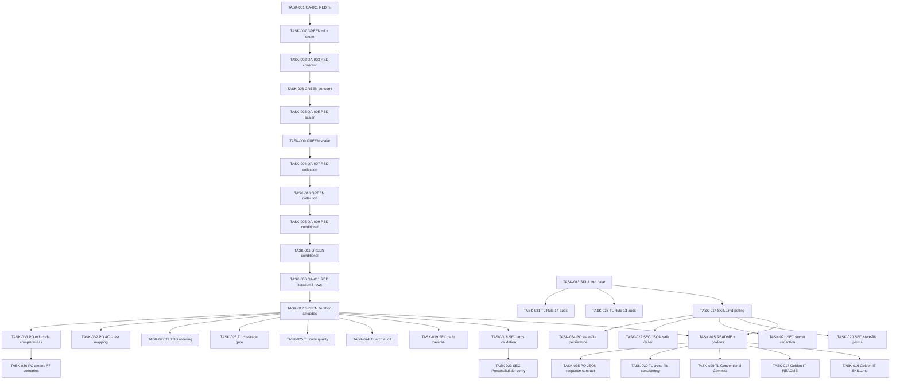

# Task Breakdown -- story-0045-0001

## Header

| Field | Value |
|-------|-------|
| Story ID | story-0045-0001 |
| Epic ID | 0045 |
| Date | 2026-04-20 |
| Author | x-story-plan (multi-agent) |
| Template Version | 1.0.0 |

## Summary

| Metric | Value |
|--------|-------|
| Total Tasks | 36 |
| Parallelizable Tasks | 14 |
| Estimated Effort | 4.0 L-equivalents (~17 points) |
| Mode | multi-agent |
| Agents Participating | Architect, QA, Security, Tech Lead, PO |

## Dependency Graph

## Tasks Table

| Task ID | Source Agent | Type | TDD Phase | TPP Level | Layer | Components | Parallel | Depends On | Effort | DoD |
|---------|-------------|------|-----------|-----------|-------|-----------|----------|-----------|--------|-----|
| TASK-001 | QA | test | RED | nil | test | PrWatchStatusClassifierTest | no | — | XS | Asserts TIMEOUT; method `classify_allNullInputs_returnsTimeout`; fails before impl |
| TASK-002 | QA | test | RED | constant | test | PrWatchStatusClassifierTest | no | TASK-007 | XS | Asserts SUCCESS on happy path; specific values; strong assertions |
| TASK-003 | QA | test | RED | scalar | test | PrWatchStatusClassifierTest | no | TASK-008 | S | Asserts CI_FAILED; covers failure/timed_out/cancelled/action_required |
| TASK-004 | QA | test | RED | collection | test | PrWatchStatusClassifierTest | no | TASK-009 | S | Pending checks do NOT yield SUCCESS |
| TASK-005 | QA | test | RED | conditional | test | PrWatchStatusClassifierTest | no | TASK-010 | S | CI_PENDING_PROCEED on copilot-timeout + green checks |
| TASK-006 | QA | test | RED | iteration | test | PrWatchStatusClassifierTest | no | TASK-011 | M | @ParameterizedTest 8 rows + boundary; file ≤ 250 lines |
| TASK-007 | QA+ARCH | implementation | GREEN | nil | adapter.outbound | PrWatchExitCode, PrWatchStatusClassifier | no | TASK-001 | S | Enum 8 values; classify() signature; null-guard → TIMEOUT; TASK-001 passes |
| TASK-008 | QA | implementation | GREEN | constant | adapter.outbound | PrWatchStatusClassifier | no | TASK-002 | XS | Success branch; TASK-001 + TASK-002 pass |
| TASK-009 | QA | implementation | GREEN | scalar | adapter.outbound | PrWatchStatusClassifier | no | TASK-003 | XS | Any-check-failed branch; no regression |
| TASK-010 | QA | implementation | GREEN | collection | adapter.outbound | PrWatchStatusClassifier | no | TASK-004 | S | Pending checks keep loop alive; no short-circuit |
| TASK-011 | QA | implementation | GREEN | conditional | adapter.outbound | PrWatchStatusClassifier | no | TASK-005 | S | Copilot-timeout branch; 100% branch coverage on conditional |
| TASK-012 | QA+ARCH | implementation | GREEN | iteration | adapter.outbound | PrWatchStatusClassifier | no | TASK-006 | M | All 8 exit codes implemented; JaCoCo ≥ 95% Line / ≥ 90% Branch |
| TASK-013 | ARCH | architecture | GREEN | N/A | config | skills/core/pr/x-pr-watch-ci/SKILL.md | yes | — | M | Frontmatter + args table + exit codes + JSON response; golden diff |
| TASK-014 | ARCH | architecture | GREEN | N/A | config | skills/core/pr/x-pr-watch-ci/SKILL.md | yes | TASK-013 | L | Polling loop + state-file atomic + backoff 30/60/120 + Copilot detection; golden diff |
| TASK-015 | ARCH | architecture | GREEN | N/A | config | README.md + goldens | no | TASK-014, TASK-012 | S | README Rule 13 Pattern 1; goldens regen via `mvn process-resources` + GoldenFileRegenerator; mvn test green |
| TASK-016 | QA | test | RED | constant | test | XPrWatchCiSkillGoldenIT | yes | TASK-014 | S | IT fails on SKILL.md drift; covers all targets |
| TASK-017 | QA | test | RED | constant | test | XPrWatchCiReadmeGoldenIT | yes | TASK-015 | XS | README golden IT; Rule 13 Pattern 1 example present |
| TASK-018 | Security | security | RED | N/A | adapter.outbound | PrWatchArgsValidator | yes | — | S | OWASP A03; bounds for pr-number/timeout/poll-interval/copilot-review-timeout; stderr "must be in range X..Y" |
| TASK-019 | Security | security | RED | N/A | adapter.outbound | StateFilePathResolver | yes | — | S | OWASP A01/CWE-22; canonicalize + prefix-validate; multi-pass; reject `..`, symlinks, absolute outside ws |
| TASK-020 | Security | security | GREEN | N/A | adapter.outbound | StateFileWriter | yes | TASK-014 | S | OWASP A05/CWE-276/377; PosixFilePermissions 0600/0700; ATOMIC_MOVE + REPLACE_EXISTING |
| TASK-021 | Security | security | RED | N/A | cross-cutting | GhCliOutputSanitizer | yes | — | S | OWASP A09/CWE-209; strip gh*_/bearer/JWT/URL creds; reuse Rule 20 TelemetryScrubber |
| TASK-022 | Security | security | RED | N/A | adapter.outbound | StateFileReader | yes | — | S | OWASP A08/CWE-502; no enableDefaultTyping; FAIL_ON_UNKNOWN_PROPERTIES; schemaVersion "1.0" only |
| TASK-023 | Security | security | VERIFY | N/A | adapter.outbound | GhCliRunner | no | TASK-018 | XS | OWASP A03 defense-in-depth; ProcessBuilder List<String> args; never `sh -c` |
| TASK-024 | TechLead | quality-gate | VERIFY | N/A | cross-cutting | PrWatchStatusClassifier imports | no | TASK-012 | XS | grep for Spring/Jackson/Quarkus imports returns 0; no IO in classifier; Rule 04 |
| TASK-025 | TechLead | quality-gate | VERIFY | N/A | cross-cutting | PrWatchStatusClassifier + test | no | TASK-012 | XS | classify() ≤ 25 lines; class ≤ 250 lines; ≤ 4 params; no boolean flags; x-code-lint clean |
| TASK-026 | TechLead | quality-gate | VERIFY | N/A | test | JaCoCo report | no | TASK-006, TASK-012 | S | ≥ 95% Line / ≥ 90% Branch; @ParameterizedTest 8 rows; no weak assertions |
| TASK-027 | TechLead | quality-gate | VERIFY | N/A | cross-cutting | git log | no | TASK-012 | S | Test commit precedes/equals impl; refactor commit present; TPP order |
| TASK-028 | TechLead | quality-gate | VERIFY | N/A | cross-cutting | SKILL.md + README.md | no | TASK-015 | XS | Rule 13 audit: 0 bare-slash matches; allowed-tools [Bash] only; Rule 13 Pattern 1 example in README |
| TASK-029 | TechLead | quality-gate | VERIFY | N/A | cross-cutting | git log | no | TASK-015 | XS | Each task = 1 commit `feat/refactor/test/docs(task-0045-0001-NNN):`; pre-commit chain green; no `--no-verify` |
| TASK-030 | TechLead | quality-gate | VERIFY | N/A | cross-cutting | state-file + SKILL.md shape | no | TASK-015 | S | State-file matches spec §5.4; atomic pattern per EPIC-0035; SKILL.md section order matches x-pr-create |
| TASK-031 | TechLead | quality-gate | VERIFY | N/A | cross-cutting | SKILL.md | no | TASK-014 | XS | Rule 14: 0 matches for `git worktree`, `x-git-worktree` outside Triggers/Examples; Integration Notes declares sequential |
| TASK-032 | PO | validation | VERIFY | N/A | cross-cutting | Gherkin §7 + test | no | TASK-012, TASK-006 | S | Each of 8 Gherkin scenarios → parametrized row; (exitCode, status-string) asserted |
| TASK-033 | PO | validation | VERIFY | N/A | cross-cutting | RULE-045-05 + enum + Gherkin | no | TASK-012 | S | All 8 enum values have ≥ 1 test row; exit 50 and 60 covered after TASK-036 |
| TASK-034 | PO | validation | VERIFY | N/A | cross-cutting | state-file AC | no | TASK-020 | S | State-file written with 7 required fields; resume reuses startedAt; atomic under crash |
| TASK-035 | PO | validation | VERIFY | N/A | cross-cutting | §5.2 JSON response | no | TASK-015 | XS | Happy path asserts all 5 fields (status, prNumber, checks[], copilotReview, elapsedSeconds) |
| TASK-036 | PO | validation | VERIFY | N/A | cross-cutting | story §7 + classifier | no | TASK-033 | S | Add Gherkin for NO_CI_CONFIGURED, PR_CLOSED, rate-limit retry transparency, state-file resume; amend story source |

## Escalation Notes

| Task ID | Reason | Recommended Action |
|---------|--------|--------------------|
| TASK-036 | PO identified 4 gaps in Gherkin §7 (exits 50/60 + rate-limit + resume) | Amend story source before implementation; regenerate tasks if scope expands |
| TASK-020 | State-file writer depends on shape decisions from SKILL.md TASK-014 | Keep writer logic in bash per ARCH decision; Java writer deferred unless resume becomes Java-driven |
| TASK-026 | Coverage gate is a check, not new code | Runs in CI after TASK-012 lands; no implementation required beyond JaCoCo config |
