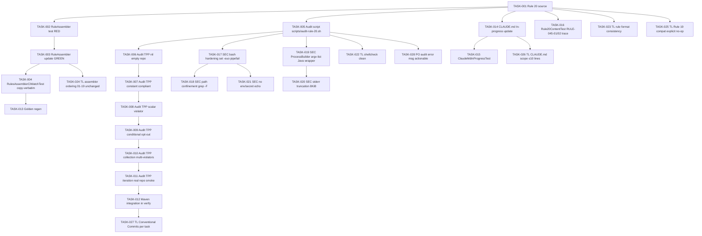

# Task Breakdown -- story-0045-0002

## Header

| Field | Value |
|-------|-------|
| Story ID | story-0045-0002 |
| Epic ID | 0045 |
| Date | 2026-04-20 |
| Author | x-story-plan (multi-agent) |
| Template Version | 1.0.0 |

## Summary

| Metric | Value |
|--------|-------|
| Total Tasks | 28 |
| Parallelizable Tasks | 9 |
| Estimated Effort | 2.5 L-equivalents |
| Mode | multi-agent |
| Agents Participating | Architect, QA, Security, Tech Lead, PO |

## Dependency Graph

## Tasks Table

| Task ID | Source Agent | Type | TDD Phase | TPP Level | Layer | Components | Parallel | Depends On | Effort | DoD |
|---------|-------------|------|-----------|-----------|-------|-----------|----------|-----------|--------|-----|
| TASK-001 | ARCH | implementation | GREEN | N/A | config | `java/src/main/resources/targets/claude/rules/20-ci-watch.md` | yes | — | M | 5 sections (Rule, Fallback Matrix, Rationale, Enforcement, Forbidden); cross-refs Rule 13 + 19; cites RULE-045-01 + RULE-045-02 |
| TASK-002 | QA | test | RED | collection | test | `RulesAssemblerTest.listRules_includesCiWatch` | no | — | XS | Asserts rule list contains `20-ci-watch.md`; precedes TASK-003 commit |
| TASK-003 | ARCH | implementation | GREEN | constant | application | `RulesAssembler`, `CoreRulesWriter` (if enumerated) | no | TASK-002, TASK-001 | S | Rule registered; TASK-002 passes; coverage ≥ 95%/90% |
| TASK-004 | ARCH | test | RED | constant | test | `RulesAssemblerCiWatchTest` | no | TASK-003 | S | Mirrors `RulesAssemblerTelemetryTest`; verbatim copy per active target |
| TASK-005 | ARCH | implementation | GREEN | N/A | adapter.outbound | `scripts/audit-rule-20.sh` | yes | TASK-001 | M | chmod 755; greps `core/**/SKILL.md`; exit 0 compliant, 1 violation, 2 misuse |
| TASK-006 | QA | test | RED | nil | test | `Rule20AuditTest.audit_emptyRepo_exits0` | no | — | S | `@TempDir` empty fixture; exit 0; empty stderr |
| TASK-007 | QA | test | GREEN | constant | test | `Rule20AuditTest.audit_singleCompliantOrchestrator_exits0` | no | TASK-006 | S | Fixture invokes both `x-pr-create` + `x-pr-watch-ci`; exit 0 |
| TASK-008 | QA | test | RED | scalar | test | `Rule20AuditTest.audit_orchestratorMissingCiWatch_exits1` | no | TASK-007 | S | Violator fixture; exit != 0; stderr lists file path |
| TASK-009 | QA | test | GREEN | conditional | test | `Rule20AuditTest.audit_explicitNoCiWatchFlag_exits0` | no | TASK-008 | S | Opt-out via `--no-ci-watch` recognized; exit 0 |
| TASK-010 | QA | test | RED | collection | test | `Rule20AuditTest.audit_multipleMixedCompliance_listsAllViolators` | no | TASK-009 | S | 3-orchestrator fixture; stderr enumerates both violators |
| TASK-011 | QA | test | GREEN | iteration | test | `Rule20AuditSmokeIT` | no | TASK-010 | M | Runs against real repo tree; `@Tag("integration")`; exit 0 |
| TASK-012 | QA | test | RED | iteration | test | `Rule20AuditMavenIT` | no | TASK-011 | M | Audit wired into `mvn verify`; build fails on seeded regression |
| TASK-013 | ARCH | implementation | REFACTOR | N/A | cross-cutting | `src/test/resources/golden/**` | no | TASK-004 | S | Goldens regenerated via `mvn process-resources` + GoldenFileRegenerator; mvn test green |
| TASK-014 | ARCH | implementation | GREEN | N/A | config | `CLAUDE.md` | no | TASK-001 | XS | "In progress" block references EPIC-0045 with link to `plans/epic-0045/`; ≤ 10-line delta |
| TASK-015 | PO | validation | VERIFY | N/A | test | `ClaudeMdInProgressTest` | no | TASK-014 | XS | Asserts `EPIC-0045` literal + path link present; temporary gate (removed at closure) |
| TASK-016 | PO | validation | VERIFY | N/A | test | `Rule20ContentTest` | no | TASK-001 | XS | Rule file contains literal `RULE-045-01` + `RULE-045-02`; traceability audit |
| TASK-017 | Security | security | RED | N/A | cross-cutting | `scripts/audit-rule-20.sh` | no | TASK-005 | S | `set -euo pipefail` first line; shellcheck clean; no `eval`/`sh -c`/backticks; quoted expansions |
| TASK-018 | Security | security | GREEN | N/A | cross-cutting | `scripts/audit-rule-20.sh` | no | TASK-017 | S | `readonly SKILLS_DIR` constant; `grep -F` for file-path matching; `find -type f` without `-L` |
| TASK-019 | Security | security | GREEN | N/A | test | `Rule20AuditTest` | no | TASK-006 | XS | `ProcessBuilder(List.of("bash", "scripts/audit-rule-20.sh"))`; no `sh -c` concat; `directory(repoRoot)` explicit |
| TASK-020 | Security | security | VERIFY | N/A | test | `Rule20AuditTest` stderr handling | no | TASK-019 | XS | Stderr truncated to relative paths (strip `user.dir`); capped 8192 bytes |
| TASK-021 | Security | security | VERIFY | N/A | test | audit script + test | no | TASK-017 | S | Script has no `env`/`printenv`/`git config --list`; canary-value test asserts no secret leak; no network/writes outside `$SKILLS_DIR` |
| TASK-022 | TechLead | quality-gate | VERIFY | N/A | cross-cutting | `scripts/audit-rule-20.sh` | no | TASK-005 | XS | shellcheck exit 0; exit codes 0/1/2 documented in header; `set -euo pipefail` |
| TASK-023 | TechLead | quality-gate | VERIFY | N/A | cross-cutting | `20-ci-watch.md` | no | TASK-001 | XS | 5 mandatory sections in canonical order; `> Related:` cross-ref; no emoji; matches Rule 19 shape |
| TASK-024 | TechLead | quality-gate | VERIFY | N/A | test | `RulesAssembler` ordering | no | TASK-003 | S | `listRules()` size +1; Rule 20 appears after Rule 19; Rules 01–19 byte-identical to baseline |
| TASK-025 | TechLead | quality-gate | VERIFY | N/A | cross-cutting | `20-ci-watch.md` body | no | TASK-001 | XS | Fallback Matrix has V1 → no-op row; Rationale cites Rule 19; Forbidden bans hard-fail on v1 |
| TASK-026 | TechLead | quality-gate | VERIFY | N/A | cross-cutting | `CLAUDE.md` | no | TASK-014 | XS | Diff scoped to In-Progress block only; no concluded-epic edits; ≤ 10 lines |
| TASK-027 | TechLead | quality-gate | VERIFY | N/A | cross-cutting | git log | no | all | XS | Exactly N atomic commits `^(feat|docs|test)\\(task-0045-0002-NNN\\):`; pre-commit green |
| TASK-028 | PO | validation | VERIFY | N/A | test | `Rule20AuditTest` stderr shape | no | TASK-008 | XS | Stderr contains violator path + literal phrase "missing x-pr-watch-ci (and no --no-ci-watch opt-out)" |

## Escalation Notes

| Task ID | Reason | Recommended Action |
|---------|--------|--------------------|
| TASK-005 | Slot `20-*` already contains `20-interactive-gates.md` + `20-telemetry-privacy.md`; adding `20-ci-watch.md` is a third tolerated collision | Documented precedent; proceed — ordering is alphabetical within slot 20 |
| TASK-021 | Canary-value secret leak test is defense-in-depth, not directly user-facing | Retain as CI smoke; low cost, high guard value |
| TASK-012 | Maven `verify` wiring needs pom.xml edit (exec-maven-plugin or maven-invoker-plugin); cross-file concern | Keep wiring minimal; reuse patterns from existing `RuleAssemblerTelemetryTest` if binding already exists |
