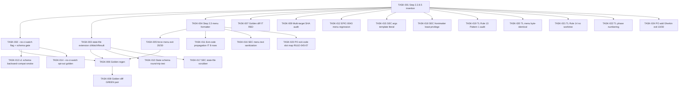

# Task Breakdown -- story-0045-0003

## Header

| Field | Value |
|-------|-------|
| Story ID | story-0045-0003 |
| Epic ID | 0045 |
| Date | 2026-04-20 |
| Author | x-story-plan (multi-agent) |
| Template Version | 1.0.0 |

## Summary

| Metric | Value |
|--------|-------|
| Total Tasks | 24 |
| Parallelizable Tasks | 8 |
| Estimated Effort | 2.5 L-equivalents |
| Mode | multi-agent |
| Agents Participating | Architect, QA, Security, Tech Lead, PO |

## Dependency Graph

## Tasks Table

| Task ID | Source | Type | TDD Phase | TPP | Layer | Components | Parallel | Depends On | Effort | DoD |
|---------|--------|------|-----------|-----|-------|-----------|----------|-----------|--------|-----|
| TASK-001 | ARCH | architecture | GREEN | N/A | config | `x-story-implement/SKILL.md` Step 2.2.8.5 | no | — | M | Step 2.2.8.5 between 2.2.8 and 2.2.9; Rule 13 Pattern 1 block; v1/opt-out skip branch; fail-open documented |
| TASK-002 | ARCH | implementation | GREEN | N/A | config | SKILL.md frontmatter + args | no | TASK-001 | S | `--no-ci-watch` documented; SchemaVersionResolver gate; reuses Rule 19 logic |
| TASK-003 | ARCH | architecture | GREEN | N/A | config | execution-state.json schema doc | no | TASK-001 | S | 5 subfields of `ciWatchResult` (status/checks/copilotReview/elapsedSeconds/exitCode); atomic write; v1 backward-compat paragraph |
| TASK-004 | ARCH | implementation | GREEN | N/A | config | Step 2.3 description formatter | no | TASK-001, TASK-003 | M | All 8 exit codes documented with menu description prefix; warning banner for 20/30 |
| TASK-005 | ARCH | implementation | GREEN | N/A | config | Step 2.2.9 auto-approve override | no | TASK-004 | M | Exit 20/30 suppress `--auto-approve-pr`; explicit log "auto-merge suppressed"; Gherkin scenario covered |
| TASK-006 | ARCH | implementation | REFACTOR | N/A | cross-cutting | `src/test/resources/golden/**/x-story-implement/**` | no | TASK-002, TASK-003, TASK-005 | S | Goldens regen via `mvn process-resources` + GoldenFileRegenerator; SkillsAssemblerTest green; TelemetryMarkerLint clean |
| TASK-007 | QA | test | RED | constant | test | `XStoryImplementGoldenIT` | no | — | M | Fails until TASK-001..005 land; exact post-insertion golden; diff localized to 2.2.8.5 + 2.3 |
| TASK-008 | QA | test | GREEN | constant | test | Golden fixture | no | TASK-007, TASK-006 | S | Golden regenerated; TASK-007 passes |
| TASK-009 | QA | test | RED | collection | test | `XStoryImplementTargetsAuditTest` | yes | — | S | SHA-256 equality across `.claude/skills/` and `src/test/resources/golden/`; clear diff report on drift |
| TASK-010 | QA | test | RED | conditional | test | `CiWatchResultSchemaTest` | yes | TASK-003 | S | Round-trip `task.ciWatchResult`; v1 fixture parses without field; optional absent field doesn't throw; all 8 exit codes accepted |
| TASK-011 | QA | test | RED | iteration | test | `XStoryImplementExitCodePropagationIT` | no | TASK-007 | M | 8×expected-phrase matrix; fails on missing branch; exit 20/30 warning prefix enforced |
| TASK-012 | QA | test | RED | collection | test | `InteractiveGatesConventionTest` extension | yes | — | S | 3-option menu invariant; canonical labels preserved; allowed-tools intact; audit script exit 0 for this SKILL.md |
| TASK-013 | QA | test | RED | conditional | test | `PlanningSchemaBackwardCompatSmokeTest` | yes | TASK-002 | S | v1 fixture reaches end of Phase 2.2 without CI-Watch; SCHEMA_VERSION_FALLBACK_* log code present; v1 skip block regex match |
| TASK-014 | QA | test | RED | conditional | test | `XStoryImplementNoCiWatchOptOutTest` | no | TASK-007 | XS | `--no-ci-watch` documented in arg table; early-return gate present; ciWatchResult NOT persisted |
| TASK-015 | Security | security | VERIFY | N/A | test | golden + `SkillsAssemblerTest` | no | TASK-001, TASK-006 | XS | Step 2.2.8.5 contains literal `Skill(skill: "x-pr-watch-ci", args: "--pr-number {{PR_NUMBER}}")`; no `$VAR`/`$(...)` in args |
| TASK-016 | Security | security | RED | N/A | config + test | SKILL.md Step 2.3 sanitization + test | no | TASK-004 | S | Strip ESC/CR/BEL/C0/C1 from check names + reviewId; cap 120 chars; negative fixture with ESC char asserts `?` redaction |
| TASK-017 | Security | security | RED | N/A | cross-cutting | state-file writer + `TelemetryScrubber` | no | TASK-003 | S | `task.ciWatchResult` string fields routed through scrubber; polluted fixture with `ghp_X...` → `GITHUB_TOKEN_REDACTED`; atomic rename preserved |
| TASK-018 | Security | security | VERIFY | N/A | test | `SkillsFrontmatterLintTest` | no | TASK-001 | XS | allowed-tools equals EPIC-0043 baseline; no silent expansion to WebFetch/Notebook |
| TASK-019 | TechLead | quality-gate | VERIFY | N/A | cross-cutting | SKILL.md audit | no | TASK-001 | XS | Rule 13 grep audit returns 0 bare-slash; Skill() call matches Pattern 1 verbatim |
| TASK-020 | TechLead | quality-gate | VERIFY | N/A | cross-cutting | Phase 2.2.9 menu block | no | TASK-001 | XS | Menu byte-identical via git diff; audit-interactive-gates.sh exit 0; 2.2.8.5 < 2.2.9 ordering |
| TASK-021 | TechLead | quality-gate | VERIFY | N/A | cross-cutting | Step 2.2.8.5 body | no | TASK-001 | XS | grep `git worktree`/`git checkout -b` in step returns 0 |
| TASK-022 | TechLead | quality-gate | VERIFY | N/A | cross-cutting | phase numbering + telemetry | no | TASK-001 | XS | 2.2.9 not renumbered; Phase-2-2-9-* markers unchanged; TelemetryMarkerLint passes |
| TASK-023 | PO | validation | VERIFY | N/A | cross-cutting | story §5.4 + SKILL.md | no | TASK-004 | XS | 8-row table (exit → default slot, auto-approve suppressed, description prefix); amends story source §5 |
| TASK-024 | PO | validation | VERIFY | N/A | cross-cutting | story §7 Gherkin | no | — | XS | Add scenarios for exit 30 forced menu + exit 10 "Copilot absent (timeout)" in description; amends story source |

## Escalation Notes

| Task ID | Reason | Recommended Action |
|---------|--------|--------------------|
| TASK-024 | PO identified gaps in Gherkin §7 (exits 30/10 coverage) | Amend story source before implementation; blocking for AC completeness |
| TASK-005 | Auto-approve suppression on exit 20/30 is cross-cutting with EPIC-0042 merge-train | Coordinate with EPIC-0042 owners; explicit log line is audit-friendly |
| TASK-023 | PO requests formalizing RULE-045-07 slot map in §5.4 | Amend story before implementation; keeps epic rules table coherent |
