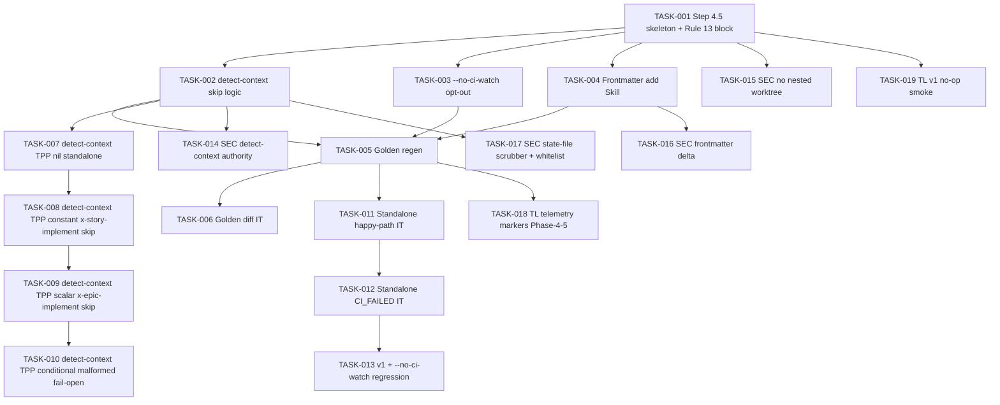

# Task Breakdown -- story-0045-0004

## Header

| Field | Value |
|-------|-------|
| Story ID | story-0045-0004 |
| Epic ID | 0045 |
| Date | 2026-04-20 |
| Author | x-story-plan (multi-agent) |
| Template Version | 1.0.0 |

## Summary

| Metric | Value |
|--------|-------|
| Total Tasks | 19 |
| Parallelizable Tasks | 7 |
| Estimated Effort | 2.0 L-equivalents |
| Mode | multi-agent |
| Agents Participating | Architect, QA, Security, Tech Lead, PO |

## Dependency Graph

## Tasks Table

| Task ID | Source | Type | TDD Phase | TPP | Layer | Components | Parallel | Depends On | Effort | DoD |
|---------|--------|------|-----------|-----|-------|-----------|----------|-----------|--------|-----|
| TASK-001 | ARCH | architecture | GREEN | N/A | config | `x-task-implement/SKILL.md` Step 4.5 | yes | story-0045-0001 | M | Step 4.5 between Step 4 and Step 5; Rule 13 Pattern 1 block `Skill(skill: "x-pr-watch-ci", args: "--pr-number {N}")`; skip matrix (v1/opt-out/parent); state-file path `.claude/state/task-watch-<TASK-ID>.json` |
| TASK-002 | ARCH | architecture | GREEN | N/A | config | SKILL.md detect-context block | no | TASK-001 | S | Rule 14 §3 canonical mechanism (git rev-parse + fixed-string `/.claude/worktrees/`); authoritative marker (no env-var/flag override); log "CI-Watch delegated to parent orchestrator" |
| TASK-003 | ARCH | architecture | GREEN | N/A | config | SKILL.md args table | no | TASK-001 | S | `--no-ci-watch` flag documented; default absent; `--no-ci-watch` precedence wins over schema version |
| TASK-004 | ARCH | implementation | GREEN | N/A | config | SKILL.md frontmatter | no | TASK-001 | XS | allowed-tools adds `Skill` only (no Agent, no new Bash); existing tools preserved |
| TASK-005 | ARCH | implementation | REFACTOR | N/A | cross-cutting | `src/test/resources/golden/**/x-task-implement/**` | no | TASK-002, TASK-003, TASK-004 | S | `mvn process-resources` first; `GoldenFileRegenerator` regen; SkillsAssemblerTest green; TelemetryMarkerLint balanced |
| TASK-006 | QA | test | RED | constant | test | `XTaskImplementGoldenIT` | no | TASK-005 | S | Byte-equivalence across all generation targets; diff reflects Step 4.5 + detect-context + --no-ci-watch + frontmatter |
| TASK-007 | QA | test | RED | nil | test | `XTaskImplementDetectContextTest` | no | TASK-002 | XS | Fixture with orchestrator=none → Skill(x-pr-watch-ci) invoked; task-watch-<ID>.json written |
| TASK-008 | QA | test | GREEN | constant | test | same | no | TASK-007 | XS | Fixture parent=x-story-implement → zero invocations; log asserted |
| TASK-009 | QA | test | GREEN | scalar | test | same | no | TASK-008 | XS | Fixture parent=x-epic-implement → zero invocations |
| TASK-010 | QA | test | RED | conditional | test | same | no | TASK-009 | S | Malformed parent marker → fail-open to standalone; WARN log asserted |
| TASK-011 | QA | test | GREEN | scalar | test | `XTaskImplementStandaloneHappyPathIT` | no | TASK-006, TASK-007 | M | `--worktree` + v2 + CI green → exit 0; state-file schemaVersion=1.0; menu unchanged |
| TASK-012 | QA | test | RED | conditional | test | `XTaskImplementStandaloneCiFailedIT` | no | TASK-011 | M | `--worktree` + v2 + CI failed → exit 20; menu slot-1 "CI FAILED — FIX-PR recommended"; 3-option invariant |
| TASK-013 | QA | test | RED | conditional | test | `XTaskImplementRegressionTest` | no | TASK-011, TASK-012 | S | v1: SCHEMA_VERSION_FALLBACK_* log + zero invocations; --no-ci-watch: opt-out log + zero invocations; EPIC-0043 menu still fires |
| TASK-014 | Security | security | VERIFY | N/A | test | SKILL.md Step 4.5 | no | TASK-002 | XS | Explicitly cites Rule 14 §3; no env-var/flag-based orchestrator detection; negative test for forged marker |
| TASK-015 | Security | security | VERIFY | N/A | cross-cutting | SKILL.md + x-pr-watch-ci contract | no | TASK-001 | XS | SKILL.md notes x-pr-watch-ci is sequential/API-only; smoke asserts `git worktree list` count unchanged after Step 4.5 |
| TASK-016 | Security | security | VERIFY | N/A | cross-cutting | goldens + `SkillsAssemblerTest` | no | TASK-005 | XS | Golden diff shows ONLY `Skill` added to allowed-tools; no Agent/WebFetch |
| TASK-017 | Security | security | VERIFY | N/A | config + test | state-file writer | no | TASK-002 | S | `task-watch-<TASK-ID>.json` schema v1.0 whitelist: {prNumber, conclusion, exitCode, timestamp, checkName}; no raw log/PR body/job env; scrubber applied to `failureReason` |
| TASK-018 | TechLead | quality-gate | VERIFY | N/A | cross-cutting | telemetry markers | no | TASK-005 | XS | `phase.start Phase-4-5-CI-Watch` / `phase.end` markers balanced; TelemetryMarkerLint clean |
| TASK-019 | TechLead | quality-gate | VERIFY | N/A | test | `PlanningSchemaBackwardCompatSmokeTest` extension | no | TASK-001 | S | v1 fixture skips CI-Watch (Rule 19 fallback); Gherkin boundary §7 scenario asserted |

## Escalation Notes

| Task ID | Reason | Recommended Action |
|---------|--------|--------------------|
| TASK-002 | Rule 14 `detect-context` envelope lacks `orchestrator=parent\|none` field today | Extend envelope contract OR derive classifier in SKILL.md; story-0045-0004 Gate-3 refinement |
| TASK-014 | Security flags forged-marker risk for detect-context | Marker MUST come from `/x-git-worktree detect-context` (trusted); forbid plan/env override |
| TASK-013 | `--no-ci-watch` precedence: flag wins over schema version (v2 + flag → skip) | Covered via PO-003; documented in SKILL.md args table |
