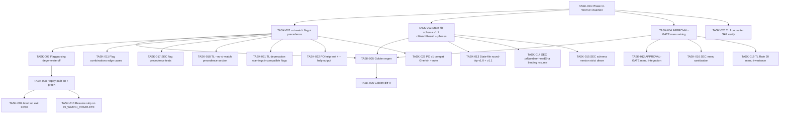

# Task Breakdown -- story-0045-0005

## Header

| Field | Value |
|-------|-------|
| Story ID | story-0045-0005 |
| Epic ID | 0045 |
| Date | 2026-04-20 |
| Author | x-story-plan (multi-agent) |
| Template Version | 1.0.0 |

## Summary

| Metric | Value |
|--------|-------|
| Total Tasks | 23 |
| Parallelizable Tasks | 7 |
| Estimated Effort | 2.5 L-equivalents |
| Mode | multi-agent |
| Agents Participating | Architect, QA, Security, Tech Lead, PO |

## Dependency Graph

## Tasks Table

| Task ID | Source | Type | TDD Phase | TPP | Layer | Components | Parallel | Depends On | Effort | DoD |
|---------|--------|------|-----------|-----|-------|-----------|----------|-----------|--------|-----|
| TASK-001 | ARCH | implementation | GREEN | N/A | config | `x-release/SKILL.md` Phase CI-WATCH | yes | story-0045-0001 | M | Phase block between OPEN-RELEASE-PR and APPROVAL-GATE; Rule 13 Pattern 1 `Skill(x-pr-watch-ci, --pr-number N --require-copilot-review=false)`; conditional on `--ci-watch`; golden diff |
| TASK-002 | ARCH | implementation | GREEN | N/A | config | args section + precedence | no | TASK-001 | S | `--ci-watch` documented; orthogonality matrix with `--interactive`/`--dry-run`/`--continue-after-merge`/`--skip-review`; `--no-ci-watch` wins precedence |
| TASK-003 | ARCH | implementation | GREEN | N/A | config | state-file schema v1.1 | no | TASK-001 | S | `ciWatchResult {status, exitCode, releaseVersion, prNumber, headSha, checksSnapshot, copilotReview?, schemaVersion="1.1"}`; new phase values CI_WATCH_PENDING/COMPLETE/RELEASE_ABORTED; v1.0 backward-compat reader |
| TASK-004 | ARCH | implementation | GREEN | N/A | config | APPROVAL-GATE Phase 8 | no | TASK-001, TASK-003 | S | AskUserQuestion description consumes `ciWatchResult`; exit 0 → PROCEED suggestion; exit 20 → FIX-PR recommendation + abort path; exit 10 Copilot-absent note; 3-option invariant preserved |
| TASK-005 | ARCH | implementation | REFACTOR | N/A | cross-cutting | `src/test/resources/golden/**/x-release/**` | no | TASK-002, TASK-003, TASK-004 | S | `mvn process-resources` first; SkillsAssemblerTest green; diff reflects all 4 prior tasks |
| TASK-006 | QA | test | RED | nil | test | `XReleaseGoldenIT` | no | TASK-005 | S | Golden asserted byte-identical; covers Phase CI-WATCH + --ci-watch args + state-file section |
| TASK-007 | QA | test | RED | nil | test | `CiWatchFlagParserTest` | no | TASK-002 | XS | Flag absent → ciWatchEnabled=false; Phase CI-WATCH marker NOT emitted; existing release flow byte-identical |
| TASK-008 | QA | test | RED | constant | test | `CiWatchHappyPathTest` | no | TASK-007 | S | `--ci-watch` on + exit 0 → ciWatchResult persisted (status=SUCCESS); phase=CI_WATCH_COMPLETE; APPROVAL-GATE entered |
| TASK-009 | QA | test | RED | scalar | test | `CiWatchAbortHandlerTest` | no | TASK-008 | S | Exit 20 → RELEASE_ABORTED; exit 30 parametrized → RELEASE_ABORTED; no tag side-effect; ciWatchResult.exitCode persisted |
| TASK-010 | QA | test | RED | conditional | test | `CiWatchResumeTest` | no | TASK-008 | S | Pre-loaded state-file with phase=CI_WATCH_COMPLETE → Skill call count == 0; advances to tag phase |
| TASK-011 | QA | test | RED | iteration | test | `CiWatchFlagCombinationsTest` | no | TASK-007 | S | `--ci-watch --dry-run` → no state write; `--no-ci-watch` overrides; `--ci-watch --interactive` combined |
| TASK-012 | QA | test | RED | constant | test | `ApprovalGateMenuTest` | no | TASK-008, TASK-009 | S | Slot-1 description substring "CI green (exit 0)" on SUCCESS; "CI skipped" when flag absent; 3-option menu preserved |
| TASK-013 | QA | test | GREEN | constant | test | `ReleaseStateFileCiWatchTest` | no | TASK-003 | S | v1.1 JSON round-trips; v1.0 legacy JSON parses (ciWatchResult=null); releaseVersion validated as semver |
| TASK-014 | Security | security | RED | N/A | config + test | state-file schema + resume | no | TASK-003 | S | `ciWatchResult.prNumber` + `headSha` (40-hex) required; resume re-queries live PR; `STATE_FILE_PR_MISMATCH` abort on stale SHA; no tag created |
| TASK-015 | Security | security | RED | N/A | config + test | state-file reader | no | TASK-003 | S | schemaVersion="1.1" when ciWatchResult present; unknown top-level fields → `STATE_FILE_SCHEMA_UNKNOWN` (WARN); no implicit upgrade on write |
| TASK-016 | Security | security | RED | N/A | config + test | APPROVAL-GATE menu composition | no | TASK-004 | S | Truncate ≤120 chars; strip backticks/newlines/markdown control; whitelist exit codes {0,10,20,30,40,50,60,70}; reject unknown |
| TASK-017 | Security | security | RED | N/A | test | `CiWatchFlagPrecedenceTest` | no | TASK-002 | S | (a) `--ci-watch --interactive --dry-run` valid; (b) `--continue-after-merge` + CI_WATCH_COMPLETE skips re-invocation; (c) CI_WATCH_COMPLETE + status != SUCCESS → abort; (d) flag absent preserves legacy byte-identical |
| TASK-018 | TechLead | quality-gate | VERIFY | N/A | config | args §Flag Compatibility | no | TASK-002 | XS | Table shows `--ci-watch`/`--no-ci-watch` conflict rule; `--no-ci-watch` wins; golden diff regen |
| TASK-019 | TechLead | quality-gate | VERIFY | N/A | test | `XReleaseApprovalGateMenuIT` | no | TASK-004 | S | Exactly 3 AskUserQuestion options (PROCEED/FIX-PR/ABORT); only `description` varies |
| TASK-020 | TechLead | quality-gate | VERIFY | N/A | test | `XReleaseFrontmatterTest` | no | TASK-001 | XS | Asserts `Skill` and `AskUserQuestion` both in allowed-tools |
| TASK-021 | TechLead | quality-gate | VERIFY | N/A | config | §Flag Compatibility deprecation notes | no | TASK-002 | XS | Warning text for `--ci-watch --skip-review` semantic overlap; `--continue-after-merge` without ciWatchResult (legacy resume); log-only exit 0 |
| TASK-022 | PO | validation | VERIFY | N/A | config + test | `x-release --help` output + README | no | TASK-002 | XS | `x-release --help \| grep -q ci-watch` returns 0; references/ quick-ref updated |
| TASK-023 | PO | validation | VERIFY | N/A | config | §3.5 v1 compat + Gherkin | no | TASK-002 | XS | `x-release` is schema-agnostic; v1 epic branch + `--ci-watch` → runs normally; Gherkin scenario added |

## Escalation Notes

| Task ID | Reason | Recommended Action |
|---------|--------|--------------------|
| TASK-014 | Resume integrity critical: stale state-file could skip CI gate on new commits | Hard-bind `ciWatchResult` to `prNumber` + `headSha`; abort on mismatch |
| TASK-003 | Story's new phase values + ciWatchResult imply shape change — requires schema bump | v1.0 → v1.1 with backward-compat reader (legacy parses with ciWatchResult=null) |
| PO-001 (not adopted as task) | Story currently aborts on exit 20; PO suggested routing to FIX-PR gate | TASK-009 retains abort behavior (release safety); FIX-PR remediation is manual post-abort. Document rationale in §7 Gherkin |
