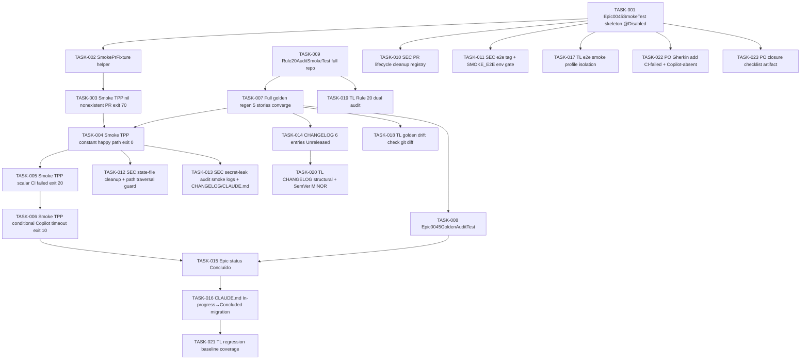

# Task Breakdown -- story-0045-0006

## Header

| Field | Value |
|-------|-------|
| Story ID | story-0045-0006 |
| Epic ID | 0045 |
| Date | 2026-04-20 |
| Author | x-story-plan (multi-agent) |
| Template Version | 1.0.0 |

## Summary

| Metric | Value |
|--------|-------|
| Total Tasks | 23 |
| Parallelizable Tasks | 5 |
| Estimated Effort | 3.0 L-equivalents |
| Mode | multi-agent |
| Agents Participating | Architect, QA, Security, Tech Lead, PO |

## Dependency Graph

## Tasks Table

| Task ID | Source | Type | TDD Phase | TPP | Layer | Components | Parallel | Depends On | Effort | DoD |
|---------|--------|------|-----------|-----|-------|-----------|----------|-----------|--------|-----|
| TASK-001 | ARCH | implementation | GREEN | N/A | test | `Epic0045SmokeTest` skeleton | yes | — | M | @Tag("e2e") + @EnabledIfEnvironmentVariable; lifecycle scaffolded; @Disabled on tests until TASK-004 |
| TASK-002 | QA | implementation | REFACTOR | N/A | test | `SmokePrFixture` helper | no | TASK-001 | M | Encapsulates gh CLI (create-draft, close, delete-branch, exists-check); idempotent cleanup; unique branch `smoke/epic-0045-<ts>-<scenario>`; unit-tested |
| TASK-003 | QA | test | RED | nil | test | `Epic0045SmokeTest.smoke_nonexistentPr_returnsExit70` | no | TASK-002 | S | `--pr-number 999999999` → exit 70; JSON PR_NOT_FOUND; runs <30s; no PR creation |
| TASK-004 | QA | test | GREEN | constant | test | `Epic0045SmokeTest.smoke_happyPath_returnsExit0` | no | TASK-003, TASK-007 | M | Real draft PR; exit 0; JSON status=SUCCESS; prNumber match; checks≥1; elapsedSeconds≤300; cleanup idempotent |
| TASK-005 | QA | test | RED | scalar | test | `Epic0045SmokeTest.smoke_ciFailed_returnsExit20` | no | TASK-004 | M | Seeded `smoke-fail.yml` workflow with `exit 1`; exit 20; JSON status=FAILURE; failing check name present |
| TASK-006 | QA | test | GREEN | conditional | test | `Epic0045SmokeTest.smoke_copilotAbsent_returnsExit10` | no | TASK-005 | M | `--require-copilot --timeout-seconds 60`; exit 10; timeout respected ±10s; @Disabled removed from class |
| TASK-007 | ARCH | implementation | GREEN | N/A | cross-cutting | `src/test/resources/golden/**` (comprehensive) | no | stories 0001/0002/0003/0004/0005 merged | L | `mvn process-resources` + GoldenFileRegenerator; covers x-pr-watch-ci new + x-story-implement + x-task-implement + x-release + rules/20-ci-watch.md; SkillsAssemblerTest + RuleAssemblerTest green |
| TASK-008 | QA | test | GREEN | constant | test | `Epic0045GoldenAuditTest` | no | TASK-007 | M | GoldenFileRegenerator dry-run mode; diff count == 0 across 6 artifact categories from story §3.1 |
| TASK-009 | QA | test | GREEN | constant | test | `Rule20AuditSmokeTest` | yes | story-0045-0002 merged | S | `scripts/audit-rule-20.sh` exit 0; zero violations reported; <10s |
| TASK-010 | Security | security | VERIFY | N/A | test | `Epic0045SmokeTest` cleanup registry | no | TASK-001 | S | Static `cleanupRegistry`; resources appended on creation; @AfterAll iterates with per-resource try/catch; @BeforeAll inner try/catch invokes partial cleanup then rethrows; post-cleanup assertion `gh pr list --state open` empty + `git ls-remote` empty |
| TASK-011 | Security | security | VERIFY | N/A | config | `pom.xml` + test | no | TASK-001 | XS | `@Tag("e2e")` + `@EnabledIfEnvironmentVariable(SMOKE_E2E=true)`; Surefire `<excludedGroups>e2e</excludedGroups>`; `GH_TOKEN`/`GITHUB_TOKEN` presence validated at @BeforeAll; gh scopes documented (`repo:public_repo` + `pull_request:write`, no admin) |
| TASK-012 | Security | security | VERIFY | N/A | test | state-file cleanup | no | TASK-004 | S | `@AfterEach` deletes `.claude/state/pr-watch-<N>.json` via `Files.deleteIfExists`; `Path.resolve(...).normalize().startsWith(baseStateDir)` guard; @AfterAll asserts state dir empty of `pr-watch-*` |
| TASK-013 | Security | security | VERIFY | N/A | cross-cutting | smoke logs + CHANGELOG + CLAUDE.md | no | TASK-004, TASK-014, TASK-016 | S | smoke stdout/stderr routed through `TelemetryScrubber`; `PiiAudit` CLI run against CHANGELOG+CLAUDE.md diff; fail on `ghp_`/`ghs_`/`Bearer `/`AKIA`/`eyJ` tokens; `gh pr close` output piped through scrubber |
| TASK-014 | ARCH | implementation | GREEN | N/A | config | `CHANGELOG.md` | no | TASK-007 | S | 6 entries under `## [Unreleased]`: 4 Added (0001/0002/0005/0006) + 2 Changed (0003/0004); each references EPIC-0045; Keep-a-Changelog categorized; prior Unreleased entries preserved |
| TASK-015 | ARCH | implementation | GREEN | N/A | config | `plans/epic-0045/epic-0045.md` + `execution-state.json` | no | TASK-006, TASK-008 | S | Status flipped `Em Refinamento` → `Concluído`; execution-state.json final status=COMPLETED + completedAt timestamp |
| TASK-016 | ARCH | implementation | GREEN | N/A | cross-cutting | `CLAUDE.md` | no | TASK-015 | S | In-progress EPIC-0045 block removed; Concluded block added linking to `plans/epic-0045/`; consistent with EPIC-0041 concluded-block style; ADR link if present |
| TASK-017 | TechLead | quality-gate | VERIFY | N/A | config | surefire/failsafe profile | no | TASK-001 | XS | `mvn test` wall-time unchanged vs baseline (smoke excluded by default); `mvn verify -P e2e` activates smoke; CLI transcript captured |
| TASK-018 | TechLead | quality-gate | VERIFY | N/A | cross-cutting | `git diff src/test/resources/golden/` | no | TASK-007 | XS | `git diff --exit-code src/test/resources/golden/` exits 0 after regen; all skills touched by 0001/0003/0004/0005 present in regenerated set |
| TASK-019 | TechLead | quality-gate | VERIFY | N/A | cross-cutting | Rule 20 dual audit | no | TASK-009 | XS | `scripts/audit-interactive-gates.sh --baseline` exit 0 AND `dev.iadev.telemetry.PiiAudit` exit 0; both output "AUDIT PASSED" |
| TASK-020 | TechLead | quality-gate | VERIFY | N/A | config | CHANGELOG + pom.xml | no | TASK-014 | S | `grep -c "story-0045-000[1-6]" CHANGELOG.md` == 6; pom.xml version bumped MINOR; no public API removed (grep diff vs last tag); Keep-a-Changelog headers present |
| TASK-021 | TechLead | quality-gate | VERIFY | N/A | test | JaCoCo + baseline comparison | no | TASK-016 | S | `mvn test` HEAD pass-count ≥ baseline; line-coverage ≥ 95%; branch ≥ 90%; zero new failures vs merge-base with develop |
| TASK-022 | PO | validation | VERIFY | N/A | config | story §7 Gherkin | no | — | S | Adds 2 Gherkin scenarios: (a) CI-failed exit 20 menu FIX-PR; (b) Copilot absent exit 10 valid downgrade (RULE-045-04); matches parameterized test scenarios |
| TASK-023 | PO | validation | VERIFY | N/A | config | `reports/epic-0045-closure-checklist.md` | no | TASK-015, TASK-016, TASK-014 | S | 7-gate closure checklist: PRs merged, smoke green ×2 CI runs, goldens + SHA, CHANGELOG 6 entries, Rule 20 audits 0, CLAUDE.md migrated, epic status Concluído |

## Escalation Notes

| Task ID | Reason | Recommended Action |
|---------|--------|--------------------|
| TASK-004 | Smoke creates real PRs; requires GITHUB_TOKEN with `pull_request:write` scope | Document in test javadoc + CI workflow; TASK-011 validates env presence at @BeforeAll |
| TASK-007 | Full golden regen converges from 5 upstream stories; sequencing critical | Wave 1: stories 0001/0002/0003/0004/0005 merged; Wave 2: TASK-007 regen; Wave 3: TASK-008 audit |
| TASK-020 | Version bump MINOR assumption — no public contract removal. Verify via grep of `public` signatures vs last tag | If any removal detected, escalate to MAJOR with ADR rationale |
| PO-002 (flakiness policy) + PO-003 (integrated-flow smoke) | Deferred — not adopted as blocking tasks for DoR | Optional follow-ups; PO-002 retry policy can fold into TASK-004 implementation; PO-003 integrated-flow smoke is optional pre-release gate, recommended but not required |
