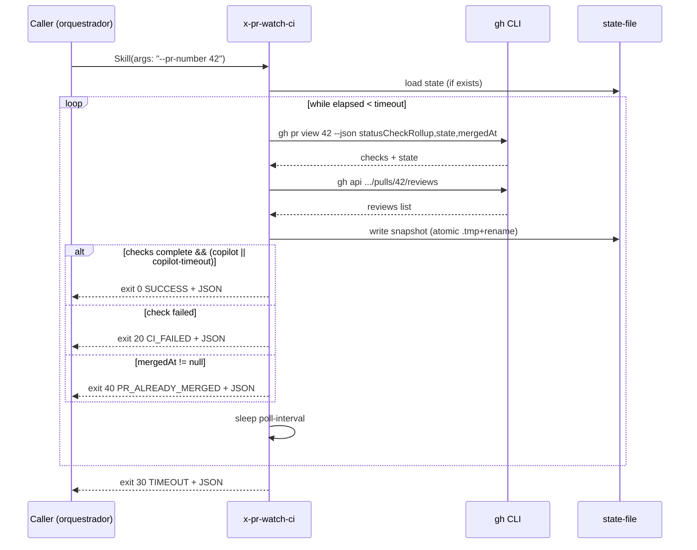

# História: Criar skill `x-pr-watch-ci` com polling de CI + detecção de Copilot review

**ID:** story-0045-0001
**Chave Jira:** —
**Status:** Pendente

## 1. Dependências

| Blocked By | Blocks |
| :--- | :--- |
| — | story-0045-0003, story-0045-0004, story-0045-0005 |

## 2. Regras Transversais Aplicáveis

| ID | Título |
| :--- | :--- |
| RULE-045-03 | State-file canônico versionado |
| RULE-045-04 | Copilot login canônico |
| RULE-045-05 | Exit codes estáveis como contrato público |
| RULE-045-06 | Rule 13 INLINE-SKILL obrigatória |
| RULE-045-08 | Atomic, Reversible Commits |

## 3. Descrição

Como **Platform engineer responsável por skills de orquestração de PR**, eu quero uma skill dedicada `x-pr-watch-ci` em `core/pr/` que encapsule o polling de checks de CI via `gh pr checks` + detecção do review do `copilot-pull-request-reviewer[bot]` via `gh api .../reviews`, garantindo que qualquer orquestrador possa aguardar feedback automatizado antes de apresentar um gate de aprovação ao usuário.

A skill resolve o gap identificado no `spec-ci-watch.md` §2: hoje `x-pr-fix` (invocada pelo menu `FIX-PR` do EPIC-0043) encontra zero comentários porque o Copilot ainda não postou. A primitiva `x-pr-watch-ci` centraliza a lógica de espera em um lugar testável, com contrato de IO preciso (argumentos + exit codes + JSON em stdout) reutilizável por `x-story-implement`, `x-task-implement --worktree` e `x-release`. A implementação segue Rule 14 (Worktree Lifecycle) — a skill NÃO cria worktrees próprios (sequencial, roda no working tree do caller). Segue ADR-0003 (categoria `core/pr/`). O state-file versionado em `.claude/state/pr-watch-<N>.json` reusa o padrão introduzido pelo EPIC-0035 story 0035-0004 para suportar retomada após interrupção da sessão.

### 3.1 Argumentos CLI

- `--pr-number <N>` obrigatório; `--timeout-seconds <N>` default 1800 (bounds 60–7200); `--poll-interval-seconds <N>` default 60 (bounds 15–300); `--require-copilot-review` default true; `--require-checks-passing` default true; `--copilot-review-timeout <N>` default 900; `--state-file <path>` default `.claude/state/pr-watch-<N>.json`; `--no-state-file` flag.

### 3.2 Lógica de polling

- Loop `while elapsed < timeout`: `gh pr view <N> --json state,mergedAt,statusCheckRollup` + `gh api .../pulls/{N}/reviews`.
- Classifica estado: `checks` (sucesso, pendente, falha), `copilotReview` (presente/ausente), `prState` (open/closed/merged).
- Escreve state-file após cada poll (atômico: `.tmp` + rename). Resume lê state-file se presente.
- Condições de saída: checks completos + (Copilot presente OU copilot-timeout) → SUCCESS/CI_PENDING_PROCEED; algum check com `conclusion ∈ {failure, timed_out, cancelled, action_required}` → CI_FAILED; elapsed >= timeout → TIMEOUT; `state == CLOSED` não-merged → PR_CLOSED; `mergedAt != null` → PR_ALREADY_MERGED.

### 3.3 Classificação de exit code (helper Java)

- Extrair para `dev.iadev.adapter.pr.PrWatchStatusClassifier` a lógica `classify(checks, copilot, prState, elapsed, cfg) -> ExitCode`.
- Enum `ExitCode {SUCCESS=0, CI_PENDING_PROCEED=10, CI_FAILED=20, TIMEOUT=30, PR_ALREADY_MERGED=40, NO_CI_CONFIGURED=50, PR_CLOSED=60, PR_NOT_FOUND=70}`.

## 3.5 Entrega de Valor

- **Valor Principal:** Primitiva reusável "aguardar PR atingir estado observável" disponível na taxonomia `core/pr/`, eliminando a necessidade de cada orquestrador re-implementar polling inline (violação de DRY/SRP).
- **Métrica de Sucesso:** Invocação `Skill(skill: "x-pr-watch-ci", args: "--pr-number N")` contra PR real retorna exit code correto conforme tabela RULE-045-05 em <= `--poll-interval-seconds` no happy path.
- **Impacto no Negócio:** Desbloqueia stories 0045-0003/0004/0005 que integram a skill nos orquestradores, permitindo que o menu interativo do EPIC-0043 receba contexto real de CI + Copilot.

## 4. Definições de Qualidade Locais

### DoR Local (Definition of Ready)

- [ ] Contrato de argumentos finalizado no `spec-ci-watch.md` §5.1
- [ ] Tabela de exit codes finalizada no `spec-ci-watch.md` §5.2
- [ ] Shape do state-file acordado (RULE-045-03)
- [ ] ADR-0003 taxonomia confirmada (categoria `core/pr/`)

### DoD Local (Definition of Done)

- [ ] Skill `x-pr-watch-ci` presente em `java/src/main/resources/targets/claude/skills/core/pr/x-pr-watch-ci/SKILL.md` com frontmatter e body
- [ ] README de referência em `.../x-pr-watch-ci/README.md`
- [ ] Helper Java `PrWatchStatusClassifier` em `java/src/main/java/dev/iadev/adapter/pr/` com cobertura ≥ 95% Line / 90% Branch
- [ ] Unit test cobrindo as 8 linhas da tabela de exit codes via `@ParameterizedTest`
- [ ] Golden diff regenerado via `GoldenFileRegenerator` (precedido de `mvn process-resources`)
- [ ] Commit atômico por task (RULE-045-08)
- [ ] Pelo menos 1 teste automatizado validando classificação de exit code
- [ ] Smoke test — STORY-0045-0006 valida end-to-end (não aqui)

### Global Definition of Done (DoD)

> Copiar do Épico.

- **Cobertura:** ≥ 95% Line, ≥ 90% Branch para `PrWatchStatusClassifier`.
- **Testes Automatizados:** unit tests do classificador (8 rows); golden diff da SKILL.md.
- **Relatório de Cobertura:** JaCoCo.
- **Documentação:** README + SKILL.md.
- **Persistência:** state-file schema v1.0.
- **Performance:** Happy path completa em ≤ 1× poll-interval (60s default).

## 5. Contratos de Dados (Data Contract)

### 5.1 Request (argumentos CLI)

| Campo | Tipo | M/O | Validações | Exemplo |
| :--- | :--- | :--- | :--- | :--- |
| `--pr-number` | `Integer` | M | > 0 | `42` |
| `--timeout-seconds` | `Integer` | O | 60..7200 | `1800` |
| `--poll-interval-seconds` | `Integer` | O | 15..300 | `60` |
| `--require-copilot-review` | `Boolean` | O | true/false | `true` |
| `--require-checks-passing` | `Boolean` | O | true/false | `true` |
| `--copilot-review-timeout` | `Integer` | O | 60..timeout | `900` |
| `--state-file` | `String(512)` | O | path válido | `.claude/state/pr-watch-42.json` |
| `--no-state-file` | `Flag` | O | — | presente/ausente |

### 5.2 Response (JSON final em stdout)

| Campo | Tipo | Sempre presente | Descrição |
| :--- | :--- | :--- | :--- |
| `status` | `String` | Sim | Nome do exit code (`SUCCESS`, `CI_FAILED`, etc.) |
| `prNumber` | `Integer` | Sim | Número do PR monitorado |
| `checks` | `List<{name, conclusion}>` | Sim | Snapshot final dos checks |
| `copilotReview` | `{present: Boolean, reviewId?: Long}` | Sim | Estado do review do Copilot |
| `elapsedSeconds` | `Integer` | Sim | Tempo total de polling |

### 5.3 Error Codes Mapeados

| Exit | Nome | Condição |
| :--- | :--- | :--- |
| 20 | `CI_FAILED` | Algum check com conclusion ∈ {failure, timed_out, cancelled, action_required} |
| 30 | `TIMEOUT` | elapsed >= timeout-seconds |
| 60 | `PR_CLOSED` | PR fechado sem merge |
| 70 | `PR_NOT_FOUND` | `gh pr view` retorna erro 404 |

### 5.4 State-file schema (RULE-045-03)

| Campo | Tipo | Obrigatório | Descrição |
| :--- | :--- | :--- | :--- |
| `prNumber` | `Integer` | Sim | PR monitorado |
| `startedAt` | `Instant` | Sim | ISO-8601 UTC |
| `lastPollAt` | `Instant` | Sim | ISO-8601 UTC |
| `pollCount` | `Integer` | Sim | Contador de polls |
| `checksSnapshot` | `List<{name, conclusion}>` | Sim | Último snapshot |
| `copilotReview` | `{present, reviewId?}` | Não | Null se Copilot ausente |
| `schemaVersion` | `String` | Sim | `"1.0"` |

## 6. Diagramas

### 6.1 Fluxo de polling



## 7. Critérios de Aceite (Gherkin)

```gherkin
Cenario: PR inexistente retorna PR_NOT_FOUND (degenerate)
  DADO que o PR 99999 não existe no repositório
  QUANDO invocar x-pr-watch-ci com --pr-number 99999
  ENTÃO a skill sai com exit code 70
  E o stdout contém "status": "PR_NOT_FOUND"

Cenario: Happy path — CI green + Copilot review presente no primeiro poll
  DADO que o PR 42 tem todos os checks com conclusion=success
  E o reviewer copilot-pull-request-reviewer[bot] já postou review
  QUANDO invocar x-pr-watch-ci com --pr-number 42
  ENTÃO a skill sai com exit code 0
  E o stdout contém "status": "SUCCESS"
  E "copilotReview.present": true
  E elapsedSeconds <= 60

Cenario: CI falhou — retorna CI_FAILED imediatamente
  DADO que o PR 42 tem um check com conclusion=failure
  QUANDO invocar x-pr-watch-ci com --pr-number 42
  ENTÃO a skill sai com exit code 20
  E o stdout contém "status": "CI_FAILED"

Cenario: Timeout de Copilot sem review — retorna CI_PENDING_PROCEED
  DADO que o PR 42 tem todos os checks green
  E o Copilot não postou review após --copilot-review-timeout segundos
  QUANDO invocar x-pr-watch-ci com --copilot-review-timeout 60
  ENTÃO a skill sai com exit code 10
  E o stdout contém "status": "CI_PENDING_PROCEED"
  E "copilotReview.present": false

Cenario: PR já mergeado — idempotência
  DADO que o PR 42 foi mergeado
  QUANDO invocar x-pr-watch-ci com --pr-number 42
  ENTÃO a skill sai com exit code 40
  E o stdout contém "status": "PR_ALREADY_MERGED"

Cenario: Timeout global estourado
  DADO que os checks do PR 42 nunca completam
  QUANDO invocar x-pr-watch-ci com --timeout-seconds 60
  ENTÃO a skill sai com exit code 30
  E o stdout contém "status": "TIMEOUT"

Cenario: Boundary — timeout-seconds no limite inferior (60s)
  DADO que o PR 42 está pendente
  QUANDO invocar x-pr-watch-ci com --timeout-seconds 60
  ENTÃO a skill aceita o argumento e executa

Cenario: Boundary — timeout-seconds abaixo do limite (59s) é rejeitado
  QUANDO invocar x-pr-watch-ci com --timeout-seconds 59
  ENTÃO a skill sai com erro de validação
  E o stderr contém "timeout-seconds must be in range 60..7200"
```

### 7.1 Scenario Ordering (TPP)

Ordem: degenerate (PR inexistente) → happy path (SUCCESS) → error path (CI_FAILED) → condicionais (timeout Copilot, PR merged) → edge cases (timeout global, boundary triplet).

### 7.2 Mandatory Scenario Categories

- [x] Degenerate cases (PR inexistente)
- [x] Happy path (SUCCESS)
- [x] Error paths (CI_FAILED, PR_CLOSED implícito)
- [x] Boundary values (timeout 60/59)

### 7.3 TDD Implementation Notes

- **Double-Loop TDD:** Cenario "Happy path" é o acceptance test (outer loop). Unit tests guiam classificador Java (inner loop — TPP).
- Primeiro unit test: `classify() com todos os campos null retorna TIMEOUT` (degenerate).

## 8. Tasks

### Valid Testability Patterns (RULE-002 / SD-12)

### TASK-0045-0001-001: Criar SKILL.md base de `x-pr-watch-ci`

- **Layer:** Doc
- **Test Type:** Verification
- **Size:** M
- **Dependencies:** —
- **Branch:** `feat/task-0045-0001-001-skill-md-base`
- **Testability:** Config + VerificationTest (golden diff)
- **Files:**
  - `java/src/main/resources/targets/claude/skills/core/pr/x-pr-watch-ci/SKILL.md`
- **Acceptance Criteria:**
  - [ ] Frontmatter válido (`name`, `description`, `allowed-tools: [Bash]`)
  - [ ] Body descreve argumentos, exit codes e fluxo de polling
  - [ ] Passes golden diff após `mvn process-resources`

### TASK-0045-0001-002: Implementar polling via gh CLI no SKILL.md

- **Layer:** Doc
- **Test Type:** Verification
- **Size:** L
- **Dependencies:** TASK-0045-0001-001
- **Branch:** `feat/task-0045-0001-002-polling-logic`
- **Testability:** Config + VerificationTest
- **Files:**
  - `java/src/main/resources/targets/claude/skills/core/pr/x-pr-watch-ci/SKILL.md`
- **Acceptance Criteria:**
  - [ ] Loop de polling com `gh pr view` + `gh api reviews`
  - [ ] State-file atômico (`.tmp` + rename)
  - [ ] Retry backoff 30/60/120s em rate limit

### TASK-0045-0001-003: Criar helper Java `PrWatchStatusClassifier` (TDD)

- **Layer:** Adapter
- **Test Type:** Unit
- **Size:** M
- **Dependencies:** —
- **Branch:** `feat/task-0045-0001-003-status-classifier`
- **Testability:** Domain + UnitTest
- **Files:**
  - `java/src/main/java/dev/iadev/adapter/pr/PrWatchStatusClassifier.java`
  - `java/src/main/java/dev/iadev/adapter/pr/PrWatchExitCode.java`
- **Acceptance Criteria:**
  - [ ] Enum `PrWatchExitCode` com 8 valores + códigos numéricos
  - [ ] Método `classify(...) -> PrWatchExitCode` puro (sem IO)
  - [ ] Cobertura ≥ 95% Line / 90% Branch

### TASK-0045-0001-004: Unit test parametrizado do classifier

- **Layer:** Test
- **Test Type:** Unit
- **Size:** M
- **Dependencies:** TASK-0045-0001-003
- **Branch:** `feat/task-0045-0001-004-classifier-test`
- **Testability:** Domain + UnitTest
- **Files:**
  - `java/src/test/java/dev/iadev/adapter/pr/PrWatchStatusClassifierTest.java`
- **Acceptance Criteria:**
  - [ ] `@ParameterizedTest` cobrindo as 8 linhas da RULE-045-05
  - [ ] Precede TASK-003 em ordem de commit (TDD test-first)

### TASK-0045-0001-005: Criar README + regenerar goldens

- **Layer:** Doc
- **Test Type:** Verification
- **Size:** S
- **Dependencies:** TASK-0045-0001-001, TASK-0045-0001-002
- **Branch:** `feat/task-0045-0001-005-readme-goldens`
- **Testability:** Config + VerificationTest
- **Files:**
  - `java/src/main/resources/targets/claude/skills/core/pr/x-pr-watch-ci/README.md`
  - `java/src/test/resources/golden/**/pr/x-pr-watch-ci/**`
- **Acceptance Criteria:**
  - [ ] README inclui exemplos de invocação via Rule 13 Pattern 1
  - [ ] Goldens regenerados para todos os targets suportados (java-quarkus, python-fastapi, etc.)
  - [ ] `mvn test` verde com novos goldens
