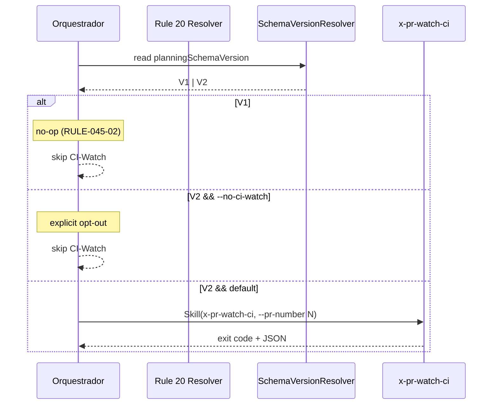

# História: Adicionar Rule 20 (CI-Watch) + audit de regressão

**ID:** story-0045-0002
**Chave Jira:** —
**Status:** Pendente

## 1. Dependências

| Blocked By | Blocks |
| :--- | :--- |
| — | story-0045-0006 (guard-rail consumido no smoke) |

## 2. Regras Transversais Aplicáveis

| ID | Título |
| :--- | :--- |
| RULE-045-01 | CI-Watch default em schema v2 |
| RULE-045-02 | No-op em schema v1 (Rule 19) |
| RULE-045-06 | Rule 13 INLINE-SKILL obrigatória |
| RULE-045-08 | Atomic, Reversible Commits |

## 3. Descrição

Como **Rules maintainer responsável pela política de PR-Flow**, eu quero uma nova rule formal `Rule 20 — CI-Watch` em `.claude/rules/` que formalize: (a) CI-Watch é comportamento default em epics com `planningSchemaVersion == "2.0"`, (b) é no-op em epics schema v1 (respeitando Rule 19), (c) opt-out via `--no-ci-watch` é o único mecanismo aceito para CI/automação, e (d) um audit grep-based garante que todo orquestrador que invoca `x-pr-create` também invoca `x-pr-watch-ci` (ou declara `--no-ci-watch` explicitamente).

A rule ocupa o slot `20-ci-watch.md` — slots 13–19 estão ocupados (`13-skill-invocation-protocol`, `14-worktree-lifecycle`, `15-task-testability`, `16-task-io-contracts`, `17-topological-execution`, `18-atomic-task-commits`, `19-backward-compatibility`); slots 10/11/12 permanecem reservados para regras condicionais. Segue o padrão textual das rules 13 e 19 (explicação + matriz de comportamento + forbidden + audit). O audit script é análogo ao da Rule 13 (grep-based, zero matches como resultado esperado), rodando em `mvn test` via `RuleAssemblerTest.listRules_includesCiWatch` + teste específico que invoca o grep.

### 3.1 Conteúdo da Rule 20

- Seções: Rule (statement), Fallback Matrix (similar à Rule 19), Rationale, Enforcement, Forbidden.
- Fallback Matrix: cruzamento entre `planningSchemaVersion` e `--no-ci-watch`.
- Forbidden: (1) invocar orquestrador que abre PR sem passar exit code do `x-pr-watch-ci` para o menu EPIC-0043; (2) criar nova skill de orquestração sem respeitar a Rule; (3) hard-fail em epics schema v1 (Rule 19 + RULE-045-02).

### 3.2 Audit script

- Script bash em `scripts/audit-rule-20.sh` (ou equivalente integrado ao maven) que:
  - Faz grep apenas por **invocações reais** de `x-pr-create` em `java/src/main/resources/targets/claude/skills/core/**/SKILL.md` (ex.: `Skill(skill: "x-pr-create"`), evitando contar menções textuais em tabelas, descrições ou rationale
  - Para cada invocação real encontrada, verifica se o mesmo arquivo contém invocação real de `x-pr-watch-ci` (ex.: `Skill(skill: "x-pr-watch-ci"`) OU declara `--no-ci-watch`
  - Opcionalmente, o filtro pode ser limitado às seções operacionais (ex.: Phase/Step) se isso produzir um audit mais estável que grep textual global
  - Exit code != 0 se alguma skill orquestradora violar a regra

## 3.5 Entrega de Valor

- **Valor Principal:** Formalização da política de CI-Watch elimina ambiguidade sobre comportamento default; audit automático impede regressões silenciosas em PRs futuros (guard-rail permanente).
- **Métrica de Sucesso:** `mvn test` falha se qualquer orquestrador retrofitado remover a invocação de `x-pr-watch-ci` sem declarar `--no-ci-watch`.
- **Impacto no Negócio:** Próximas skills de orquestração (futuras) são obrigadas a integrar CI-Watch por padrão, sem necessidade de memória institucional.

## 4. Definições de Qualidade Locais

### DoR Local

- [ ] Slot de rule 20 confirmado disponível (não utilizado por outra rule)
- [ ] Rule 19 (backward compat) finalizada e disponível para referência
- [ ] Padrão textual da Rule 13 / Rule 19 estudado como template

### DoD Local

- [ ] `20-ci-watch.md` presente em `java/src/main/resources/targets/claude/rules/` (source of truth)
- [ ] Rule gerada em `.claude/rules/20-ci-watch.md` via `mvn process-resources`
- [ ] `RuleAssemblerTest.listRules_includesCiWatch` verde
- [ ] Audit grep script rodando em CI com exit 0 para o estado atual
- [ ] Teste que injeta regressão simulada (skill sem CI-Watch) confirma audit exit != 0
- [ ] Pelo menos 1 teste automatizado validando audit
- [ ] CLAUDE.md atualizado no bloco "In progress" referenciando EPIC-0045

### Global DoD

- Cobertura ≥ 95%/90% no código Java do audit test.
- Golden diff para nova rule.
- `mvn process-resources && mvn test` verde.

## 5. Contratos de Dados

### 5.1 Rule 20 — estrutura textual (arquivo markdown)

| Seção | Conteúdo |
| :--- | :--- |
| Title + lead-in | `# Rule 20 — CI-Watch (RULE-045-01)` + `> Related:` block |
| Rule statement | 1 parágrafo definindo a obrigação |
| Fallback Matrix | Tabela 2x2 `schemaVersion × --no-ci-watch` → `{V1 no-op, V2 active, V2 skipped}` |
| Rationale | 2 parágrafos — por que a rule existe |
| Enforcement | Referências a testes e audit |
| Forbidden | Bullet list |

### 5.2 Audit script — contrato

| Entrada | Valor |
| :--- | :--- |
| Working dir | repo root |
| Grep target | `java/src/main/resources/targets/claude/skills/core/**/SKILL.md` |
| Padrão positivo | `x-pr-create` |
| Padrão negativo (esperado presente) | `x-pr-watch-ci` OU `--no-ci-watch` |
| Exit 0 | Zero violações |
| Exit != 0 | Lista de arquivos violadores em stderr |

## 6. Diagramas

### 6.1 Decisão de aplicação da Rule 20



## 7. Critérios de Aceite (Gherkin)

```gherkin
Cenario: Rule 20 presente em .claude/rules após regeneração
  DADO que 20-ci-watch.md existe em java/src/main/resources/targets/claude/rules/
  QUANDO executar mvn process-resources
  ENTÃO .claude/rules/20-ci-watch.md é gerado
  E RuleAssemblerTest.listRules_includesCiWatch passa

Cenario: Audit aprova estado íntegro
  DADO que x-story-implement, x-task-implement e x-release invocam x-pr-watch-ci
  QUANDO executar scripts/audit-rule-20.sh
  ENTÃO o script sai com exit 0
  E stderr está vazio

Cenario: Audit detecta regressão — orquestrador sem CI-Watch
  DADO que removi a invocação de x-pr-watch-ci de x-story-implement/SKILL.md
  QUANDO executar scripts/audit-rule-20.sh
  ENTÃO o script sai com exit != 0
  E stderr lista "x-story-implement/SKILL.md: invokes x-pr-create but missing x-pr-watch-ci"

Cenario: Audit aceita opt-out explícito
  DADO que x-release/SKILL.md usa "--no-ci-watch" em vez de invocar x-pr-watch-ci
  QUANDO executar scripts/audit-rule-20.sh
  ENTÃO o script sai com exit 0

Cenario: Boundary — rule lida com epics sem planningSchemaVersion declarado
  DADO que execution-state.json não declara planningSchemaVersion
  QUANDO SchemaVersionResolver.resolve() é chamado
  ENTÃO retorna V1 (conforme Rule 19 matrix)
  E orquestrador não invoca x-pr-watch-ci
```

### 7.1 Scenario Ordering (TPP)

Ordem: verificação de presença (degenerate) → happy path (audit aprovado) → erro (regressão detectada) → condição (opt-out) → boundary (schema ausente).

### 7.2 Mandatory Scenario Categories

- [x] Degenerate cases (rule presente)
- [x] Happy path (audit aprovado)
- [x] Error paths (regressão detectada)
- [x] Boundary values (schema ausente)

### 7.3 TDD Implementation Notes

- Acceptance test: cenário "Audit detecta regressão" (outer loop).
- Unit tests: helpers Java do audit (se houver extração) — TPP (inner loop).

## 8. Tasks

### TASK-0045-0002-001: Criar arquivo `20-ci-watch.md` source of truth

- **Layer:** Doc
- **Test Type:** Verification
- **Size:** M
- **Dependencies:** —
- **Branch:** `feat/task-0045-0002-001-rule-20-source`
- **Testability:** Config + VerificationTest (golden diff)
- **Files:**
  - `java/src/main/resources/targets/claude/rules/20-ci-watch.md`
- **Acceptance Criteria:**
  - [ ] Seções Rule, Fallback Matrix, Rationale, Enforcement, Forbidden presentes
  - [ ] Referência cruzada a Rule 13 e Rule 19

### TASK-0045-0002-002: Atualizar `RuleAssembler` para incluir Rule 20 em todos os targets

- **Layer:** Application
- **Test Type:** Unit
- **Size:** S
- **Dependencies:** TASK-0045-0002-001
- **Branch:** `feat/task-0045-0002-002-assembler-update`
- **Testability:** UseCase + AT
- **Files:**
  - `java/src/main/java/dev/iadev/application/rule/RuleAssembler.java` (ou equivalente)
- **Acceptance Criteria:**
  - [ ] `listRules()` retorna 11 rules incluindo `20-ci-watch.md`
  - [ ] Goldens regenerados em todos os targets

### TASK-0045-0002-003: Implementar audit script `audit-rule-20`

- **Layer:** Adapter (Test/Ops)
- **Test Type:** Verification
- **Size:** M
- **Dependencies:** TASK-0045-0002-001
- **Branch:** `feat/task-0045-0002-003-audit-script`
- **Testability:** Config + VerificationTest
- **Files:**
  - `scripts/audit-rule-20.sh`
  - `java/src/test/java/dev/iadev/audit/Rule20AuditTest.java`
- **Acceptance Criteria:**
  - [ ] Script grep-based com exit code 0/1
  - [ ] Test Java invoca script, valida exit 0 no estado atual
  - [ ] Test Java simula regressão (patch temporário) e valida exit != 0

### TASK-0045-0002-004: Unit test `RuleAssemblerTest.listRules_includesCiWatch`

- **Layer:** Test
- **Test Type:** Unit
- **Size:** S
- **Dependencies:** TASK-0045-0002-002
- **Branch:** `feat/task-0045-0002-004-assembler-test`
- **Testability:** Domain + UnitTest
- **Files:**
  - `java/src/test/java/dev/iadev/application/rule/RuleAssemblerTest.java`
- **Acceptance Criteria:**
  - [ ] Teste precede TASK-002 em ordem de commit (test-first)
  - [ ] Valida presença do novo item na listagem

### TASK-0045-0002-005: Atualizar CLAUDE.md bloco "In progress"

- **Layer:** Doc
- **Test Type:** Verification
- **Size:** S
- **Dependencies:** —
- **Branch:** `feat/task-0045-0002-005-claude-md-in-progress`
- **Testability:** Config + VerificationTest
- **Files:**
  - `CLAUDE.md`
- **Acceptance Criteria:**
  - [ ] Bloco `> In progress` menciona EPIC-0045 com link para o diretório do épico
  - [ ] Linha removida quando épico for fechado (task futura)
