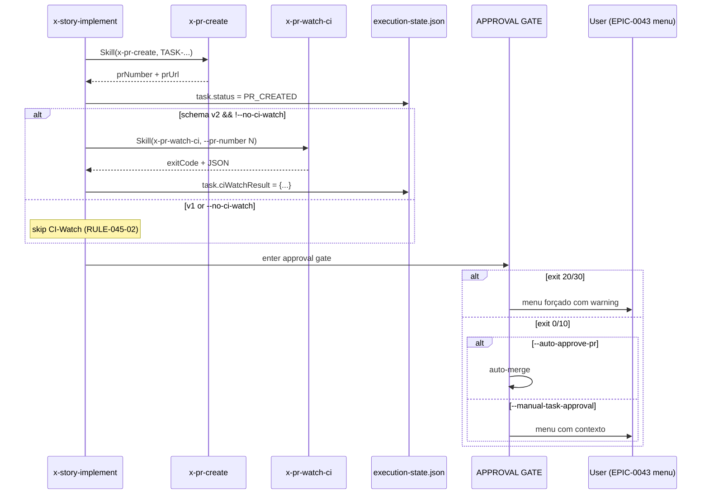

# História: Integrar CI-Watch em `x-story-implement` Phase 2.2

**ID:** story-0045-0003
**Chave Jira:** —
**Status:** Pendente

## 1. Dependências

| Blocked By | Blocks |
| :--- | :--- |
| story-0045-0001, EPIC-0043 mergeado em develop | story-0045-0006 |

## 2. Regras Transversais Aplicáveis

| ID | Título |
| :--- | :--- |
| RULE-045-01 | CI-Watch default em schema v2 |
| RULE-045-02 | No-op em schema v1 (Rule 19) |
| RULE-045-06 | Rule 13 INLINE-SKILL obrigatória |
| RULE-045-07 | Menu do EPIC-0043 consome exit code |
| RULE-045-08 | Atomic, Reversible Commits |

## 3. Descrição

Como **desenvolvedor usando `x-story-implement` para orquestrar implementação de tasks**, eu quero que a skill aguarde o CI terminar e o Copilot postar review entre `x-pr-create` (2.2.7) e APPROVAL GATE (2.2.9), garantindo que o menu interativo `PROCEED / FIX-PR / ABORT` (EPIC-0043) receba contexto real para formar o prompt e que `FIX-PR`, quando acionado, encontre comentários reais em vez de vazio.

A implementação insere um novo passo `2.2.8.5 CI-Watch` entre `2.2.8 update state: task.status = PR_CREATED` e `2.2.9 APPROVAL GATE`, com as seguintes responsabilidades: (a) invocar `x-pr-watch-ci` via Rule 13 Pattern 1 INLINE-SKILL, (b) capturar exit code + JSON final, (c) armazenar no `execution-state.json` do épico sob `task.ciWatchResult`, (d) propagar exit code para o formatter do prompt do `AskUserQuestion` do menu, (e) respeitar `--no-ci-watch` (skip completo), e (f) respeitar schema v1 (skip por RULE-045-02 via `SchemaVersionResolver`). O impacto no comportamento default do EPIC-0042 (auto-approve) é mantido: se CI green + Copilot review presente, auto-merge ocorre normalmente; se CI failed, o menu EPIC-0043 é FORÇADO a aparecer (mesmo com `--auto-approve-pr`) para evitar merge de PR quebrado.

### 3.1 Ponto de inserção

- `java/src/main/resources/targets/claude/skills/core/dev/x-story-implement/SKILL.md:797-810` — linha entre `2.2.8 Update execution-state` e `2.2.9 APPROVAL GATE`.
- Novo subhead `### Step 2.3a — CI Watch Detail` após Step 2.3 (approval gate detail do EPIC-0042).

### 3.2 Interação com EPIC-0042 (auto-approve)

- **CI exit 0 (SUCCESS)** + `--auto-approve-pr`: auto-merge como hoje.
- **CI exit 10 (CI_PENDING_PROCEED)** + `--auto-approve-pr`: auto-merge com warning log "Copilot review timeout; proceeding".
- **CI exit 20 (CI_FAILED)**: auto-merge SUPRIMIDO; menu EPIC-0043 é forçado com `description` destacando falha; `FIX-PR` sugerido.
- **CI exit 30 (TIMEOUT)**: mesmo que exit 20 — menu forçado.
- **CI exit 40/50/60/70**: tratamento caso-a-caso documentado no SKILL.md.

### 3.3 Interação com EPIC-0043 (menu interativo)

- O `description` do `AskUserQuestion` da approval gate inclui bloco:

  ```
  CI Status: N checks passed / M failed / K pending
  Copilot review: {present | absent (timeout)}
  ```

- Se `exit == 20`, `description` inicia com `⚠️  CI FAILED — FIX-PR recommended`.

### 3.4 Precondição dura — merge do EPIC-0043

STORY-0045-0003 modifica as mesmas linhas que o EPIC-0043 está refatorando. Executar em paralelo gera merge conflict determinístico. Precondição: EPIC-0043 mergeado em `develop` antes de abrir branch de 0045-0003.

## 3.5 Entrega de Valor

- **Valor Principal:** Menu interativo do EPIC-0043 passa a ter contexto real — `FIX-PR` encontra comentários em vez de vazio; `PROCEED` é informado sobre falhas de CI; `ABORT` é decisão consciente.
- **Métrica de Sucesso:** Em smoke test (STORY-0045-0006), ao invocar `x-story-implement` contra uma story com PR que tem check failure, o menu é forçado e `FIX-PR` retorna N > 0 comentários do Copilot.
- **Impacto no Negócio:** Taxa de auto-merge em PRs com CI amarelo cai a zero; taxa de `FIX-PR` efetivo (com comentários) sobe de ~0% para >90%.

## 4. Definições de Qualidade Locais

### DoR Local

- [ ] STORY-0045-0001 mergeada (skill `x-pr-watch-ci` disponível)
- [ ] EPIC-0043 mergeado em develop (precondição dura)
- [ ] RULE-045-07 finalizada no épico
- [ ] Branch `feat/epic-0045-ci-watch` rebasada com develop

### DoD Local

- [ ] `x-story-implement/SKILL.md` tem novo passo 2.2.8.5 com invocação via Rule 13 Pattern 1
- [ ] Frontmatter `allowed-tools` inclui `Skill` (já presente pelo EPIC-0043)
- [ ] Novo campo `task.ciWatchResult` persistido em `execution-state.json`
- [ ] Prompt do menu EPIC-0043 consome exit code + JSON
- [ ] Auto-approve (EPIC-0042) respeita exit 20/30 (força menu)
- [ ] `--no-ci-watch` opt-out funcional
- [ ] SchemaVersionResolver v1 → skip (RULE-045-02)
- [ ] Golden diff regenerado
- [ ] Pelo menos 1 teste automatizado validando o comportamento integrado (smoke local com PR mock via gh mock)

### Global DoD

- Cobertura ≥ 95%/90% em qualquer helper novo.
- `mvn process-resources && mvn test` verde.

## 5. Contratos de Dados

### 5.1 execution-state.json — novo campo `task.ciWatchResult`

| Campo | Tipo | Obrigatório | Descrição |
| :--- | :--- | :--- | :--- |
| `task.ciWatchResult.status` | `String` | Não (só quando v2 + !no-ci-watch) | Nome do exit code |
| `task.ciWatchResult.checks` | `List<{name, conclusion}>` | Não | Snapshot final |
| `task.ciWatchResult.copilotReview` | `{present, reviewId?}` | Não | Estado do review |
| `task.ciWatchResult.elapsedSeconds` | `Integer` | Não | Tempo total |
| `task.ciWatchResult.exitCode` | `Integer` | Não | 0/10/20/30/40/50/60/70 |

### 5.2 Prompt do AskUserQuestion (EPIC-0043 menu)

Novo parágrafo injetado no `description`:

```
CI Status: 3 checks passed / 1 failed / 0 pending
Copilot review: present (reviewId=12345678)
```

### 5.3 Flag `--no-ci-watch`

| Flag | Semântica |
| :--- | :--- |
| ausente | Default v2: invoca `x-pr-watch-ci` |
| presente | Skip CI-Watch; task.ciWatchResult não é persistido; comportamento idêntico ao estado pré-EPIC-0045 |

## 6. Diagramas

### 6.1 Fluxo Phase 2.2 com CI-Watch



## 7. Critérios de Aceite (Gherkin)

```gherkin
Cenario: Schema v1 — CI-Watch é no-op (degenerate)
  DADO que execution-state.json não declara planningSchemaVersion
  QUANDO x-story-implement executa Phase 2.2 para uma task
  ENTÃO x-pr-watch-ci NÃO é invocada
  E task.ciWatchResult não é persistido
  E o comportamento é idêntico ao estado pré-EPIC-0045

Cenario: Happy path — CI green + Copilot review + auto-approve
  DADO planningSchemaVersion = "2.0"
  E flag --auto-approve-pr presente
  E o PR recebe CI green + Copilot review
  QUANDO x-story-implement completa Phase 2.2.7 (PR criado)
  ENTÃO x-pr-watch-ci é invocada e retorna exit 0
  E task.ciWatchResult.status = "SUCCESS" é persistido
  E a task PR é auto-mergeada (EPIC-0042)

Cenario: CI falhou — menu forçado mesmo com --auto-approve-pr
  DADO planningSchemaVersion = "2.0"
  E flag --auto-approve-pr presente
  E o PR tem check com conclusion=failure
  QUANDO x-pr-watch-ci retorna exit 20
  ENTÃO a skill NÃO faz auto-merge
  E o menu EPIC-0043 é apresentado com description incluindo "⚠️  CI FAILED — FIX-PR recommended"

Cenario: Copilot timeout — auto-approve segue com warning
  DADO planningSchemaVersion = "2.0"
  E flag --auto-approve-pr presente
  E o PR tem CI green mas Copilot não postou review após --copilot-review-timeout
  QUANDO x-pr-watch-ci retorna exit 10 (CI_PENDING_PROCEED)
  ENTÃO a skill faz auto-merge com log warning "Copilot review timeout; proceeding"

Cenario: --no-ci-watch — opt-out explícito
  DADO planningSchemaVersion = "2.0"
  E flag --no-ci-watch presente
  QUANDO x-story-implement executa Phase 2.2
  ENTÃO x-pr-watch-ci NÃO é invocada
  E o fluxo segue direto para APPROVAL GATE

Cenario: Boundary — primeiro PR da story (nenhuma task anterior tem ciWatchResult)
  DADO planningSchemaVersion = "2.0"
  E execution-state.json tem 0 tasks completas
  QUANDO a primeira task entra em Phase 2.2.8.5
  ENTÃO x-pr-watch-ci é invocada normalmente
  E task.ciWatchResult é persistido na 1ª task (criação do campo)
```

### 7.1 Scenario Ordering (TPP)

Ordem: degenerate (v1 no-op) → happy path (auto-approve) → error (CI failed) → condicional (Copilot timeout) → opt-out → boundary.

### 7.2 Mandatory Scenario Categories

- [x] Degenerate cases (v1 no-op, 0 tasks completas)
- [x] Happy path (auto-approve)
- [x] Error paths (CI failed)
- [x] Boundary values (primeiro PR)

### 7.3 TDD Implementation Notes

- Acceptance test: "CI falhou — menu forçado" (cenário de maior valor de negócio).
- Unit tests: helpers do SchemaVersionResolver (já cobertos pela Rule 19), formatter do description do menu (novo).

## 8. Tasks

### TASK-0045-0003-001: Inserir passo 2.2.8.5 em `x-story-implement/SKILL.md`

- **Layer:** Doc
- **Test Type:** Verification
- **Size:** M
- **Dependencies:** —
- **Branch:** `feat/task-0045-0003-001-skill-phase-2-2-8-5`
- **Testability:** Config + VerificationTest
- **Files:**
  - `java/src/main/resources/targets/claude/skills/core/dev/x-story-implement/SKILL.md`
- **Acceptance Criteria:**
  - [ ] Novo passo 2.2.8.5 entre linhas 797 (PR_CREATED) e 798 (APPROVAL GATE)
  - [ ] Invocação via Rule 13 Pattern 1 INLINE-SKILL
  - [ ] Bloco condicional schema v2 vs v1 (SchemaVersionResolver)

### TASK-0045-0003-002: Adicionar flag `--no-ci-watch` no parser de argumentos

- **Layer:** Application
- **Test Type:** Unit
- **Size:** S
- **Dependencies:** TASK-0045-0003-001
- **Branch:** `feat/task-0045-0003-002-no-ci-watch-flag`
- **Testability:** UseCase + AT
- **Files:**
  - `java/src/main/resources/targets/claude/skills/core/dev/x-story-implement/SKILL.md`
  - (Opcional) helper Java se a lógica for extraída
- **Acceptance Criteria:**
  - [ ] Flag documentada na seção de argumentos
  - [ ] Comportamento skip quando presente

### TASK-0045-0003-003: Atualizar formatter do prompt do menu EPIC-0043

- **Layer:** Doc
- **Test Type:** Verification
- **Size:** M
- **Dependencies:** TASK-0045-0003-001
- **Branch:** `feat/task-0045-0003-003-menu-prompt-formatter`
- **Testability:** Config + VerificationTest
- **Files:**
  - `java/src/main/resources/targets/claude/skills/core/dev/x-story-implement/SKILL.md` (Step 2.3)
- **Acceptance Criteria:**
  - [ ] Description inclui bloco "CI Status: ..." + "Copilot review: ..."
  - [ ] Exit 20/30 adiciona warning "⚠️  CI FAILED — FIX-PR recommended"
  - [ ] Exit 10 adiciona info "Copilot review absent (timeout)"

### TASK-0045-0003-004: Persistir `task.ciWatchResult` em execution-state.json

- **Layer:** Doc
- **Test Type:** Verification
- **Size:** S
- **Dependencies:** TASK-0045-0003-001
- **Branch:** `feat/task-0045-0003-004-execution-state-ci`
- **Testability:** Config + VerificationTest
- **Files:**
  - `java/src/main/resources/targets/claude/skills/core/dev/x-story-implement/SKILL.md` (Step 2.2.10)
- **Acceptance Criteria:**
  - [ ] Shape do campo documentado no SKILL.md
  - [ ] Escrita ocorre após retorno do `x-pr-watch-ci`

### TASK-0045-0003-005: Forçar menu EPIC-0043 em exit 20/30 mesmo com `--auto-approve-pr`

- **Layer:** Doc
- **Test Type:** Verification
- **Size:** M
- **Dependencies:** TASK-0045-0003-003
- **Branch:** `feat/task-0045-0003-005-force-menu-on-ci-fail`
- **Testability:** Config + VerificationTest
- **Files:**
  - `java/src/main/resources/targets/claude/skills/core/dev/x-story-implement/SKILL.md` (Step 2.2.9 APPROVAL GATE)
- **Acceptance Criteria:**
  - [ ] Exit 20/30 desativa auto-merge
  - [ ] Log explícito da decisão

### TASK-0045-0003-006: Regenerar golden diff de `x-story-implement`

- **Layer:** Test
- **Test Type:** Verification
- **Size:** S
- **Dependencies:** TASK-0045-0003-001..005
- **Branch:** `feat/task-0045-0003-006-golden-regen`
- **Testability:** Config + VerificationTest
- **Files:**
  - `java/src/test/resources/golden/**/skills/core/dev/x-story-implement/**`
- **Acceptance Criteria:**
  - [ ] `mvn process-resources` antes de regenerar
  - [ ] `SkillsAssemblerTest` verde
