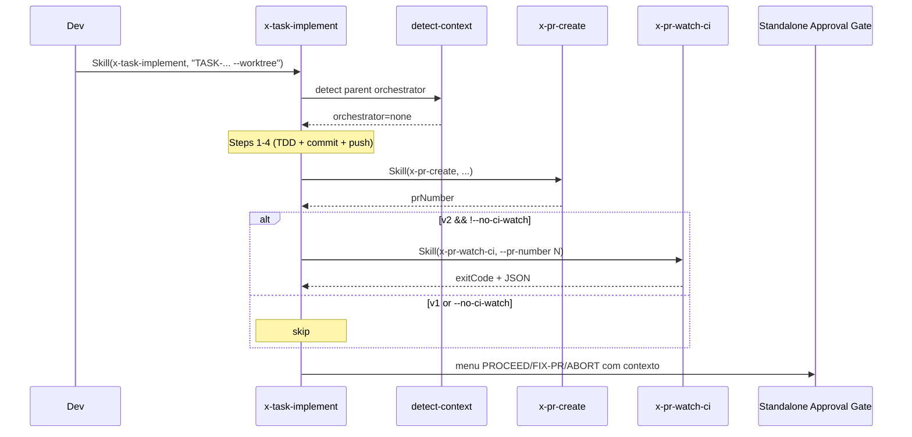

# História: Integrar CI-Watch em `x-task-implement --worktree` standalone

**ID:** story-0045-0004
**Chave Jira:** —
**Status:** Pendente

## 1. Dependências

| Blocked By | Blocks |
| :--- | :--- |
| story-0045-0001 | story-0045-0006 |

## 2. Regras Transversais Aplicáveis

| ID | Título |
| :--- | :--- |
| RULE-045-01 | CI-Watch default em schema v2 |
| RULE-045-02 | No-op em schema v1 (Rule 19) |
| RULE-045-06 | Rule 13 INLINE-SKILL obrigatória |
| RULE-045-07 | Menu do EPIC-0043 consome exit code |
| RULE-045-08 | Atomic, Reversible Commits |

## 3. Descrição

Como **desenvolvedor que invoca `x-task-implement` standalone com `--worktree` para implementar uma task isolada fora de um fluxo orquestrado**, eu quero que a skill aguarde o CI terminar e o Copilot postar review antes de apresentar o gate de aprovação, garantindo paridade de comportamento com o fluxo orquestrado (`x-story-implement` Phase 2.2) e evitando auto-merge em commits com CI amarelo.

A implementação é análoga à STORY-0045-0003 mas aplicada ao fluxo standalone. O `x-task-implement` com `--worktree` cria seu próprio worktree (Rule 14 Section 6 — "Am I a standalone skill that may run in parallel with other instances? Yes → Expose --worktree as an opt-in flag"), executa TDD, faz commit, push, e invoca `x-pr-create` diretamente. O CI-Watch é inserido entre o `x-pr-create` e o approval gate standalone (que, pós-EPIC-0043, também usa menu `PROCEED/FIX-PR/ABORT`).

### 3.1 Ponto de inserção

- `java/src/main/resources/targets/claude/skills/core/dev/x-task-implement/SKILL.md` — Step 4.5 (entre commit/push e approval gate standalone).
- Localização exata: após `Step 4: Commits atômicos (TDD tags)` e antes de `Step 5: Limpeza de worktree e sync de repo`.

### 3.2 Condição de invocação

- Apenas quando invocada standalone (`--worktree` presente) E não invocada por orquestrador pai. Caller detection via Rule 14 Section 3 Canonical Detection Mechanism (`detect-context`).
- Quando invocada como subagent de `x-story-implement` (reusa worktree do pai), CI-Watch é responsabilidade do pai (STORY-0045-0003) — `x-task-implement` pula para não duplicar.

### 3.3 Interação com approval gate standalone (pós-EPIC-0043)

- O menu standalone recebe o exit code + JSON conforme RULE-045-07.
- Exit 20/30: força menu, suprime auto-approve.

## 3.5 Entrega de Valor

- **Valor Principal:** Standalone task execution tem paridade de comportamento com fluxo orquestrado — mesmo feedback de CI + Copilot antes do gate, mesmo contrato de exit code.
- **Métrica de Sucesso:** Invocação `Skill(x-task-implement, "TASK-XXXX-YYYY-NNN --worktree")` contra task real aguarda CI e apresenta menu com contexto.
- **Impacto no Negócio:** Desenvolvedores que usam o fluxo standalone não precisam lembrar de invocar manualmente `x-pr-watch-ci` — comportamento consistente.

## 4. Definições de Qualidade Locais

### DoR Local

- [ ] STORY-0045-0001 mergeada
- [ ] Rule 14 Section 3 (detect-context) operacional
- [ ] Caller detection de orquestrador pai documentada no SKILL.md de `x-task-implement`

### DoD Local

- [ ] `x-task-implement/SKILL.md` tem novo Step 4.5 com invocação condicional
- [ ] Detect-context ativado — pula CI-Watch quando invocada por orquestrador pai
- [ ] Frontmatter `allowed-tools` inclui `Skill`
- [ ] Flag `--no-ci-watch` opt-out funcional
- [ ] SchemaVersionResolver v1 → skip
- [ ] Golden diff regenerado
- [ ] Pelo menos 1 teste automatizado validando comportamento standalone

### Global DoD

- Cobertura ≥ 95%/90% em helpers novos.
- `mvn process-resources && mvn test` verde.

## 5. Contratos de Dados

### 5.1 Flag nova

| Flag | Tipo | Default | Semântica |
| :--- | :--- | :--- | :--- |
| `--no-ci-watch` | Flag | ausente | Skip CI-Watch (para CI/automação) |

### 5.2 Detect-context output

| Variável | Valor | Comportamento |
| :--- | :--- | :--- |
| `orchestrator=parent` | Invocada por orquestrador | Skip CI-Watch (pai gerencia) |
| `orchestrator=none` | Standalone `--worktree` | Invoca CI-Watch |

### 5.3 Resultado armazenado

- Em standalone, não há `execution-state.json` compartilhado. Resultado do CI-Watch é armazenado em `.claude/state/task-watch-<TASK-ID>.json` (state-file próprio, mesmo schema v1.0 da RULE-045-03).

## 6. Diagramas

### 6.1 Fluxo standalone com CI-Watch



## 7. Critérios de Aceite (Gherkin)

```gherkin
Cenario: Invocação por orquestrador pai — CI-Watch é skipped (degenerate)
  DADO que x-task-implement foi invocada por x-story-implement
  E detect-context retorna orchestrator=parent
  QUANDO Step 4.5 (CI-Watch) é atingido
  ENTÃO x-pr-watch-ci NÃO é invocada
  E o log menciona "CI-Watch delegated to parent orchestrator"

Cenario: Standalone happy path — CI green + Copilot present
  DADO --worktree presente
  E planningSchemaVersion = "2.0"
  E o PR recebe CI green + Copilot review
  QUANDO x-task-implement completa Step 4 (commit)
  ENTÃO x-pr-watch-ci é invocada
  E retorna exit 0
  E o menu standalone apresenta PROCEED como sugerido

Cenario: Standalone CI failed — menu sugere FIX-PR
  DADO --worktree presente
  E planningSchemaVersion = "2.0"
  E o PR tem check com conclusion=failure
  QUANDO x-pr-watch-ci retorna exit 20
  ENTÃO o menu standalone inicia description com "⚠️  CI FAILED — FIX-PR recommended"

Cenario: --no-ci-watch opt-out em standalone
  DADO --worktree e --no-ci-watch presentes
  QUANDO x-task-implement completa Step 4
  ENTÃO x-pr-watch-ci NÃO é invocada

Cenario: Boundary — schema v1 em standalone
  DADO --worktree presente
  E planningSchemaVersion ausente (fallback v1)
  QUANDO x-task-implement atinge Step 4.5
  ENTÃO x-pr-watch-ci NÃO é invocada (RULE-045-02)
```

### 7.1 Scenario Ordering (TPP)

Ordem: degenerate (orquestrador pai) → happy path (standalone success) → error (CI failed) → condicional (opt-out) → boundary (v1).

### 7.2 Mandatory Scenario Categories

- [x] Degenerate cases (orquestrador pai skip)
- [x] Happy path (standalone success)
- [x] Error paths (CI failed)
- [x] Boundary values (v1 no-op)

### 7.3 TDD Implementation Notes

- Acceptance test: cenário "Standalone CI failed".
- Unit tests: detect-context se houver helper Java extraído.

## 8. Tasks

### TASK-0045-0004-001: Inserir Step 4.5 em `x-task-implement/SKILL.md`

- **Layer:** Doc
- **Test Type:** Verification
- **Size:** M
- **Dependencies:** —
- **Branch:** `feat/task-0045-0004-001-skill-step-4-5`
- **Testability:** Config + VerificationTest
- **Files:**
  - `java/src/main/resources/targets/claude/skills/core/dev/x-task-implement/SKILL.md`
- **Acceptance Criteria:**
  - [ ] Novo Step 4.5 entre Step 4 (commit) e Step 5 (cleanup)
  - [ ] Invocação via Rule 13 Pattern 1 INLINE-SKILL
  - [ ] Bloco condicional schema v2 vs v1

### TASK-0045-0004-002: Adicionar detect-context + skip quando orquestrado

- **Layer:** Doc
- **Test Type:** Verification
- **Size:** S
- **Dependencies:** TASK-0045-0004-001
- **Branch:** `feat/task-0045-0004-002-detect-context`
- **Testability:** Config + VerificationTest
- **Files:**
  - `java/src/main/resources/targets/claude/skills/core/dev/x-task-implement/SKILL.md`
- **Acceptance Criteria:**
  - [ ] Step 4.5 chama `detect-context` antes de invocar CI-Watch
  - [ ] Skip quando `orchestrator=parent`

### TASK-0045-0004-003: Adicionar flag `--no-ci-watch`

- **Layer:** Doc
- **Test Type:** Verification
- **Size:** S
- **Dependencies:** TASK-0045-0004-001
- **Branch:** `feat/task-0045-0004-003-no-ci-watch-flag`
- **Testability:** Config + VerificationTest
- **Files:**
  - `java/src/main/resources/targets/claude/skills/core/dev/x-task-implement/SKILL.md`
- **Acceptance Criteria:**
  - [ ] Flag documentada em argumentos
  - [ ] Comportamento skip quando presente

### TASK-0045-0004-004: Documentar state-file `task-watch-<TASK-ID>.json`

- **Layer:** Doc
- **Test Type:** Verification
- **Size:** S
- **Dependencies:** TASK-0045-0004-001
- **Branch:** `feat/task-0045-0004-004-state-file-doc`
- **Testability:** Config + VerificationTest
- **Files:**
  - `java/src/main/resources/targets/claude/skills/core/dev/x-task-implement/SKILL.md`
- **Acceptance Criteria:**
  - [ ] Shape documentado (igual RULE-045-03)
  - [ ] Localização `.claude/state/task-watch-<TASK-ID>.json`

### TASK-0045-0004-005: Regenerar golden diff de `x-task-implement`

- **Layer:** Test
- **Test Type:** Verification
- **Size:** S
- **Dependencies:** TASK-0045-0004-001..004
- **Branch:** `feat/task-0045-0004-005-golden-regen`
- **Testability:** Config + VerificationTest
- **Files:**
  - `java/src/test/resources/golden/**/skills/core/dev/x-task-implement/**`
- **Acceptance Criteria:**
  - [ ] `mvn process-resources` antes de regenerar
  - [ ] `SkillsAssemblerTest` verde
