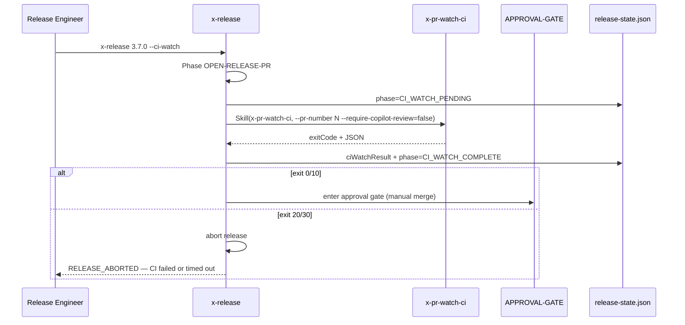

# História: Integrar CI-Watch opcional em `x-release` via `--ci-watch`

**ID:** story-0045-0005
**Chave Jira:** —
**Status:** Pendente

## 1. Dependências

| Blocked By | Blocks |
| :--- | :--- |
| story-0045-0001 | story-0045-0006 |

## 2. Regras Transversais Aplicáveis

| ID | Título |
| :--- | :--- |
| RULE-045-01 | CI-Watch default em schema v2 |
| RULE-045-06 | Rule 13 INLINE-SKILL obrigatória |
| RULE-045-07 | Menu do EPIC-0043 consome exit code |
| RULE-045-08 | Atomic, Reversible Commits |

## 3. Descrição

Como **engenheiro de release executando `x-release` para produzir uma nova versão**, eu quero a opção de aguardar o CI do release PR terminar antes da approval-gate humana, reduzindo o risco de tagear `main` em commit com CI amarelo ou pipeline de release falhando.

`x-release` já tem Phase APPROVAL-GATE com state-file + resume (EPIC-0035 story 0035-0004) — é o prior art do padrão que `x-pr-watch-ci` reusa. A integração aqui é **opt-in** via flag `--ci-watch`, não default, porque: (a) releases são menos frequentes que PRs de feature e frequentemente já esperam o CI manualmente como parte do checklist humano, (b) o Copilot geralmente não revisa release PRs (não é contexto de feature review), (c) preservar backward compatibility da interface de release é mais crítico que em `x-story-implement`/`x-task-implement`.

### 3.1 Ponto de inserção

- `java/src/main/resources/targets/claude/skills/core/ops/x-release/SKILL.md` Phase `OPEN-RELEASE-PR` → NEW Phase `CI-WATCH` (opcional) → Phase `APPROVAL-GATE`.
- Quando `--ci-watch` presente: invoca `x-pr-watch-ci` com `--require-copilot-review=false` (padrão sensato para release PRs).
- Quando ausente: fluxo atual preservado (comportamento inalterado).

### 3.2 Interação com state-file de release

- `plans/release-state-<X.Y.Z>.json` (state-file do `x-release`) ganha novo campo opcional `ciWatchResult` seguindo mesma shape da RULE-045-03 extendido com `releaseVersion`.
- Fase `CI-WATCH` é rastreada em `phase` (valores possíveis: `CI_WATCH_PENDING`, `CI_WATCH_COMPLETE`).
- Resume via `--continue-after-merge` ignora CI-Watch (se já concluída) e vai para tag.

### 3.3 Compatibilidade com `--interactive` / `--dry-run` existentes

- Semântica de `--interactive` (EPIC-0035 story 0035-0002) preservada: `--interactive` + `--dry-run` = interactive dry-run; sem `--dry-run` = aborta com `INTERACTIVE_REQUIRES_DRYRUN`.
- `--ci-watch` é ortogonal a `--interactive` e `--dry-run`: pode ser combinado com qualquer um.

## 3.5 Entrega de Valor

- **Valor Principal:** Release engineer pode optar por gate automatizado de CI antes da approval-gate humana, reduzindo risco de tag com CI amarelo.
- **Métrica de Sucesso:** Invocação `x-release 3.7.0 --ci-watch` com CI amarelo no release PR falha a release com exit 20 antes de tagear `main`.
- **Impacto no Negócio:** Tags em `main` garantidamente correspondem a estados com CI verde, reduzindo retrabalho de hotfix por tag prematura.

## 4. Definições de Qualidade Locais

### DoR Local

- [ ] STORY-0045-0001 mergeada
- [ ] State-file schema do `x-release` (EPIC-0035) disponível como referência
- [ ] Flag `--ci-watch` não conflita com flags existentes (`--interactive`, `--dry-run`, `--continue-after-merge`, `--skip-review`)

### DoD Local

- [ ] `x-release/SKILL.md` tem nova Phase `CI-WATCH` opt-in
- [ ] Flag `--ci-watch` documentada na seção de argumentos
- [ ] State-file ganha campo `ciWatchResult` opcional
- [ ] Phase transitions documentadas (`CI_WATCH_PENDING` / `CI_WATCH_COMPLETE`)
- [ ] Resume lida corretamente com CI-Watch já concluída
- [ ] Golden diff regenerado
- [ ] Pelo menos 1 teste automatizado validando fluxo opt-in

### Global DoD

- Cobertura ≥ 95%/90% em helpers novos (se houver).
- `mvn process-resources && mvn test` verde.

## 5. Contratos de Dados

### 5.1 Flag nova

| Flag | Tipo | Default | Semântica |
| :--- | :--- | :--- | :--- |
| `--ci-watch` | Flag | ausente (disabled) | Opt-in para CI-Watch do release PR |

### 5.2 Release state-file — novo campo

| Campo | Tipo | Obrigatório | Descrição |
| :--- | :--- | :--- | :--- |
| `ciWatchResult.status` | `String` | Não | Nome do exit code |
| `ciWatchResult.exitCode` | `Integer` | Não | 0/10/20/30/40/50/60/70 |
| `ciWatchResult.releaseVersion` | `String` | Não | Versão da release (ex: `3.7.0`) |
| (demais campos herdados da RULE-045-03) | — | Não | Shape idêntico |

### 5.3 Phase transitions

```
OPEN-RELEASE-PR → CI_WATCH_PENDING (se --ci-watch)
CI_WATCH_PENDING → CI_WATCH_COMPLETE (após exit code)
CI_WATCH_COMPLETE → APPROVAL-GATE (se exit 0/10) | RELEASE_ABORTED (se exit 20/30)
OPEN-RELEASE-PR → APPROVAL-GATE (se não --ci-watch, comportamento atual)
```

## 6. Diagramas

### 6.1 Fluxo com `--ci-watch`



## 7. Critérios de Aceite (Gherkin)

```gherkin
Cenario: --ci-watch ausente — comportamento atual preservado (degenerate)
  DADO que invoco x-release 3.7.0 (sem --ci-watch)
  QUANDO a skill completa Phase OPEN-RELEASE-PR
  ENTÃO x-pr-watch-ci NÃO é invocada
  E a skill entra diretamente em Phase APPROVAL-GATE

Cenario: Happy path — --ci-watch com CI green
  DADO que invoco x-release 3.7.0 --ci-watch
  E o release PR recebe CI green
  QUANDO x-pr-watch-ci retorna exit 0
  ENTÃO release-state.json tem phase=CI_WATCH_COMPLETE
  E ciWatchResult.status = "SUCCESS"
  E a skill entra em Phase APPROVAL-GATE

Cenario: --ci-watch com CI failed — aborta release
  DADO --ci-watch presente
  E o release PR tem check com conclusion=failure
  QUANDO x-pr-watch-ci retorna exit 20
  ENTÃO a skill aborta com "RELEASE_ABORTED — CI failed"
  E release-state.json tem phase=RELEASE_ABORTED
  E nenhuma tag é criada em main

Cenario: --ci-watch com timeout — aborta release
  DADO --ci-watch presente
  QUANDO x-pr-watch-ci retorna exit 30
  ENTÃO a skill aborta com "RELEASE_ABORTED — CI timeout"

Cenario: --ci-watch combinado com --dry-run
  DADO --ci-watch e --dry-run presentes
  QUANDO a skill executa
  ENTÃO x-pr-watch-ci é invocada em modo dry-run (ou simulado)
  E nenhum state-file é persistido

Cenario: Boundary — resume após --ci-watch já completa
  DADO release-state.json tem phase=CI_WATCH_COMPLETE e ciWatchResult.status=SUCCESS
  QUANDO invoco x-release 3.7.0 --ci-watch --continue-after-merge
  ENTÃO x-pr-watch-ci NÃO é reinvocada (já concluída)
  E a skill pula direto para tag em main
```

### 7.1 Scenario Ordering (TPP)

Ordem: degenerate (flag ausente) → happy path (CI green) → error (CI failed) → condicional (timeout) → composição (dry-run) → boundary (resume).

### 7.2 Mandatory Scenario Categories

- [x] Degenerate cases (flag ausente)
- [x] Happy path (CI green)
- [x] Error paths (CI failed, timeout)
- [x] Boundary values (resume com CI-Watch já completa)

### 7.3 TDD Implementation Notes

- Acceptance test: "--ci-watch com CI failed — aborta release".
- Unit tests: phase transition handler se extraído para helper Java.

## 8. Tasks

### TASK-0045-0005-001: Adicionar Phase CI-WATCH em `x-release/SKILL.md`

- **Layer:** Doc
- **Test Type:** Verification
- **Size:** M
- **Dependencies:** —
- **Branch:** `feat/task-0045-0005-001-phase-ci-watch`
- **Testability:** Config + VerificationTest
- **Files:**
  - `java/src/main/resources/targets/claude/skills/core/ops/x-release/SKILL.md`
- **Acceptance Criteria:**
  - [ ] Nova Phase entre OPEN-RELEASE-PR e APPROVAL-GATE
  - [ ] Condicional em flag `--ci-watch`

### TASK-0045-0005-002: Adicionar flag `--ci-watch` ao parser + documentar semântica

- **Layer:** Doc
- **Test Type:** Verification
- **Size:** S
- **Dependencies:** TASK-0045-0005-001
- **Branch:** `feat/task-0045-0005-002-flag-docs`
- **Testability:** Config + VerificationTest
- **Files:**
  - `java/src/main/resources/targets/claude/skills/core/ops/x-release/SKILL.md`
- **Acceptance Criteria:**
  - [ ] Seção de argumentos inclui `--ci-watch`
  - [ ] Ortogonalidade com `--interactive`/`--dry-run` documentada

### TASK-0045-0005-003: Estender release state-file schema com `ciWatchResult`

- **Layer:** Doc
- **Test Type:** Verification
- **Size:** S
- **Dependencies:** TASK-0045-0005-001
- **Branch:** `feat/task-0045-0005-003-state-file-schema`
- **Testability:** Config + VerificationTest
- **Files:**
  - `java/src/main/resources/targets/claude/skills/core/ops/x-release/SKILL.md`
  - `java/src/main/resources/targets/claude/skills/core/ops/x-release/references/state-file-schema.md` (se existir)
- **Acceptance Criteria:**
  - [ ] Campo `ciWatchResult` opcional documentado
  - [ ] Transições de phase documentadas

### TASK-0045-0005-004: Unit test do handler de abort em CI_FAILED

- **Layer:** Test
- **Test Type:** Unit
- **Size:** S
- **Dependencies:** TASK-0045-0005-001
- **Branch:** `feat/task-0045-0005-004-abort-handler-test`
- **Testability:** Domain + UnitTest
- **Files:**
  - `java/src/test/java/dev/iadev/release/ci/CiWatchAbortHandlerTest.java` (se helper extraído)
- **Acceptance Criteria:**
  - [ ] Test verifica que exit 20/30 → phase=RELEASE_ABORTED
  - [ ] Test verifica que tag NÃO é criada

### TASK-0045-0005-005: Regenerar golden diff de `x-release`

- **Layer:** Test
- **Test Type:** Verification
- **Size:** S
- **Dependencies:** TASK-0045-0005-001..003
- **Branch:** `feat/task-0045-0005-005-golden-regen`
- **Testability:** Config + VerificationTest
- **Files:**
  - `java/src/test/resources/golden/**/skills/core/ops/x-release/**`
- **Acceptance Criteria:**
  - [ ] `mvn process-resources` antes
  - [ ] `SkillsAssemblerTest` verde
