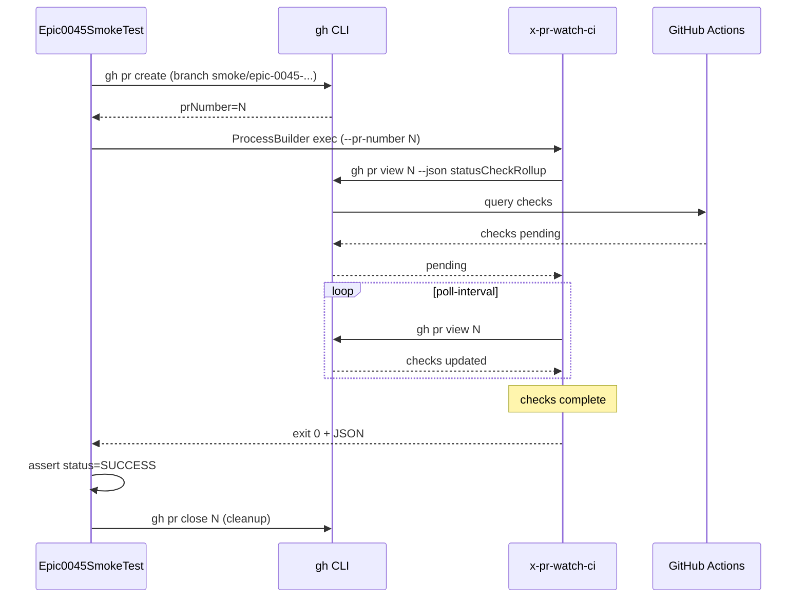

# História: Golden diff regen + smoke test real contra PR

**ID:** story-0045-0006
**Chave Jira:** —
**Status:** Pendente

## 1. Dependências

| Blocked By | Blocks |
| :--- | :--- |
| story-0045-0003, story-0045-0004, story-0045-0005 | — |

## 2. Regras Transversais Aplicáveis

| ID | Título |
| :--- | :--- |
| RULE-045-05 | Exit codes estáveis como contrato público |
| RULE-045-07 | Menu do EPIC-0043 consome exit code |
| RULE-045-08 | Atomic, Reversible Commits |

## 3. Descrição

Como **tech lead responsável pelo fechamento do EPIC-0045**, eu quero uma história dedicada a consolidar (a) a regeneração completa dos golden diffs afetados pelos retrofits das stories 0003/0004/0005, (b) um smoke test real que invoque `x-pr-watch-ci` contra um PR ao vivo do próprio repositório, e (c) a validação end-to-end do fluxo integrado (`x-story-implement` → `x-pr-create` → `x-pr-watch-ci` → menu EPIC-0043 → `x-pr-fix`).

A história existe para consolidar validações que cruzam múltiplas stories e para fornecer um guard-rail permanente (`Epic0045SmokeTest.java`) que impeça regressões silenciosas em futuros retrofits. É a última story do épico — fecha o ciclo.

### 3.1 Escopo de regeneração

- Goldens de `x-pr-watch-ci` (novo).
- Goldens retrofitados: `x-story-implement`, `x-task-implement`, `x-release`.
- Goldens de `rules/20-ci-watch.md` (nova rule).
- Goldens de `.claude/README.md` (menciona nova skill).
- Golden `SkillsAssemblerTest.listSkills_includesCiWatch` (nova entry).

### 3.2 Smoke test

- Classe: `Epic0045SmokeTest.java` em `java/src/test/java/dev/iadev/smoke/`.
- Estratégia: criar PR efêmero no próprio repo (branch `smoke/epic-0045-<timestamp>`), invocar `x-pr-watch-ci` via processo subjacente, validar exit code + JSON.
- Timeout do smoke: 120s (default de poll-interval 60s → 2 polls). Se CI do próprio repo for mais lento, ajustar timeout para 300s.
- Cleanup: fechar PR + deletar branch remota no `@AfterAll`.

### 3.3 Audit consolidado

- `scripts/audit-rule-20.sh` (STORY-0045-0002) rodando em `mvn test` via `Rule20AuditTest`.
- `scripts/audit-rule-13.sh` continua verde pós-retrofits.
- Goldens de `SkillsAssembler` e `RuleAssembler` sem diff não-esperado.

## 3.5 Entrega de Valor

- **Valor Principal:** Validação end-to-end garante que o épico inteiro entrega o comportamento prometido em produção (não apenas em unit tests). Smoke test recorrente em CI impede regressões silenciosas.
- **Métrica de Sucesso:** (a) Todos os goldens verdes após `mvn process-resources && mvn test`; (b) `Epic0045SmokeTest` passa contra PR real em <300s; (c) audit rule-20 e rule-13 retornam exit 0.
- **Impacto no Negócio:** Épico fechado com confiança; próximos retrofits em orquestradores têm guard-rail automatizado.

## 4. Definições de Qualidade Locais

### DoR Local

- [ ] Stories 0045-0001..0005 mergeadas
- [ ] CI do próprio repo estável (pipelines típicas <3min)
- [ ] `Epic0045SmokeTest` skeleton disponível (pode ser @Disabled antes do DoD)

### DoD Local

- [ ] `Epic0045SmokeTest.java` presente e habilitado
- [ ] Smoke test passa em CI contra PR real
- [ ] Todos os goldens regenerados e verdes
- [ ] `SkillsAssemblerTest.listSkills_includesCiWatch` verde
- [ ] `RuleAssemblerTest.listRules_includesCiWatch` verde
- [ ] `Rule20AuditTest` verde
- [ ] CHANGELOG.md seção Unreleased tem uma entrada por story
- [ ] CLAUDE.md bloco "In progress" atualizado ou removido (épico fechado)
- [ ] Epic-0045 `plans/epic-0045/epic-0045.md` tem status atualizado para "Concluído"

### Global DoD

- Cobertura ≥ 95%/90%.
- `mvn process-resources && mvn test` verde.
- Smoke test obrigatório quando `testing.smoke_tests == true` — presente aqui.

## 5. Contratos de Dados

### 5.1 Smoke test — contrato de invocação

| Passo | Ação | Validação |
| :--- | :--- | :--- |
| 1 | `@BeforeAll`: criar branch `smoke/epic-0045-<ts>` com commit trivial | branch criada no remote |
| 2 | Abrir PR contra `develop` via `gh pr create` | prNumber capturado |
| 3 | Invocar `x-pr-watch-ci --pr-number <N> --timeout-seconds 300` via `ProcessBuilder` | exit code + stdout JSON capturados |
| 4 | Parse JSON final, validar `status`, `prNumber`, `checks[]`, `elapsedSeconds` | JSON schema conformidade |
| 5 | `@AfterAll`: `gh pr close <N>` + `git push origin --delete smoke/epic-0045-<ts>` | cleanup successful |

### 5.2 CHANGELOG entries

| Story | Tipo | Entry sugerida |
| :--- | :--- | :--- |
| 0045-0001 | Added | New skill `x-pr-watch-ci` for polling PR CI + Copilot review (EPIC-0045) |
| 0045-0002 | Added | Rule 20 formalizes CI-Watch default in schema v2 (EPIC-0045) |
| 0045-0003 | Changed | `x-story-implement` now waits for CI + Copilot before approval gate (EPIC-0045) |
| 0045-0004 | Changed | `x-task-implement --worktree` now waits for CI + Copilot before approval gate (EPIC-0045) |
| 0045-0005 | Added | `x-release --ci-watch` flag for opt-in CI gate before release approval (EPIC-0045) |
| 0045-0006 | Added | `Epic0045SmokeTest` validates end-to-end CI-Watch flow (EPIC-0045) |

## 6. Diagramas

### 6.1 Validação end-to-end



## 7. Critérios de Aceite (Gherkin)

```gherkin
Cenario: Smoke test sem PR ativo falha de forma clara (degenerate)
  DADO que nenhum PR smoke existe
  QUANDO Epic0045SmokeTest.setUp() falha ao criar PR
  ENTÃO o test falha com mensagem clara "failed to create smoke PR: <reason>"
  E nenhum cleanup inadequado é tentado

Cenario: Smoke happy path — PR criado, CI termina, exit 0
  DADO que Epic0045SmokeTest cria PR smoke com sucesso
  QUANDO x-pr-watch-ci executa contra o PR
  E o CI do próprio repo passa em <300s
  ENTÃO a skill retorna exit 0
  E o JSON final contém status=SUCCESS
  E pelo menos 1 check está presente em checks[]
  E elapsedSeconds <= 300

Cenario: Goldens regenerados sem diff não-esperado
  DADO que todas as stories 0045-0001..0005 estão mergeadas
  QUANDO executar mvn process-resources && mvn test
  ENTÃO SkillsAssemblerTest passa
  E RuleAssemblerTest passa
  E Rule20AuditTest passa
  E nenhum golden tem diff inesperado

Cenario: CHANGELOG atualizado com 6 entradas
  DADO que todas as stories foram commitadas
  QUANDO inspecionar CHANGELOG.md seção Unreleased
  ENTÃO existem 6 entradas referenciando EPIC-0045 (uma por story)

Cenario: Boundary — smoke test com PR mergeado durante polling
  DADO que um operador mergeou o PR manualmente durante o smoke
  QUANDO x-pr-watch-ci detecta mergedAt != null
  ENTÃO retorna exit 40 (PR_ALREADY_MERGED)
  E o smoke test aceita exit 40 como válido (idempotência)
```

### 7.1 Scenario Ordering (TPP)

Ordem: degenerate (sem PR) → happy path (smoke verde) → verificação (goldens) → documentação (CHANGELOG) → boundary (PR mergeado durante polling).

### 7.2 Mandatory Scenario Categories

- [x] Degenerate cases (sem PR)
- [x] Happy path (smoke verde)
- [x] Error paths (cleanup falha implicitamente coberto)
- [x] Boundary values (PR mergeado durante polling)

### 7.3 TDD Implementation Notes

- Acceptance test: "Smoke happy path — PR criado, CI termina, exit 0" (é o próprio smoke test).
- Unit tests: parsers de JSON do JSON final se extraídos em helper.

## 8. Tasks

### TASK-0045-0006-001: Criar skeleton `Epic0045SmokeTest.java` (@Disabled)

- **Layer:** Test
- **Test Type:** Smoke
- **Size:** M
- **Dependencies:** —
- **Branch:** `feat/task-0045-0006-001-smoke-skeleton`
- **Testability:** Migration + Smoke
- **Files:**
  - `java/src/test/java/dev/iadev/smoke/Epic0045SmokeTest.java`
- **Acceptance Criteria:**
  - [ ] Estrutura @BeforeAll / @AfterAll com criação/deleção de PR
  - [ ] @Disabled até TASK-003 concluir

### TASK-0045-0006-002: Habilitar smoke test + validação completa

- **Layer:** Test
- **Test Type:** Smoke
- **Size:** M
- **Dependencies:** TASK-0045-0006-001, stories 0001-0005 mergeadas
- **Branch:** `feat/task-0045-0006-002-smoke-enable`
- **Testability:** Migration + Smoke
- **Files:**
  - `java/src/test/java/dev/iadev/smoke/Epic0045SmokeTest.java`
- **Acceptance Criteria:**
  - [ ] @Disabled removido
  - [ ] Smoke test passa em CI contra PR real
  - [ ] Cleanup idempotente

### TASK-0045-0006-003: Regenerar todos os goldens afetados

- **Layer:** Test
- **Test Type:** Verification
- **Size:** L
- **Dependencies:** stories 0001-0005 mergeadas
- **Branch:** `feat/task-0045-0006-003-golden-full-regen`
- **Testability:** Config + VerificationTest
- **Files:**
  - `java/src/test/resources/golden/**`
- **Acceptance Criteria:**
  - [ ] `mvn process-resources` antes
  - [ ] `GoldenFileRegenerator` rodado conforme memory
  - [ ] `mvn test` verde

### TASK-0045-0006-004: Atualizar CHANGELOG.md com 6 entradas

- **Layer:** Doc
- **Test Type:** Verification
- **Size:** S
- **Dependencies:** —
- **Branch:** `feat/task-0045-0006-004-changelog`
- **Testability:** Config + VerificationTest
- **Files:**
  - `CHANGELOG.md`
- **Acceptance Criteria:**
  - [ ] Seção Unreleased tem 6 entradas (uma por story)
  - [ ] Categorias Keep a Changelog aplicadas

### TASK-0045-0006-005: Marcar EPIC-0045 como Concluído + remover de CLAUDE.md "In progress"

- **Layer:** Doc
- **Test Type:** Verification
- **Size:** S
- **Dependencies:** TASK-0045-0006-002, TASK-0045-0006-003, TASK-0045-0006-004
- **Branch:** `feat/task-0045-0006-005-epic-close`
- **Testability:** Config + VerificationTest
- **Files:**
  - `plans/epic-0045/epic-0045.md` (Status → Concluído)
  - `CLAUDE.md` (remover linha do bloco "In progress")
- **Acceptance Criteria:**
  - [ ] Epic status = Concluído
  - [ ] CLAUDE.md atualizado
