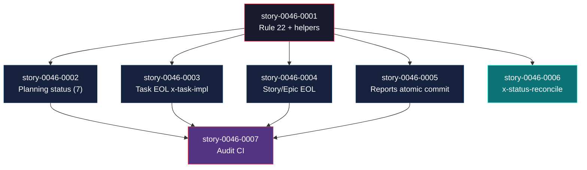
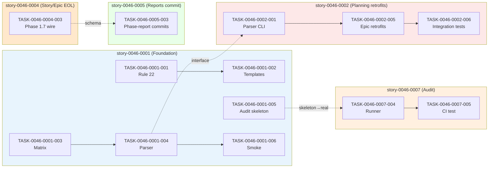

# Mapa de Implementação — EPIC-0046 Lifecycle Integrity

**Gerado a partir das dependências BlockedBy/Blocks de cada história do epic-0046.**

---

## 1. Matriz de Dependências

| Story | Título | Chave Jira | Blocked By | Blocks | Status |
| :--- | :--- | :--- | :--- | :--- | :--- |
| story-0046-0001 | Rule 22 lifecycle-integrity + matriz de transição nos templates + helpers Java base | — | — | story-0046-0002, story-0046-0003, story-0046-0004, story-0046-0005, story-0046-0006, story-0046-0007 | Pendente |
| story-0046-0002 | Planning status propagation nas 7 skills de planejamento | — | story-0046-0001 | story-0046-0007 | Pendente |
| story-0046-0003 | Task-level end-of-life status em x-task-implement | — | story-0046-0001 | story-0046-0007 | Concluída |
| story-0046-0004 | Story/Epic end-of-life status — Phase 3 unskippable + Phase 1.7 cabeada | — | story-0046-0001 | story-0046-0007 | Pendente |
| story-0046-0005 | Atomic commit dos reports de épico em x-epic-implement | — | story-0046-0001 | story-0046-0007 | Concluida |
| story-0046-0006 | Nova skill x-status-reconcile (opt-in diagnose + apply) | — | story-0046-0001 | — | Pendente |
| story-0046-0007 | Enforcement CI audit LifecycleIntegrityAuditTest | — | story-0046-0002, story-0046-0003, story-0046-0004, story-0046-0005 | — | Pendente |

> **Valores de Status:** `Pendente` (padrão) · `Em Andamento` · `Concluída` · `Falha` · `Bloqueada` · `Parcial`

> **Nota:** Story 0046-0006 (`x-status-reconcile`) é opt-in e não bloqueia o audit final (0046-0007). Pode ser implementada em paralelo ou diferida sem impactar o caminho crítico.

---

## 2. Fases de Implementação

> As histórias são agrupadas em fases. Dentro de cada fase, as histórias podem ser implementadas **em paralelo**. Uma fase só pode iniciar quando todas as dependências das fases anteriores estiverem concluídas.

```
╔══════════════════════════════════════════════════════════════════════════╗
║                   FASE 0 — Fundação (Rule + Helpers)                    ║
║                                                                        ║
║   ┌────────────────────────────────────────────────────┐              ║
║   │  story-0046-0001  Rule 22 + matrix + helpers       │              ║
║   └──────────────────────────┬─────────────────────────┘              ║
╚══════════════════════════════╪═════════════════════════════════════════╝
                               │
        ┌──────────┬───────────┼───────────┬──────────┐
        ▼          ▼           ▼           ▼          ▼
╔══════════════════════════════════════════════════════════════════════════╗
║                   FASE 1 — Retrofits + Skill nova (paralelo)           ║
║                                                                        ║
║   ┌────────────┐ ┌────────────┐ ┌────────────┐ ┌────────────┐ ┌──────┐║
║   │  0046-0002 │ │  0046-0003 │ │  0046-0004 │ │  0046-0005 │ │ 0046-║
║   │  Planning  │ │  Task EOL  │ │  Story/Epic│ │  Reports   │ │ 0006 ║
║   │  status    │ │  x-task-   │ │  EOL +     │ │  atomic    │ │ rec- ║
║   │  (7 skills)│ │  implement │ │  Phase 1.7 │ │  commit    │ │ cile ║
║   └─────┬──────┘ └─────┬──────┘ └─────┬──────┘ └─────┬──────┘ └──────┘║
╚═════════╪══════════════╪══════════════╪══════════════╪═════════════════╝
          │              │              │              │
          └──────────────┴──────┬───────┴──────────────┘
                                ▼
╔══════════════════════════════════════════════════════════════════════════╗
║                   FASE 2 — Enforcement (audit CI)                      ║
║                                                                        ║
║   ┌────────────────────────────────────────────────────┐              ║
║   │  story-0046-0007  LifecycleIntegrityAuditTest      │              ║
║   │  (CI-blocking; 3 dimensões de regressão)           │              ║
║   └────────────────────────────────────────────────────┘              ║
╚══════════════════════════════════════════════════════════════════════════╝
```

---

## 3. Caminho Crítico

> O caminho crítico (a sequência mais longa de dependências) determina o tempo mínimo de implementação do projeto.

```
story-0046-0001 ──┬──► story-0046-0002 ──┐
                  ├──► story-0046-0003 ──┤
                  ├──► story-0046-0004 ──┼──► story-0046-0007
                  ├──► story-0046-0005 ──┘
                  └──► story-0046-0006 (paralelo leaf)
   Fase 0            Fase 1                   Fase 2
```

**3 fases no caminho crítico, 3 histórias na cadeia mais longa (0046-0001 → 0046-0002|0003|0004|0005 → 0046-0007).**

Atrasos em `story-0046-0001` impactam TODAS as fases subsequentes (único item de Fase 0). Atrasos em 0002/0003/0004/0005 empurram a Fase 2 — qualquer um deles é bloqueador. Atrasos em 0046-0006 NÃO afetam o caminho crítico (é folha paralela).

---

## 4. Grafo de Dependências (Mermaid)



---

## 5. Resumo por Fase

| Fase | Histórias | Camada | Paralelismo | Pré-requisito |
| :--- | :--- | :--- | :--- | :--- |
| 0 | story-0046-0001 | Foundation (Rule + helpers + templates) | 1 | — |
| 1 | story-0046-0002, story-0046-0003, story-0046-0004, story-0046-0005, story-0046-0006 | Extensions (retrofits + skill nova) | 5 paralelas | Fase 0 concluída |
| 2 | story-0046-0007 | Cross-cutting (enforcement audit) | 1 | story-0046-0002..0005 concluídas |

**Total: 7 histórias em 3 fases.**

> **Nota:** story-0046-0006 (`x-status-reconcile`) é folha paralela. Pode iniciar em Fase 1 mas sua conclusão não bloqueia Fase 2.

---

## 6. Detalhamento por Fase

### Fase 0 — Fundação

| Story | Escopo Principal | Artefatos Chave |
| :--- | :--- | :--- |
| story-0046-0001 | Rule 22 publicada; matriz de transição nos 3 templates principais; helpers Java (`StatusFieldParser`, `LifecycleTransitionMatrix`, `LifecycleAuditRunner` skeleton) | `rules/22-lifecycle-integrity.md`; `_TEMPLATE-{TASK,STORY,EPIC}.md` atualizados; `dev.iadev.application.lifecycle.*`; `dev.iadev.domain.lifecycle.LifecycleStatus` |

**Entregas da Fase 0:**

- Rule 22 formalizada e carregada pelo `RuleAssembler`
- `StatusFieldParser` com regex + escrita atômica `.tmp`+rename (≥ 95% cobertura)
- `LifecycleTransitionMatrix` com matriz completa (≥ 95% cobertura)
- `LifecycleAuditRunner` skeleton (contrato `List<Violation>`; implementação real na Fase 2)
- Templates com bloco "Status Transitions" no header
- `RuleAssemblerTest.listRules_includesLifecycleIntegrity` verde

### Fase 1 — Retrofits + Skill Nova (paralela)

| Story | Escopo Principal | Artefatos Chave |
| :--- | :--- | :--- |
| story-0046-0002 | Retrofit de 7 skills de planejamento para propagar status Pendente→Planejada no commit do plan | 7 SKILL.md + `StatusFieldParserCli` + smoke tests |
| story-0046-0003 | Retrofit `x-task-implement` com Phase 3.5 (status Concluída + map row) no commit atômico da task | `x-task-implement/SKILL.md` + `TaskMapRowUpdater` + coalesced test |
| story-0046-0004 | Phase 3 unskippable em `x-story-implement`; Phase 1.7 cabeada em `x-epic-implement`; Phase 5 finalize | 2 SKILL.md + `EpicMapRowUpdater` + smoke E2E |
| story-0046-0005 | Commits atômicos dos reports (`execution-plan-*`, `phase-report-*`) em `x-epic-implement` | `x-epic-implement/SKILL.md` + `ReportCommitMessageBuilder` + release compat test |
| story-0046-0006 | Nova skill `x-status-reconcile` em `core/ops/` para reconciliação opt-in | SKILL.md novo + `LifecycleReconciler` + CLI + smoke tests |

**Entregas da Fase 1:**

- 10 SKILL.md retrofitadas (7 planning + 3 implementation)
- 1 skill nova (`x-status-reconcile`)
- Helpers Java adicionais: `TaskMapRowUpdater`, `EpicMapRowUpdater`, `LifecycleReconciler`, `ReportCommitMessageBuilder`
- CLI wrappers: `StatusFieldParserCli`, `TaskMapRowUpdaterCli`, `EpicMapRowUpdaterCli`, `StatusReconcileCli`
- Smoke tests por retrofit + integration tests (clean-workdir, fail-loud, Rule 19 compat)
- Golden diff regenerado em todos os SKILL.md afetados

### Fase 2 — Enforcement (audit CI)

| Story | Escopo Principal | Artefatos Chave |
| :--- | :--- | :--- |
| story-0046-0007 | `LifecycleIntegrityAuditTest` CI-blocking com 3 dimensões (orphan phase, write-without-commit, skip-flag-in-happy) | `LifecycleAuditRunner` (completo), `OrphanPhaseDetector`, `WriteWithoutCommitDetector`, `SkipFlagDetector`, `LifecycleAuditCli`, `audit/LifecycleIntegrityAuditTest` |

**Entregas da Fase 2:**

- `LifecycleAuditRunner` completo substituindo o skeleton da Fase 0
- 3 detectors independentes por dimension
- `LifecycleIntegrityAuditTest` rodando em `mvn test` (CI-blocking)
- Smoke test de regressão sintética (3 injeções → 3 violations)
- Escape hatch `<!-- audit-exempt -->` com threshold de alerta
- CLAUDE.md "In progress" atualizado com documentação de uso

---

## 7. Observações Estratégicas

### Gargalo Principal

**story-0046-0001 (Rule 22 + helpers)** é o maior gargalo. Bloqueia 6 outras histórias (todas as demais). Investir em review acelerado da 0001 reduz o tempo-calendário de todo o épico. Também é a story mais "fundacional" — a qualidade dos helpers (`StatusFieldParser` regex tolerante, escrita atômica, matriz de transição) determina a qualidade dos 6 retrofits subsequentes.

### Histórias Folha (sem dependentes)

- **story-0046-0006** (`x-status-reconcile`): folha paralela. Não bloqueia o audit final. Pode ser implementada em paralelo com 0002-0005 ou diferida para um PR subsequente sem impactar o fechamento do épico.
- **story-0046-0007**: folha terminal (audit CI). Sem dependentes.

### Otimização de Tempo

- **Paralelismo máximo na Fase 1:** 5 stories simultâneas (uma por desenvolvedor). Se a equipe tiver 5+ devs, Fase 1 executa em um único sprint.
- **Imediatamente acionável:** story-0046-0001 pode iniciar assim que o PR deste planning for aprovado.
- **Alocação sugerida para acelerar:** desenvolvedor sênior → 0001 + 0007 (fundação + audit); mid/senior → 0002 (7 retrofits, maior volume textual); mid → 0003, 0004, 0005 (retrofits focados); junior/mid → 0006 (skill nova, isolada).

### Dependências Cruzadas

- **story-0046-0004** declara `REQUIRES_MOCK of TASK-0046-0004-003` em sua TASK-0046-0005-003 (retrofit de `x-epic-implement` para commits de phase-report requer Phase 1.7 já cabeada). Ponto de convergência crítico: se 0004 atrasar, 0005 fica em REQUIRES_MOCK até merge.
- **story-0046-0007** é ponto de convergência final: consome o comportamento retrofitado de 0002-0005. Pré-condição dura: merge de 0002+0003+0004+0005 antes de iniciar a execução de 0007 (evita falsos-positivos do audit durante desenvolvimento).

### Marco de Validação Arquitetural

**story-0046-0004** é o checkpoint de validação arquitetural. Ela valida que:
- A infraestrutura da Fase 0 é consumível por SKILL.md orquestradores (não apenas skills simples)
- Rule 19 (V2-gating) funciona corretamente em fluxos complexos
- Clean-workdir invariant é mantido em fluxos de múltiplas waves

Se 0004 passar smoke end-to-end (épico toy v2 → Status Concluído propagado + clean workdir), a convenção Rule 22 está validada para o caso mais complexo do épico.

---

## 8. Dependências entre Tasks (Cross-Story)

> Esta seção captura dependências explícitas de tasks que cruzam fronteiras de histórias. Task IDs formais `TASK-0046-YYYY-NNN`.

### 8.1 Dependências Cross-Story entre Tasks

| Task | Depends On | Story Source | Story Target | Tipo |
| :--- | :--- | :--- | :--- | :--- |
| TASK-0046-0002-001..006 | TASK-0046-0001-004 | story-0046-0001 | story-0046-0002 | interface (StatusFieldParser API) |
| TASK-0046-0003-001..005 | TASK-0046-0001-003, TASK-0046-0001-004 | story-0046-0001 | story-0046-0003 | interface (LifecycleStatus + Parser) |
| TASK-0046-0004-001..004 | TASK-0046-0001-003, TASK-0046-0001-004 | story-0046-0001 | story-0046-0004 | interface |
| TASK-0046-0005-001..005 | TASK-0046-0004-003 | story-0046-0004 | story-0046-0005 | schema (Phase 1.7 deve existir para 0005 commitar report pós-wave) |
| TASK-0046-0006-001..005 | TASK-0046-0001-004 | story-0046-0001 | story-0046-0006 | interface |
| TASK-0046-0007-001..006 | TASK-0046-0001-005, TASK-0046-0002-*..0005-* | múltiplas | story-0046-0007 | data (audit depende dos retrofits implementados) |

> **Validação RULE-012:** dependências de tasks são consistentes com dependências de histórias. Exceção declarada: TASK-0046-0005-003 marca `REQUIRES_MOCK of TASK-0046-0004-003` — durante desenvolvimento isolado, usa mock de Phase 1.7 wire-up; integração real ao merge.

### 8.2 Ordem de Merge (Topological Sort)

| Ordem | Task ID | Story | Parallelizável Com | Fase |
| :--- | :--- | :--- | :--- | :--- |
| 1 | TASK-0046-0001-001 (Rule 22) | story-0046-0001 | — | 0 |
| 2 | TASK-0046-0001-003 (Matrix) | story-0046-0001 | TASK-0046-0001-005 | 0 |
| 3 | TASK-0046-0001-004 (Parser) | story-0046-0001 | — | 0 |
| 4 | TASK-0046-0001-002 (Templates), TASK-0046-0001-005 (Audit skeleton), TASK-0046-0001-006 (Smoke) | story-0046-0001 | entre si | 0 |
| 5 | TASK-0046-0002-001 (Parser CLI) | story-0046-0002 | TASK-0046-0003-001, TASK-0046-0004-001, TASK-0046-0005-001, TASK-0046-0006-001 | 1 |
| 6 | TASK-0046-0002-002..006, TASK-0046-0003-002..005, TASK-0046-0004-002..004, TASK-0046-0005-002..005, TASK-0046-0006-002..005 | múltiplas | entre si (5 waves paralelas) | 1 |
| 7 | TASK-0046-0007-001, 002, 003 (detectors) | story-0046-0007 | entre si | 2 |
| 8 | TASK-0046-0007-004, 005, 006 (runner, CI test, smoke) | story-0046-0007 | sequenciais | 2 |

**Total: ~30 tasks em 3 fases de execução (Fase 1 com alto paralelismo interno).**

### 8.3 Grafo de Dependências entre Tasks (Mermaid)



---

## 9. Pré-condições e Riscos

### 9.1 Pré-condições duras

- Slot Rule 22 disponível (confirmado: rules atuais 01-19 + 20 reservado pelo EPIC-0045 ci-watch).
- Templates `_TEMPLATE-{TASK,STORY,EPIC}.md` existem em `java/src/main/resources/targets/claude/templates/` OU em `java/src/test/resources/golden/{scenario}/.claude/templates/` como source-of-truth reusável.
- `SchemaVersionResolver` (EPIC-0038 story-0038-0008) disponível em `dev.iadev.domain.schemaversion.SchemaVersionResolver`.

### 9.2 Riscos principais

- **Paradoxo auto-planejamento:** este épico MODIFICA as skills de planejamento que ele mesmo usa (0046-0002 retrofita `x-epic-decompose`, `x-story-plan`, `x-task-plan`). O planejamento atual (este map) foi gerado com as skills pre-fix — esperado e documentado.
- **Rule 19 compat:** status sync é V2-gated. Audit da 0046-0007 deve provar que épicos v1 permanecem inalterados.
- **EPIC-0045 (ci-watch) conflict:** slot Rule 21 consumido. Este épico usa Rule 22. Nenhum outro conflito esperado; merge order: EPIC-0045 pode fundir antes ou depois, sem impacto.

---

## 10. Entrega Incremental

| Marco | Stories concluídas | Valor de negócio entregue |
| :--- | :--- | :--- |
| M0 (Fase 0 verde) | 0046-0001 | Convenção + infraestrutura pronta; sem mudança comportamental ainda |
| M1 (Fase 1 verde — crítica) | 0046-0001..0005 | Novos épicos v2 têm ciclo de vida íntegro (status sincronizado, reports commitados). Bug EPIC-0024 eliminado para frente |
| M1' (folha) | + 0046-0006 | Débito técnico de épicos legados endereçável via `x-status-reconcile --apply` |
| M2 (Fase 2 verde — épico fechado) | + 0046-0007 | CI bloqueia regressões; convenção Rule 22 enforcível. Épico fechado com `**Status:** Concluído` (via Phase 5 de `x-epic-implement` retrofitado, consumindo sua própria convenção) |
