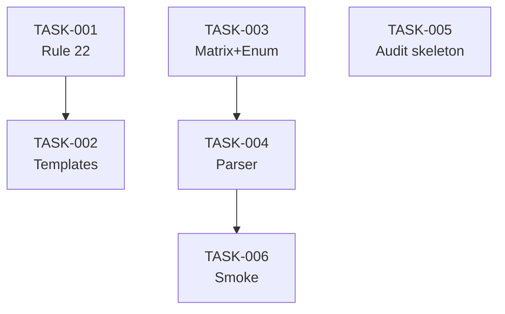

# Task Breakdown — story-0046-0001

## Header

| Field | Value |
|-------|-------|
| Story ID | story-0046-0001 |
| Epic ID | 0046 |
| Date | 2026-04-16 |
| Author | x-story-plan (multi-agent) |
| Template Version | 1.0.0 |

## Summary

| Metric | Value |
|--------|-------|
| Total Tasks | 6 |
| Parallelizable Tasks | 3 (TASK-001, TASK-003, TASK-005) |
| Estimated Effort | M |
| Mode | multi-agent |
| Agents Participating | Architect, QA, Security, Tech Lead, PO |

## Dependency Graph

## Tasks Table

| Task ID | Source Agent | Type | TDD Phase | TPP Level | Layer | Components | Parallel | Depends On | Estimated Effort | DoD |
|---------|-------------|------|-----------|-----------|-------|-----------|----------|-----------|-----------------|-----|
| TASK-0046-0001-001 | merged(ARCH,TL) | implementation | VERIFY | N/A | Doc | rules/22-lifecycle-integrity.md | Yes | — | S | Rule 22 existe; RuleAssemblerTest verde; golden regen OK |
| TASK-0046-0001-002 | ARCH | implementation | VERIFY | N/A | Doc | templates/_TEMPLATE-TASK, STORY, EPIC | No | TASK-001 | S | 3 templates atualizados com matriz; golden regen OK |
| TASK-0046-0001-003 | merged(ARCH,QA) | implementation+test | GREEN | scalar | Domain | LifecycleStatus enum, LifecycleTransitionMatrix | Yes | — | M | 100% matriz coberta; validateOrThrow lança com contexto; ≥95% cov |
| TASK-0046-0001-004 | merged(ARCH,QA,SEC) | implementation+test | GREEN | collection | Application | StatusFieldParser, StatusSyncException | No | TASK-003 | M | Regex MULTILINE tolerante; ATOMIC_MOVE; fail-loud STATUS_SYNC_FAILED; ≥95% cov |
| TASK-0046-0001-005 | ARCH | implementation | GREEN | nil | Application | LifecycleAuditRunner skeleton, Violation record | Yes | — | S | Skeleton retorna List.of(); contrato estável (real impl em story 0007) |
| TASK-0046-0001-006 | QA+PO | test | VERIFY | iteration | Test | LifecycleFoundationSmokeTest | No | TASK-004 | S | Sandbox E2E: read→validate→write→read; assert Status final |

## Escalation Notes

| Task ID | Reason | Recommended Action |
|---------|--------|--------------------|
| TASK-004 | SEC augmenta com OWASP A04 (Insecure Design — path traversal) e A08 (Software and Data Integrity Failures — atomic write) | Incluir no DoD: canonicalização de path; verify write completeness; no symlink follow |

## Source Agent Breakdown

- **Architect:** ARCH-001..005 (Rule + templates + enum + matrix + parser + skeleton)
- **QA:** QA-001..006 (6 Gherkin scenarios → 6 RED/GREEN pairs unit-tested em TPP order)
- **Security:** SEC-001 (augmentar TASK-004 com path-safety + atomic-write integrity)
- **Tech Lead:** TL-001 (quality gate ≥95% cov em helpers; Rule 19 V2-gating não aplicável nesta story)
- **Product Owner:** PO-001 (validar 6 Gherkin scenarios cobrem degenerate/happy/error/boundary)
