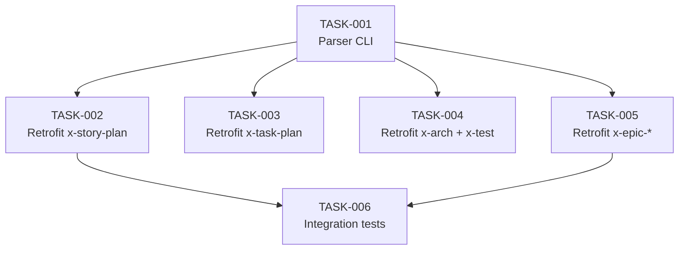

# Task Breakdown — story-0046-0002

## Header

| Field | Value |
|-------|-------|
| Story ID | story-0046-0002 |
| Epic ID | 0046 |
| Date | 2026-04-16 |
| Author | x-story-plan (multi-agent) |
| Template Version | 1.0.0 |

## Summary

| Metric | Value |
|--------|-------|
| Total Tasks | 6 |
| Parallelizable Tasks | 4 (retrofits podem rodar em paralelo após CLI pronto) |
| Estimated Effort | L (maior volume textual do épico) |
| Mode | multi-agent |
| Agents Participating | Architect, QA, Security, Tech Lead, PO |

## Dependency Graph

## Tasks Table

| Task ID | Source Agent | Type | TDD Phase | TPP Level | Layer | Components | Parallel | Depends On | Estimated Effort | DoD |
|---------|-------------|------|-----------|-----------|-------|-----------|----------|-----------|-----------------|-----|
| TASK-0046-0002-001 | ARCH+SEC | implementation+test | GREEN | scalar | Adapter | StatusFieldParserCli | Yes | — | M | CLI subcomandos read/write com exit 0/20/40; ≥95% cov; path canonicalization em writes |
| TASK-0046-0002-002 | ARCH+QA | doc+verification | VERIFY | N/A | Doc | x-story-plan/SKILL.md | Yes | TASK-001 | M | Bloco V2-gated adicionado; golden diff regen; smoke test story-plan status propagation |
| TASK-0046-0002-003 | ARCH+QA | doc+verification | VERIFY | N/A | Doc | x-task-plan/SKILL.md | Yes | TASK-001 | M | Bloco V2-gated; golden regen; smoke test |
| TASK-0046-0002-004 | ARCH | doc | VERIFY | N/A | Doc | x-arch-plan/SKILL.md, x-test-plan/SKILL.md | Yes | TASK-001 | M | Bloco idempotente (no-op se já Planejada); golden regen |
| TASK-0046-0002-005 | ARCH+QA | doc+verification | VERIFY | N/A | Doc | x-epic-create, x-epic-decompose, x-epic-map SKILL.md | No | TASK-001 | L | 3 retrofits; x-epic-map substitui `{{PLANNING_STATUS}}`; smoke E2E decompose+plan |
| TASK-0046-0002-006 | QA+SEC+PO | test | VERIFY | iteration | Test | PlanningStatusFailLoudTest, PlanningCleanWorkdirTest | No | TASK-002..005 | M | Fail-loud: remove story file → exit 20; clean-workdir: sandbox + assert empty |

## Escalation Notes

| Task ID | Reason | Recommended Action |
|---------|--------|--------------------|
| TASK-005 | 3 skills retrofitadas num único PR → diff grande, review cansativo | Considerar split em 3 subtasks 005a/005b/005c se o PR exceder 500 linhas de diff, mantendo atomicidade semântica |

## Source Agent Breakdown

- **Architect:** ARCH-001..005 (CLI + 4 retrofits + epic-* retrofits)
- **QA:** QA-001..006 (golden diff + smoke test por skill retrofitada)
- **Security:** SEC-001 (augmenta TASK-001 com path canonicalization no CLI write)
- **Tech Lead:** TL-001 (garantir que flag V2-gating use `SchemaVersionResolver.resolve() == V2` consistente em todos os 7 retrofits)
- **Product Owner:** PO-001 (validar 6 Gherkin scenarios + cenário de idempotency + backward compat v1)
