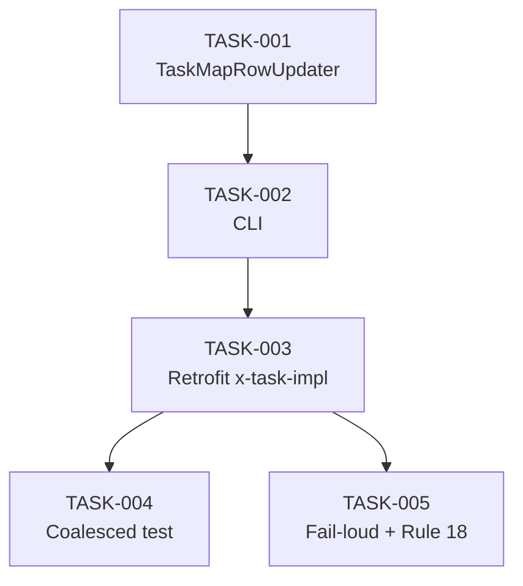

# Task Breakdown — story-0046-0003

## Header

| Field | Value |
|-------|-------|
| Story ID | story-0046-0003 |
| Epic ID | 0046 |
| Date | 2026-04-16 |
| Author | x-story-plan (multi-agent) |
| Template Version | 1.0.0 |

## Summary

| Metric | Value |
|--------|-------|
| Total Tasks | 5 |
| Parallelizable Tasks | 2 |
| Estimated Effort | M |
| Mode | multi-agent |
| Agents Participating | Architect, QA, Security, Tech Lead, PO |

## Tasks Table

| Task ID | Source Agent | Type | TDD Phase | TPP Level | Layer | Components | Parallel | Depends On | Estimated Effort | DoD |
|---------|-------------|------|-----------|-----------|-------|-----------|----------|-----------|-----------------|-----|
| TASK-0046-0003-001 | ARCH+QA | implementation+test | GREEN | scalar | Application | TaskMapRowUpdater | Yes | — | M | Regex substitui coluna Status da row correta; idempotente; ≥95% cov |
| TASK-0046-0003-002 | ARCH | implementation+test | GREEN | scalar | Adapter | TaskMapRowUpdaterCli | No | TASK-001 | S | CLI `update <map> <TASK-ID> <status>` exit 0/20/40 |
| TASK-0046-0003-003 | ARCH+QA | doc+verification | VERIFY | N/A | Doc | x-task-implement/SKILL.md | No | TASK-002 | M | Phase 3.5 adicionada entre outputs-verify e commit; V2-gated; smoke E2E |
| TASK-0046-0003-004 | QA+TL | test | VERIFY | iteration | Test | CoalescedTaskStatusTest | No | TASK-003 | M | Cria 2 tasks COALESCED sandbox; roda x-task-implement; assert 1 commit com ambos Status Concluída + footer Coalesces-with |
| TASK-0046-0003-005 | QA+SEC | test | VERIFY | boundary | Test | TaskStatusFailLoudTest, TaskAtomicCommitAuditTest | No | TASK-003 | M | Fail-loud: task file ausente → exit 20; Rule 18 audit: 3 tasks = 3 commits |

## Dependency Graph

## Escalation Notes

| Task ID | Reason | Recommended Action |
|---------|--------|--------------------|
| TASK-003 | Requer cuidado para não quebrar Rule 18 (atomic task commit) — status update deve entrar no MESMO commit do último ciclo TDD | Stage status + map row ANTES de invocar x-git-commit da fase 4 (commit atômico); NÃO criar commit dedicado a "status only" |

## Source Agent Breakdown

- **Architect:** ARCH-001..003 (helper + CLI + retrofit SKILL.md)
- **QA:** QA-001..005 (unit + integration + coalesced + fail-loud)
- **Security:** SEC-001 (nenhuma nova surface; augmenta TASK-001 com path canonicalization herdada do StatusFieldParser)
- **Tech Lead:** TL-001 (garantia Rule 18: contar 1 commit por task no audit)
- **Product Owner:** PO-001 (valida cenário COALESCED cobrindo Rule 15)
