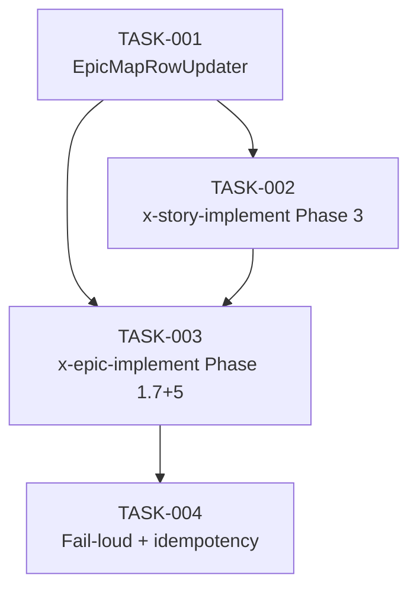

# Task Breakdown — story-0046-0004

## Header

| Field | Value |
|-------|-------|
| Story ID | story-0046-0004 |
| Epic ID | 0046 |
| Date | 2026-04-16 |
| Author | x-story-plan (multi-agent) |

## Summary

| Metric | Value |
|--------|-------|
| Total Tasks | 4 |
| Parallelizable Tasks | 1 (TASK-001 independente) |
| Estimated Effort | L (marco arquitetural) |
| Agents | Architect, QA, Security, Tech Lead, PO |

## Tasks Table

| Task ID | Source Agent | Type | TDD Phase | TPP Level | Layer | Components | Parallel | Depends On | Estimated Effort | DoD |
|---------|-------------|------|-----------|-----------|-------|-----------|----------|-----------|-----------------|-----|
| TASK-0046-0004-001 | ARCH+QA | implementation+test | GREEN | scalar | Application+Adapter | EpicMapRowUpdater + CLI | Yes | — | M | Regex para row do implementation-map-XXXX.md (distinto de task-map); ≥95% cov |
| TASK-0046-0004-002 | ARCH+QA | doc+verification | VERIFY | N/A | Doc | x-story-implement/SKILL.md | No | TASK-001 | M | Phase 3 unskippable; `--skip-verification` marcada "recovery only"; smoke: story toy v2 → Status + map + commit |
| TASK-0046-0004-003 | ARCH+QA+TL | doc+verification | VERIFY | N/A | Doc | x-epic-implement/SKILL.md | No | TASK-001, TASK-002 | L | Section 1.6b promovida a Phase 1.7 cabeada no Core Loop; Phase 5 (epic finalize) adicionada; smoke E2E épico toy v2 |
| TASK-0046-0004-004 | QA+SEC+PO | test | VERIFY | boundary | Test | EpicFinalizeFailLoudTest, EpicFinalizeIdempotencyTest | No | TASK-003 | M | Fail-loud: epic file ausente → STATUS_SYNC_FAILED; Idempotency: re-roda → 0 novos commits; clean-workdir |

## Dependency Graph

## Escalation Notes

| Task ID | Reason | Recommended Action |
|---------|--------|--------------------|
| TASK-003 | Maior task do épico: 2 SKILL.md modificações + Phase 1.7 wire-up + Phase 5 nova. Diff grande + complexidade de wiring | Review gatekeeping: 2 reviewers (architect + tech lead); smoke test E2E mandatório antes de merge |

## Source Agent Breakdown

- **Architect:** ARCH-001..003 (helper + 2 retrofits; Phase 1.7 é wiring-only)
- **QA:** QA-001..004 (TPP unit + integration + E2E smoke)
- **Security:** SEC-001 (nenhuma surface nova; augmenta TASK-003 com verificação de commit message sanitization)
- **Tech Lead:** TL-001 (marco arquitetural — valida que Rule 19 V2-gating funciona em fluxos complexos)
- **Product Owner:** PO-001 (6 Gherkin scenarios incluem v1 backward compat, audit hook, idempotency)
