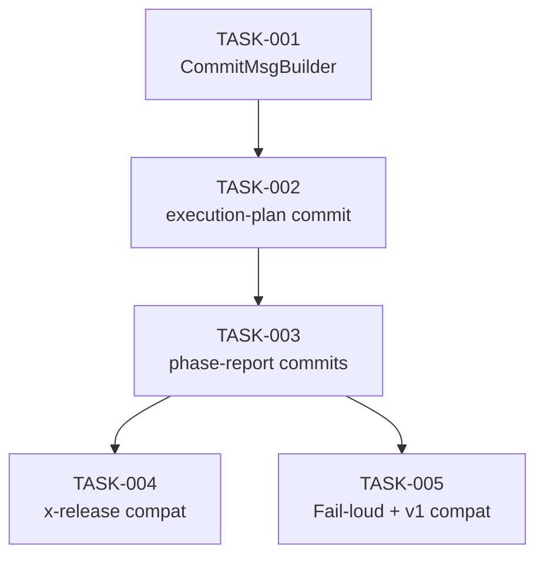

# Task Breakdown — story-0046-0005

## Header

| Field | Value |
|-------|-------|
| Story ID | story-0046-0005 |
| Epic ID | 0046 |
| Date | 2026-04-16 |
| Author | x-story-plan (multi-agent) |

## Summary

| Metric | Value |
|--------|-------|
| Total Tasks | 5 |
| Parallelizable Tasks | 1 |
| Estimated Effort | M |
| Agents | ARCH, QA, SEC, TL, PO |

## Tasks Table

| Task ID | Source Agent | Type | TDD Phase | TPP | Layer | Components | Parallel | Depends On | Effort | DoD |
|---------|-------------|------|-----------|-----|-------|-----------|----------|-----------|--------|-----|
| TASK-0046-0005-001 | ARCH+QA | implementation+test | GREEN | const | Application | ReportCommitMessageBuilder | Yes | — | S | Gera mensagens no formato `docs(epic-XXXX): add <type> report`; ≥95% cov |
| TASK-0046-0005-002 | ARCH+QA | doc+verification | VERIFY | N/A | Doc | x-epic-implement/SKILL.md (execution-plan commit) | No | TASK-001 | M | Bloco pré-wave-loop V2-gated adicionado; smoke: épico v2 → 1 commit docs(epic-*) antes das stories |
| TASK-0046-0005-003 | ARCH+QA | doc+verification | VERIFY | N/A | Doc | x-epic-implement/SKILL.md (phase-report commit) | No | TASK-002, **MOCK of TASK-0046-0004-003** | M | Bloco pós-wave V2-gated; smoke: N commits `docs(epic-*): add phase-N report` = N waves |
| TASK-0046-0005-004 | QA+TL | test | E2E | iteration | Test | EpicImplementReleaseCompatTest | No | TASK-003 | M | Sandbox: x-epic-implement v2 completo → x-release --dry-run → VALIDATE_DIRTY_WORKDIR passa |
| TASK-0046-0005-005 | QA+SEC | test | VERIFY | boundary | Test | ReportCommitFailLoudTest, EpicV1NoReportCommitTest | No | TASK-003 | M | Fail-loud: hook rejeita commit → exit REPORT_COMMIT_FAILED; Rule 19: v1 → 0 commits automáticos |

## Dependency Graph

## Escalation Notes

| Task ID | Reason | Recommended Action |
|---------|--------|--------------------|
| TASK-003 | `REQUIRES_MOCK of TASK-0046-0004-003` — Phase 1.7 da story 0004 precisa estar cabeada para posicionar corretamente o commit de phase-report pós-wave | Durante desenvolvimento isolado, mock de Phase 1.7 wire-up; integração real só ao merge da 0004. Alternativa: merge 0004 antes de iniciar 0005 (sequencializar). |

## Source Agent Breakdown

- **Architect:** ARCH-001..003 (commit builder + 2 retrofits)
- **QA:** QA-001..005 (unit + 2 smoke + E2E + fail-loud)
- **Security:** SEC-001 (commit message sanitization — não incluir paths absolutos, não incluir state.json bytes)
- **Tech Lead:** TL-001 (garantir ordem correta: execution-plan commit antes das stories; phase-report commit DEPOIS das stories de cada wave mas ANTES da próxima wave)
- **Product Owner:** PO-001 (5 Gherkin cobrem v1, happy v2, boundary clean-workdir, error, x-release compat)
