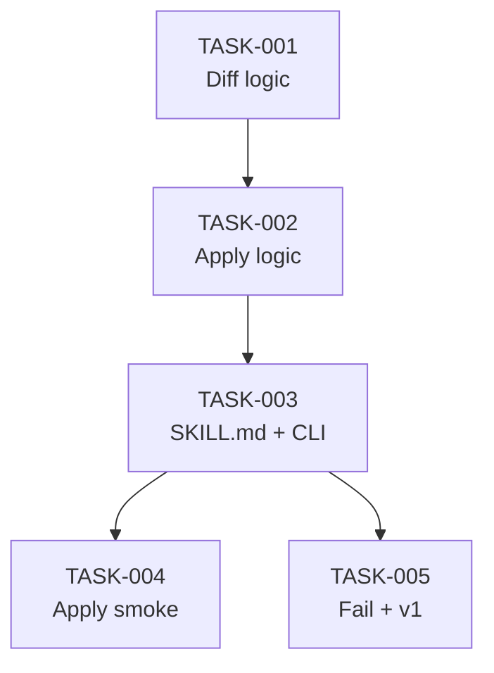

# Task Breakdown — story-0046-0006

## Header

| Field | Value |
|-------|-------|
| Story ID | story-0046-0006 |
| Epic ID | 0046 |
| Date | 2026-04-16 |
| Author | x-story-plan (multi-agent) |

## Summary

| Metric | Value |
|--------|-------|
| Total Tasks | 5 |
| Parallelizable Tasks | 1 |
| Estimated Effort | L (nova skill + 2 CLI + gate interativo + 2 smokes) |
| Agents | ARCH, QA, SEC, TL, PO |

## Tasks Table

| Task ID | Source Agent | Type | TDD | TPP | Layer | Components | Parallel | Depends On | Effort | DoD |
|---------|-------------|------|-----|-----|-------|-----------|----------|-----------|--------|-----|
| TASK-0046-0006-001 | ARCH+QA | implementation+test | GREEN | collection | Application | LifecycleReconciler.diff + Divergence record | Yes | — | L | Diff(epicDir) → List<Divergence>; mapeia state.json→LifecycleStatus; ≥95% cov |
| TASK-0046-0006-002 | ARCH+QA+SEC | implementation+test | GREEN | conditional | Application | LifecycleReconciler.apply | No | TASK-001 | M | apply(divergences) atomicamente via StatusFieldParser; skip v1; abort transição suspeita |
| TASK-0046-0006-003 | ARCH+PO | doc+implementation | GREEN | N/A | Doc+Adapter | x-status-reconcile/SKILL.md, StatusReconcileCli | No | TASK-002 | L | SKILL.md frontmatter correto; CLI argumentos; SkillsAssemblerTest.listSkills_includesStatusReconcile verde; smoke diagnose |
| TASK-0046-0006-004 | QA+PO | test | E2E | iteration | Test | StatusReconcileApplySmokeTest | No | TASK-003 | M | Sandbox épico legado → --apply --non-interactive → 1 commit + markdowns atualizados |
| TASK-0046-0006-005 | QA+SEC | test | VERIFY | boundary | Test | StatusReconcileFailTest, StatusReconcileV1CompatTest | No | TASK-003 | M | state.json invalid→30; transição suspeita→40; v1→exit 0 skip |

## Dependency Graph

## Escalation Notes

| Task ID | Reason | Recommended Action |
|---------|--------|--------------------|
| TASK-003 | Nova skill em `core/ops/` requer golden regen + SkillsAssembler atualizado; frontmatter `allowed-tools` inclui `AskUserQuestion` (novidade na taxonomia) | Validar com golden diff que taxonomia `core/ops/` não conflita com skills existentes (x-release, etc.) |
| TASK-002 | Transição suspeita (markdown=Concluída com checkpoint=PENDING) é semanticamente ambígua — pode ser reabertura legítima ou corrupção | Default: fail-loud (exit 40); documentar override manual via edição direta do markdown |

## Source Agent Breakdown

- **Architect:** ARCH-001..003 (reconciler + CLI + SKILL.md)
- **QA:** QA-001..005 (unit + integration + smoke + fail-loud)
- **Security:** SEC-001 (augmenta TASK-002 com: não escrever em arquivos fora do epic dir; canonicalize paths; não modificar state.json nunca)
- **Tech Lead:** TL-001 (reuse EPIC-0043 gate pattern `AskUserQuestion` ou fallback inline; validar Rule 19 compat)
- **Product Owner:** PO-001 (8 Gherkin cobrem: v1, diagnose, apply, abort, error, suspeita, non-interactive, per-story scope)
