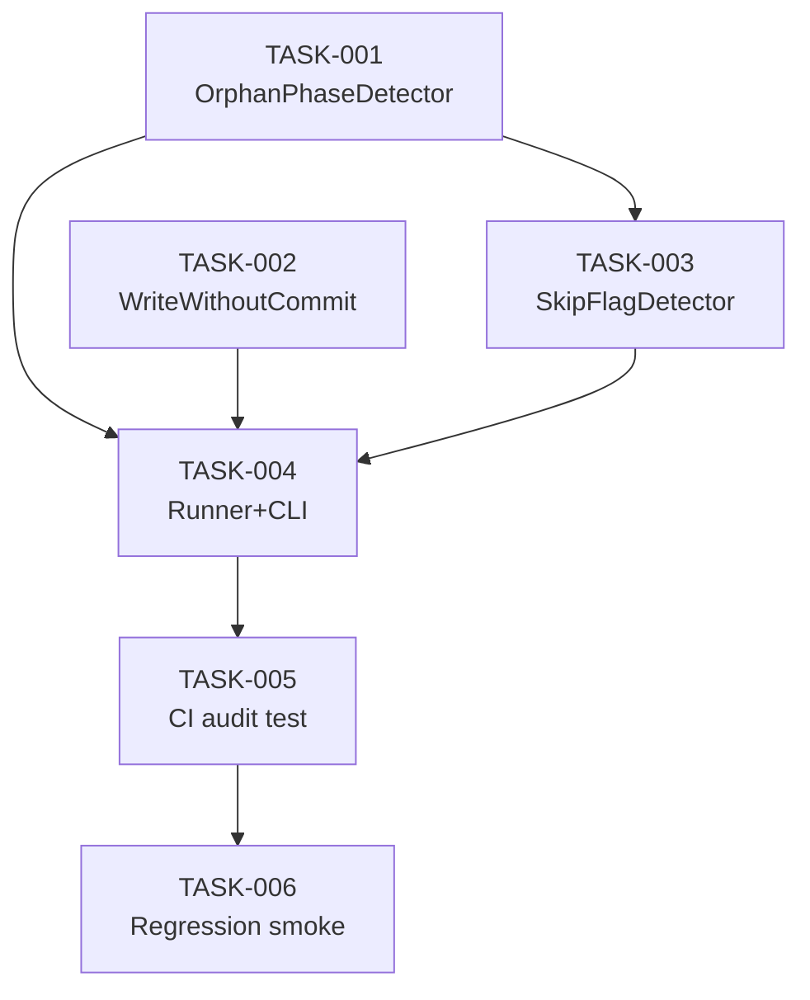

# Task Breakdown — story-0046-0007

## Header

| Field | Value |
|-------|-------|
| Story ID | story-0046-0007 |
| Epic ID | 0046 |
| Date | 2026-04-16 |
| Author | x-story-plan (multi-agent) |

## Summary

| Metric | Value |
|--------|-------|
| Total Tasks | 6 |
| Parallelizable Tasks | 3 (detectors 001, 002 + 003) |
| Estimated Effort | L |
| Agents | ARCH, QA, SEC, TL, PO |

## Tasks Table

| Task ID | Source Agent | Type | TDD | TPP | Layer | Components | Parallel | Depends On | Effort | DoD |
|---------|-------------|------|-----|-----|-------|-----------|----------|-----------|--------|-----|
| TASK-0046-0007-001 | ARCH+QA | implementation+test | GREEN | conditional | Application | OrphanPhaseDetector | Yes | — | L | Parse markdown via commonmark; detect sections não referenciadas no Core Loop; ≥95% cov |
| TASK-0046-0007-002 | ARCH+QA | implementation+test | GREEN | collection | Application | WriteWithoutCommitDetector | Yes | — | M | Regex detecta writes em reports/; window 20 lines; respeita `<!-- audit-exempt -->` |
| TASK-0046-0007-003 | ARCH+QA | implementation+test | GREEN | scalar | Application | SkipFlagDetector | Yes | TASK-001 | M | Detect `--skip-*` em Core Loop; ignore em Recovery/Error sections |
| TASK-0046-0007-004 | ARCH+TL | implementation | GREEN | N/A | Application+Adapter | LifecycleAuditRunner (real, substitui skeleton) + LifecycleAuditCli | No | TASK-001..003 | M | Agrega detectors; CLI exit 0/11 |
| TASK-0046-0007-005 | QA+PO | test | VERIFY | iteration | Test | LifecycleIntegrityAuditTest (CI-blocking) | No | TASK-004 | M | `mvn test -Dtest=LifecycleIntegrityAuditTest` verde; scan skills reais retorna 0 violations |
| TASK-0046-0007-006 | QA+TL | test | E2E | iteration | Test | LifecycleAuditRegressionSmokeTest | No | TASK-005 | M | Sandbox com cópia do skills tree; injeta 3 regressões sintéticas; assert 3 violations; scan < 2s |

## Dependency Graph

## Escalation Notes

| Task ID | Reason | Recommended Action |
|---------|--------|--------------------|
| TASK-001 | Parse markdown via commonmark + matching heurístico "Core Loop section" → frágil em variações de heading. Pode gerar falsos-positivos | Iterar heurística com sample real de 40 SKILL.md; adicionar exempt inline `<!-- audit-exempt -->` para casos verdadeiros de documentação inativa |
| TASK-005 | Se CI-blocking falhar em skill já retrofitada (stories 002-005), bloqueia merge do próprio PR de 0007 | Rodar scan manual antes do PR + ajustar false-positives com exempt tags |

## Source Agent Breakdown

- **Architect:** ARCH-001..004 (3 detectors + runner/CLI)
- **QA:** QA-001..006 (unit per detector + integration runner + E2E smoke + CI test)
- **Security:** SEC-001 (nenhuma surface nova; escape hatch `<!-- audit-exempt -->` controlado — threshold alerta se > 3)
- **Tech Lead:** TL-001 (garantir que detectors não conflitam entre si; runner agrega de forma determinística)
- **Product Owner:** PO-001 (valida 7 Gherkin scenarios incluindo performance boundary e regression E2E)
