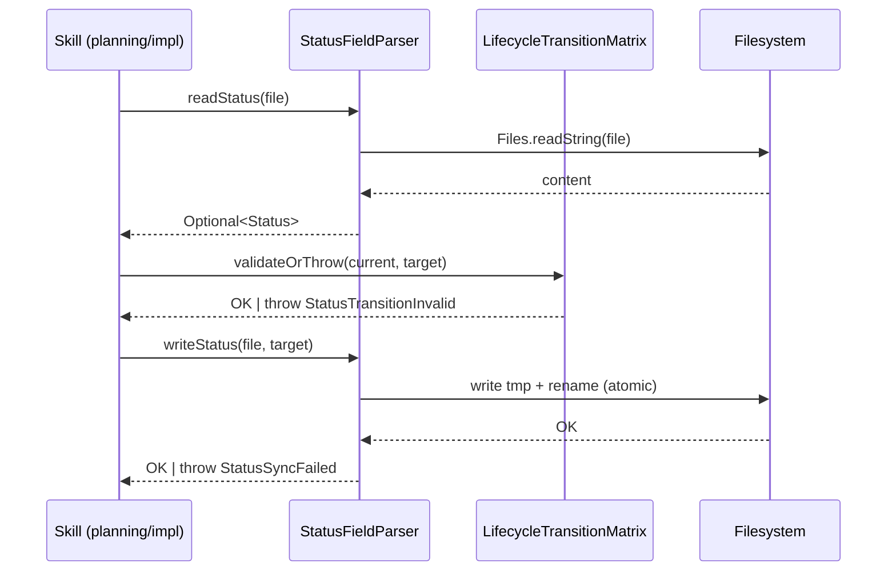

# História: Rule 21 lifecycle-integrity + matriz de transição nos templates + helpers Java base

**ID:** story-0046-0001
**Chave Jira:** —
**Status:** Pendente

## 1. Dependências

| Blocked By | Blocks |
| :--- | :--- |
| — | story-0046-0002, story-0046-0003, story-0046-0004, story-0046-0005, story-0046-0006, story-0046-0007 |

## 2. Regras Transversais Aplicáveis

| ID | Título |
| :--- | :--- |
| RULE-046-01 | Source-of-truth invariant |
| RULE-046-06 | Clean workdir invariant |
| RULE-046-07 | Markdown é SoT; state.json é telemetria |
| RULE-046-08 | Fail loud on status update failure |

## 3. Descrição

Como **Engenheiro de Plataforma**, eu quero uma rule formal `Rule 21 — lifecycle-integrity`, a matriz de transição de status documentada no header dos três templates principais e os helpers Java `StatusFieldParser`, `LifecycleTransitionMatrix` e `LifecycleAuditRunner` implementados, garantindo que as stories subsequentes (0002-0007) tenham convenção + infraestrutura prontas para retrofit sem reinventar regex, matriz de transição ou escrita atômica em cada SKILL.md.

Esta é a story fundacional (Layer 0 — Foundation) do EPIC-0046. Ela não altera comportamento de skills existentes; apenas publica a Rule, atualiza templates e entrega o pacote `dev.iadev.application.lifecycle`. As stories 0002-0005 consomem os helpers via retrofits em SKILL.md; story 0006 (nova skill `x-status-reconcile`) consome `StatusFieldParser` + `LifecycleTransitionMatrix`; story 0007 consome `LifecycleAuditRunner` no `LifecycleIntegrityAuditTest`.

### 3.1 Rule 21 — lifecycle-integrity

- Arquivo: `java/src/main/resources/targets/claude/rules/21-lifecycle-integrity.md`.
- Seções obrigatórias: Rule (sumário), Scope (planning + implementation + reconcile), Matriz de Transição, Enforcement, Forbidden.
- Matriz de transição (enum `LifecycleStatus`): `Pendente → Planejada → Em Andamento → Concluída | Cancelada | Bloqueada`. Transições inversas permitidas apenas `Concluída → Em Andamento` (via `x-status-reconcile --apply` em caso de reabertura) e `Bloqueada → Pendente` / `Em Andamento`.
- Rule referencia RULE-046-02..08 como enforcement detalhado no épico.

### 3.2 Matriz de transição nos templates

- Atualizar `java/src/main/resources/targets/claude/templates/_TEMPLATE-TASK.md`, `_TEMPLATE-STORY.md`, `_TEMPLATE-EPIC.md` adicionando bloco informativo no header (abaixo do campo `**Status:**`) com a matriz de transição permitida e link para Rule 21.
- Valores permitidos enumerados: `Pendente | Planejada | Em Andamento | Concluída | Cancelada | Bloqueada`.

### 3.3 Helpers Java em `dev.iadev.application.lifecycle`

- `StatusFieldParser`:
  - Regex tolerante a whitespace: `^\*\*Status:\*\*\s+(Pendente|Planejada|Em Andamento|Concluída|Cancelada|Bloqueada)\s*$` (multiline).
  - API: `Optional<LifecycleStatus> readStatus(Path file)`, `void writeStatus(Path file, LifecycleStatus newStatus)`.
  - Escrita atômica: grava em `file + ".tmp"`, depois `Files.move(tmp, file, ATOMIC_MOVE, REPLACE_EXISTING)`.
  - Exceções: `StatusSyncException(code=STATUS_SYNC_FAILED, context=Path, expected, found)`.
- `LifecycleTransitionMatrix`:
  - Enum `LifecycleStatus` com os 6 valores.
  - Método `boolean isAllowed(LifecycleStatus from, LifecycleStatus to)` consultando matriz imutável.
  - Método `void validateOrThrow(LifecycleStatus from, LifecycleStatus to)` lança `StatusTransitionInvalidException` com contexto.
- `LifecycleAuditRunner`:
  - Interface consumida por `LifecycleIntegrityAuditTest` (story 0046-0007).
  - API: `List<Violation> scan(Path skillsRoot)` retorna violations das 3 dimensões (phases órfãs, reports sem commit, flags `--skip-*` no happy).
  - Implementação nesta story apenas esqueleto + contrato; detecção real vive na story 0007.

## 3.5 Entrega de Valor

- **Valor Principal:** Convenção formal (`Rule 21`) + infraestrutura reusável (`StatusFieldParser`, `LifecycleTransitionMatrix`) + templates atualizados. Desbloqueia as 6 stories seguintes, que podem consumir os helpers sem reinventar regex, matriz de transição ou escrita atômica.
- **Métrica de Sucesso:** (a) Rule 21 publicada e referenciada em 3 templates e em 10 SKILL.md (via retrofits das stories 0002-0005); (b) `StatusFieldParser` e `LifecycleTransitionMatrix` com ≥ 95% cobertura; (c) `RuleAssemblerTest.listRules_includesLifecycleIntegrity` verde.
- **Impacto no Negócio:** Elimina a ambiguidade sobre quem atualiza status e quando; reduz custo cognitivo de todas as stories subsequentes (reusam helpers); estabelece padrão que governa todo o ciclo SDD futuro.

## 4. Definições de Qualidade Locais

### DoR Local (Definition of Ready)

- [ ] Slot Rule 21 confirmado como disponível (`RuleAssemblerTest` atual lista rules 01-19; EPIC-0045 consumirá slot 20).
- [ ] Templates atuais (`_TEMPLATE-TASK`, `_TEMPLATE-STORY`, `_TEMPLATE-EPIC`) localizados na source-of-truth (`java/src/main/resources/targets/claude/templates/` ou inline no `PlanTemplatesAssembler`).
- [ ] Decisão sobre localização do enum `LifecycleStatus` tomada: `dev.iadev.domain.lifecycle.LifecycleStatus` (domain puro, consumido por `application.lifecycle`).

### DoD Local (Definition of Done)

- [ ] Rule 21 gravada em `java/src/main/resources/targets/claude/rules/21-lifecycle-integrity.md`.
- [ ] Templates atualizados com matriz de transição no header.
- [ ] `StatusFieldParser`, `LifecycleTransitionMatrix`, `LifecycleAuditRunner` implementados com ≥ 95% cobertura line / ≥ 90% branch.
- [ ] `RuleAssemblerTest.listRules_includesLifecycleIntegrity` verde.
- [ ] Golden diff regenerado em `mvn process-resources` — `.claude/rules/21-lifecycle-integrity.md` e templates atualizados nos goldens.
- [ ] Pelo menos 1 teste fail-loud: `StatusFieldParserTest.writeStatus_whenFileMissing_throwsStatusSyncFailed`.
- [ ] Smoke test passando (sandbox: grava `**Status:** Pendente` em arquivo toy, lê, transiciona para `Planejada`, verifica arquivo).

### Global Definition of Done (DoD)

- **Cobertura:** ≥ 95% Line, ≥ 90% Branch
- **Testes Automatizados:** Unit tests dos 3 helpers + golden diff regen + RuleAssembler test + smoke test
- **Relatório de Cobertura:** JaCoCo agregado
- **Documentação:** Rule 21 + CLAUDE.md "In progress" + CHANGELOG Unreleased entry
- **Persistência:** Escrita atômica via `.tmp` + rename com `ATOMIC_MOVE`
- **Performance:** ~5ms por read/write em SSD

## 5. Contratos de Dados (Data Contract)

### 5.1 Enum `LifecycleStatus`

```java
public enum LifecycleStatus {
    PENDENTE("Pendente"),
    PLANEJADA("Planejada"),
    EM_ANDAMENTO("Em Andamento"),
    CONCLUIDA("Concluída"),
    CANCELADA("Cancelada"),
    BLOQUEADA("Bloqueada");
}
```

### 5.2 Regex canônica

```
^\*\*Status:\*\*\s+(Pendente|Planejada|Em Andamento|Concluída|Cancelada|Bloqueada)\s*$
```

Flags: MULTILINE. Apenas a PRIMEIRA ocorrência em um arquivo é considerada (header).

### 5.3 Matriz de transição

| De / Para | Pendente | Planejada | Em Andamento | Concluída | Cancelada | Bloqueada |
| :--- | :---: | :---: | :---: | :---: | :---: | :---: |
| Pendente | — | ✅ | ✅ | — | ✅ | ✅ |
| Planejada | — | — | ✅ | — | ✅ | ✅ |
| Em Andamento | — | — | — | ✅ | ✅ | ✅ |
| Concluída | — | — | ✅ (reopen) | — | — | — |
| Cancelada | ✅ (reopen) | — | — | — | — | — |
| Bloqueada | ✅ | ✅ | ✅ | — | ✅ | — |

## 6. Diagramas

### 6.1 Fluxo de atualização de status (genérico)



## 7. Critérios de Aceite (Gherkin)

```gherkin
Cenario: Leitura de arquivo sem campo Status (degenerate)
  DADO um arquivo markdown sem a linha **Status:**
  QUANDO StatusFieldParser.readStatus é invocado
  ENTÃO retorna Optional.empty()
  E nenhuma exceção é lançada

Cenario: Leitura e transição happy path
  DADO um arquivo markdown com **Status:** Pendente
  QUANDO LifecycleTransitionMatrix.isAllowed(PENDENTE, PLANEJADA) é consultado
  ENTÃO retorna true
  E StatusFieldParser.writeStatus(file, PLANEJADA) grava atomicamente
  E a próxima leitura retorna PLANEJADA

Cenario: Transição inválida (error path)
  DADO um arquivo com **Status:** Concluída
  QUANDO LifecycleTransitionMatrix.validateOrThrow(CONCLUIDA, PENDENTE) é invocado
  ENTÃO lança StatusTransitionInvalidException
  E a mensagem contém os valores from, to

Cenario: Falha de escrita por arquivo ausente (fail loud)
  DADO um path que não existe
  QUANDO StatusFieldParser.writeStatus(path, PLANEJADA) é invocado
  ENTÃO lança StatusSyncException com code STATUS_SYNC_FAILED
  E o contexto inclui o path

Cenario: Whitespace tolerante (boundary)
  DADO um arquivo com "**Status:**    Pendente   " (múltiplos espaços)
  QUANDO StatusFieldParser.readStatus é invocado
  ENTÃO retorna Optional.of(PENDENTE)

Cenario: Escrita atômica via .tmp + rename (boundary)
  DADO um arquivo existente com **Status:** Pendente
  QUANDO StatusFieldParser.writeStatus é interrompido antes do rename
  ENTÃO o arquivo original permanece intacto (sem corrupção)
```

### 7.1 Scenario Ordering (TPP)

Scenarios ordenados de degenerate → happy → error → boundary, conforme TPP.

### 7.2 Mandatory Scenario Categories

- [x] Degenerate cases (arquivo sem Status)
- [x] Happy path (transição permitida)
- [x] Error paths (transição inválida, arquivo ausente)
- [x] Boundary values (whitespace, interrupt during atomic write)

### 7.3 TDD Implementation Notes

- **Acceptance test (outer loop):** "Leitura e transição happy path" é o walking skeleton — cria arquivo, lê, valida, escreve, lê de novo.
- **Inner loop (TPP):** unit tests começam pelo mais simples: regex match de string estática; depois parse com whitespace; depois matriz de transição; depois escrita atômica.

## 8. Tasks

### Valid Testability Patterns (RULE-002 / SD-12)

| Pattern | Content | Test Type |
| :--- | :--- | :--- |
| Domain + UnitTest | Entity/VO/Engine + unit test | Unit |
| Config + VerificationTest | Configuration + verification test | Verification |

### Sizing Constraints (RULE-011)

- S: < 50 LOC · M: 50-150 (ideal) · L: 150-300 · Split se > 300

### TASK-0046-0001-001: Criar Rule 21 lifecycle-integrity

- **Layer:** Doc
- **Test Type:** Verification
- **Size:** S
- **Dependencies:** —
- **Branch:** `feat/task-0046-0001-001-rule-21`
- **Testability:** INDEPENDENT
- **Files:**
  - `java/src/main/resources/targets/claude/rules/21-lifecycle-integrity.md`
  - `java/src/test/java/dev/iadev/application/RuleAssemblerTest.java` (extensão)
- **Acceptance Criteria:**
  - [ ] Rule 21 existe com as 5 seções obrigatórias
  - [ ] `RuleAssemblerTest.listRules_includesLifecycleIntegrity` verde
  - [ ] `mvn process-resources` regenera `.claude/rules/21-lifecycle-integrity.md`

### TASK-0046-0001-002: Atualizar templates com matriz de transição

- **Layer:** Doc
- **Test Type:** Verification
- **Size:** S
- **Dependencies:** TASK-0046-0001-001
- **Branch:** `feat/task-0046-0001-002-templates-matrix`
- **Testability:** INDEPENDENT
- **Files:**
  - `java/src/main/resources/targets/claude/templates/_TEMPLATE-TASK.md`
  - `java/src/main/resources/targets/claude/templates/_TEMPLATE-STORY.md`
  - `java/src/main/resources/targets/claude/templates/_TEMPLATE-EPIC.md`
- **Acceptance Criteria:**
  - [ ] Cada template tem bloco "Status Transitions" no header com a matriz + link para Rule 21
  - [ ] `mvn process-resources` regenera os 3 templates nos goldens

### TASK-0046-0001-003: Implementar LifecycleStatus enum + LifecycleTransitionMatrix

- **Layer:** Domain
- **Test Type:** Unit
- **Size:** M
- **Dependencies:** —
- **Branch:** `feat/task-0046-0001-003-transition-matrix`
- **Testability:** INDEPENDENT
- **Files:**
  - `java/src/main/java/dev/iadev/domain/lifecycle/LifecycleStatus.java`
  - `java/src/main/java/dev/iadev/application/lifecycle/LifecycleTransitionMatrix.java`
  - `java/src/main/java/dev/iadev/application/lifecycle/StatusTransitionInvalidException.java`
  - `java/src/test/java/dev/iadev/application/lifecycle/LifecycleTransitionMatrixTest.java`
- **Acceptance Criteria:**
  - [ ] Enum com 6 valores
  - [ ] Matriz de transição implementada como `Map<LifecycleStatus, Set<LifecycleStatus>>`
  - [ ] Unit test cobrindo 100% da matriz (permitidas + proibidas)
  - [ ] `validateOrThrow` lança exception com contexto

### TASK-0046-0001-004: Implementar StatusFieldParser (read + atomic write)

- **Layer:** Application
- **Test Type:** Unit
- **Size:** M
- **Dependencies:** TASK-0046-0001-003
- **Branch:** `feat/task-0046-0001-004-status-parser`
- **Testability:** INDEPENDENT
- **Files:**
  - `java/src/main/java/dev/iadev/application/lifecycle/StatusFieldParser.java`
  - `java/src/main/java/dev/iadev/application/lifecycle/StatusSyncException.java`
  - `java/src/test/java/dev/iadev/application/lifecycle/StatusFieldParserTest.java`
- **Acceptance Criteria:**
  - [ ] Regex tolerante a whitespace, MULTILINE
  - [ ] `readStatus` retorna `Optional<LifecycleStatus>`
  - [ ] `writeStatus` usa `.tmp` + `Files.move(ATOMIC_MOVE)`
  - [ ] Fail-loud test: arquivo ausente → `StatusSyncException(STATUS_SYNC_FAILED)`
  - [ ] ≥ 95% line coverage

### TASK-0046-0001-005: Esqueleto LifecycleAuditRunner + contrato Violation

- **Layer:** Application
- **Test Type:** Unit
- **Size:** S
- **Dependencies:** —
- **Branch:** `feat/task-0046-0001-005-audit-runner-skeleton`
- **Testability:** INDEPENDENT
- **Files:**
  - `java/src/main/java/dev/iadev/application/lifecycle/LifecycleAuditRunner.java`
  - `java/src/main/java/dev/iadev/application/lifecycle/Violation.java`
  - `java/src/test/java/dev/iadev/application/lifecycle/LifecycleAuditRunnerTest.java`
- **Acceptance Criteria:**
  - [ ] Interface `scan(Path) : List<Violation>` implementada com skeleton vazio (detecção real em story 0007)
  - [ ] Record `Violation(dimension, file, line, detail)`
  - [ ] Unit test verifica que skeleton retorna `List.of()` (contrato)

### TASK-0046-0001-006: Smoke test end-to-end fundações

- **Layer:** Test
- **Test Type:** Smoke
- **Size:** S
- **Dependencies:** TASK-0046-0001-004
- **Branch:** `feat/task-0046-0001-006-smoke-foundations`
- **Testability:** INDEPENDENT
- **Files:**
  - `java/src/test/java/dev/iadev/application/lifecycle/LifecycleFoundationSmokeTest.java`
- **Acceptance Criteria:**
  - [ ] Cria sandbox tmp dir, arquivo markdown toy com `**Status:** Pendente`
  - [ ] Roda read → validateTransition(PENDENTE, PLANEJADA) → write → read
  - [ ] Assert final `**Status:** Planejada`
