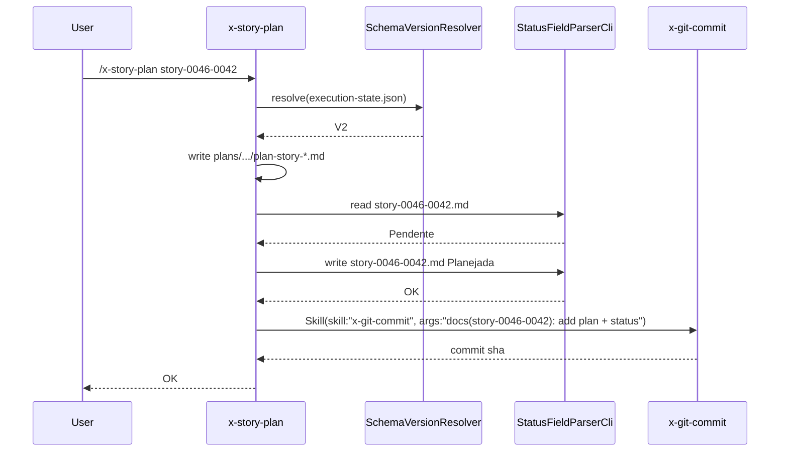

# História: Planning status propagation nas 7 skills de planejamento

**ID:** story-0046-0002
**Chave Jira:** —
**Status:** Pendente

## 1. Dependências

| Blocked By | Blocks |
| :--- | :--- |
| story-0046-0001 | story-0046-0007 |

## 2. Regras Transversais Aplicáveis

| ID | Título |
| :--- | :--- |
| RULE-046-01 | Source-of-truth invariant |
| RULE-046-02 | Planning updates status |
| RULE-046-06 | Clean workdir invariant |
| RULE-046-08 | Fail loud on status update failure |

## 3. Descrição

Como **Orquestrador de Planejamento (usuário do `x-epic-decompose`, `x-story-plan`, etc.)**, eu quero que as skills de planejamento atualizem automaticamente o campo `**Status:**` do artefato-fonte (story, task, epic) de `Pendente` para `Planejada` no MESMO commit em que geram o plan artefact, garantindo que um observador que lê apenas o markdown saiba que o DoR foi alcançado sem consultar `execution-state.json`.

Esta story retrofita 7 SKILL.md: `x-story-plan`, `x-task-plan`, `x-arch-plan`, `x-test-plan`, `x-epic-create`, `x-epic-decompose`, `x-epic-map`. Cada retrofit é um bloco adicional no SKILL.md que, após gravar o plan artefact, invoca `StatusFieldParser.writeStatus` (via um helper Java + Skill tool delegation) e stage do artefato-fonte junto com o plan artefact antes do commit único. A story NÃO introduz commit adicional — status update é stageado com o plan.

### 3.1 Contrato por skill

| Skill | Artefato-fonte | Plan artefact produzido | Coluna do map atualizada |
| :--- | :--- | :--- | :--- |
| `x-story-plan` | `story-XXXX-YYYY.md` | `plans/epic-XXXX/plans/plan-story-*.md`, `tasks-story-*.md`, `dor-story-*.md` | `implementation-map` coluna Planejamento |
| `x-task-plan` | `task-TASK-XXXX-YYYY-NNN.md` (v2) ou seção na story | `plans/epic-XXXX/plans/plan-task-*.md` | `task-implementation-map-STORY-*.md` coluna Planejamento |
| `x-arch-plan` | `story-XXXX-YYYY.md` associada | `plans/epic-XXXX/plans/arch-story-*.md` | — (planning column já cuidada por `x-story-plan`) |
| `x-test-plan` | `story-XXXX-YYYY.md` associada | `plans/epic-XXXX/plans/tests-story-*.md` | — |
| `x-epic-create` | — (cria epic do zero) | `plans/epic-XXXX/epic-XXXX.md` com `**Status:** Em Refinamento` | — |
| `x-epic-decompose` | — (cria epic + stories) | epic + stories (todos `Pendente`) + `implementation-map` | coluna Planejamento com `{{PLANNING_STATUS}}` substituído por `Pendente` |
| `x-epic-map` | `story-*.md` (lê, não altera) | `implementation-map-XXXX.md` | cria/atualiza colunas Planejamento + Status |

### 3.2 Invocação Rule 13 Pattern 1 INLINE-SKILL

Cada retrofit adiciona ao SKILL.md um bloco no final da Phase que gera o plan artefact:

```
After writing the plan artefact, update the source artifact status:
1. Read the current status via StatusFieldParser (Bash-backed helper)
2. Validate transition Pendente → Planejada via LifecycleTransitionMatrix
3. Write new status atomically
4. Stage the source artefact alongside the plan artefact
5. Invoke x-git-commit via the Skill tool with both files staged:
   Skill(skill: "x-git-commit", args: "docs(story-XXXX-YYYY): add plan + update status to Planejada")

If any step fails with STATUS_SYNC_FAILED, abort the skill with exit != 0.
```

### 3.3 V2-gated

Todo o bloco é condicional a `SchemaVersionResolver.resolve() == V2`. Em épicos v1 (legados), skip silencioso do status update (Rule 19).

## 3.5 Entrega de Valor

- **Valor Principal:** Plan skills passam a atualizar `**Status:** Pendente → Planejada` automaticamente no commit do plan. Operador sabe, olhando só o markdown, que a story/task/epic está pronta para execução. Elimina divergência entre plan gerado e Status exibido.
- **Métrica de Sucesso:** Após `x-story-plan story-XXXX-YYYY` em épico v2, `git diff HEAD~1 story-XXXX-YYYY.md` mostra `**Status:** Pendente` → `Planejada`; `implementation-map` coluna Planejamento atualizada; commit único inclui ambos arquivos.
- **Impacto no Negócio:** Observabilidade direta do estado do planejamento sem depender de execution-state.json. Reduz tempo de leitura contextual de "qual o próximo passo desta story?".

## 4. Definições de Qualidade Locais

### DoR Local (Definition of Ready)

- [ ] Story 0046-0001 merged em develop (helpers disponíveis)
- [ ] `StatusFieldParser` e `LifecycleTransitionMatrix` importáveis de `dev.iadev.application.lifecycle`
- [ ] Decisão: exposição do parser para SKILL.md via subagent Bash wrapper OU helper Java invocado por `x-task-implement` durante TDD? → Bash wrapper simples (`java -cp ... StatusFieldParserCli read/write <file>`)

### DoD Local (Definition of Done)

- [ ] 7 SKILL.md retrofitadas com o bloco de status update
- [ ] Cada retrofit é V2-gated (via checagem de `execution-state.json`)
- [ ] Golden diff regenerado para as 7 SKILL.md
- [ ] Clean-workdir integration test por skill (sandbox): roda skill toy, verifica `git status --porcelain` vazio
- [ ] Fail-loud test: injetar arquivo fonte inexistente, assert exit STATUS_SYNC_FAILED
- [ ] Smoke test: rodar `x-story-plan` em épico toy v2, verificar status propagado + commit único

### Global Definition of Done (DoD)

- **Cobertura:** ≥ 95% Line (helpers já na 0001), ≥ 90% Branch
- **Testes Automatizados:** 7 golden diffs + integration tests + fail-loud test + smoke
- **Documentação:** CHANGELOG entry
- **Persistência:** Reusa `StatusFieldParser` (atomic)
- **Performance:** Overhead ~5ms por skill

## 5. Contratos de Dados (Data Contract)

### 5.1 CLI wrapper `StatusFieldParserCli`

```
java -cp target/ia-dev-env.jar dev.iadev.application.lifecycle.StatusFieldParserCli \
    read <file>                     # prints status or "NONE"; exit 0 or 20
java -cp target/ia-dev-env.jar dev.iadev.application.lifecycle.StatusFieldParserCli \
    write <file> <Pendente|Planejada|Em Andamento|Concluída|Falha|Bloqueada>
                                    # exit 0 on success, 20 on STATUS_SYNC_FAILED, 40 on STATUS_TRANSITION_INVALID
```

### 5.2 Error codes

| Exit | Nome | Condição |
| :--- | :--- | :--- |
| 0 | OK | Status lido/escrito com sucesso |
| 20 | STATUS_SYNC_FAILED | Arquivo ausente, regex não casa, write failure |
| 40 | STATUS_TRANSITION_INVALID | Transição violou `LifecycleTransitionMatrix` |

## 6. Diagramas

### 6.1 Fluxo x-story-plan com status propagation



## 7. Critérios de Aceite (Gherkin)

```gherkin
Cenario: Plan em épico v1 não altera Status (backward compat)
  DADO um épico v1 sem planningSchemaVersion ou com "1.0"
  QUANDO /x-story-plan story-0020-0001 é invocado
  ENTÃO o plan artefact é gerado
  E o campo **Status:** da story permanece inalterado
  E nenhum log de STATUS_SYNC é emitido

Cenario: Plan em épico v2 happy path
  DADO um épico v2 com story-0046-0042 em **Status:** Pendente
  QUANDO /x-story-plan story-0046-0042 é invocado
  ENTÃO o plan artefact é gerado em plans/epic-0046/plans/plan-story-0046-0042.md
  E o campo **Status:** de story-0046-0042.md muda para Planejada
  E a coluna Planejamento do implementation-map é atualizada para Planejada
  E um único commit inclui ambos arquivos

Cenario: Plan falha por arquivo-fonte ausente (fail loud)
  DADO que story-0046-0099.md não existe
  QUANDO /x-story-plan story-0046-0099 é invocado
  ENTÃO a skill aborta com exit STATUS_SYNC_FAILED
  E stderr contém o path esperado

Cenario: Plan re-rodada em story já Planejada (idempotency)
  DADO story-0046-0042 em **Status:** Planejada
  QUANDO /x-story-plan story-0046-0042 é re-invocado
  ENTÃO a skill regenera o plan artefact
  E o **Status:** permanece Planejada (LifecycleTransitionMatrix.isAllowed(PLANEJADA, PLANEJADA) é false, mas skill detecta no-op)
  E nenhum novo commit de Status é criado (apenas o commit do plan atualizado)

Cenario: Clean workdir invariant após skill (boundary)
  DADO um épico v2 limpo
  QUANDO /x-story-plan story-0046-0042 roda até fim
  ENTÃO git status --porcelain retorna vazio
```

### 7.1 Scenario Ordering (TPP)

Degenerate (v1 backward compat) → happy → error → idempotency → boundary.

### 7.2 Mandatory Scenario Categories

- [x] Degenerate (v1 épico — no-op)
- [x] Happy path (v2 retrofit funciona)
- [x] Error (arquivo fonte ausente)
- [x] Boundary (clean workdir invariant)

### 7.3 TDD Implementation Notes

- Acceptance test: "Plan em épico v2 happy path" é o outer loop — testa end-to-end uma skill retrofitada (escolher `x-story-plan` como skill canônica).
- Inner loop: unit tests do CLI wrapper + integration test por skill retrofitada.

## 8. Tasks

### TASK-0046-0002-001: CLI wrapper StatusFieldParserCli

- **Layer:** Adapter
- **Test Type:** Unit + Integration
- **Size:** M
- **Dependencies:** —
- **Branch:** `feat/task-0046-0002-001-parser-cli`
- **Testability:** INDEPENDENT
- **Files:**
  - `java/src/main/java/dev/iadev/adapter/inbound/cli/StatusFieldParserCli.java`
  - `java/src/test/java/dev/iadev/adapter/inbound/cli/StatusFieldParserCliTest.java`
- **Acceptance Criteria:**
  - [ ] Subcomandos `read` e `write` com exit codes corretos
  - [ ] ≥ 95% coverage

### TASK-0046-0002-002: Retrofit x-story-plan

- **Layer:** Doc
- **Test Type:** Verification + Integration
- **Size:** M
- **Dependencies:** TASK-0046-0002-001
- **Branch:** `feat/task-0046-0002-002-retrofit-story-plan`
- **Testability:** INDEPENDENT
- **Files:**
  - `java/src/main/resources/targets/claude/skills/core/plan/x-story-plan/SKILL.md`
  - Golden regen
  - `java/src/test/java/dev/iadev/smoke/StoryPlanSmokeTest.java`
- **Acceptance Criteria:**
  - [ ] Bloco de status update V2-gated adicionado
  - [ ] Smoke test em sandbox v2 prova status + commit

### TASK-0046-0002-003: Retrofit x-task-plan

- **Layer:** Doc
- **Test Type:** Verification + Integration
- **Size:** M
- **Dependencies:** TASK-0046-0002-001
- **Branch:** `feat/task-0046-0002-003-retrofit-task-plan`
- **Testability:** INDEPENDENT
- **Files:**
  - `java/src/main/resources/targets/claude/skills/core/plan/x-task-plan/SKILL.md`
  - Golden regen
  - Smoke test
- **Acceptance Criteria:**
  - [ ] Bloco V2-gated adicionado
  - [ ] Smoke test verde

### TASK-0046-0002-004: Retrofit x-arch-plan + x-test-plan

- **Layer:** Doc
- **Test Type:** Verification
- **Size:** M
- **Dependencies:** TASK-0046-0002-001
- **Branch:** `feat/task-0046-0002-004-retrofit-arch-test`
- **Testability:** INDEPENDENT
- **Files:**
  - `java/src/main/resources/targets/claude/skills/core/plan/x-arch-plan/SKILL.md`
  - `java/src/main/resources/targets/claude/skills/core/test/x-test-plan/SKILL.md`
  - Golden regen
- **Acceptance Criteria:**
  - [ ] Ambas skills ganham bloco (idempotente em status — se já Planejada, no-op)

### TASK-0046-0002-005: Retrofit x-epic-create + x-epic-decompose + x-epic-map

- **Layer:** Doc
- **Test Type:** Verification + Integration
- **Size:** L
- **Dependencies:** TASK-0046-0002-001
- **Branch:** `feat/task-0046-0002-005-retrofit-epic-skills`
- **Testability:** INDEPENDENT
- **Files:**
  - `java/src/main/resources/targets/claude/skills/core/plan/x-epic-create/SKILL.md`
  - `java/src/main/resources/targets/claude/skills/core/plan/x-epic-decompose/SKILL.md`
  - `java/src/main/resources/targets/claude/skills/core/plan/x-epic-map/SKILL.md`
  - Golden regen
  - Smoke test `EpicDecomposeSmokeTest`
- **Acceptance Criteria:**
  - [ ] `x-epic-map` substitui `{{PLANNING_STATUS}}` por valor real
  - [ ] Smoke end-to-end: decompose + story-plan → `implementation-map` com colunas corretas

### TASK-0046-0002-006: Fail-loud + clean-workdir integration tests

- **Layer:** Test
- **Test Type:** Integration
- **Size:** M
- **Dependencies:** TASK-0046-0002-002, TASK-0046-0002-005
- **Branch:** `feat/task-0046-0002-006-integration-tests`
- **Testability:** INDEPENDENT
- **Files:**
  - `java/src/test/java/dev/iadev/smoke/PlanningStatusFailLoudTest.java`
  - `java/src/test/java/dev/iadev/smoke/PlanningCleanWorkdirTest.java`
- **Acceptance Criteria:**
  - [ ] Fail-loud: remove story file e roda x-story-plan → exit 20
  - [ ] Clean-workdir: roda em sandbox e assert `git status --porcelain` vazio
