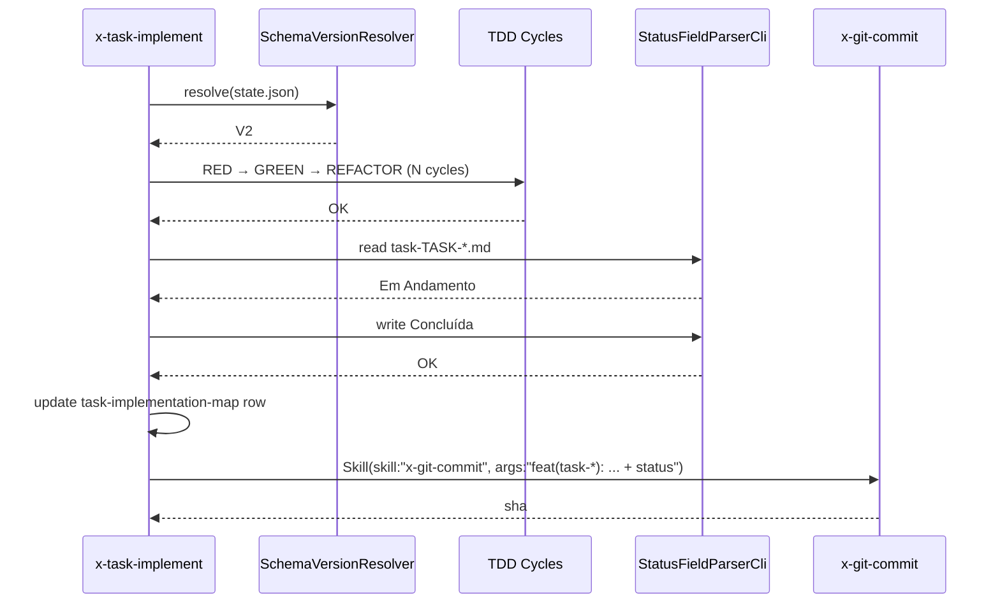

# História: Task-level end-of-life status em x-task-implement

**ID:** story-0046-0003
**Chave Jira:** —
**Status:** Concluída

## 1. Dependências

| Blocked By | Blocks |
| :--- | :--- |
| story-0046-0001 | story-0046-0007 |

## 2. Regras Transversais Aplicáveis

| ID | Título |
| :--- | :--- |
| RULE-046-01 | Source-of-truth invariant |
| RULE-046-03 | Implementation updates status |
| RULE-046-04 | Status transition is non-skippable |
| RULE-046-06 | Clean workdir invariant |
| RULE-046-08 | Fail loud on status update failure |

## 3. Descrição

Como **Desenvolvedor usando `x-task-implement`**, eu quero que, ao final do último ciclo TDD de uma task (commit atômico final), o campo `**Status:**` do `task-TASK-XXXX-YYYY-NNN.md` transicione para `Concluída` e a row correspondente do `task-implementation-map-STORY-*.md` seja atualizada, tudo no mesmo commit atômico, garantindo que `git show <task-commit>` já reflita o estado final e que Rule 18 (atomic task commits) continue sendo respeitada.

Esta story retrofita APENAS `x-task-implement` SKILL.md. O status update acontece ANTES do único commit da task (stageado junto com os artefatos do TDD), preservando Rule 18 "exatamente 1 commit por task". V2-gated via `SchemaVersionResolver`.

### 3.1 Ponto de inserção

No Core Loop v2 de `x-task-implement`, após o REFACTOR final e antes do `Skill(skill: "x-git-commit", ...)`:

```
Phase 3 (v2): Verify declared outputs (Rule 16)
Phase 3.5 (NEW): Status transition
  - Read task file via StatusFieldParserCli
  - Validate transition Em Andamento → Concluída (or Planejada → Concluída)
  - Write new status atomically
  - Update task-implementation-map-STORY-*.md row (coluna Status)
  - Stage both files alongside the TDD artefacts
Phase 4: Atomic commit via x-git-commit
```

### 3.2 Coalesced tasks (Rule 15 + 18)

Para tasks COALESCED, os DOIS task files (partner A + partner B) têm Status atualizado e ambos rows do task-map são atualizados no MESMO commit (que já é compartilhado por Rule 18).

### 3.3 V2-gated

- Task-level status sync é V2-only. Épicos v1 (schema v1 ou ausente) não têm arquivos `task-TASK-*.md` separados — usam seções na story. Skip silencioso.

## 3.5 Entrega de Valor

- **Valor Principal:** `git show <task-commit>` mostra imediatamente task concluída (Status: Concluída) + row do map atualizada, junto com os artefatos TDD. Revisores do PR veem o ciclo completo em 1 commit.
- **Métrica de Sucesso:** Após `x-task-implement TASK-0046-0042-003` em épico v2, o commit final contém: (a) arquivos produzidos pelo TDD; (b) `task-TASK-0046-0042-003.md` com `**Status:** Concluída`; (c) row do `task-implementation-map-STORY-0046-0042.md` com Status=Concluída. `git show <sha>` confirma.
- **Impacto no Negócio:** Bisect-ability preservada (Rule 18); rastreabilidade task↔commit fortalecida; integração com telemetria `execution-state.json` bidirecional (markdown refletiu o que já estava em state.json).

## 4. Definições de Qualidade Locais

### DoR Local (Definition of Ready)

- [ ] Story 0046-0001 merged
- [ ] Story 0046-0002 merged OU paralelizada (story 0003 não depende de 0002)
- [ ] `StatusFieldParserCli` disponível no classpath

### DoD Local (Definition of Done)

- [ ] `x-task-implement` SKILL.md retrofitado com Phase 3.5 (status transition)
- [ ] Golden diff regenerado
- [ ] Smoke test: sandbox v2, rodar task toy, verificar commit único contém TDD + status + map row
- [ ] Coalesced test: partner A + B → 1 commit com ambos status atualizados
- [ ] Fail-loud: task file renomeado durante execução → exit STATUS_SYNC_FAILED
- [ ] Clean-workdir test
- [ ] Rule 18 não regredida: contar commits produzidos = 1 por task

### Global Definition of Done (DoD)

- **Cobertura:** ≥ 95% Line, ≥ 90% Branch (helpers já cobertos)
- **Testes Automatizados:** golden diff + smoke + coalesced + fail-loud + clean-workdir + Rule 18 audit
- **Documentação:** CHANGELOG entry
- **Persistência:** Atomic write (já garantido pelo Parser)
- **Performance:** Adiciona ~10ms ao final da task

## 5. Contratos de Dados (Data Contract)

### 5.1 Task implementation map row (atualização)

Before:
```
| TASK-0046-0042-003 | ... | Em Andamento |
```

After:
```
| TASK-0046-0042-003 | ... | Concluída |
```

Transição detectável por regex na linha da tabela: `(^\| TASK-XXXX-YYYY-NNN \|[^|]*\|)[^|]*(\|)` — substitui o valor entre os últimos dois pipes.

### 5.2 Commit message canônica

```
feat(task-0046-0042-003): <description>

- TDD cycles: 3 RED → 3 GREEN → 1 REFACTOR
- Status: Em Andamento → Concluída
- Map row updated: task-implementation-map-STORY-0046-0042.md

Refs: plans/epic-0046/plans/task-TASK-0046-0042-003.md
```

## 6. Diagramas

### 6.1 Fluxo task-level end-of-life



## 7. Critérios de Aceite (Gherkin)

```gherkin
Cenario: Task em épico v1 não altera Status (backward compat)
  DADO um épico v1 sem task files separados
  QUANDO /x-task-implement é invocado via seção de story
  ENTÃO o fluxo legacy roda normalmente
  E nenhum Status de task é atualizado

Cenario: Task v2 happy path termina com Status Concluída
  DADO um épico v2 com task-TASK-0046-0042-003.md em **Status:** Em Andamento
  QUANDO /x-task-implement TASK-0046-0042-003 completa todos os ciclos TDD
  ENTÃO o **Status:** transiciona para Concluída
  E a row do task-implementation-map-STORY-0046-0042.md coluna Status vira Concluída
  E UM único commit atômico contém: artefatos TDD + task-TASK-*.md + map

Cenario: Task COALESCED (Rule 15) atualiza ambos partners
  DADO TASK-0046-0042-003 e TASK-0046-0042-004 COALESCED
  QUANDO ambas executam no mesmo worktree
  ENTÃO UM commit com "Coalesces-with" footer contém Status Concluída em AMBOS task files
  E Rule 18 não é violada (1 commit para o par)

Cenario: Task file ausente no momento do status update (fail loud)
  DADO task-TASK-0046-0042-003.md foi deletado durante a execução
  QUANDO x-task-implement tenta Phase 3.5
  ENTÃO a skill aborta com exit STATUS_SYNC_FAILED
  E stderr contém o caminho da task

Cenario: Clean workdir após task (boundary)
  DADO uma task v2 toy
  QUANDO x-task-implement roda até o final
  ENTÃO git status --porcelain retorna vazio

Cenario: Rule 18 preserved — exactly 1 commit per task
  DADO um épico v2 com 3 tasks independentes
  QUANDO x-task-implement roda para cada uma
  ENTÃO cada task produz EXATAMENTE 1 commit
  E nenhum commit intermediário "status update only" foi criado
```

### 7.1 Scenario Ordering (TPP)

Degenerate (v1) → happy → coalesced → error → boundary → invariant.

### 7.2 Mandatory Scenario Categories

- [x] Degenerate (v1 bypass)
- [x] Happy path
- [x] Error (file missing)
- [x] Boundary (clean workdir + Rule 18 preservation)

### 7.3 TDD Implementation Notes

- Acceptance test: "Task v2 happy path termina com Status Concluída" drives outer loop.
- Inner loop: unit tests para a função de substituição de row no map (regex).

## 8. Tasks

### TASK-0046-0003-001: Helper Java para row-update no task-implementation-map

- **Layer:** Application
- **Test Type:** Unit
- **Size:** M
- **Dependencies:** —
- **Branch:** `feat/task-0046-0003-001-map-row-updater`
- **Testability:** INDEPENDENT
- **Files:**
  - `java/src/main/java/dev/iadev/application/lifecycle/TaskMapRowUpdater.java`
  - `java/src/test/java/dev/iadev/application/lifecycle/TaskMapRowUpdaterTest.java`
- **Acceptance Criteria:**
  - [ ] Regex substitui coluna Status da row correta (match por TASK-ID)
  - [ ] Idempotente: rodar 2× na mesma row = mesmo resultado
  - [ ] ≥ 95% coverage

### TASK-0046-0003-002: CLI wrapper TaskMapRowUpdaterCli

- **Layer:** Adapter
- **Test Type:** Integration
- **Size:** S
- **Dependencies:** TASK-0046-0003-001
- **Branch:** `feat/task-0046-0003-002-map-row-cli`
- **Testability:** INDEPENDENT
- **Files:**
  - `java/src/main/java/dev/iadev/adapter/inbound/cli/TaskMapRowUpdaterCli.java`
  - `java/src/test/java/dev/iadev/adapter/inbound/cli/TaskMapRowUpdaterCliTest.java`
- **Acceptance Criteria:**
  - [ ] CLI subcomando `update <map-file> <TASK-ID> <new-status>`
  - [ ] Exit codes alinhados com `StatusFieldParserCli` (0/20/40)

### TASK-0046-0003-003: Retrofit x-task-implement Phase 3.5

- **Layer:** Doc
- **Test Type:** Verification + Integration
- **Size:** M
- **Dependencies:** TASK-0046-0003-002
- **Branch:** `feat/task-0046-0003-003-retrofit-task-implement`
- **Testability:** INDEPENDENT
- **Files:**
  - `java/src/main/resources/targets/claude/skills/core/dev/x-task-implement/SKILL.md`
  - Golden regen
  - `java/src/test/java/dev/iadev/smoke/TaskImplementStatusSmokeTest.java`
- **Acceptance Criteria:**
  - [ ] Phase 3.5 adicionada entre Phase 3 (outputs verify) e Phase 4 (commit)
  - [ ] V2-gated
  - [ ] Smoke end-to-end: task toy v2 → Status Concluída + map row + 1 commit

### TASK-0046-0003-004: Coalesced pair integration test

- **Layer:** Test
- **Test Type:** Integration
- **Size:** M
- **Dependencies:** TASK-0046-0003-003
- **Branch:** `feat/task-0046-0003-004-coalesced-test`
- **Testability:** INDEPENDENT
- **Files:**
  - `java/src/test/java/dev/iadev/smoke/CoalescedTaskStatusTest.java`
- **Acceptance Criteria:**
  - [ ] Cria 2 task files COALESCED em sandbox
  - [ ] Roda x-task-implement para o par
  - [ ] Assert 1 commit com Status Concluída em ambos + Coalesces-with footer

### TASK-0046-0003-005: Fail-loud + Rule 18 audit tests

- **Layer:** Test
- **Test Type:** Integration
- **Size:** M
- **Dependencies:** TASK-0046-0003-003
- **Branch:** `feat/task-0046-0003-005-failmode-tests`
- **Testability:** INDEPENDENT
- **Files:**
  - `java/src/test/java/dev/iadev/smoke/TaskStatusFailLoudTest.java`
  - `java/src/test/java/dev/iadev/smoke/TaskAtomicCommitAuditTest.java`
- **Acceptance Criteria:**
  - [ ] Fail-loud test cobre: task file ausente, map file ausente, transição inválida
  - [ ] Rule 18 audit: 3 tasks toy → 3 commits (count exato)
