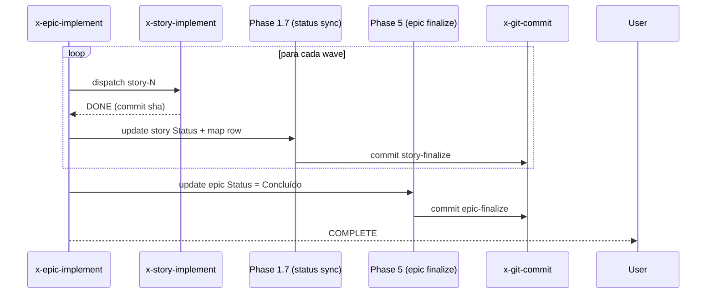

# História: Story/Epic end-of-life status — Phase 3 unskippable + Phase 1.7 cabeada no Core Loop

**ID:** story-0046-0004
**Chave Jira:** —
**Status:** Pendente

## 1. Dependências

| Blocked By | Blocks |
| :--- | :--- |
| story-0046-0001 | story-0046-0007 |

## 2. Regras Transversais Aplicáveis

| ID | Título |
| :--- | :--- |
| RULE-046-01 | Source-of-truth invariant |
| RULE-046-03 | Implementation updates status |
| RULE-046-04 | Status transition is non-skippable |
| RULE-046-06 | Clean workdir invariant |
| RULE-046-08 | Fail loud on status update failure |

## 3. Descrição

Como **Operador de `x-epic-implement` / `x-story-implement`**, eu quero garantias de que (a) `x-story-implement` Phase 3 ("Final Verification + Cleanup", atualmente skippable via `--skip-verification`) sempre executa o status update no caminho happy, e (b) `x-epic-implement` Seção 1.6b ("Markdown Status Sync", hoje órfã do Core Loop) seja promovida a Phase 1.7 e cabeada explicitamente no Core Loop, garantindo que ao final de cada wave/story e ao final do épico os campos `**Status:**` da story e do epic propagam para `Concluída` / `Concluído` e a coluna Status do `implementation-map` reflita o estado.

Esta story retrofita 2 SKILL.md: `x-story-implement` e `x-epic-implement`. O foco é "wiring": fazer o que JÁ está documentado entrar no caminho happy + proibir a flag opt-out.

### 3.1 Retrofit x-story-implement

- Phase 3 passa a ser obrigatória. O parâmetro `--skip-verification` é REMOVIDO do Core Loop; a flag pode ainda ser aceita mas produz WARN + documenta que ela só vale para `--dry-run` ou modo recovery (ver RULE-046-04).
- Dentro da Phase 3:
  - Step 3.8 (Final Verification + Cleanup) ganha sub-steps explícitos:
    - 3.8.1: read story-XXXX-YYYY.md Status
    - 3.8.2: validateTransition(Em Andamento, Concluída)
    - 3.8.3: writeStatus(Concluída)
    - 3.8.4: update `implementation-map-XXXX.md` coluna Status
    - 3.8.5: stage + invoke `Skill(skill: "x-git-commit", args: "docs(story-*): finalize status")`
- Fail-loud em cada step: exit STATUS_SYNC_FAILED se algo falhar.
- V2-gated.

### 3.2 Retrofit x-epic-implement

- Section 1.6b é renomeada para **Phase 1.7** e cabeada ao Core Loop explicitamente (após Phase 1.6 checkpoint).
- Phase 1.7 executa após cada wave (para cada story da wave: update story Status + map row).
- Nova **Phase 5** (ao final do épico, pós último wave): atualiza `epic-XXXX.md` `**Status:** Em Refinamento → Concluído` + coluna Planejamento/Status final.
- V2-gated.

### 3.3 Ponto-chave

Esta story é 90% textual (SKILL.md diff). A infraestrutura (helpers, CLI) já existe nas stories 0046-0001 e 0046-0002/0003. A entrega é fazer o fluxo DOCUMENTADO virar COMPORTAMENTO EXECUTADO.

## 3.5 Entrega de Valor

- **Valor Principal:** Histórias e épicos concluídos passam a refletir seu estado real no markdown e no map. A falha que afetou EPIC-0024 (16 stories SUCCESS em state.json mas "Pendente" nos markdowns) deixa de existir para épicos v2 dali em diante.
- **Métrica de Sucesso:** Após `x-epic-implement 0046` em épico v2, (a) todas as stories têm `**Status:** Concluída`; (b) epic file tem `**Status:** Concluído`; (c) `implementation-map` coluna Status preenchida; (d) `git status --porcelain` vazio. Smoke test valida.
- **Impacto no Negócio:** Observabilidade end-to-end do ciclo SDD. PR de epic-closing tem diff claro mostrando o passo final de cada story + epic. Reduz surpresas no `x-release`.

## 4. Definições de Qualidade Locais

### DoR Local (Definition of Ready)

- [ ] Story 0046-0001 merged (helpers + CLI)
- [ ] `TaskMapRowUpdaterCli` disponível (output da story 0046-0003) OU helper análogo para `implementation-map-XXXX.md` (não task-map) extraído desta story

### DoD Local (Definition of Done)

- [ ] `x-story-implement` SKILL.md retrofitado: Phase 3 sempre executa; `--skip-verification` documentada como "recovery only, NEVER use in happy path"
- [ ] `x-epic-implement` SKILL.md retrofitado: Phase 1.7 (de 1.6b) referenciada explicitamente no Core Loop; Phase 5 (epic finalization) adicionada
- [ ] Golden diff regenerado para ambas skills
- [ ] Smoke test: sandbox v2 épico toy com 2 stories, roda `x-epic-implement` → todos os Status propagam + commit final de epic-closing
- [ ] Fail-loud: remove epic-XXXX.md durante a execução da Phase 5 → exit STATUS_SYNC_FAILED
- [ ] Clean-workdir test
- [ ] Audit: grep `--skip-verification` no Core Loop do SKILL.md retorna 0 matches

### Global Definition of Done (DoD)

- **Cobertura:** helpers já cobertos pelas stories anteriores; esta story foca em golden + integration
- **Testes Automatizados:** 2 goldens + smoke + fail-loud + clean-workdir + audit grep
- **Documentação:** CHANGELOG entry
- **Persistência:** reusa helpers atômicos
- **Performance:** overhead ~20ms por story + 10ms no epic closing

## 5. Contratos de Dados (Data Contract)

### 5.1 Epic finalization commit (Phase 5)

```
chore(epic-0046): finalize status to Concluído

- Epic Status: Em Refinamento → Concluído
- Implementation map columns updated for all stories

Refs: plans/epic-0046/epic-0046.md
```

### 5.2 Story finalization commit (Phase 3.8.5)

```
docs(story-0046-0042): finalize Status to Concluída

- Status transition: Em Andamento → Concluída
- implementation-map-0046.md row updated
```

## 6. Diagramas

### 6.1 x-epic-implement Core Loop com Phase 1.7



## 7. Critérios de Aceite (Gherkin)

```gherkin
Cenario: Épico v1 executa fluxo legacy (backward compat)
  DADO um épico v1 sem planningSchemaVersion
  QUANDO /x-epic-implement roda até o fim
  ENTÃO a Phase 1.7 e Phase 5 NÃO executam
  E nenhum Status é atualizado
  E o fluxo legacy termina normalmente

Cenario: Épico v2 happy path — story e epic concluídos
  DADO um épico v2 com 2 stories (v2)
  QUANDO /x-epic-implement completa ambas waves
  ENTÃO cada story tem **Status:** Concluída
  E implementation-map coluna Status = Concluída para ambas
  E epic-XXXX.md tem **Status:** Concluído
  E 3 commits existem: 2 de story-finalize + 1 de epic-finalize

Cenario: x-story-implement --skip-verification no happy path falha audit
  DADO x-story-implement executado com --skip-verification no Core Loop
  QUANDO LifecycleIntegrityAuditTest é executado (via story 0007)
  ENTÃO uma violation "SKIP_IN_HAPPY_PATH" é reportada
  (NOTA: esta story documenta; a detecção formal é na story 0007)

Cenario: Falha de status update no epic-finalize (fail loud)
  DADO epic-XXXX.md foi deletado durante o loop de waves
  QUANDO x-epic-implement chega na Phase 5
  ENTÃO a skill aborta com exit STATUS_SYNC_FAILED
  E stderr inclui o path do epic file

Cenario: Clean workdir após x-epic-implement (boundary)
  DADO um épico v2 toy
  QUANDO x-epic-implement roda até fim
  ENTÃO git status --porcelain retorna vazio

Cenario: Idempotência — re-rodar x-epic-implement em épico já concluído
  DADO um épico v2 já com **Status:** Concluído
  QUANDO /x-epic-implement é re-invocado
  ENTÃO o Core Loop detecta no-op (todos Status já Concluída)
  E nenhum novo commit é criado
```

### 7.1 Scenario Ordering (TPP)

Degenerate (v1) → happy → audit hook → error → boundary → idempotency.

### 7.2 Mandatory Scenario Categories

- [x] Degenerate (v1)
- [x] Happy path (v2 end-to-end)
- [x] Error (epic file missing)
- [x] Boundary (clean workdir + idempotency)

### 7.3 TDD Implementation Notes

- Acceptance test: "Épico v2 happy path — story e epic concluídos" drives outer loop.
- Inner loop: se houver helper novo para `implementation-map-XXXX.md` (map de épico, distinto do task-map), ele ganha unit tests em TPP.

## 8. Tasks

### TASK-0046-0004-001: EpicMapRowUpdater (coluna Status + Planejamento do map de épico)

- **Layer:** Application
- **Test Type:** Unit
- **Size:** M
- **Dependencies:** —
- **Branch:** `feat/task-0046-0004-001-epic-map-updater`
- **Testability:** INDEPENDENT
- **Files:**
  - `java/src/main/java/dev/iadev/application/lifecycle/EpicMapRowUpdater.java`
  - `java/src/test/java/dev/iadev/application/lifecycle/EpicMapRowUpdaterTest.java`
  - CLI wrapper `EpicMapRowUpdaterCli`
- **Acceptance Criteria:**
  - [ ] Regex robusto para row de `implementation-map-XXXX.md` (distinto do task-map)
  - [ ] ≥ 95% coverage

### TASK-0046-0004-002: Retrofit x-story-implement Phase 3 unskippable

- **Layer:** Doc
- **Test Type:** Verification + Integration
- **Size:** M
- **Dependencies:** TASK-0046-0004-001
- **Branch:** `feat/task-0046-0004-002-story-implement-unskippable`
- **Testability:** INDEPENDENT
- **Files:**
  - `java/src/main/resources/targets/claude/skills/core/dev/x-story-implement/SKILL.md`
  - Golden regen
  - `java/src/test/java/dev/iadev/smoke/StoryImplementFinalizeSmokeTest.java`
- **Acceptance Criteria:**
  - [ ] Phase 3 steps 3.8.1-3.8.5 documentados e invocados no Core Loop v2
  - [ ] `--skip-verification` marcada como "recovery only"
  - [ ] Smoke: story toy v2 → Status Concluída + map row + commit

### TASK-0046-0004-003: Retrofit x-epic-implement Phase 1.7 + Phase 5

- **Layer:** Doc
- **Test Type:** Verification + Integration
- **Size:** L
- **Dependencies:** TASK-0046-0004-001, TASK-0046-0004-002
- **Branch:** `feat/task-0046-0004-003-epic-implement-finalize`
- **Testability:** INDEPENDENT
- **Files:**
  - `java/src/main/resources/targets/claude/skills/core/dev/x-epic-implement/SKILL.md`
  - Golden regen
  - `java/src/test/java/dev/iadev/smoke/EpicImplementFinalizeSmokeTest.java`
- **Acceptance Criteria:**
  - [ ] Section 1.6b renomeada/referenciada como Phase 1.7 no Core Loop
  - [ ] Phase 5 (epic finalize) adicionada
  - [ ] Smoke end-to-end: épico toy v2 → todas stories + epic concluídos

### TASK-0046-0004-004: Fail-loud + clean-workdir + idempotency tests

- **Layer:** Test
- **Test Type:** Integration
- **Size:** M
- **Dependencies:** TASK-0046-0004-003
- **Branch:** `feat/task-0046-0004-004-finalize-edge-tests`
- **Testability:** INDEPENDENT
- **Files:**
  - `java/src/test/java/dev/iadev/smoke/EpicFinalizeFailLoudTest.java`
  - `java/src/test/java/dev/iadev/smoke/EpicFinalizeIdempotencyTest.java`
- **Acceptance Criteria:**
  - [ ] Fail-loud: epic file ausente → exit STATUS_SYNC_FAILED
  - [ ] Idempotency: re-roda → 0 novos commits
  - [ ] Clean-workdir no retorno
