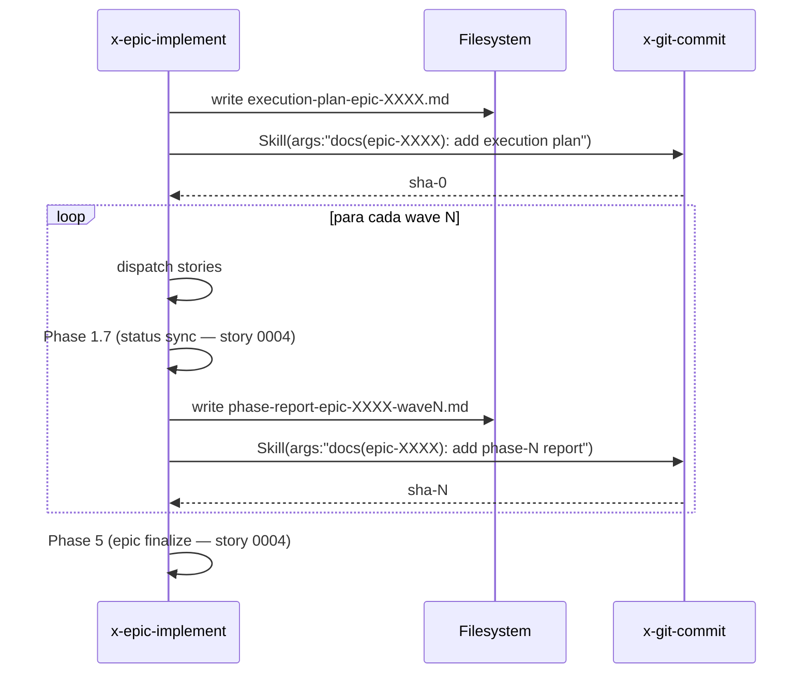

# História: Atomic commit dos reports de épico em x-epic-implement

**ID:** story-0046-0005
**Chave Jira:** —
**Status:** Concluída

## 1. Dependências

| Blocked By | Blocks |
| :--- | :--- |
| story-0046-0001 | story-0046-0007 |

## 2. Regras Transversais Aplicáveis

| ID | Título |
| :--- | :--- |
| RULE-046-01 | Source-of-truth invariant |
| RULE-046-05 | Reports are atomically committed |
| RULE-046-06 | Clean workdir invariant |
| RULE-046-08 | Fail loud on status update failure |

## 3. Descrição

Como **Release Manager**, eu quero que `x-epic-implement` invoque `x-git-commit` via Skill tool (Rule 13 Pattern 1) imediatamente após cada escrita em `plans/epic-XXXX/reports/`, eliminando a janela em que reports ficam órfãos no working tree e disparam falso-positivo na precondição `VALIDATE_DIRTY_WORKDIR` do `x-release` (SKILL.md:277-308).

Hoje `x-epic-implement/SKILL.md` escreve:
- `plans/epic-XXXX/reports/execution-plan-epic-XXXX.md` (linhas 220, 233, 264 aprox.)
- `plans/epic-XXXX/reports/phase-report-epic-XXXX.md` (linha 706 aprox.)

Ambas escritas NÃO são seguidas por `Skill(skill: "x-git-commit", ...)`. Esta story adiciona os commits atômicos logo após cada escrita, com mensagem conventional-commits (`docs(epic-XXXX): add execution plan` / `docs(epic-XXXX): add phase-N report`). V2-gated (épicos v1 continuam com comportamento legado — reports podem ou não existir).

### 3.1 Ponto de inserção 1: execution-plan

Na fase pré-execução do Core Loop v2:

```
Before entering the wave loop, if v2:
  - Write plans/epic-XXXX/reports/execution-plan-epic-XXXX.md
  - Stage it
  - Skill(skill: "x-git-commit", args: "docs(epic-XXXX): add execution plan")
```

### 3.2 Ponto de inserção 2: phase-report

Ao final de cada wave (após Phase 1.7 da story 0046-0004):

```
After each wave finishes:
  - Write plans/epic-XXXX/reports/phase-report-epic-XXXX-waveN.md
    (ou atualiza phase-report-epic-XXXX.md com a seção da wave)
  - Stage
  - Skill(skill: "x-git-commit", args: "docs(epic-XXXX): add phase-N report")
```

### 3.3 V2-gated

- Em épico v1, reports seguem sendo opcionais e não-commitados (Rule 19 — no regression).
- Em épico v2, reports são obrigatórios e commitados atomicamente.

### 3.4 Interação com story 0046-0004

Story 0046-0004 introduz Phase 1.7 (por-wave status sync) e Phase 5 (epic finalize). Esta story 0046-0005 adiciona commits de report ao redor dessas phases. Ordem canônica v2:

```
Wave N executes
→ Phase 1.7 (status sync por story) → commit docs(story-*)
→ Phase 1.8 (NEW: phase-report write + commit) → commit docs(epic-*)
→ próxima wave...
Phase 5 (epic finalize) → commit chore(epic-*)
```

## 3.5 Entrega de Valor

- **Valor Principal:** `x-release` deixa de falhar por `VALIDATE_DIRTY_WORKDIR` após execução de `x-epic-implement`. Release train desbloqueado — sem limpeza manual.
- **Métrica de Sucesso:** Smoke test: roda épico v2 toy → `x-release --dry-run` imediatamente após, sem limpeza manual → precondição `VALIDATE_DIRTY_WORKDIR` passa. Commits de report visíveis no git log entre commits de story.
- **Impacto no Negócio:** Tempo de release reduzido; eliminação de classe inteira de bugs ("esqueci de commitar os reports antes do release").

## 4. Definições de Qualidade Locais

### DoR Local (Definition of Ready)

- [ ] Story 0046-0001 merged
- [ ] Decisão sobre granularidade do phase-report: um arquivo por wave (`phase-report-epic-XXXX-wave1.md`) OU um arquivo append (`phase-report-epic-XXXX.md` com seções por wave)? → Preferência: UM arquivo per wave (clareza + granularidade de commit).

### DoD Local (Definition of Done)

- [ ] `x-epic-implement` SKILL.md retrofitado com commits após escrita de `execution-plan-*.md` e `phase-report-*-waveN.md`
- [ ] Golden diff regenerado
- [ ] Smoke test: épico v2 toy → git log mostra commits `docs(epic-XXXX): add execution plan` e `docs(epic-XXXX): add phase-N report`
- [ ] `x-release --dry-run` imediatamente após passa `VALIDATE_DIRTY_WORKDIR`
- [ ] Fail-loud: git commit rejeitado (ex.: hook falha) → exit REPORT_COMMIT_FAILED
- [ ] Clean-workdir test
- [ ] Rule 19 test: épico v1 toy → reports NÃO são commitados (comportamento legacy preservado)

### Global Definition of Done (DoD)

- **Cobertura:** Não há novo helper Java significativo; esta story é 100% SKILL.md diff + tests
- **Testes Automatizados:** golden diff + smoke (v2) + smoke (v1 no-op) + fail-loud + clean-workdir + x-release compat
- **Documentação:** CHANGELOG entry
- **Persistência:** atômica via `x-git-commit`
- **Performance:** overhead 1 commit por wave ≈ 100ms + 1 commit para execution plan = 200ms total

## 5. Contratos de Dados (Data Contract)

### 5.1 Commit messages canônicas

```
docs(epic-0046): add execution plan

- Waves: 3
- Stories: 7
- Schema: v2.0

Refs: plans/epic-0046/reports/execution-plan-epic-0046.md
```

```
docs(epic-0046): add phase-2 report

- Wave 2 complete: 5 stories DONE
- Commits: 5 story-finalize

Refs: plans/epic-0046/reports/phase-report-epic-0046-wave2.md
```

### 5.2 Error codes

| Exit | Nome | Condição |
| :--- | :--- | :--- |
| 0 | OK | Report escrito e commitado |
| 21 | REPORT_COMMIT_FAILED | `x-git-commit` retornou erro (hook, conflito, etc.) |

## 6. Diagramas

### 6.1 Fluxo v2 com commits atômicos de reports



## 7. Critérios de Aceite (Gherkin)

```gherkin
Cenario: Épico v1 não commita reports (backward compat)
  DADO um épico v1 sem planningSchemaVersion
  QUANDO /x-epic-implement roda até o fim
  ENTÃO reports (se gerados) NÃO são commitados automaticamente
  E comportamento legacy preservado (Rule 19)

Cenario: Épico v2 happy path — execution-plan + phase-reports commitados
  DADO um épico v2 com 2 waves (3 stories total)
  QUANDO /x-epic-implement completa
  ENTÃO git log mostra EM ORDEM:
    docs(epic-XXXX): add execution plan
    <commits de Wave 1>
    docs(epic-XXXX): add phase-1 report
    <commits de Wave 2>
    docs(epic-XXXX): add phase-2 report
    chore(epic-XXXX): finalize Status (da story 0046-0004)

Cenario: git status --porcelain vazio após x-epic-implement (boundary)
  DADO um épico v2 toy
  QUANDO x-epic-implement roda até fim
  ENTÃO git status --porcelain retorna vazio
  E x-release --dry-run executado imediatamente NÃO falha VALIDATE_DIRTY_WORKDIR

Cenario: Commit de report falha por pre-commit hook (fail loud)
  DADO um pre-commit hook que rejeita docs(epic-*) commits
  QUANDO x-epic-implement tenta commitar phase-report
  ENTÃO a skill aborta com exit REPORT_COMMIT_FAILED
  E stderr inclui o output do hook

Cenario: x-release compatibility — report committed → VALIDATE_DIRTY_WORKDIR passa
  DADO x-epic-implement acabou de rodar em épico v2
  QUANDO /x-release --dry-run é invocado
  ENTÃO a precondição VALIDATE_DIRTY_WORKDIR passa (exit 0 nesta check)
  E x-release prossegue para as checks seguintes
```

### 7.1 Scenario Ordering (TPP)

Degenerate (v1) → happy → boundary → error → integration.

### 7.2 Mandatory Scenario Categories

- [x] Degenerate (v1 no-op)
- [x] Happy path (v2 commits)
- [x] Error (commit failure)
- [x] Boundary (clean workdir + x-release compat)

### 7.3 TDD Implementation Notes

- Acceptance test: "Épico v2 happy path — execution-plan + phase-reports commitados" drives outer loop (rede mais ampla de integração).
- Inner loop: testes unitários do template de commit message (`ReportCommitMessageBuilder`) em TPP.

## 8. Tasks

### TASK-0046-0005-001: ReportCommitMessageBuilder helper

- **Layer:** Application
- **Test Type:** Unit
- **Size:** S
- **Dependencies:** —
- **Branch:** `feat/task-0046-0005-001-commit-msg-builder`
- **Testability:** INDEPENDENT
- **Files:**
  - `java/src/main/java/dev/iadev/application/lifecycle/ReportCommitMessageBuilder.java`
  - `java/src/test/java/dev/iadev/application/lifecycle/ReportCommitMessageBuilderTest.java`
- **Acceptance Criteria:**
  - [ ] Gera mensagens no formato `docs(epic-XXXX): add <type> report`
  - [ ] ≥ 95% coverage

### TASK-0046-0005-002: Retrofit x-epic-implement — execution-plan commit

- **Layer:** Doc
- **Test Type:** Verification + Integration
- **Size:** M
- **Dependencies:** TASK-0046-0005-001
- **Branch:** `feat/task-0046-0005-002-execution-plan-commit`
- **Testability:** INDEPENDENT
- **Files:**
  - `java/src/main/resources/targets/claude/skills/core/dev/x-epic-implement/SKILL.md`
  - Golden regen
  - `java/src/test/java/dev/iadev/smoke/ExecutionPlanCommitSmokeTest.java`
- **Acceptance Criteria:**
  - [ ] Bloco "Stage + commit execution-plan" adicionado pré-wave-loop (V2-gated)
  - [ ] Smoke: épico v2 → 1 commit docs(epic-*) antes dos commits de story

### TASK-0046-0005-003: Retrofit x-epic-implement — phase-report commits

- **Layer:** Doc
- **Test Type:** Verification + Integration
- **Size:** M
- **Dependencies:** TASK-0046-0005-002
- **Branch:** `feat/task-0046-0005-003-phase-report-commits`
- **Testability:** REQUIRES_MOCK of TASK-0046-0004-003 (precisa Phase 1.7 cabeada para ordenar corretamente)
- **Files:**
  - `java/src/main/resources/targets/claude/skills/core/dev/x-epic-implement/SKILL.md`
  - Smoke test `PhaseReportCommitsSmokeTest`
- **Acceptance Criteria:**
  - [ ] Bloco "Stage + commit phase-report" adicionado pós-wave (V2-gated)
  - [ ] Smoke verifica N commits `docs(epic-*): add phase-N report` = N waves

### TASK-0046-0005-004: x-release compatibility integration test

- **Layer:** Test
- **Test Type:** E2E
- **Size:** M
- **Dependencies:** TASK-0046-0005-003
- **Branch:** `feat/task-0046-0005-004-release-compat-test`
- **Testability:** INDEPENDENT
- **Files:**
  - `java/src/test/java/dev/iadev/smoke/EpicImplementReleaseCompatTest.java`
- **Acceptance Criteria:**
  - [ ] Sandbox: roda x-epic-implement v2 completo
  - [ ] Invoca x-release --dry-run
  - [ ] Assert VALIDATE_DIRTY_WORKDIR passa

### TASK-0046-0005-005: Fail-loud + Rule 19 compat tests

- **Layer:** Test
- **Test Type:** Integration
- **Size:** M
- **Dependencies:** TASK-0046-0005-003
- **Branch:** `feat/task-0046-0005-005-edge-tests`
- **Testability:** INDEPENDENT
- **Files:**
  - `java/src/test/java/dev/iadev/smoke/ReportCommitFailLoudTest.java`
  - `java/src/test/java/dev/iadev/smoke/EpicV1NoReportCommitTest.java`
- **Acceptance Criteria:**
  - [ ] Fail-loud: hook rejeita commit → exit REPORT_COMMIT_FAILED
  - [ ] Rule 19 compat: épico v1 → zero commits docs(epic-*) automáticos
