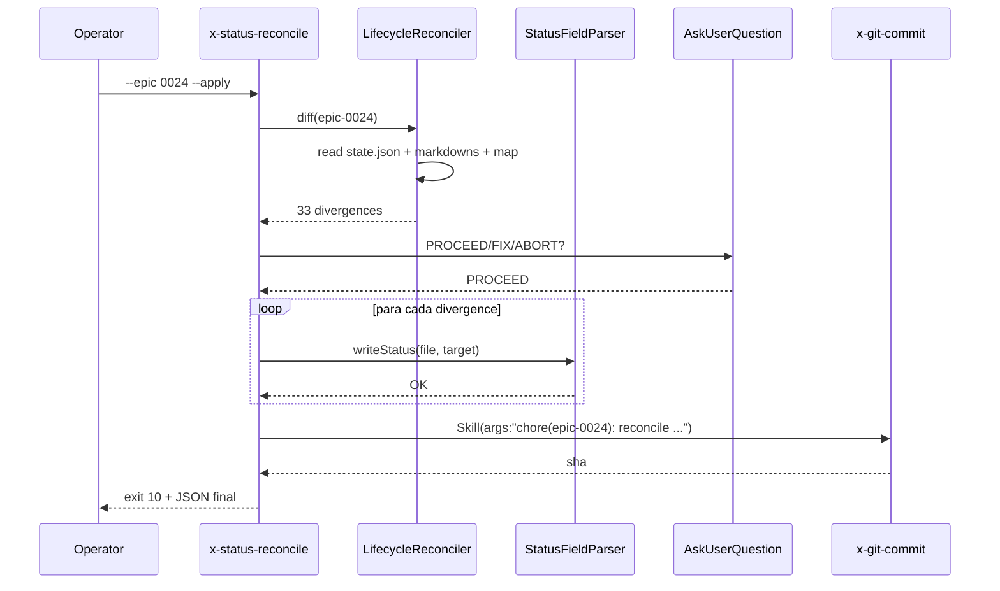

# História: Nova skill x-status-reconcile (opt-in diagnose + apply)

**ID:** story-0046-0006
**Chave Jira:** —
**Status:** Em Andamento

## 1. Dependências

| Blocked By | Blocks |
| :--- | :--- |
| story-0046-0001 | — |

## 2. Regras Transversais Aplicáveis

| ID | Título |
| :--- | :--- |
| RULE-046-01 | Source-of-truth invariant |
| RULE-046-06 | Clean workdir invariant (no modo --apply, após commit) |
| RULE-046-07 | Markdown é SoT; state.json é telemetria |
| RULE-046-08 | Fail loud on status update failure |

## 3. Descrição

Como **Operador responsável por épicos legados (ex.: EPIC-0024 com 16 stories concluídas porém markdown em "Pendente")**, eu quero uma skill `x-status-reconcile` em `core/ops/` que leia `plans/epic-XXXX/execution-state.json` e compare com os campos `**Status:**` dos markdowns e com a coluna Status do `implementation-map`, reportando divergências; e opcionalmente, com `--apply`, aplique correções nos markdowns + commite via `x-git-commit`, respeitando gate interativo (reusa EPIC-0043 `PROCEED/FIX/ABORT` quando disponível) e nunca modificando `execution-state.json` (Rule 19 + RULE-046-07).

Esta story NÃO modifica comportamento de outras skills. Ela adiciona uma ferramenta opt-in para recuperação manual. Pode rodar em épicos v1 e v2 — em v1 respeita Rule 19 (não força upgrade).

### 3.1 Dois modos de operação

**Modo diagnose (default):** Lê state.json + markdowns, imprime tabela de divergências, exit 0.

```
$ /x-status-reconcile --epic 0024
Divergence report for epic 0024:
  story-0024-0001.md: checkpoint=SUCCESS markdown=Pendente  → suggest: Concluída
  story-0024-0002.md: checkpoint=SUCCESS markdown=Pendente  → suggest: Concluída
  ...
  implementation-map: 16/16 rows stale
  epic-0024.md:      checkpoint=COMPLETE markdown=Em Refinamento → suggest: Concluído

Total divergences: 33
Exit code: 0 (diagnose mode)
Tip: run with --apply to reconcile.
```

**Modo apply:** Após diagnose, apresenta gate interativo (via `AskUserQuestion` ou `--non-interactive` para CI), atualiza markdowns atomicamente via `StatusFieldParser`, invoca `x-git-commit`. Exit 10 (`APPLIED`) em sucesso.

### 3.2 Escopo por arg

- `--epic XXXX` → épico inteiro
- `--story story-XXXX-YYYY` → apenas uma story
- `--dry-run` → força diagnose mesmo com `--apply`

### 3.3 Error handling

- state.json ausente → exit 30 (`STATE_FILE_INVALID`)
- Transição suspeita (ex.: markdown=Concluída mas state.json=PENDING) → exit 40 (`STATUS_TRANSITION_INVALID`) — operador deve investigar
- Épico v1 → imprime "legacy epic; skipping sync per Rule 19" e exit 0

### 3.4 Gate interativo (Rule 20 EPIC-0043 reuse)

Se EPIC-0043 estiver disponível, reusa o padrão:

```
⚠️  33 divergences detected. Apply?
  [1] PROCEED — apply all changes + commit
  [2] FIX     — re-invoke diagnose with detail
  [3] ABORT   — exit without changes
```

Com `--non-interactive`, pula o gate (assume PROCEED + registra no JSON final).

## 3.5 Entrega de Valor

- **Valor Principal:** Operador pode reconciliar EPIC-0024 (e outros legados) sem engenharia manual: um comando, um gate, commits auditáveis. Também é útil em recovery de falhas futuras das skills retrofitadas (stories 0002-0005).
- **Métrica de Sucesso:** Executar `x-status-reconcile --epic 0024 --apply` transforma 0% de sync em 100% em EPIC-0024, produzindo 1 commit `chore(epic-0024): reconcile lifecycle status backfill` com 17 arquivos modificados (16 stories + 1 map + epic).
- **Impacto no Negócio:** Débito técnico dos épicos legados é endereçável com baixo risco (gate humano). Confiança no estado markdown como SoT cresce.

## 4. Definições de Qualidade Locais

### DoR Local (Definition of Ready)

- [ ] Story 0046-0001 merged (helpers + matrix)
- [ ] Decisão sobre reuso de EPIC-0043 gate: se EPIC-0043 mergeado → reuse; caso contrário, `AskUserQuestion` custom inline (fallback)

### DoD Local (Definition of Done)

- [ ] Skill `core/ops/x-status-reconcile/SKILL.md` criada com contrato completo (args, exit codes, JSON final)
- [ ] Helper Java `LifecycleReconciler` implementa a lógica de diff e apply
- [ ] Golden diff regenerado
- [ ] Smoke tests: diagnose mode (read-only, zero commits) + apply mode (1 commit com N files)
- [ ] Fail-loud: state.json ausente → exit 30; transição suspeita → exit 40
- [ ] Rule 19 test: épico v1 → exit 0 com mensagem "skipping"
- [ ] `SkillsAssemblerTest.listSkills_includesStatusReconcile` verde

### Global Definition of Done (DoD)

- **Cobertura:** ≥ 95% Line / ≥ 90% Branch no `LifecycleReconciler`
- **Testes Automatizados:** golden diff + smoke (diagnose + apply) + fail-loud + Rule 19 compat
- **Documentação:** CHANGELOG entry + seção no CLAUDE.md sobre casos de uso da skill
- **Persistência:** escrita atômica via `StatusFieldParser`; state.json nunca modificado
- **Performance:** diagnose de épico com 20 stories ≈ 100ms; apply ≈ 500ms (inclui commit)

## 5. Contratos de Dados (Data Contract)

### 5.1 Argumentos CLI

| Argumento | Tipo | Default | Semântica |
| :--- | :--- | :--- | :--- |
| `--epic <XXXX>` | int | — (um de `--epic` ou `--story` obrigatório) | Escopo do épico |
| `--story <story-XXXX-YYYY>` | string | — | Escopo reduzido |
| `--apply` | flag | — | Aplica correções + commita |
| `--non-interactive` | flag | — | Pula gate (assume PROCEED) |
| `--dry-run` | flag | — | Força diagnose mesmo com `--apply` |

### 5.2 Exit codes

| Código | Nome | Semântica |
| :--- | :--- | :--- |
| 0 | SUCCESS | Sem divergência OU diagnose mode |
| 10 | APPLIED | `--apply` bem-sucedido |
| 20 | STATUS_SYNC_FAILED | Falha ao escrever markdown |
| 30 | STATE_FILE_INVALID | state.json malformado ou ausente |
| 40 | STATUS_TRANSITION_INVALID | Transição suspeita (checkpoint < markdown) |
| 50 | USER_ABORTED | Operador ABORT no gate |

### 5.3 JSON final (stdout última linha)

```json
{
  "status": "APPLIED",
  "epicId": "0024",
  "divergences": [
    {"artifact": "story-0024-0001.md", "from": "Pendente", "to": "Concluída"},
    {"artifact": "IMPLEMENTATION-MAP.md:row-5", "from": "Pendente", "to": "Concluída"},
    {"artifact": "epic-0024.md", "from": "Em Refinamento", "to": "Concluído"}
  ],
  "divergenceCount": 33,
  "commitSha": "abc1234",
  "mode": "apply"
}
```

## 6. Diagramas

### 6.1 Fluxo diagnose → apply → commit



## 7. Critérios de Aceite (Gherkin)

```gherkin
Cenario: Épico v1 — skipping silencioso (backward compat)
  DADO um épico legado v1 sem planningSchemaVersion
  QUANDO /x-status-reconcile --epic 0020 é invocado
  ENTÃO a skill imprime "legacy epic; skipping per Rule 19"
  E exit 0
  E nenhuma alteração no markdown

Cenario: Diagnose mode detecta divergências (happy, read-only)
  DADO EPIC-0024 com 16 stories SUCCESS em state.json e 16 markdowns Pendente
  QUANDO /x-status-reconcile --epic 0024 é invocado (sem --apply)
  ENTÃO exit 0 é retornado
  E stdout contém "Total divergences: 33"
  E git status --porcelain permanece inalterado

Cenario: Apply mode com gate PROCEED (happy, write)
  DADO EPIC-0024 divergente + operador escolhe PROCEED no gate
  QUANDO /x-status-reconcile --epic 0024 --apply é invocado
  ENTÃO 17 markdowns atualizados atomicamente
  E 1 commit chore(epic-0024): reconcile lifecycle status backfill
  E exit 10 (APPLIED)
  E JSON final contém divergenceCount=33, commitSha não vazio

Cenario: Gate ABORT deixa working tree intacto
  DADO divergências detectadas
  QUANDO operador escolhe ABORT
  ENTÃO exit 50 (USER_ABORTED)
  E git status --porcelain vazio
  E nenhum markdown alterado

Cenario: state.json corrompido (fail loud)
  DADO state.json é JSON inválido
  QUANDO /x-status-reconcile --epic 0024 é invocado
  ENTÃO exit 30 (STATE_FILE_INVALID)
  E stderr contém path + motivo

Cenario: Transição suspeita (error path)
  DADO markdown=Concluída mas state.json status=PENDING
  QUANDO /x-status-reconcile --epic 0030 é invocado
  ENTÃO exit 40 (STATUS_TRANSITION_INVALID)
  E nenhum markdown é alterado (abort antes do apply)

Cenario: --non-interactive assume PROCEED (boundary)
  DADO EPIC-0024 divergente + flag --non-interactive
  QUANDO /x-status-reconcile --epic 0024 --apply --non-interactive
  ENTÃO gate é pulado (log registra)
  E reconciliação aplicada + commit

Cenario: Escopo reduzido por story
  DADO EPIC-0024 com 16 stories
  QUANDO /x-status-reconcile --story story-0024-0005 --apply
  ENTÃO apenas story-0024-0005 + 1 row do map são atualizadas
  E commit escopa docs(story-0024-0005)
```

### 7.1 Scenario Ordering (TPP)

Degenerate (v1) → happy diagnose → happy apply → user choice (abort) → error (state invalid) → error (transition invalid) → boundary (non-interactive, story scope).

### 7.2 Mandatory Scenario Categories

- [x] Degenerate (v1 skip)
- [x] Happy path (diagnose + apply)
- [x] Error paths (state invalid, transition invalid, user abort)
- [x] Boundary (non-interactive, per-story scope)

### 7.3 TDD Implementation Notes

- Acceptance test (outer loop): "Apply mode com gate PROCEED" — end-to-end com sandbox tmp dir.
- Inner loop: unit tests do `LifecycleReconciler` em TPP: (1) compare 1 file, (2) compare N files, (3) collect divergences, (4) apply one, (5) apply all, (6) commit message composition.

## 8. Tasks

### TASK-0046-0006-001: LifecycleReconciler domain + diff logic

- **Layer:** Application
- **Test Type:** Unit
- **Size:** L
- **Dependencies:** —
- **Branch:** `feat/task-0046-0006-001-reconciler-diff`
- **Testability:** INDEPENDENT
- **Files:**
  - `java/src/main/java/dev/iadev/application/lifecycle/LifecycleReconciler.java`
  - `java/src/main/java/dev/iadev/domain/lifecycle/Divergence.java`
  - `java/src/test/java/dev/iadev/application/lifecycle/LifecycleReconcilerTest.java`
- **Acceptance Criteria:**
  - [ ] `diff(Path epicDir) : List<Divergence>` implementado
  - [ ] Mapeamento state.json status → LifecycleStatus (vocabulário canônico do projeto, alinhado com `_TEMPLATE-IMPLEMENTATION-MAP.md` e `dev.iadev.domain.taskfile.rules.StatusInEnumRule`):
    - `SUCCESS`+`MERGED` → `Concluída`
    - `IN_PROGRESS` → `Em Andamento`
    - `PENDING` → `Pendente`
    - `FAILED` → `Falha`
  - [ ] ≥ 95% coverage

### TASK-0046-0006-002: Reconciler apply + commit logic

- **Layer:** Application
- **Test Type:** Integration
- **Size:** M
- **Dependencies:** TASK-0046-0006-001
- **Branch:** `feat/task-0046-0006-002-reconciler-apply`
- **Testability:** INDEPENDENT
- **Files:**
  - `java/src/main/java/dev/iadev/application/lifecycle/LifecycleReconciler.java` (extensão)
  - `java/src/test/java/dev/iadev/application/lifecycle/LifecycleReconcilerApplyTest.java`
- **Acceptance Criteria:**
  - [ ] `apply(List<Divergence>) : CommitSha` usa StatusFieldParser atomicamente
  - [ ] Skip em épico v1 (Rule 19)
  - [ ] Abort em transição suspeita

### TASK-0046-0006-003: CLI skill x-status-reconcile SKILL.md + CLI wrapper

- **Layer:** Doc + Adapter
- **Test Type:** Verification + Integration
- **Size:** L
- **Dependencies:** TASK-0046-0006-002
- **Branch:** `feat/task-0046-0006-003-status-reconcile-skill`
- **Testability:** INDEPENDENT
- **Files:**
  - `java/src/main/resources/targets/claude/skills/core/ops/x-status-reconcile/SKILL.md`
  - `java/src/main/java/dev/iadev/adapter/inbound/cli/StatusReconcileCli.java`
  - Golden regen
  - `java/src/test/java/dev/iadev/smoke/StatusReconcileDiagnoseSmokeTest.java`
- **Acceptance Criteria:**
  - [ ] SKILL.md frontmatter com `allowed-tools: [Skill, AskUserQuestion, Read, Write, Bash]`
  - [ ] CLI com argumentos documentados
  - [ ] `SkillsAssemblerTest.listSkills_includesStatusReconcile` verde
  - [ ] Smoke diagnose mode

### TASK-0046-0006-004: Gate interativo + apply smoke test

- **Layer:** Test
- **Test Type:** E2E
- **Size:** M
- **Dependencies:** TASK-0046-0006-003
- **Branch:** `feat/task-0046-0006-004-apply-smoke`
- **Testability:** INDEPENDENT
- **Files:**
  - `java/src/test/java/dev/iadev/smoke/StatusReconcileApplySmokeTest.java`
- **Acceptance Criteria:**
  - [ ] Sandbox: cria épico "legado" toy com divergências
  - [ ] Roda com `--apply --non-interactive`
  - [ ] Assert 1 commit + markdowns atualizados

### TASK-0046-0006-005: Fail-loud edge tests

- **Layer:** Test
- **Test Type:** Integration
- **Size:** M
- **Dependencies:** TASK-0046-0006-003
- **Branch:** `feat/task-0046-0006-005-reconcile-edges`
- **Testability:** INDEPENDENT
- **Files:**
  - `java/src/test/java/dev/iadev/smoke/StatusReconcileFailTest.java`
  - `java/src/test/java/dev/iadev/smoke/StatusReconcileV1CompatTest.java`
- **Acceptance Criteria:**
  - [ ] state.json inválido → exit 30
  - [ ] Transição suspeita → exit 40
  - [ ] Épico v1 → exit 0 com skip message
