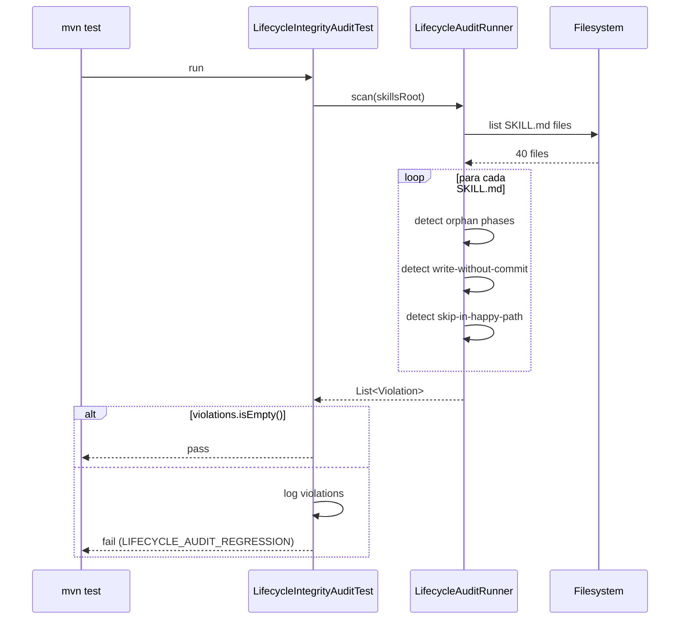

# História: Enforcement CI audit LifecycleIntegrityAuditTest

**ID:** story-0046-0007
**Chave Jira:** —
**Status:** Pendente

## 1. Dependências

| Blocked By | Blocks |
| :--- | :--- |
| story-0046-0002, story-0046-0003, story-0046-0004, story-0046-0005 | — |

## 2. Regras Transversais Aplicáveis

| ID | Título |
| :--- | :--- |
| RULE-046-01 | Source-of-truth invariant |
| RULE-046-02 | Planning updates status |
| RULE-046-03 | Implementation updates status |
| RULE-046-04 | Status transition is non-skippable |
| RULE-046-05 | Reports are atomically committed |

## 3. Descrição

Como **CI mantenedor**, eu quero um teste automatizado `LifecycleIntegrityAuditTest` (Maven CI-blocking) que escanee todos os SKILL.md em `java/src/main/resources/targets/claude/skills/core/` e detecte regressões das Rules 046-02 a 046-05 em três dimensões:

1. **Phases órfãs:** seção documentada no SKILL.md (ex.: "Section 1.6b", "Phase 3") que NÃO é referenciada pelo Core Loop da mesma skill. Exemplo do gap original: `x-epic-implement` Section 1.6b existe como texto mas o Core Loop chama apenas "1.6 checkpoint".
2. **Escritas em `plans/epic-*/reports/` sem commit subsequente:** grep padrão "write plans/epic-*/reports/*.md" em um SKILL.md que NÃO seja seguido, no bloco, por uma invocação `Skill(skill: "x-git-commit", ...)`.
3. **Flags `--skip-*-sync` no caminho happy:** grep flags que pulam status sync (`--skip-verification`, `--skip-status-sync`) em posições do Core Loop (não em seções de "recovery only" explicitamente documentadas).

Cada violation produz entrada em `List<Violation>` com `dimension`, `file`, `line`, `detail`. O teste `LifecycleIntegrityAuditTest` chama `LifecycleAuditRunner.scan(skillsRoot)` e assert que o resultado é vazio. CI-blocking: violations quebram o build.

### 3.1 Implementação do audit runner

O skeleton criado em story 0046-0001 (TASK-0046-0001-005) agora ganha lógica real:

- **Dimensão 1 (orphan phase):**
  - Parse SKILL.md em seções markdown (`##` headings).
  - Identifica a seção "Core Loop" ou equivalente (heurística: subtítulo mais próximo à palavra "workflow" ou "core loop" ou "phases").
  - Lista todas as phases/sections referenciadas no Core Loop (matches `Phase \d+(\.\d+)?` ou `Section \d+(\.\d+)?`).
  - Compara com todas as seções com heading numerado no SKILL.md.
  - Diferença = órfã.
- **Dimensão 2 (write sem commit):**
  - Grep padrão `write\s+plans/epic-\*/reports/` ou `write\s+plans/epic-\S+/reports/\S+`.
  - Para cada match, verifica as 20 linhas seguintes por `Skill\(skill:\s*"x-git-commit"` ou `x-git-commit` explícito.
  - Se ausente → violation.
- **Dimensão 3 (skip flag no happy path):**
  - Grep `--skip-verification|--skip-status-sync` fora de seções "Recovery" ou "Error Handling".
  - Heurística: se a linha está dentro de Core Loop / Workflow → violation.

### 3.2 Excludes

- Skills que declaram explicitamente "dirty on exit by design" no frontmatter (nenhuma hoje, mas possível).
- Seções marcadas `## Recovery` ou `## Error Handling`.
- Comentários markdown `<!-- audit-exempt -->` (escape hatch para casos especiais revisados por humanos — uso raro; CI alerta se > 3).

### 3.3 Integração Maven

- Teste em `java/src/test/java/dev/iadev/audit/LifecycleIntegrityAuditTest.java`.
- Executado em `mvn test`.
- Falha no build se `violations.size() > 0`.
- Error code `LIFECYCLE_AUDIT_REGRESSION` emitido em stderr.

### 3.4 Observabilidade

- Em pass: stdout breve "Lifecycle integrity audit: 0 violations across N SKILL.md".
- Em fail: stdout lista todas violations em formato legível + path + linha.

## 3.5 Entrega de Valor

- **Valor Principal:** CI bloqueia qualquer regressão das rules 046-02 a 046-05. A permanência dos retrofits das stories 0002-0005 fica garantida mesmo em refatorações futuras.
- **Métrica de Sucesso:** (a) `mvn test -Dtest=LifecycleIntegrityAuditTest` verde ao final do épico 0046; (b) em branch isolado, injetar regressão intencional (remover commit após write em report, ou adicionar `--skip-verification` no Core Loop de `x-story-implement`) faz o teste falhar com mensagem clara.
- **Impacto no Negócio:** Convenção Rule 22 é enforcível pelo CI — redução de débito técnico futuro. A skill que entrar no projeto amanhã não pode silenciosamente violar a convenção sem o reviewer saber.

## 4. Definições de Qualidade Locais

### DoR Local (Definition of Ready)

- [ ] Stories 0046-0002, 0003, 0004, 0005 merged (audit precisa das skills retrofitadas verdes)
- [ ] Decisão sobre heurísticas de parsing: regex vs markdown parser? → Markdown parser (`commonmark-java`) para dimensão 1; regex para dimensões 2 e 3

### DoD Local (Definition of Done)

- [ ] `LifecycleAuditRunner` implementado (substitui skeleton da story 0001)
- [ ] `LifecycleIntegrityAuditTest` CI-blocking; falha em injeção intencional de regressão
- [ ] ≥ 95% coverage em `LifecycleAuditRunner`
- [ ] Documentação: CLAUDE.md seção "In progress" atualizada explicando o audit + como usar `<!-- audit-exempt -->`
- [ ] CHANGELOG entry
- [ ] Smoke test: 4 skills retrofitadas (stories 0002-0005) passam o audit; 3 injeções de regressão sintéticas falham

### Global Definition of Done (DoD)

- **Cobertura:** ≥ 95% Line / ≥ 90% Branch
- **Testes Automatizados:** unit tests para cada dimensão + smoke injection + CI integration test
- **Documentação:** CLAUDE.md + CHANGELOG
- **Persistência:** N/A
- **Performance:** audit sobre ~40 SKILL.md em < 2s

## 5. Contratos de Dados (Data Contract)

### 5.1 Violation record

```java
public record Violation(
    Dimension dimension,
    Path file,
    int line,
    String detail
) {}

public enum Dimension {
    ORPHAN_PHASE,
    WRITE_WITHOUT_COMMIT,
    SKIP_IN_HAPPY_PATH
}
```

### 5.2 Audit CLI (uso opcional standalone)

```
java -cp target/ia-dev-env.jar dev.iadev.audit.LifecycleAuditCli scan [--skills-root <path>] [--json]
```

Exit: 0 (no violations) / 11 (violations found).

## 6. Diagramas

### 6.1 Fluxo do audit



## 7. Critérios de Aceite (Gherkin)

```gherkin
Cenario: SKILL.md sem violations passa audit
  DADO um SKILL.md limpo (todas phases referenciadas; sem write sem commit; sem skip-flag no happy)
  QUANDO LifecycleAuditRunner.scan é executado
  ENTÃO retorna List.of() (vazio)
  E LifecycleIntegrityAuditTest passa

Cenario: Phase órfã detectada (happy path do audit)
  DADO um SKILL.md com "## Section 1.6b — Status Sync" que não aparece no Core Loop
  QUANDO scan é executado
  ENTÃO retorna 1 Violation dimension=ORPHAN_PHASE
  E detail menciona "Section 1.6b"

Cenario: Write sem commit detectado
  DADO um SKILL.md com bloco que grava em plans/epic-*/reports/ mas não chama x-git-commit nas 20 linhas seguintes
  QUANDO scan é executado
  ENTÃO retorna 1 Violation dimension=WRITE_WITHOUT_COMMIT

Cenario: Flag --skip no Core Loop detectada
  DADO um SKILL.md com "--skip-verification" referenciado no Core Loop
  QUANDO scan é executado
  ENTÃO retorna 1 Violation dimension=SKIP_IN_HAPPY_PATH

Cenario: Escape hatch audit-exempt respeitado
  DADO uma linha com comentário <!-- audit-exempt --> seguida de write em reports/ sem commit
  QUANDO scan é executado
  ENTÃO nenhuma violation é emitida para essa linha
  E um WARN é logado listando a exempção

Cenario: CI falha em regressão sintética (E2E)
  DADO todas as skills verdes no branch develop
  QUANDO injeto --skip-verification no Core Loop de x-story-implement em um branch
  ENTÃO mvn test -Dtest=LifecycleIntegrityAuditTest FALHA
  E stderr contém "LIFECYCLE_AUDIT_REGRESSION"

Cenario: Performance (boundary)
  DADO 40 SKILL.md no skills root
  QUANDO scan é executado
  ENTÃO tempo total < 2s
```

### 7.1 Scenario Ordering (TPP)

Happy (no violations) → happy detect (orphan, write-without-commit, skip) → escape hatch → E2E regression → boundary (performance).

### 7.2 Mandatory Scenario Categories

- [x] Degenerate (SKILL.md limpo)
- [x] Happy path (3 tipos de violation detectados)
- [x] Error (escape hatch respeitado; regressão bloqueada)
- [x] Boundary (performance)

### 7.3 TDD Implementation Notes

- Acceptance test (outer loop): "CI falha em regressão sintética" — o teste E2E mais representativo do valor.
- Inner loop: unit tests por dimension em TPP — começar com 1 arquivo mínimo + 1 violation, expandir.

## 8. Tasks

### TASK-0046-0007-001: Dimension 1 — orphan phase detector

- **Layer:** Application
- **Test Type:** Unit
- **Size:** L
- **Dependencies:** —
- **Branch:** `feat/task-0046-0007-001-orphan-phase`
- **Testability:** INDEPENDENT
- **Files:**
  - `java/src/main/java/dev/iadev/application/lifecycle/OrphanPhaseDetector.java`
  - `java/src/test/java/dev/iadev/application/lifecycle/OrphanPhaseDetectorTest.java`
- **Acceptance Criteria:**
  - [ ] Parse markdown headings via commonmark
  - [ ] Detect sections not referenced in Core Loop
  - [ ] ≥ 95% coverage

### TASK-0046-0007-002: Dimension 2 — write-without-commit detector

- **Layer:** Application
- **Test Type:** Unit
- **Size:** M
- **Dependencies:** —
- **Branch:** `feat/task-0046-0007-002-write-without-commit`
- **Testability:** INDEPENDENT
- **Files:**
  - `java/src/main/java/dev/iadev/application/lifecycle/WriteWithoutCommitDetector.java`
  - `java/src/test/java/dev/iadev/application/lifecycle/WriteWithoutCommitDetectorTest.java`
- **Acceptance Criteria:**
  - [ ] Regex detecta writes em `plans/epic-*/reports/`
  - [ ] Window de 20 linhas seguintes para x-git-commit
  - [ ] Respeita `<!-- audit-exempt -->`

### TASK-0046-0007-003: Dimension 3 — skip-in-happy-path detector

- **Layer:** Application
- **Test Type:** Unit
- **Size:** M
- **Dependencies:** TASK-0046-0007-001
- **Branch:** `feat/task-0046-0007-003-skip-flag`
- **Testability:** INDEPENDENT
- **Files:**
  - `java/src/main/java/dev/iadev/application/lifecycle/SkipFlagDetector.java`
  - `java/src/test/java/dev/iadev/application/lifecycle/SkipFlagDetectorTest.java`
- **Acceptance Criteria:**
  - [ ] Detect `--skip-*` in Core Loop sections
  - [ ] Ignore in "Recovery" / "Error Handling" sections

### TASK-0046-0007-004: LifecycleAuditRunner integration + CLI

- **Layer:** Application + Adapter
- **Test Type:** Integration
- **Size:** M
- **Dependencies:** TASK-0046-0007-001, TASK-0046-0007-002, TASK-0046-0007-003
- **Branch:** `feat/task-0046-0007-004-audit-runner-integration`
- **Testability:** INDEPENDENT
- **Files:**
  - `java/src/main/java/dev/iadev/application/lifecycle/LifecycleAuditRunner.java` (substitui skeleton da 0001)
  - `java/src/main/java/dev/iadev/adapter/inbound/cli/LifecycleAuditCli.java`
  - `java/src/test/java/dev/iadev/application/lifecycle/LifecycleAuditRunnerTest.java`
- **Acceptance Criteria:**
  - [ ] Runner agrega detectors + retorna List<Violation>
  - [ ] CLI standalone exit 0/11

### TASK-0046-0007-005: LifecycleIntegrityAuditTest CI-blocking

- **Layer:** Test
- **Test Type:** Integration
- **Size:** M
- **Dependencies:** TASK-0046-0007-004
- **Branch:** `feat/task-0046-0007-005-ci-audit-test`
- **Testability:** INDEPENDENT
- **Files:**
  - `java/src/test/java/dev/iadev/audit/LifecycleIntegrityAuditTest.java`
- **Acceptance Criteria:**
  - [ ] Roda `LifecycleAuditRunner.scan(skillsRoot real)` e assertEquals(List.of(), violations)
  - [ ] Em caso de fail, imprime violations legíveis
  - [ ] `mvn test` inclui este teste

### TASK-0046-0007-006: Synthetic regression injection smoke test

- **Layer:** Test
- **Test Type:** E2E
- **Size:** M
- **Dependencies:** TASK-0046-0007-005
- **Branch:** `feat/task-0046-0007-006-regression-smoke`
- **Testability:** INDEPENDENT
- **Files:**
  - `java/src/test/java/dev/iadev/smoke/LifecycleAuditRegressionSmokeTest.java`
- **Acceptance Criteria:**
  - [ ] Cria sandbox com cópia do skills tree
  - [ ] Injeta 3 regressões sintéticas (uma por dimension)
  - [ ] Roda audit e assert 3 violations
  - [ ] Performance: scan < 2s
