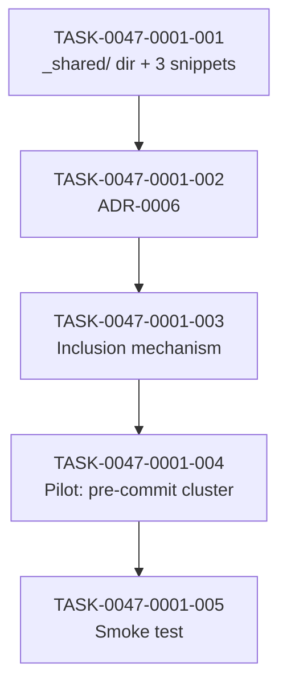

# Task Breakdown -- story-0047-0001

## Header

| Field | Value |
|-------|-------|
| Story ID | story-0047-0001 |
| Epic ID | 0047 |
| Date | 2026-04-21 |
| Author | x-epic-orchestrate (inline planning) |
| Template Version | 1.0.0 |

## Summary

| Metric | Value |
|--------|-------|
| Total Tasks | 5 |
| Parallelizable Tasks | 0 (linear chain) |
| Estimated Effort | S + M + M + L + S = ~M+ |
| Mode | multi-agent (consolidated from story Section 8) |
| Agents Participating | Architect, QA, Security, Tech Lead, PO |

## Dependency Graph

## Tasks Table

| Task ID | Source Agent | Type | TDD Phase | TPP Level | Layer | Components | Parallel | Depends On | Effort | DoD |
|---------|-------------|------|-----------|-----------|-------|-----------|----------|-----------|--------|-----|
| TASK-0047-0001-001 | Architect+PO | architecture | GREEN | N/A | cross-cutting | `_shared/` + 3 snippets + README | no | — | S | 4 files exist; README links ADR-0006; count check passes |
| TASK-0047-0001-002 | Tech Lead | architecture | GREEN | N/A | doc | ADR-0006 | no | 001 | M | 5 mandatory sections; decision a/b/c justified; Proposed->Accepted |
| TASK-0047-0001-003 | Architect+QA | implementation | RED+GREEN | constant | application | SnippetIncluder (if opt a) OR link validation | no | 002 | M/S | Unit test ≥95% Line/90% Branch (opt a); or link existence test (opt b/c) |
| TASK-0047-0001-004 | Architect+Tech Lead | implementation | GREEN | N/A | doc+test | 3 SKILL.md + goldens | no | 003 | L | 3 SKILLs consume snippet; mvn verify green; 17 goldens regen byte-diff documented |
| TASK-0047-0001-005 | QA | test | GREEN | collection | test | Epic0047CompressionSmokeTest.smoke_sharedDirShipsToAllProfiles | no | 004 | S | Smoke validates `_shared/` present in 17 profiles + pre-commit cluster uses snippet |

## Escalation Notes

| Task ID | Reason | Recommended Action |
|---------|--------|--------------------|
| 003 | Branching on ADR-0006 outcome | Finalize ADR-0006 before executing 003 (DoR) |
| 004 | Risk of golden regression outside target cluster | Run full `mvn verify`; review golden diff per-profile |
