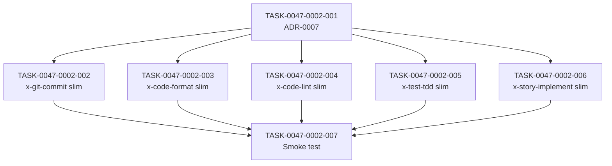

# Task Breakdown -- story-0047-0002

## Header

| Field | Value |
|-------|-------|
| Story ID | story-0047-0002 |
| Epic ID | 0047 |
| Date | 2026-04-21 |
| Author | x-epic-orchestrate (inline planning) |
| Template Version | 1.0.0 |

## Summary

| Metric | Value |
|--------|-------|
| Total Tasks | 7 |
| Parallelizable Tasks | 5 (tasks 002-006 after 001) |
| Estimated Effort | S + 3×M + 2×L + S |
| Mode | multi-agent (consolidated from story Section 8) |
| Agents Participating | Architect, QA, Security, Tech Lead, PO |

## Dependency Graph

## Tasks Table

| Task ID | Source Agent | Type | TDD Phase | TPP Level | Layer | Components | Parallel | Depends On | Effort | DoD |
|---------|-------------|------|-----------|-----------|-------|-----------|----------|-----------|--------|-----|
| TASK-0047-0002-001 | Tech Lead | architecture | GREEN | N/A | doc | ADR-0007 | no | — | S | 5 sections; 3 alternatives with rejection rationale |
| TASK-0047-0002-002 | Architect+PO | implementation | GREEN | N/A | doc+test | x-git-commit SKILL.md + references/full-protocol.md + goldens | yes | 001 | M | ≤200 LoC; 5 slim sections; goldens regen byte-diff documented |
| TASK-0047-0002-003 | Architect+PO | implementation | GREEN | N/A | doc+test | x-code-format analogous | yes | 001 | M | analogous; ≤200 LoC |
| TASK-0047-0002-004 | Architect+PO | implementation | GREEN | N/A | doc+test | x-code-lint analogous | yes | 001 | M | analogous; ≤200 LoC |
| TASK-0047-0002-005 | Architect+PO | implementation | GREEN | N/A | doc+test | x-test-tdd analogous | yes | 001 | L | ≤250 LoC (larger surface) |
| TASK-0047-0002-006 | Architect+PO | implementation | GREEN | N/A | doc+test | x-story-implement analogous (coordinate w/ A4) | yes | 001 + A4 merged | L | ≤250 LoC; no conflict with A4 |
| TASK-0047-0002-007 | QA | test | GREEN | collection | test | Epic0047CompressionSmokeTest.smoke_slimSkillsHaveFullProtocolReference | no | 002..006 | S | validates full-protocol.md + 4 slim sections + line limits per skill |

## Escalation Notes

| Task ID | Reason | Recommended Action |
|---------|--------|--------------------|
| 006 | Coordination with Bucket A item A4 | Confirm A4 merged in develop before execution (DoR check) |
| 005 | x-test-tdd surface larger (487 LoC pre-A5) | Target ≤250 LoC relaxed exception documented in DoD |
