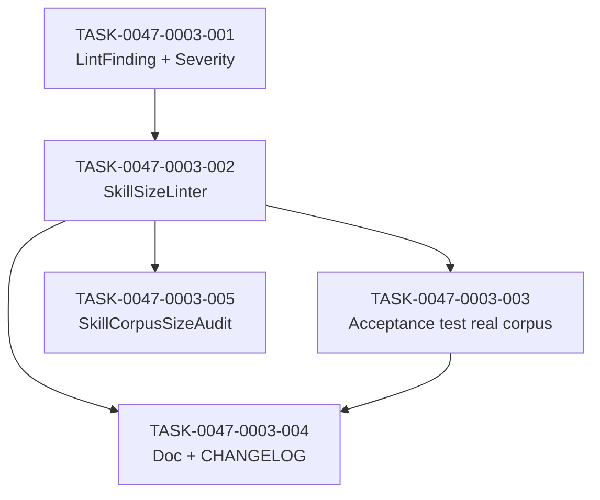

# Task Breakdown -- story-0047-0003

## Header

| Field | Value |
|-------|-------|
| Story ID | story-0047-0003 |
| Epic ID | 0047 |
| Date | 2026-04-21 |
| Author | x-epic-orchestrate (inline planning) |
| Template Version | 1.0.0 |

## Summary

| Metric | Value |
|--------|-------|
| Total Tasks | 5 |
| Parallelizable Tasks | 2 (003 and 004 after 002) |
| Estimated Effort | S + M + S + S + S |
| Mode | multi-agent (consolidated from story Section 8) |
| Agents Participating | Architect, QA, Security, Tech Lead, PO |

## Dependency Graph

## Tasks Table

| Task ID | Source Agent | Type | TDD Phase | TPP Level | Layer | Components | Parallel | Depends On | Effort | DoD |
|---------|-------------|------|-----------|-----------|-------|-----------|----------|-----------|--------|-----|
| TASK-0047-0003-001 | Architect | implementation | RED+GREEN | constant | domain | `LintFinding` record, `Severity` enum, unit test | no | — | S | Record with 6 fields per §5.1; enum INFO/WARN/ERROR; equals/toString tests |
| TASK-0047-0003-002 | Architect+QA | implementation | RED+GREEN+REFACTOR | collection | application | `SkillSizeLinter` + parametric unit test | no | 001 | M | `lint(Path)->List<LintFinding>`; 6+ parametric scenarios; ≥95% Line / 90% Branch; error message matches §3.2 |
| TASK-0047-0003-003 | QA | test | GREEN | iteration | test | `SkillSizeLinterAcceptanceTest` | yes w/ 004 | 002 | S | invokes linter on real corpus; passes against current develop post-Bucket-A; integrates in `mvn test` default scope |
| TASK-0047-0003-004 | Tech Lead+PO | validation | VERIFY | N/A | doc | `quality/README.md` + `CHANGELOG.md` [Unreleased] | yes w/ 003 | 002 | S | README explains threshold + debug; CHANGELOG cites RULE-047-04 |
| TASK-0047-0003-005 | QA+Tech Lead | test | GREEN | constant | test | `SkillCorpusSizeAudit` | no | 002 | S | `wc -l` equivalent; fails if total ≥30k; message shows gap vs target; `mvn test` default scope |

## Escalation Notes

| Task ID | Reason | Recommended Action |
|---------|--------|--------------------|
| 003 | Requires Bucket A merged to pass vs current develop | DoR gate: Bucket A merged confirmed |
| 005 | Threshold 30k assumes Bucket A + 0047 compression complete | Threshold may be soft-warn initially; hard-fail once 0047-0004 merged |
