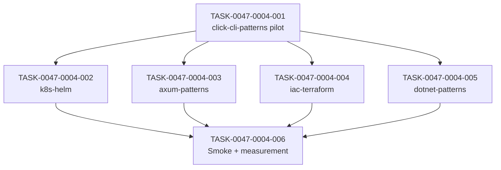

# Task Breakdown -- story-0047-0004

## Header

| Field | Value |
|-------|-------|
| Story ID | story-0047-0004 |
| Epic ID | 0047 |
| Date | 2026-04-21 |
| Author | x-epic-orchestrate (inline planning) |
| Template Version | 1.0.0 |

## Summary

| Metric | Value |
|--------|-------|
| Total Tasks | 6 |
| Parallelizable Tasks | 4 (tasks 002-005 after pilot 001) |
| Estimated Effort | 5×L + S |
| Mode | multi-agent (consolidated from story Section 8) |
| Agents Participating | Architect, QA, Security, Tech Lead, PO |

## Dependency Graph

## Tasks Table

| Task ID | Source Agent | Type | TDD Phase | TPP Level | Layer | Components | Parallel | Depends On | Effort | DoD |
|---------|-------------|------|-----------|-----------|-------|-----------|----------|-----------|--------|-----|
| TASK-0047-0004-001 | Architect+PO | implementation | GREEN | N/A | doc+test | click-cli SKILL.md slim + ~10 references/examples-*.md + goldens | no (pilot) | story-0047-0001 merged | L | SKILL.md ≤250 LoC; Overview+Index+Stack+References; byte-identical examples; goldens regen |
| TASK-0047-0004-002 | Architect+PO | implementation | GREEN | N/A | doc+test | k8s-helm analogous | yes | 001 | L | analogous |
| TASK-0047-0004-003 | Architect+PO | implementation | GREEN | N/A | doc+test | axum-patterns analogous | yes | 001 | L | analogous |
| TASK-0047-0004-004 | Architect+PO | implementation | GREEN | N/A | doc+test | iac-terraform analogous | yes | 001 | L | analogous |
| TASK-0047-0004-005 | Architect+PO | implementation | GREEN | N/A | doc+test | dotnet-patterns analogous | yes | 001 | L | analogous |
| TASK-0047-0004-006 | QA+Tech Lead | test | GREEN | collection | test+doc | Epic0047CompressionSmokeTest.smoke_kpsHaveCarvedExamples + epic §6 update | no | 002..005 | S | smoke validates 5 KPs ≤250 LoC + references present; epic §6 delta captured; issue opened if <−20% |

## Escalation Notes

| Task ID | Reason | Recommended Action |
|---------|--------|--------------------|
| 001 | Pilot — validates approach before fan-out | Review pattern with maintainer before launching 002-005 |
| 006 | RULE-047-07 measurement tied to epic DoD | If delta < −20%, open investigation issue |
| 002-005 | 4-way parallel = heavy golden regen load | Coordinate goldens to avoid lock contention; serialize regen step if needed (RULE-004 HARD-CONFLICT hotspot) |
