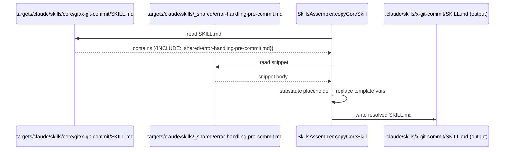

# História: Diretório `_shared/` + ADR-0006 (estratégia de inclusão)

**ID:** story-0047-0001
**Chave Jira:** —
**Status:** Pendente

## 1. Dependências

| Blocked By | Blocks |
| :--- | :--- |
| — | story-0047-0002, story-0047-0004 |

## 2. Regras Transversais Aplicáveis

| ID | Título |
| :--- | :--- |
| RULE-047-01 | `_shared/` é diretório irmão de `core/`/`conditional/`/`knowledge-packs/` |
| RULE-047-02 | Carve-out preserva referência cruzada explícita |
| RULE-047-06 | Atomic, Reversible Commits |

## 3. Descrição

Como **maintainer da fonte-de-verdade de skills (`java/src/main/resources/targets/claude/skills/`)**, eu quero um diretório `_shared/` para snippets cross-cutting (Error Handling templates, TDD-tags reference, glossário de exit codes comuns) **e uma decisão formal (ADR-0006) sobre o mecanismo de inclusão**, garantindo que duplicação inter-skill seja eliminada na fonte sem violar Rule 13 (skills self-contained).

O Bucket A do plano `mellow-mixing-rainbow.md` já consolidou o `## Global Output Policy` em `CLAUDE.md` (carregado uma vez por conversa, não por skill). Esta story estende o pattern para conteúdo que **não é projeto-wide** mas é **cross-skill**: ex. tabelas de Error Handling do cluster pre-commit (`x-git-commit`, `x-code-format`, `x-code-lint` compartilham 100% das rows), templates de Integration Notes para skills de uma mesma família (`x-review-*`), e o glossário recorrente de TDD tags. A decisão crítica é **como** essas inclusões são resolvidas: opção (a) novo placeholder `{{INCLUDE:_shared/path}}` resolvido pelo `SkillsAssembler` em `mvn process-resources`; opção (b) link Markdown relativo na SKILL.md fonte que aponta para `_shared/` no output gerado (LLM segue o link se necessário, sem inclusão física); opção (c) symlinks per-skill para arquivos em `_shared/`. ADR-0006 escolhe e documenta os trade-offs (assembler complexity vs reader UX vs git-tracking custos).

A precondição dura é Bucket A mergeado em `develop` para que o `CLAUDE.md`-style pattern já esteja validado em produção — sem isto, ADR-0006 fica especulando sobre eficácia. Não há mudança de runtime aqui (o Claude Code continua carregando SKILL.md inteira, não há lazy-load de `_shared/`); o ganho é eliminar duplicação física na fonte, reduzindo consequentemente o byte count copiado para os 17 perfis de output.

### 3.1 Diretório `_shared/`

- Localização: `java/src/main/resources/targets/claude/skills/_shared/`.
- Conteúdo inicial mínimo (esta story): `_shared/error-handling-pre-commit.md`, `_shared/tdd-tags-glossary.md`, `_shared/exit-codes-common.md`. Cada um com header level-2 (`## ...`) e body em formato de tabela ou bullets, identificável como "snippet incluível".
- README do diretório (`_shared/README.md`) explica o pattern, lista snippets, e linka ADR-0006.
- NÃO contém SKILL.md (não é uma skill invocável). NÃO entra em `core/`/`conditional/`/`knowledge-packs/` (RULE-047-01).

### 3.2 ADR-0006: estratégia de inclusão

- Local: `adr/ADR-0006-shared-snippets-inclusion-strategy.md`.
- Status inicial: `Proposed` → mover para `Accepted` na DoD desta story após validação em PR review.
- Compara as 3 opções (a/b/c). Recomenda uma com justificativa baseada em: (i) custo de implementação no `SkillsAssembler`, (ii) UX para o reviewer humano lendo SKILL.md fonte, (iii) clareza para o LLM em runtime, (iv) compatibilidade com goldens byte-a-byte (option a precisa que o include seja resolvido ANTES do golden diff; option b/c não precisa).
- Inclui exemplo concreto: como ficaria `x-git-commit/SKILL.md` consumindo `_shared/error-handling-pre-commit.md` com a opção escolhida.

### 3.3 Pilot integration: 1 cluster real

- Aplicar a opção escolhida em ADR-0006 ao cluster pre-commit (`x-git-commit`, `x-code-format`, `x-code-lint`) **como parte desta story** para validar end-to-end.
- Goldens dos 17 perfis regenerados; byte diff documentado no commit de regen.
- Se a opção escolhida for (a) placeholder, atualizar `SkillsAssembler.copyCoreSkill` ou `SkillsCopyHelper.replacePlaceholdersInDir` para resolver `{{INCLUDE:...}}` antes do template substitution.

## 3.5 Entrega de Valor

- **Valor Principal:** Infraestrutura de snippets cross-cutting estabelecida — qualquer skill futura pode reusar texto canônico em vez de duplicar (DRY na fonte). Pilot pre-commit cluster valida o pattern com ganho mensurável.
- **Métrica de Sucesso:** ADR-0006 mergeado como `Accepted`; `_shared/` existe com 3+ snippets; cluster pre-commit (3 skills × ~10 linhas duplicadas) deduplicado → ~30 linhas removidas do corpus + 1 source de verdade.
- **Impacto no Negócio:** Desbloqueia STORY-0047-0002 (que precisa decidir onde a `references/full-protocol.md` vive — em `references/` per-skill ou em `_shared/`) e STORY-0047-0004 (KPs podem reusar headers de "Examples" via `_shared/`).

## 4. Definições de Qualidade Locais

### DoR Local (Definition of Ready)

- [ ] Bucket A do plano `mellow-mixing-rainbow.md` mergeado em `develop` (PR1-PR8)
- [ ] Sprint 2 de medição executada e delta documentado em `epic-0047.md` §6
- [ ] ADR-0006 draft revisado por outro maintainer (assíncrono, async OK)
- [ ] Cluster pre-commit identificado como pilot (consenso entre as 3 SKILL.md sobre o que migrar)

### DoD Local (Definition of Done)

- [ ] `java/src/main/resources/targets/claude/skills/_shared/` criado com 3 arquivos snippet + README
- [ ] `adr/ADR-0006-shared-snippets-inclusion-strategy.md` mergeado com status `Accepted`
- [ ] Cluster pre-commit (`x-git-commit`, `x-code-format`, `x-code-lint`) consome o snippet via opção escolhida em ADR-0006
- [ ] Goldens dos 17 perfis regenerados via `mvn process-resources` (sem regressões em outras skills)
- [ ] Se ADR-0006 escolheu opção (a): unit test `SnippetIncluderTest` cobrindo resolução de `{{INCLUDE:path}}` (≥ 95% Line / 90% Branch)
- [ ] Commit atômico por task (RULE-047-06)
- [ ] Pelo menos 1 teste automatizado validando `_shared/` é copiado para output (`SkillsAssemblerTest.includesSharedDir` novo)
- [ ] Smoke: `Epic0047CompressionSmokeTest.smoke_sharedDirShipsToAllProfiles` valida presença em 17 perfis

### Global Definition of Done (DoD)

- **Cobertura:** ≥ 95% Line, ≥ 90% Branch para qualquer helper Java novo
- **Testes Automatizados:** unit + golden + smoke conforme acima
- **Documentação:** ADR-0006 + `_shared/README.md`; CLAUDE.md atualizado se opção (b) escolhida (link ao `_shared/` pattern)
- **Performance:** assembly tempo não regride > 10%

## 5. Contratos de Dados (Data Contract)

### 5.1 ADR-0006 estrutura

| Seção | Conteúdo obrigatório |
| :--- | :--- |
| Status | `Proposed` → `Accepted` (após merge) |
| Context | Problema: duplicação cross-skill mensurada (linhas exatas) |
| Decision | Opção escolhida (a/b/c) com regra clara |
| Consequences | Trade-off de assembler complexity / reviewer UX / runtime / golden compat |
| Alternatives Considered | As 2 opções não escolhidas com razão de rejeição |

### 5.2 `_shared/` arquivos iniciais

| Arquivo | Conteúdo | Origem (cluster) |
| :--- | :--- | :--- |
| `_shared/error-handling-pre-commit.md` | Tabela de erros pre-commit chain (format → lint → compile → commit) | x-git-commit, x-code-format, x-code-lint |
| `_shared/tdd-tags-glossary.md` | Glossário de TDD tags (RED/GREEN/REFACTOR + variants) | x-test-tdd, x-task-implement, x-story-implement |
| `_shared/exit-codes-common.md` | Exit codes comuns (DEP_*, STATE_*, RULE_*) | x-release, x-epic-implement, x-story-implement |

### 5.3 Placeholder syntax (se opção a) ou link relativo (se b/c)

| Opção | Sintaxe na SKILL.md fonte | Resultado no output |
| :--- | :--- | :--- |
| (a) | `{{INCLUDE:_shared/error-handling-pre-commit.md}}` | conteúdo inline (resolvido em assembler) |
| (b) | `[Pre-commit error handling](../../../_shared/error-handling-pre-commit.md)` | link Markdown; LLM segue se necessário |
| (c) | symlink em `references/error-handling.md` → `../../../_shared/error-handling-pre-commit.md` | arquivo aparece em `references/` mas é symlink |

## 6. Diagramas

### 6.1 Fluxo de assembly com `_shared/` (opção a — placeholder)



## 7. Critérios de Aceite (Gherkin)

```gherkin
Cenario: opção escolhida em ADR-0006 produz output válido para cluster pre-commit
  DADO que ADR-0006 está mergeado como Accepted
  E o diretório _shared/ contém error-handling-pre-commit.md
  E x-git-commit/SKILL.md consome o snippet conforme a opção escolhida
  QUANDO mvn process-resources é executado
  ENTÃO .claude/skills/x-git-commit/SKILL.md no output contém o conteúdo do snippet (resolvido se opção a; linkado se b/c)
  E goldens dos 17 perfis batem byte-a-byte com a regeneração

Cenario: snippet ausente em _shared/ falha o assembly cedo
  DADO que x-code-lint/SKILL.md referencia _shared/snippet-inexistente.md
  QUANDO mvn process-resources é executado
  ENTÃO o assembly falha com mensagem clara apontando o arquivo origem e o snippet ausente

Cenario: skill que não usa _shared/ não é afetada
  DADO que x-release/SKILL.md não contém referência a _shared/
  QUANDO mvn process-resources é executado
  ENTÃO o output de x-release/SKILL.md é idêntico ao baseline pré-épico
```

### 7.1 Scenario Ordering (TPP)

Ordem TPP: degenerado (snippet ausente) → happy path (resolução simples) → independência (skill não-usuária inalterada).

### 7.2 Mandatory Scenario Categories

- [x] Degenerate cases (snippet ausente)
- [x] Happy path (cluster pre-commit deduplica)
- [x] Error paths (assembly fail-fast)
- [x] Boundary values (skill sem uso de `_shared/` permanece intacta)

### 7.3 TDD Implementation Notes

- ADR-0006 é o "outer loop driver": a decisão limita o que vai ser testado.
- Se opção (a): unit test `SnippetIncluderTest` (TPP) precede `SkillsAssembler` modification.
- Goldens são "outer loop assertion": regen + byte diff.

## 8. Tasks

### TASK-0047-0001-001: Criar diretório `_shared/` com 3 snippets iniciais + README

- **Layer:** Doc
- **Test Type:** Verification (file existence + content sanity)
- **Size:** S
- **Dependencies:** —
- **Branch:** `feat/task-0047-0001-001-shared-dir-bootstrap`
- **Testability:** Config + VerificationTest
- **Files:**
  - `java/src/main/resources/targets/claude/skills/_shared/README.md`
  - `java/src/main/resources/targets/claude/skills/_shared/error-handling-pre-commit.md`
  - `java/src/main/resources/targets/claude/skills/_shared/tdd-tags-glossary.md`
  - `java/src/main/resources/targets/claude/skills/_shared/exit-codes-common.md`
- **Acceptance Criteria:**
  - [ ] 4 arquivos criados com conteúdo válido
  - [ ] `_shared/README.md` linka ADR-0006 (mesmo se ainda Proposed)
  - [ ] `find java/src/main/resources/targets/claude/skills/_shared -name '*.md' | wc -l` = 4

### TASK-0047-0001-002: Escrever ADR-0006 (Proposed → Accepted)

- **Layer:** Doc
- **Test Type:** Verification (mandatory sections present)
- **Size:** M
- **Dependencies:** TASK-0047-0001-001
- **Branch:** `feat/task-0047-0001-002-adr-0006-shared-snippets`
- **Testability:** Config + VerificationTest
- **Files:**
  - `adr/ADR-0006-shared-snippets-inclusion-strategy.md`
- **Acceptance Criteria:**
  - [ ] ADR contém seções: Status, Context, Decision, Consequences, Alternatives Considered
  - [ ] Decisão entre a/b/c documentada com justificativa
  - [ ] Status inicial `Proposed`; vira `Accepted` no merge

### TASK-0047-0001-003: Implementar mecanismo de inclusão (se opção a) OU validar links (se b/c)

- **Layer:** Application (assembler) ou Doc (links validation)
- **Test Type:** Unit (se a) ou Verification (se b/c)
- **Size:** M se opção (a); S se opção (b/c)
- **Dependencies:** TASK-0047-0001-002
- **Branch:** `feat/task-0047-0001-003-snippet-inclusion-mechanism`
- **Testability:** Domain + UnitTest (se a) ou Config + VerificationTest (se b/c)
- **Files (se opção a):**
  - `java/src/main/java/dev/iadev/application/assembler/SnippetIncluder.java`
  - `java/src/test/java/dev/iadev/application/assembler/SnippetIncluderTest.java`
- **Files (se opção b/c):**
  - validação via `SkillsCopyHelper` existente; talvez teste novo `SharedReferencesTest`
- **Acceptance Criteria:**
  - [ ] Se opção (a): `SnippetIncluder.resolve(content, sharedDir)` retorna content com placeholders substituídos
  - [ ] Se opção (a): `SnippetIncluderTest` cobre 3 rows (placeholder presente, ausente, malformado) com ≥ 95%/90% coverage
  - [ ] Se opção (b/c): test verifica que cada link relativo em SKILL.md fonte aponta para arquivo existente em `_shared/`

### TASK-0047-0001-004: Pilot — migrar cluster pre-commit + golden regen

- **Layer:** Doc (SKILL.md edits) + Test (golden regen)
- **Test Type:** Golden diff
- **Size:** L
- **Dependencies:** TASK-0047-0001-003
- **Branch:** `refactor/task-0047-0001-004-pre-commit-cluster-shared`
- **Testability:** UseCase + AT (assembly + golden assertion)
- **Files:**
  - `java/src/main/resources/targets/claude/skills/core/git/x-git-commit/SKILL.md`
  - `java/src/main/resources/targets/claude/skills/core/code/x-code-format/SKILL.md`
  - `java/src/main/resources/targets/claude/skills/core/code/x-code-lint/SKILL.md`
  - `java/src/test/resources/golden/**/.claude/skills/x-{git-commit,code-format,code-lint}/SKILL.md` (regenerados)
- **Acceptance Criteria:**
  - [ ] 3 SKILL.md fonte consomem `_shared/error-handling-pre-commit.md` conforme ADR-0006
  - [ ] `mvn process-resources && mvn test` verde
  - [ ] Goldens dos 17 perfis regenerados; byte diff esperado documentado no commit

### TASK-0047-0001-005: Smoke `Epic0047CompressionSmokeTest.smoke_sharedDirShipsToAllProfiles`

- **Layer:** Test
- **Test Type:** Smoke
- **Size:** S
- **Dependencies:** TASK-0047-0001-004
- **Branch:** `test/task-0047-0001-005-shared-smoke`
- **Testability:** Migration + Smoke
- **Files:**
  - `java/src/test/java/dev/iadev/smoke/Epic0047CompressionSmokeTest.java`
- **Acceptance Criteria:**
  - [ ] Smoke valida que `_shared/` é copiado em todos os 17 perfis + 2 platform variants
  - [ ] Smoke valida que cluster pre-commit (3 skills) tem o snippet resolvido/linkado conforme ADR-0006
