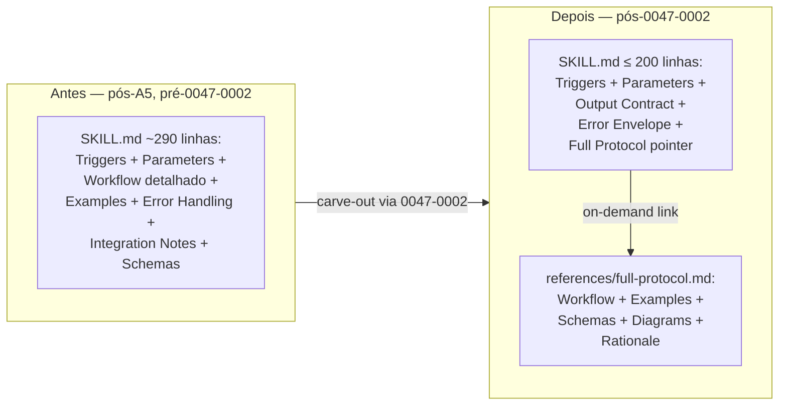

# História: Retirar pattern Slim Mode + ADR-0007 (flipped orientation)

**ID:** story-0047-0002
**Chave Jira:** —
**Status:** Pendente

## 1. Dependências

| Blocked By | Blocks |
| :--- | :--- |
| story-0047-0001 | — |

## 2. Regras Transversais Aplicáveis

| ID | Título |
| :--- | :--- |
| RULE-047-02 | Carve-out preserva referência cruzada explícita |
| RULE-047-03 | Slim como default; full como on-demand |
| RULE-047-04 | Limite duro de 500 linhas por SKILL.md |
| RULE-047-06 | Atomic, Reversible Commits |

## 3. Descrição

Como **maintainer da fonte-de-verdade de skills**, eu quero **retirar formalmente o pattern `## Slim Mode` append-only** introduzido por story 0030-0006 e substituí-lo pelo pattern **flipped orientation** (SKILL.md curta como default + `references/full-protocol.md` on-demand), garantindo que o body que o runtime do Claude Code carrega seja a versão mínima viável e que a versão verbose esteja disponível quando o reviewer humano ou o LLM precisar de detalhes.

O Bucket A do plano `mellow-mixing-rainbow.md` (item A5) já deletou as 5 seções `## Slim Mode` mortas das SKILL.md (`x-test-tdd`, `x-story-implement`, `x-git-commit`, `x-code-format`, `x-code-lint`). Esta story vai além: para CADA uma dessas 5 skills, audita o **contrato comportamental mínimo** (o que a skill PRECISA dizer pra cumprir seu propósito), reescreve a SKILL.md fonte como esse contrato mínimo, e move o resto para `references/full-protocol.md` (ou `_shared/...` se for cross-skill, reusando STORY-0047-0001). A precondição dura é que (a) Bucket A já tenha deletado o pattern morto, (b) Sprint 2 já tenha medido o ganho real do Bucket A para sabermos o **delta esperado** desta story, e (c) ADR-0007 esteja `Accepted` documentando a decisão arquitetural — porque flipping default-orientation IS uma decisão de design (não é só refactor). Sem ADR a story vira "trust me bro" review.

A diferença entre esta story e A4 do Bucket A: A4 carved out duplicate inline content das orchestrators (`x-release`, `x-epic-implement`, `x-story-implement`, `x-story-plan`, `x-pr-fix-epic`) — conteúdo que JÁ ESTAVA em `references/` mas tinha sido re-inlined no merge-conflict v2.2.1. Esta story é diferente: aplica flipped orientation às 5 skills que TINHAM Slim Mode (que A5 só removeu sem reescrever). Os 5 alvos desta story são pré-commit chain + test/dev: `x-test-tdd`, `x-story-implement` (já em A4 também — coordenar para evitar conflito), `x-git-commit`, `x-code-format`, `x-code-lint`.

### 3.1 Audit do contrato mínimo por skill

Para cada uma das 5 skills, produzir uma "spec mínima" listando:
- **Triggers** (linhas obrigatórias que descrevem quando invocar)
- **Inputs/args** (frontmatter `argument-hint` + tabela de argumentos)
- **Output contract** (o que a skill produz; ex: state-file path, exit code, modificação de arquivo)
- **Error envelope** (códigos de erro + condições)
- **Relação com outras skills** (1 frase + link para Integration Notes em `references/`)

Tudo o que NÃO cair nessas categorias vai para `references/full-protocol.md` (workflows detalhados, exemplos longos, justificativas históricas, schemas JSON expandidos, diagramas Mermaid grandes).

### 3.2 ADR-0007: flipped orientation

- Local: `adr/ADR-0007-skill-body-slim-by-default.md`.
- Status `Proposed` → `Accepted` no merge.
- Documenta:
  - **Decisão:** SKILL.md como contrato mínimo viável (default-slim); detalhe verbose vai para `references/full-protocol.md` (default-on-demand).
  - **Por quê:** Runtime do Claude Code carrega SKILL.md inteira (não consegue lazy-load por seção). O pattern oposto (default-full + Slim Mode appended) é arquiteturalmente quebrado — texto consultivo "load only this section" não é honrado.
  - **Trade-offs:** Reviewer humano que quer ver o protocolo completo precisa abrir 2 arquivos. LLM em runtime pode ter que ler `references/full-protocol.md` se a SKILL.md slim não for suficiente para a tarefa atual (custo: mais um Read tool call).
  - **Critério de "mínimo viável":** SKILL.md slim deve ser executável standalone para o caminho feliz da skill. Casos atípicos podem requerer leitura de `references/`.
  - **Migration path:** as 5 skills desta story são piloto. Outras skills migram conforme entrarem em manutenção (não force-migrate o corpus inteiro).

### 3.3 Carve-out por skill

Para cada uma das 5 skills, em PRs separados (uma por skill, mesma branch ou separadas — TBD na DoR):

1. Audit do contrato mínimo (§3.1)
2. Reescrita da SKILL.md fonte para conter APENAS o contrato mínimo
3. Criação de `references/full-protocol.md` com tudo que sobrou
4. Atualização de Integration Notes (já em `references/integrations.md` via Bucket A item A3) se relação com outras skills mudou
5. Golden regen + byte diff documentado

Target por skill: **SKILL.md slim ≤ 200 linhas** (vs ~250-487 atual pós-A5). `references/full-protocol.md` carrega o resto.

## 3.5 Entrega de Valor

- **Valor Principal:** Pattern arquitetural correto estabelecido (default-slim + on-demand-full). 5 skills piloto demonstram viabilidade. Texto morto ("read only this section") eliminado da fonte.
- **Métrica de Sucesso:** As 5 skills alvo somam ≤ 1.000 linhas de SKILL.md fonte (vs ~1.500 pós-A5). `references/full-protocol.md` existe em cada uma. ADR-0007 documenta a decisão.
- **Impacto no Negócio:** Reduz custo de invocação para chains que tocam essas 5 skills (especialmente pre-commit chain rodando em todo task TDD). Estabelece template para EPIC-0047 story 0047-0004 (KPs) e migrações futuras.

## 4. Definições de Qualidade Locais

### DoR Local (Definition of Ready)

- [ ] STORY-0047-0001 mergeada (`_shared/` e ADR-0006 disponíveis)
- [ ] Bucket A item A5 mergeado em `develop` (sections Slim Mode já deletadas)
- [ ] Sprint 2 de medição completada e delta documentado em `epic-0047.md` §6
- [ ] ADR-0007 draft revisado por outro maintainer
- [ ] Audit de contrato mínimo (§3.1) feito para as 5 skills (1 doc resumo por skill, scratch ou em PR draft)
- [ ] Coordenação com A4 do Bucket A confirmada (não conflitar com `x-story-implement` se A4 ainda em curso)

### DoD Local (Definition of Done)

- [ ] `adr/ADR-0007-skill-body-slim-by-default.md` mergeado como `Accepted`
- [ ] 5 SKILL.md fonte reescritas como slim contract:
  - [ ] `x-test-tdd/SKILL.md` ≤ 200 linhas
  - [ ] `x-story-implement/SKILL.md` ≤ 200 linhas (slim contract; coordenar com A4)
  - [ ] `x-git-commit/SKILL.md` ≤ 200 linhas
  - [ ] `x-code-format/SKILL.md` ≤ 200 linhas
  - [ ] `x-code-lint/SKILL.md` ≤ 200 linhas
- [ ] 5 `references/full-protocol.md` criadas com o conteúdo carved out
- [ ] Goldens dos 17 perfis regenerados via `mvn process-resources` (sem regressões fora das 5 alvo)
- [ ] Cada SKILL.md slim contém `## Triggers`, `## Parameters`, `## Output Contract`, `## Error Envelope`, e link para `references/full-protocol.md`
- [ ] Smoke test `Epic0047CompressionSmokeTest.smoke_slimSkillsHaveFullProtocolReference` valida presença de `full-protocol.md` em cada uma das 5 skills
- [ ] CHANGELOG entry sob `[Unreleased]` referenciando ADR-0007
- [ ] Pelo menos 1 teste automatizado validando que cada skill slim ainda tem o contrato mínimo (pode ser content assertion em `Epic0047CompressionSmokeTest`)

### Global Definition of Done (DoD)

- **Cobertura:** N/A para esta story (sem código Java novo; só SKILL.md + ADR + smoke test)
- **Testes Automatizados:** golden diff + smoke test
- **Documentação:** ADR-0007 + 5 `references/full-protocol.md`; CHANGELOG; CLAUDE.md "In progress" atualizado
- **Performance:** Tempo de assembly não regride > 10%
- **Backward Compatibility:** Skills slim devem continuar funcionando standalone para caminho feliz; reviewers podem precisar abrir `references/full-protocol.md` para edge cases (documentado em ADR-0007)

## 5. Contratos de Dados (Data Contract)

### 5.1 ADR-0007 estrutura

| Seção | Conteúdo obrigatório |
| :--- | :--- |
| Status | `Proposed` → `Accepted` |
| Context | Story 0030-0006 Slim Mode quebrado; A5 deletou; precisamos pattern correto |
| Decision | Default-slim + on-demand-full; SKILL.md = contrato mínimo viável |
| Consequences | Reviewer abre 2 arquivos; LLM pode precisar Read em `full-protocol.md` |
| Alternatives Considered | (1) Manter bodies completas (status quo pré-A5); (2) Restaurar Slim Mode appended (rejeitado por arquiteturalmente quebrado); (3) Splittar em 2 skills (rejeitado por explosão de Skill() invocations) |

### 5.2 SKILL.md slim contract — seções obrigatórias

| Seção | Conteúdo |
| :--- | :--- |
| `## Triggers` | 1-3 linhas dizendo quando invocar |
| `## Parameters` | Tabela de args + flags |
| `## Output Contract` | O que a skill produz (state-file, exit code, file modification) |
| `## Error Envelope` | Tabela de error codes (link para `_shared/exit-codes-common.md` se aplicável) |
| `## Full Protocol` | 1 frase + link para `references/full-protocol.md` |

### 5.3 `references/full-protocol.md` por skill — conteúdo migrado

| Origem (seção da SKILL.md atual) | Destino |
| :--- | :--- |
| Workflows detalhados (multi-step) | `references/full-protocol.md` § Workflow |
| Exemplos longos (> 10 linhas) | `references/full-protocol.md` § Examples |
| Schemas JSON expandidos | `references/full-protocol.md` § Schemas |
| Diagramas Mermaid grandes | `references/full-protocol.md` § Diagrams |
| Justificativas históricas (Why X not Y) | `references/full-protocol.md` § Rationale |

## 6. Diagramas

### 6.1 Antes vs depois (1 skill — x-git-commit)



## 7. Critérios de Aceite (Gherkin)

```gherkin
Cenario: SKILL.md slim contém contrato mínimo executável standalone
  DADO que x-git-commit/SKILL.md foi reescrita como slim
  E references/full-protocol.md foi criada com o detalhe
  QUANDO um operador invoca /x-git-commit pela primeira vez (sem ler full-protocol)
  ENTÃO o caminho feliz funciona: format -> lint -> compile -> commit (RULE-007)
  E mensagens de erro são auto-explicativas via Error Envelope

Cenario: edge case requer leitura de references/full-protocol.md
  DADO que x-git-commit/SKILL.md slim cobre apenas caminho feliz
  QUANDO operador encontra um edge case (ex: commit hook custom)
  ENTÃO a SKILL.md slim diz "para casos avançados ver references/full-protocol.md"
  E references/full-protocol.md cobre o caso documentadamente

Cenario: ADR-0007 documenta a decisão de orientation flip
  DADO que adr/ADR-0007-skill-body-slim-by-default.md está mergeado
  QUANDO um maintainer futuro pergunta "por que não restaurar Slim Mode?"
  ENTÃO ADR-0007 §Alternatives Considered responde

Cenario: golden regen valida byte-a-byte para 17 perfis pós-flip
  DADO que as 5 SKILL.md foram reescritas
  QUANDO mvn process-resources && mvn verify é executado
  ENTÃO goldens dos 17 perfis batem byte-a-byte com a regeneração
  E nenhum teste de outras skills regride
```

### 7.1 Scenario Ordering (TPP)

Degenerado (operador feliz path) → happy (slim contract suficiente) → edge (full-protocol consultado) → governance (ADR responde futuro maintainer) → invariante (goldens estáveis).

### 7.2 Mandatory Scenario Categories

- [x] Degenerate cases (caminho feliz só com slim)
- [x] Happy path (mesmo)
- [x] Error paths (Error Envelope cobre; full-protocol detalha)
- [x] Boundary values (edge case → full-protocol)

### 7.3 TDD Implementation Notes

- ADR-0007 é o "outer loop driver".
- Por skill: rewrite slim primeiro (acceptance: Gherkin §1 cenário 1 passa); golden regen é o assertion final.
- Sem código Java novo, então TPP unit tests não se aplicam — esta story é doc-heavy refactor.

## 8. Tasks

### TASK-0047-0002-001: Escrever ADR-0007 (Proposed → Accepted)

- **Layer:** Doc
- **Test Type:** Verification
- **Size:** S
- **Dependencies:** —
- **Branch:** `feat/task-0047-0002-001-adr-0007-flipped-orientation`
- **Testability:** Config + VerificationTest
- **Files:**
  - `adr/ADR-0007-skill-body-slim-by-default.md`
- **Acceptance Criteria:**
  - [ ] ADR contém 5 seções obrigatórias (Status, Context, Decision, Consequences, Alternatives)
  - [ ] §Alternatives Considered cobre 3 alternativas com razão de rejeição

### TASK-0047-0002-002: Audit + slim rewrite — `x-git-commit`

- **Layer:** Doc (SKILL.md) + Doc (references)
- **Test Type:** Golden diff + Smoke
- **Size:** M
- **Dependencies:** TASK-0047-0002-001
- **Branch:** `refactor/task-0047-0002-002-x-git-commit-slim`
- **Testability:** UseCase + AT
- **Files:**
  - `java/src/main/resources/targets/claude/skills/core/git/x-git-commit/SKILL.md`
  - `java/src/main/resources/targets/claude/skills/core/git/x-git-commit/references/full-protocol.md`
  - `java/src/test/resources/golden/**/.claude/skills/x-git-commit/**`
- **Acceptance Criteria:**
  - [ ] SKILL.md ≤ 200 linhas; contém 5 seções obrigatórias do contrato slim
  - [ ] `references/full-protocol.md` criado com o conteúdo migrado
  - [ ] Goldens regenerados; byte diff documentado

### TASK-0047-0002-003: Audit + slim rewrite — `x-code-format`

- **Layer:** Doc + Doc
- **Test Type:** Golden diff + Smoke
- **Size:** M
- **Dependencies:** TASK-0047-0002-001
- **Branch:** `refactor/task-0047-0002-003-x-code-format-slim`
- **Testability:** UseCase + AT
- **Files:** análogo a TASK-002 para `x-code-format`
- **Acceptance Criteria:** análogo a TASK-002

### TASK-0047-0002-004: Audit + slim rewrite — `x-code-lint`

- **Layer:** Doc + Doc
- **Test Type:** Golden diff + Smoke
- **Size:** M
- **Dependencies:** TASK-0047-0002-001
- **Branch:** `refactor/task-0047-0002-004-x-code-lint-slim`
- **Testability:** UseCase + AT
- **Files:** análogo
- **Acceptance Criteria:** análogo

### TASK-0047-0002-005: Audit + slim rewrite — `x-test-tdd`

- **Layer:** Doc + Doc
- **Test Type:** Golden diff + Smoke
- **Size:** L (test-tdd é maior; 487 linhas pós-A5)
- **Dependencies:** TASK-0047-0002-001
- **Branch:** `refactor/task-0047-0002-005-x-test-tdd-slim`
- **Testability:** UseCase + AT
- **Files:** análogo
- **Acceptance Criteria:** análogo, mas slim alvo ≤ 250 linhas (test-tdd tem mais surface)

### TASK-0047-0002-006: Audit + slim rewrite — `x-story-implement` (coordenar com A4)

- **Layer:** Doc + Doc
- **Test Type:** Golden diff + Smoke
- **Size:** L
- **Dependencies:** TASK-0047-0002-001 + Bucket A4 do plano mergeado
- **Branch:** `refactor/task-0047-0002-006-x-story-implement-slim`
- **Testability:** UseCase + AT
- **Files:** análogo
- **Acceptance Criteria:**
  - [ ] análogo, slim alvo ≤ 250 linhas
  - [ ] Validar que A4 (do Bucket A) já moveu duplicate inline content para `references/`; esta task complementa com flipped orientation

### TASK-0047-0002-007: Smoke `Epic0047CompressionSmokeTest.smoke_slimSkillsHaveFullProtocolReference`

- **Layer:** Test
- **Test Type:** Smoke
- **Size:** S
- **Dependencies:** TASK-0047-0002-002, 003, 004, 005, 006
- **Branch:** `test/task-0047-0002-007-slim-smoke`
- **Testability:** Migration + Smoke
- **Files:**
  - `java/src/test/java/dev/iadev/smoke/Epic0047CompressionSmokeTest.java` (estende a smoke iniciada em STORY-0001)
- **Acceptance Criteria:**
  - [ ] Smoke valida presença de `references/full-protocol.md` nas 5 skills alvo
  - [ ] Smoke valida que cada SKILL.md slim contém `## Triggers`, `## Parameters`, `## Output Contract`, `## Error Envelope`
  - [ ] Smoke valida que SKILL.md slim ≤ limite por skill (200 ou 250 conforme tabela)
