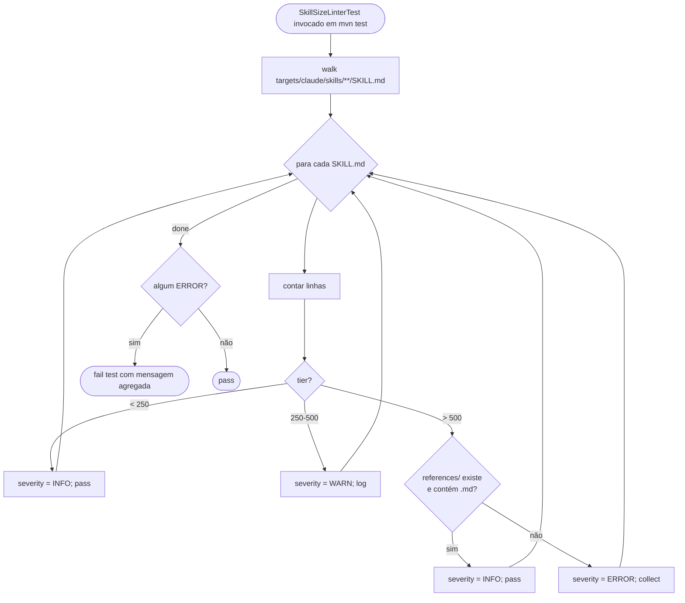

# História: CI lint `SkillSizeLinter` (limite 500 LoC + `references/` sibling)

**ID:** story-0047-0003
**Chave Jira:** —
**Status:** Pendente

## 1. Dependências

| Blocked By | Blocks |
| :--- | :--- |
| — | — |

## 2. Regras Transversais Aplicáveis

| ID | Título |
| :--- | :--- |
| RULE-047-04 | Limite duro de 500 linhas por SKILL.md |
| RULE-047-05 | Knowledge packs seguem mesmo regime |
| RULE-047-06 | Atomic, Reversible Commits |

## 3. Descrição

Como **maintainer da fonte-de-verdade de skills**, eu quero um **CI lint** (Maven test) que falhe a build quando alguma SKILL.md em `targets/claude/skills/` ultrapassar 500 linhas sem ter um diretório `references/` sibling não-vazio, garantindo que o pattern de carve-out (RULE-047-02) seja enforçado para qualquer skill futura — sem depender da memória do reviewer.

Esta story é **independente das outras** (não bloqueada por STORY-0047-0001 nem por STORY-0047-0002). É um guard-rail preventivo: mesmo que Bucket A + EPIC-0047 stories 0001/0002/0004 reduzam o corpus para a meta, a regressão silenciosa é o vetor mais provável de re-inflação (foi exatamente o que aconteceu pós-merge-conflict v2.2.1 com EPIC-0030). O lint roda em `mvn test` (default scope), tem mensagem de erro acionável (path + line count + threshold + sugestão "crie references/ ou divida"), e respeita 3 tiers: < 250 linhas passa silencioso; 250-500 emite WARNING (não bloqueia); > 500 sem `references/` falha (bloqueia).

A complexidade real está no **threshold tuning** e nas **exceções legítimas**. Algumas skills genuinamente precisam de body grande mesmo com `references/` (orchestrators top — `x-release` mesmo após STORY-0030-0002 follow-up no Bucket A pode ficar próximo de 1.200 linhas). Por isso o lint exige `references/` sibling **não-vazio** (ou seja, contém pelo menos 1 arquivo `.md` além de `README.md` se houver), não impõe um teto rígido absoluto. Threshold é revisitado anualmente conforme corpus evolui (RULE-047-04 explicita).

### 3.1 Lint Java (`SkillSizeLinter`)

- Localização: `java/src/main/java/dev/iadev/quality/SkillSizeLinter.java`
- Singleton/static helper com método `lint(Path skillsRoot) -> List<LintFinding>`
- Findings têm severity: `INFO` (< 250), `WARN` (250-500), `ERROR` (> 500 sem `references/` válido)
- Test wrapper `SkillSizeLinterTest` em `java/src/test/java/dev/iadev/quality/` que executa o lint contra `java/src/main/resources/targets/claude/skills/` real e:
  - aceita findings INFO/WARN
  - falha o teste se algum ERROR aparece
  - tem teste paramétrico cobrindo as 3 tiers + edge cases (skill com `references/` vazio = ERROR; skill com `references/` contendo só README = ERROR; skill com `references/` contendo `error-handling.md` = passa)

### 3.2 Mensagem de erro acionável

Format esperado quando lint falha:
```
[ERROR] SkillSizeLinter: x-release/SKILL.md exceeds 500 lines (current: 1247) without a non-empty references/ sibling.
        Sugestões:
        1. Carve out detail to references/full-protocol.md (see ADR-0007)
        2. Carve out shared content to _shared/ (see ADR-0006 + STORY-0047-0001)
        3. Split into multiple skills (only if scope justifies)
        Threshold: ≤ 500 lines OR > 500 with references/ containing 1+ .md files.
```

### 3.3 Integração no pipeline

- O test roda em `mvn test` default (não em profile separado) — ninguém pula
- Tempo de execução esperado: < 1s (apenas conta linhas + verifica diretórios)
- Sem dependências externas (não usa `gh`, `mvn process-resources`, etc.)
- Reusa pattern de outros tests `Audit*` no projeto (ex: `Rule13AuditTest` se existir; senão estabelece o pattern)

## 3.5 Entrega de Valor

- **Valor Principal:** Guard-rail preventivo: regressão estrutural (skill > 500 LoC sem references/) torna-se IMPOSSÍVEL de passar silenciosa. CI bloqueia merge.
- **Métrica de Sucesso:** Após esta story mergeada, qualquer PR que adicione/expanda SKILL.md > 500 LoC sem `references/` falha em `mvn test` antes do reviewer humano ver.
- **Impacto no Negócio:** Custo de manutenção do corpus reduzido — não precisa mais que o reviewer seja a salvaguarda; o lint pega. Reduz risco de regressão tipo EPIC-0030 → v2.2.1.

## 4. Definições de Qualidade Locais

### DoR Local (Definition of Ready)

- [ ] Bucket A do plano mergeado em `develop` (caso contrário o lint falha imediatamente em x-release pré-A4)
- [ ] Threshold (500) confirmado com maintainers (revisitar se Bucket A reduz top-skills para abaixo de 800 — daí 500 é ainda generoso)
- [ ] Decisão sobre se KPs (`knowledge-packs/**`) também são linted (RULE-047-05 diz sim) — confirmada
- [ ] Scope confirmado: lint cobre `targets/claude/skills/{core,conditional,knowledge-packs}/` MAS não `targets/claude/skills/_shared/` (por design — `_shared/` não tem SKILL.md)

### DoD Local (Definition of Done)

- [ ] `SkillSizeLinter.java` implementado com cobertura ≥ 95% Line / 90% Branch
- [ ] `SkillSizeLinterTest.java` cobre 6+ cenários paramétricos (INFO, WARN, ERROR-no-references, ERROR-empty-references, ERROR-readme-only-references, OK-with-references)
- [ ] Test roda em `mvn test` default e passa contra estado atual de develop pós-Bucket A
- [ ] Mensagem de erro segue formato §3.2 (path + count + threshold + sugestões)
- [ ] CHANGELOG entry sob `[Unreleased]`
- [ ] Pelo menos 1 teste validando o critério de aceite (já é o `SkillSizeLinterTest`)
- [ ] Documentação curta em `java/src/main/java/dev/iadev/quality/README.md` (se diretório `quality/` é novo) explicando o lint

### Global Definition of Done (DoD)

- **Cobertura:** ≥ 95% Line, ≥ 90% Branch para `SkillSizeLinter`
- **Testes Automatizados:** `SkillSizeLinterTest` paramétrico
- **Documentação:** README curto + CHANGELOG
- **Performance:** Lint < 1s para o corpus completo
- **Backward Compatibility:** Lint não falha em qualquer skill atual pós-Bucket A — se falhar, o lint precisa de threshold ajustado OU as skills problemáticas precisam ser corrigidas em outro PR antes desta story landar

## 5. Contratos de Dados (Data Contract)

### 5.1 `LintFinding` record

| Campo | Tipo | Descrição |
| :--- | :--- | :--- |
| `path` | `Path` | path relativa da SKILL.md (`core/git/x-git-commit/SKILL.md`) |
| `lineCount` | `int` | linhas atuais |
| `severity` | `Severity` enum | `INFO`/`WARN`/`ERROR` |
| `hasReferencesDir` | `boolean` | `references/` sibling existe |
| `referencesNonEmpty` | `boolean` | contém ≥ 1 arquivo `.md` (excluindo `README.md`) |
| `message` | `String` | mensagem human-readable conforme §3.2 |

### 5.2 Tiers (RULE-047-04)

| Range | Severity | Action |
| :--- | :--- | :--- |
| < 250 | `INFO` | silently pass |
| 250-500 | `WARN` | log warning; do not fail build |
| > 500 sem `references/` válido | `ERROR` | fail build |
| > 500 com `references/` válido | `INFO` | silently pass (orchestrators OK) |

### 5.3 Exclusions

| Path pattern | Razão |
| :--- | :--- |
| `_shared/**` | Não contém SKILL.md (RULE-047-01) |
| `**/README.md` | Não é SKILL.md |
| Qualquer arquivo `.md` que não seja `SKILL.md` | Lint só vê SKILL.md |

## 6. Diagramas

### 6.1 Fluxo do lint



## 7. Critérios de Aceite (Gherkin)

```gherkin
Cenario: skill < 250 linhas passa silenciosamente
  DADO que x-pr-fix/SKILL.md tem 228 linhas
  E não tem references/
  QUANDO SkillSizeLinterTest é executado
  ENTÃO o finding para x-pr-fix tem severity = INFO
  E o test passa

Cenario: skill 250-500 linhas emite WARN sem falhar
  DADO que algum-skill/SKILL.md tem 380 linhas
  E não tem references/
  QUANDO SkillSizeLinterTest é executado
  ENTÃO o finding tem severity = WARN
  E o test passa (com log)

Cenario: skill > 500 sem references/ falha
  DADO que x-release/SKILL.md tem 1247 linhas
  E references/ está ausente
  QUANDO SkillSizeLinterTest é executado
  ENTÃO o finding tem severity = ERROR
  E o test falha
  E a mensagem contém path + count + sugestões

Cenario: skill > 500 com references/ não-vazio passa
  DADO que x-release/SKILL.md tem 1247 linhas
  E references/ contém approval-gate-workflow.md, backmerge-strategies.md
  QUANDO SkillSizeLinterTest é executado
  ENTÃO o finding tem severity = INFO
  E o test passa

Cenario: references/ contendo só README.md ainda falha
  DADO que algum-skill/SKILL.md tem 700 linhas
  E references/ contém apenas README.md
  QUANDO SkillSizeLinterTest é executado
  ENTÃO o finding tem severity = ERROR
  E mensagem indica "references/ deve conter ≥ 1 .md além de README.md"
```

### 7.1 Scenario Ordering (TPP)

Degenerado (skill pequena) → escala (WARN tier) → falha (ERROR sem refs) → boundary (ERROR com refs vazias / só README) → happy edge (large mas com refs).

### 7.2 Mandatory Scenario Categories

- [x] Degenerate cases (< 250)
- [x] Happy path (large com refs OK)
- [x] Error paths (ERROR sem refs)
- [x] Boundary values (250, 500, refs com só README)

### 7.3 TDD Implementation Notes

- Outer loop: Gherkin cenário 3 (ERROR sem refs) é o acceptance test.
- Inner loop TPP: começar pelo cenário 1 (skill pequena, sem refs → INFO); progredir para WARN, ERROR, edge cases.
- `LintFinding` record é Domain (zero deps); `SkillSizeLinter` é Application/Quality (filesystem walk, pure function dado mock filesystem).

## 8. Tasks

### TASK-0047-0003-001: Domain — `LintFinding` record + `Severity` enum

- **Layer:** Domain
- **Test Type:** Unit
- **Size:** S
- **Dependencies:** —
- **Branch:** `feat/task-0047-0003-001-lint-finding-record`
- **Testability:** Domain + UnitTest
- **Files:**
  - `java/src/main/java/dev/iadev/quality/LintFinding.java`
  - `java/src/main/java/dev/iadev/quality/Severity.java`
  - `java/src/test/java/dev/iadev/quality/LintFindingTest.java`
- **Acceptance Criteria:**
  - [ ] Record `LintFinding` com 6 campos conforme §5.1
  - [ ] Enum `Severity` com `INFO`/`WARN`/`ERROR`
  - [ ] Unit tests cobrem construção, equals, toString

### TASK-0047-0003-002: `SkillSizeLinter` — walker + tier classifier

- **Layer:** Application
- **Test Type:** Unit (com filesystem mockado via `Jimfs` ou `@TempDir`)
- **Size:** M
- **Dependencies:** TASK-0047-0003-001
- **Branch:** `feat/task-0047-0003-002-skill-size-linter`
- **Testability:** Domain + UnitTest
- **Files:**
  - `java/src/main/java/dev/iadev/quality/SkillSizeLinter.java`
  - `java/src/test/java/dev/iadev/quality/SkillSizeLinterTest.java`
- **Acceptance Criteria:**
  - [ ] `lint(Path) -> List<LintFinding>` walker funcional
  - [ ] Tier classifier paramétrico cobrindo 6+ cenários da Gherkin
  - [ ] ≥ 95% Line / 90% Branch coverage
  - [ ] Mensagem de erro acionável conforme §3.2

### TASK-0047-0003-003: Acceptance test contra corpus real

- **Layer:** Test
- **Test Type:** Acceptance
- **Size:** S
- **Dependencies:** TASK-0047-0003-002
- **Branch:** `test/task-0047-0003-003-acceptance-real-corpus`
- **Testability:** UseCase + AT
- **Files:**
  - `java/src/test/java/dev/iadev/quality/SkillSizeLinterAcceptanceTest.java`
- **Acceptance Criteria:**
  - [ ] Test invoca `SkillSizeLinter.lint(java/src/main/resources/targets/claude/skills)` real
  - [ ] Test passa contra estado atual de develop (DoR confirma; se falhar, fix é parte de outra story)
  - [ ] Test integra ao `mvn test` default scope (não em profile separado)

### TASK-0047-0003-004: Doc + CHANGELOG

- **Layer:** Doc
- **Test Type:** Verification
- **Size:** S
- **Dependencies:** TASK-0047-0003-002, 003
- **Branch:** `docs/task-0047-0003-004-lint-readme-changelog`
- **Testability:** Config + VerificationTest
- **Files:**
  - `java/src/main/java/dev/iadev/quality/README.md`
  - `CHANGELOG.md` ([Unreleased] entry)
- **Acceptance Criteria:**
  - [ ] README curto explica o lint, threshold, e como debugar quando falha
  - [ ] CHANGELOG entry referencia RULE-047-04 e esta story
