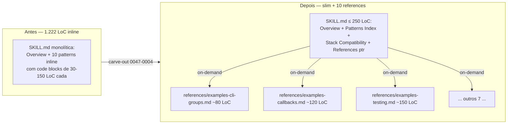

# História: Sweep de compressão dos 5 maiores knowledge packs

**ID:** story-0047-0004
**Chave Jira:** —
**Status:** Pendente

## 1. Dependências

| Blocked By | Blocks |
| :--- | :--- |
| story-0047-0001 | — |

## 2. Regras Transversais Aplicáveis

| ID | Título |
| :--- | :--- |
| RULE-047-02 | Carve-out preserva referência cruzada explícita |
| RULE-047-04 | Limite duro de 500 linhas por SKILL.md |
| RULE-047-05 | Knowledge packs seguem mesmo regime |
| RULE-047-06 | Atomic, Reversible Commits |

## 3. Descrição

Como **maintainer da fonte-de-verdade de skills**, eu quero **comprimir os 5 maiores knowledge packs** (`click-cli-patterns` 1.222 LoC, `k8s-helm` 944, `axum-patterns` 888, `iac-terraform` 861, `dotnet-patterns` 814 — total 4.729 LoC) movendo os blocos de **code samples longos para `references/examples-<lang>.md`**, garantindo que SKILL.md do KP fique como narrativa + índice de exemplos (target ≤ 250 LoC cada).

KPs em `knowledge-packs/` são bibliotecas de pattern: cada um tem 8-12 exemplos canônicos (Click CLI groups, k8s Helm values, Axum extractors, Terraform modules, .NET DI). Hoje os exemplos estão **inline** na SKILL.md — cada exemplo é um code block de 30-100 linhas. O resultado é que sempre que algum orquestrador puxa um KP (e KPs são puxados em quase toda chain via `x-task-implement`/`x-story-implement` para projetos que matchem o stack), os 1.222 linhas do click-cli ou os 944 do k8s-helm vão pra dentro do contexto, mesmo quando só 1 dos 10 exemplos seria suficiente para a tarefa.

Esta story aplica o pattern de carve-out (RULE-047-02) aos KPs: SKILL.md fica como narrativa + tabela-índice ("Pattern X — see `references/examples-x.md`"). A SKILL.md ainda é executável standalone para descoberta (LLM lê narrativa, sabe que pattern existe, decide se precisa abrir o `examples-x.md`), mas o byte cost por invocação cai drasticamente. Reusa STORY-0047-0001 (`_shared/`) para headers comuns de "Examples" se aplicável (ex: cabeçalho consistente "**Stack:** ... | **Use case:** ... | **File:** ..." pode virar `_shared/example-header.md` e ser linkado).

A precondição dura é STORY-0047-0001 mergeada (caso seja escolhido reusar `_shared/` para headers de exemplo). Pre-condition soft: idealmente STORY-0047-0003 (lint) também mergeada antes — daí o lint imediatamente valida que os 5 KPs comprimidos cumprem RULE-047-04.

### 3.1 Audit por KP

Para cada um dos 5 KPs, produzir uma "spec mínima" listando:
- **Lista de patterns canônicos** (identificadores: `cli-groups`, `cli-callbacks`, `cli-testing` etc.)
- **Para cada pattern:** narrativa breve (3-5 linhas) + link para `references/examples-<pattern>.md`
- **Headers consistentes:** "**Stack:** click 8.x | **Python:** ≥ 3.10 | **Use case:** CLI subcommand grouping | **File:** `references/examples-cli-groups.md`"

A SKILL.md slim vira um índice. Os exemplos completos vão para `references/examples-<pattern>.md` (1 arquivo por pattern para granularidade máxima — LLM puxa só os patterns relevantes).

### 3.2 Carve-out por KP

Para cada um dos 5 KPs (ordem sugerida: click-cli primeiro como pilot menor; depois k8s-helm como mais complexo; demais em paralelo se review bandwidth permitir):

1. Audit (§3.1)
2. Reescrita SKILL.md como narrativa + índice
3. Extração de cada pattern para `references/examples-<pattern>.md`
4. Goldens dos 17 perfis regenerados; byte diff documentado

Target por KP: **SKILL.md ≤ 250 LoC**. `references/examples-*.md` carregam o resto. Exceções (algum KP que estruturalmente não consiga abaixo de 250) precisam justificativa em PR description; lint da STORY-0047-0003 absorve via `references/` non-vazio.

### 3.3 Coordenação com taxonomia

KPs vivem em `targets/claude/skills/knowledge-packs/{stack-patterns,infra-patterns}/`. ADR-0003 (skill taxonomy) classifica KPs como uma das 10 categorias. Esta story não muda taxonomia — apenas reorganiza conteúdo dentro do diretório do KP. Goldens preservam a estrutura `knowledge-packs/<categoria>/<kp>/SKILL.md` + novo `knowledge-packs/<categoria>/<kp>/references/examples-*.md`.

## 3.5 Entrega de Valor

- **Valor Principal:** ~3.500 LoC saem do hot-path de invocação. Para chains que puxam 1+ KP (a maioria das tasks de implementação), o ganho é direto.
- **Métrica de Sucesso:** Os 5 KPs alvo somam ≤ 1.250 LoC de SKILL.md (vs 4.729 atual, ~−74%). Cada `references/examples-*.md` cobre exatamente 1 pattern e é byte-identical ao código que estava inline.
- **Impacto no Negócio:** Reduz latência percebida em invocações que tocam KPs (LLM menos contexto = mais rápido). Estabelece baseline para futuras adições de KPs (qualquer KP novo nasce com structure narrativa + references).

## 4. Definições de Qualidade Locais

### DoR Local (Definition of Ready)

- [ ] STORY-0047-0001 mergeada (`_shared/` disponível se quiser reusar headers de Example)
- [ ] STORY-0047-0003 mergeada (lint valida o resultado) — soft, recomendado mas não bloqueante
- [ ] Audit de patterns por KP (§3.1) feito como doc de trabalho (1 por KP, scratch ou em PR draft)
- [ ] Decisão: tudo numa PR só vs 1 PR por KP — recomendação 1 PR por KP (5 PRs) para reviewability isolada de cada lang

### DoD Local (Definition of Done)

- [ ] 5 SKILL.md fonte reescritas como narrativa + índice:
  - [ ] `knowledge-packs/stack-patterns/click-cli-patterns/SKILL.md` ≤ 250 LoC
  - [ ] `knowledge-packs/infra-patterns/k8s-helm/SKILL.md` ≤ 250 LoC
  - [ ] `knowledge-packs/stack-patterns/axum-patterns/SKILL.md` ≤ 250 LoC
  - [ ] `knowledge-packs/infra-patterns/iac-terraform/SKILL.md` ≤ 250 LoC
  - [ ] `knowledge-packs/stack-patterns/dotnet-patterns/SKILL.md` ≤ 250 LoC
- [ ] `references/examples-<pattern>.md` criadas por KP (1 arquivo por pattern; ~8-12 arquivos por KP)
- [ ] Goldens dos 17 perfis regenerados; byte-diff documentado por commit
- [ ] CHANGELOG entry sob `[Unreleased]` por KP (ou agregada referenciando os 5)
- [ ] Smoke test `Epic0047CompressionSmokeTest.smoke_kpsHaveCarvedExamples` valida presença de `references/examples-*.md` em cada um dos 5 KPs alvo
- [ ] Pelo menos 1 teste validando que cada KP slim ainda lista todos os patterns originais (assertion: cada pattern conhecido pré-carve-out tem entry na narrativa pós-carve-out)

### Global Definition of Done (DoD)

- **Cobertura:** N/A (sem código Java; só SKILL.md + references + smoke)
- **Testes Automatizados:** golden diff + smoke
- **Documentação:** CHANGELOG por KP; CLAUDE.md "In progress" atualizado se ainda em flight
- **Performance:** assembly tempo não regride > 10% (esperado: melhora marginal — menos bytes pra copiar)
- **Backward Compatibility:** SKILL.md slim do KP deve continuar funcionando como entry point para discovery; LLM em runtime pode precisar Read em `references/examples-*.md` para detalhe (esperado e documentado em `_shared/README.md` ou ADR-0007 se aplicável)

## 5. Contratos de Dados (Data Contract)

### 5.1 SKILL.md slim do KP — seções obrigatórias

| Seção | Conteúdo |
| :--- | :--- |
| `# <KP Name>` | Título |
| `## Overview` | 1-2 parágrafos de quando usar este KP |
| `## Patterns Index` | Tabela com colunas: Pattern \| Use case \| File |
| `## Stack Compatibility` | Versões testadas (ex: click 8.x, Python ≥ 3.10) |
| `## References` | Link para `references/` dir + breve descrição da convenção de nomes |

### 5.2 `references/examples-<pattern>.md` — estrutura

| Seção | Conteúdo |
| :--- | :--- |
| `# Example: <pattern>` | Título descritivo |
| `## Use Case` | 1 frase |
| `## Implementation` | Code block completo (intacto, byte-identical ao inline original) |
| `## Notes` | Edge cases, alternativas, links a outros patterns relacionados |

### 5.3 Mapping atual → futuro (sample: click-cli-patterns)

| Atual (inline em SKILL.md) | Futuro |
| :--- | :--- |
| Section "Pattern: CLI Groups" (~80 linhas) | `references/examples-cli-groups.md` |
| Section "Pattern: Callbacks" (~120 linhas) | `references/examples-callbacks.md` |
| Section "Pattern: Testing" (~150 linhas) | `references/examples-testing.md` |
| ... outros 7 patterns ... | `references/examples-<pattern>.md` cada |

## 6. Diagramas

### 6.1 Antes vs depois (1 KP — click-cli)



## 7. Critérios de Aceite (Gherkin)

```gherkin
Cenario: KP slim lista todos os patterns originais
  DADO que click-cli-patterns/SKILL.md foi reescrita como slim
  E references/examples-<pattern>.md existem para todos os patterns originais
  QUANDO um operador lê SKILL.md
  ENTÃO Patterns Index lista cada pattern com link para references/examples-<pattern>.md
  E nenhum pattern do baseline pré-carve-out está ausente

Cenario: code samples byte-identical pós-carve-out
  DADO que pattern "CLI Groups" tinha code block de 80 linhas inline em SKILL.md
  QUANDO o pattern é movido para references/examples-cli-groups.md
  ENTÃO o code block é byte-identical ao original (mesma indentação, mesmas linhas em branco)
  E o golden diff confirma byte-identical preservation pós-regen

Cenario: SKILL.md slim ainda funciona como entry point
  DADO que o LLM puxa click-cli-patterns/SKILL.md em uma task
  QUANDO a tarefa precisa de "CLI groups"
  ENTÃO SKILL.md narra que o pattern existe e linka references/examples-cli-groups.md
  E o LLM pode optar por ler o examples file se precisar de detalhe

Cenario: lint da STORY-0047-0003 valida cada KP slim pós-carve-out
  DADO que STORY-0047-0003 mergeada e SkillSizeLinter está ativo
  QUANDO os 5 KPs alvo estão pós-carve-out
  ENTÃO cada SKILL.md tem severity = INFO (≤ 250 LoC ou tem references/ não-vazio)
```

### 7.1 Scenario Ordering (TPP)

Degenerado (KP narra patterns) → byte-identical preservation → entry point ainda funcional → lint OK.

### 7.2 Mandatory Scenario Categories

- [x] Degenerate cases (lista patterns)
- [x] Happy path (entry point + on-demand)
- [x] Error paths (não aplicável — refactor sem comportamento novo)
- [x] Boundary values (KP com mais patterns vs KP com menos; ambos respeitam ≤ 250 LoC slim)

### 7.3 TDD Implementation Notes

- Sem código Java novo; story é doc-heavy refactor.
- Outer loop: golden regen é a acceptance.
- Inner loop: por KP, scratchpad com a tabela "atual → futuro" (§5.3) precede o split físico.

## 8. Tasks

### TASK-0047-0004-001: Audit + slim rewrite — `click-cli-patterns` (pilot)

- **Layer:** Doc + Doc
- **Test Type:** Golden diff + Smoke
- **Size:** L (1.222 LoC origem)
- **Dependencies:** STORY-0047-0001 mergeada
- **Branch:** `refactor/task-0047-0004-001-click-cli-patterns-slim`
- **Testability:** UseCase + AT
- **Files:**
  - `java/src/main/resources/targets/claude/skills/knowledge-packs/stack-patterns/click-cli-patterns/SKILL.md`
  - `java/src/main/resources/targets/claude/skills/knowledge-packs/stack-patterns/click-cli-patterns/references/examples-*.md` (~10 arquivos)
  - `java/src/test/resources/golden/**/.claude/skills/knowledge-packs/stack-patterns/click-cli-patterns/**` (regenerados)
- **Acceptance Criteria:**
  - [ ] SKILL.md ≤ 250 LoC; contém Overview + Patterns Index + Stack Compatibility + References
  - [ ] ~10 `references/examples-<pattern>.md` byte-identical aos blocos originais
  - [ ] Goldens regenerados; byte diff documentado

### TASK-0047-0004-002: `k8s-helm`

- **Layer:** Doc + Doc
- **Test Type:** Golden diff + Smoke
- **Size:** L
- **Dependencies:** TASK-0047-0004-001 (pilot validado)
- **Branch:** `refactor/task-0047-0004-002-k8s-helm-slim`
- **Testability:** UseCase + AT
- **Files:** análogo
- **Acceptance Criteria:** análogo

### TASK-0047-0004-003: `axum-patterns`

- **Layer:** Doc + Doc
- **Test Type:** Golden diff + Smoke
- **Size:** L
- **Dependencies:** TASK-0047-0004-001
- **Branch:** `refactor/task-0047-0004-003-axum-patterns-slim`
- **Testability:** UseCase + AT
- **Files:** análogo
- **Acceptance Criteria:** análogo

### TASK-0047-0004-004: `iac-terraform`

- **Layer:** Doc + Doc
- **Test Type:** Golden diff + Smoke
- **Size:** L
- **Dependencies:** TASK-0047-0004-001
- **Branch:** `refactor/task-0047-0004-004-iac-terraform-slim`
- **Testability:** UseCase + AT
- **Files:** análogo
- **Acceptance Criteria:** análogo

### TASK-0047-0004-005: `dotnet-patterns`

- **Layer:** Doc + Doc
- **Test Type:** Golden diff + Smoke
- **Size:** L
- **Dependencies:** TASK-0047-0004-001
- **Branch:** `refactor/task-0047-0004-005-dotnet-patterns-slim`
- **Testability:** UseCase + AT
- **Files:** análogo
- **Acceptance Criteria:** análogo

### TASK-0047-0004-006: Smoke + medição final

- **Layer:** Test
- **Test Type:** Smoke
- **Size:** S
- **Dependencies:** TASK-0047-0004-001 a 005
- **Branch:** `test/task-0047-0004-006-kp-slim-smoke-and-measure`
- **Testability:** Migration + Smoke
- **Files:**
  - `java/src/test/java/dev/iadev/smoke/Epic0047CompressionSmokeTest.java` (extends a smoke iniciada em STORY-0001 e estendida em STORY-0002)
  - `plans/epic-0047/epic-0047.md` (§6 Histórico de Medições — preencher delta final)
- **Acceptance Criteria:**
  - [ ] Smoke valida `references/examples-*.md` presente nos 5 KPs alvo
  - [ ] Smoke valida `SKILL.md ≤ 250 LoC` para cada um
  - [ ] Smoke valida `Patterns Index` contém todos os patterns originais (lista hardcoded ou descoberta via grep ao baseline pré-carve-out)
  - [ ] §6 do epic atualizado com corpus total pós-épico (target < 28k LoC)
  - [ ] Se delta final < −20% vs baseline, abrir issue para investigar (RULE-047-07)
