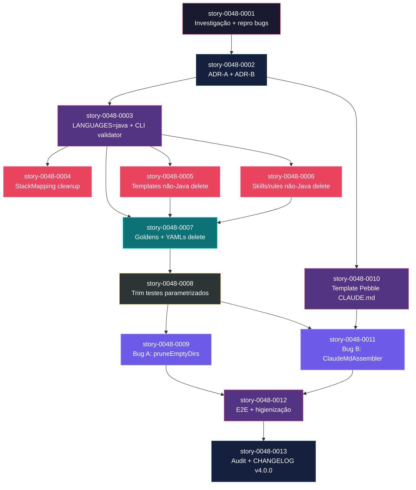

# Mapa de Implementação — EPIC-0048 (Java-Only Generator + Bug Fixes A/B)

**Gerado a partir das dependências BlockedBy/Blocks de cada história do epic-0048.**

---

## 1. Matriz de Dependências

| Story | Título | Chave Jira | Blocked By | Blocks | Status |
| :--- | :--- | :--- | :--- | :--- | :--- |
| story-0048-0001 | Investigação: inventário canônico + repro Bug A + repro Bug B | — | — | story-0048-0002 | Pendente |
| story-0048-0002 | ADR-0048-A (Java-only scope) + ADR-0048-B (CLAUDE.md contract) | — | story-0048-0001 | story-0048-0003, story-0048-0010 | Pendente |
| story-0048-0003 | Restringir LanguageFrameworkMapping + CliLanguageValidator + UnsupportedLanguageException | — | story-0048-0002 | story-0048-0004, story-0048-0005, story-0048-0006, story-0048-0007 | Pendente |
| story-0048-0004 | Limpar StackMapping + StackResolver + StackValidator (incl. csharp-dotnet leftover) | — | story-0048-0003 | — | Pendente |
| story-0048-0005 | Remover templates targets/claude/{agents,hooks,settings} não-Java | — | story-0048-0003 | story-0048-0007 | Pendente |
| story-0048-0006 | Remover skills, rules, anti-patterns, security-anti-patterns não-Java | — | story-0048-0003 | story-0048-0007 | Pendente |
| story-0048-0007 | Remover 8 goldens + 8 YAMLs setup-config (atomicamente) | — | story-0048-0003, story-0048-0005, story-0048-0006 | story-0048-0008 | Pendente |
| story-0048-0008 | Atualizar testes parametrizados: SmokeProfiles 17→9, GoldenFileTest, ConfigProfiles, expected-artifacts.json | — | story-0048-0007 | story-0048-0009 | Pendente |
| story-0048-0009 | Bug A — OutputDirectoryIntegrityTest (RED) → pruneEmptyDirs (GREEN) → regen 9 goldens | — | story-0048-0008 | story-0048-0012 | Pendente |
| story-0048-0010 | Template Pebble shared/templates/CLAUDE.md + ClaudeMdTemplateSyntaxTest | — | story-0048-0002 | story-0048-0011 | Pendente |
| story-0048-0011 | Bug B — ClaudeMdAssembler novo + registrar em AssemblerFactory + 9 goldens atualizados | — | story-0048-0010, story-0048-0008 | story-0048-0012 | Pendente |
| story-0048-0012 | Higienização + Epic0048EndToEndTest + remover @Disabled órfãos + testes negativos | — | story-0048-0009, story-0048-0011 | story-0048-0013 | Pendente |
| story-0048-0013 | Audit grep + README + CHANGELOG v4.0.0 + release notes + cleanup worktrees | — | story-0048-0012 | — | Pendente |

> **Nota 1 — Correção de simetria:** `story-0048-0004` declarou `Blocks: story-0048-0007` no arquivo de origem, mas `story-0048-0007` não lista `story-0048-0004` em `Blocked By`. Semanticamente, `0004` (limpa `StackMapping`/`StackResolver`/`StackValidator` — código Java) e `0007` (deleta 8 goldens + 8 YAMLs — recursos) são **independentes**: nenhuma das duas precisa da outra concluída para começar. Mapa normaliza: `0004` é **leaf** no ramo paralelo após `0003` (não bloqueia ninguém); `0007` depende apenas de `0003, 0005, 0006`. Essa assimetria deve ser corrigida no `story-0048-0004.md` (trocar `Blocks: story-0048-0007` por `Blocks: —`) antes do merge da investigação.
>
> **Nota 2 — Dependência implícita de ambiente:** todas as stories dependem de `execution-state.json` com `planningSchemaVersion: "2.0"` declarado + baseline verde em `develop` + tag `pre-epic-0048-java-only` criada (DoR global). Essas precondições ambientais não são modeladas no grafo de stories, mas a STORY-0048-0001 só pode iniciar após atendidas.
>
> **Nota 3 — `story-0048-0001` como gate universal:** embora o arquivo declare `Blocks` com todas as 12 stories seguintes (fechamento transitivo), a dependência **direta** é apenas sobre `story-0048-0002` (investigação → ADRs). As demais stories dependem de `0001` transitivamente via `0002`. Matriz acima registra dependências diretas para fins de cálculo de fases; regra RULE-048-08 (gate) continua valendo em nível semântico.

---

## 2. Fases de Implementação

> As histórias são agrupadas em fases. Dentro de cada fase, as histórias podem ser implementadas **em paralelo**. Uma fase só pode iniciar quando todas as dependências das fases anteriores estiverem concluídas.

```
╔══════════════════════════════════════════════════════════════════════════╗
║                   FASE 0 — Gate de Investigação                        ║
║                                                                        ║
║   ┌──────────────────────────────────────────────────────────┐         ║
║   │  story-0048-0001 — Inventário + repro bugs               │         ║
║   └──────────────────────────┬───────────────────────────────┘         ║
╚══════════════════════════════╪═════════════════════════════════════════╝
                               │
                               ▼
╔══════════════════════════════════════════════════════════════════════════╗
║                   FASE 1 — Decisões Arquiteturais                      ║
║                                                                        ║
║   ┌──────────────────────────────────────────────────────────┐         ║
║   │  story-0048-0002 — ADR-0048-A + ADR-0048-B               │         ║
║   └──────────────────────────┬───────────────────────────────┘         ║
╚══════════════════════════════╪═════════════════════════════════════════╝
                               │
            ┌──────────────────┴──────────────────┐
            ▼                                     ▼
╔══════════════════════════════════════════════════════════════════════════╗
║                   FASE 2 — Fundações (paralelo)                        ║
║                                                                        ║
║   ┌────────────────────────────┐  ┌────────────────────────────┐       ║
║   │  story-0048-0003           │  │  story-0048-0010           │       ║
║   │  Restrict LANGUAGES=java + │  │  Template CLAUDE.md Pebble │       ║
║   │  CLI validator             │  │  + syntax test             │       ║
║   └──────────────┬─────────────┘  └──────────────┬─────────────┘       ║
╚══════════════════╪════════════════════════════════╪═════════════════════╝
                   │                                │
    ┌──────────────┼──────┬─────────────┐          │
    ▼              ▼      ▼             ▼          │
╔══════════════════════════════════════════════════════════════════════════╗
║                   FASE 3 — Limpezas Paralelas (3 em paralelo)          ║
║                                                                        ║
║   ┌──────────────┐  ┌──────────────┐  ┌──────────────┐                 ║
║   │  0048-0004   │  │  0048-0005   │  │  0048-0006   │                 ║
║   │  StackMapping│  │  Templates   │  │  Skills+     │                 ║
║   │  cleanup     │  │  (agents/    │  │  rules       │                 ║
║   │  (leaf)      │  │  hooks/sett) │  │  não-Java    │                 ║
║   └──────────────┘  └──────┬───────┘  └──────┬───────┘                 ║
╚════════════════════════════╪═══════════════════╪═══════════════════════╝
                             │                   │
                             └────────┬──────────┘
                                      ▼
╔══════════════════════════════════════════════════════════════════════════╗
║                   FASE 4 — Deleção de Resources (alto risco)           ║
║                                                                        ║
║   ┌──────────────────────────────────────────────────────────┐         ║
║   │  story-0048-0007 — Deletar 8 goldens + 8 YAMLs           │         ║
║   │  (atomicamente; simetria YAML↔STACK_KEYS)                │         ║
║   └──────────────────────────┬───────────────────────────────┘         ║
╚══════════════════════════════╪═════════════════════════════════════════╝
                               │
                               ▼
╔══════════════════════════════════════════════════════════════════════════╗
║                   FASE 5 — Trim de Testes Parametrizados               ║
║                                                                        ║
║   ┌──────────────────────────────────────────────────────────┐         ║
║   │  story-0048-0008 — SmokeProfiles 17→9 + GoldenFileTest   │         ║
║   │  delegation + expected-artifacts.json regen              │         ║
║   └──────────────────────────┬───────────────────────────────┘         ║
╚══════════════════════════════╪═════════════════════════════════════════╝
                               │
          ┌────────────────────┴──────────────┐
          ▼                                    ▼
╔══════════════════════════════════════════════════════════════════════════╗
║                   FASE 6 — Bug Fixes (paralelo 2 em paralelo)          ║
║                                                                        ║
║   ┌──────────────────────────┐  ┌──────────────────────────┐           ║
║   │  story-0048-0009         │  │  story-0048-0011         │           ║
║   │  Bug A: pruneEmptyDirs   │  │  Bug B: ClaudeMdAssembler│           ║
║   │  + regen 9 goldens       │  │  + regen 9 goldens       │           ║
║   │  (RED-first)             │  │  (RED-first)             │           ║
║   └─────────────┬────────────┘  └─────────────┬────────────┘           ║
╚═════════════════╪══════════════════════════════╪══════════════════════╝
                  │                              │
                  └──────────────┬───────────────┘
                                 ▼
╔══════════════════════════════════════════════════════════════════════════╗
║                   FASE 7 — E2E + Higienização                          ║
║                                                                        ║
║   ┌──────────────────────────────────────────────────────────┐         ║
║   │  story-0048-0012 — Epic0048EndToEndTest (2 perfis) +     │         ║
║   │  testes negativos + limpeza @Disabled                    │         ║
║   └──────────────────────────┬───────────────────────────────┘         ║
╚══════════════════════════════╪═════════════════════════════════════════╝
                               │
                               ▼
╔══════════════════════════════════════════════════════════════════════════╗
║                   FASE 8 — Release v4.0.0                              ║
║                                                                        ║
║   ┌──────────────────────────────────────────────────────────┐         ║
║   │  story-0048-0013 — Audit grep + README + CHANGELOG v4    │         ║
║   │  + release notes + cleanup worktrees                     │         ║
║   └──────────────────────────────────────────────────────────┘         ║
╚══════════════════════════════════════════════════════════════════════════╝
```

---

## 3. Caminho Crítico

> O caminho crítico (a sequência mais longa de dependências) determina o tempo mínimo de implementação do épico.

```
story-0048-0001 ─► story-0048-0002 ─► story-0048-0003 ─► story-0048-0005 ─► story-0048-0007 ─► story-0048-0008 ─► story-0048-0011 ─► story-0048-0012 ─► story-0048-0013
     Fase 0            Fase 1           Fase 2           Fase 3          Fase 4          Fase 5           Fase 6            Fase 7            Fase 8
```

**9 fases no caminho crítico, 9 histórias na cadeia mais longa** (`0001 → 0002 → 0003 → 0005 → 0007 → 0008 → 0011 → 0012 → 0013`).

Caminho alternativo de mesmo comprimento: `0001 → 0002 → 0003 → 0005 → 0007 → 0008 → 0009 → 0012 → 0013` (9 stories via Bug A em vez de Bug B em Fase 6; 0011 em vez de 0009 também produz comprimento 9).

**Impacto de atrasos:** qualquer atraso em uma story do caminho crítico atrasa o release v4.0.0 na mesma proporção. Os pontos mais sensíveis são:
- **Fase 2 — story-0048-0003**: estabelece `LANGUAGES=List.of("java")` e a exceção `UnsupportedLanguageException`; é gate técnico de 4 stories subsequentes. Se slip aqui, Fase 3 inteira fica bloqueada.
- **Fase 4 — story-0048-0007**: alto risco por deletar 2.835 arquivos golden; exige atomicidade YAML↔STACK_KEYS. Testes quebram deliberadamente até Fase 5. Se `ProfileRegistrationIntegrityTest` detectar dessincronia, PR precisa ser refeito.
- **Fase 6 — stories 0009 e 0011**: ambas regeneram goldens. Dev deve sequenciar: primeiro 0009 (Bug A — remoção de dirs vazios), depois 0011 (Bug B — adição de CLAUDE.md). Fazer paralelo arrisca conflito em regeneração. Recomendação operacional: 0009 → 0011 sequencialmente dentro da Fase 6 (mesmo que o DAG permita paralelo).

---

## 4. Grafo de Dependências (Mermaid)



---

## 5. Resumo por Fase

| Fase | Histórias | Camada | Paralelismo | Pré-requisito |
| :--- | :--- | :--- | :--- | :--- |
| 0 | story-0048-0001 | Foundation (investigation gate) | 1 | — |
| 1 | story-0048-0002 | Foundation (ADRs) | 1 | Fase 0 concluída |
| 2 | story-0048-0003, story-0048-0010 | Core (CLI + template) | 2 paralelas | Fase 1 concluída |
| 3 | story-0048-0004, story-0048-0005, story-0048-0006 | Extension (cleanup por camada: domínio / templates / skills) | **3 paralelas (máximo)** | Fase 2 concluída (story-0048-0003) |
| 4 | story-0048-0007 | Extension (resource deletion, HIGH RISK) | 1 | Fase 3 concluída (stories 0005, 0006) |
| 5 | story-0048-0008 | Cross-cutting (test trim) | 1 | Fase 4 concluída |
| 6 | story-0048-0009, story-0048-0011 | Composition (bug fixes + regen goldens) | 2 paralelas (recomendação: sequencial na prática) | Fase 5 concluída + story-0048-0010 (Fase 2) |
| 7 | story-0048-0012 | Cross-cutting (E2E + higienização) | 1 | Fase 6 concluída |
| 8 | story-0048-0013 | Cross-cutting (release + docs) | 1 | Fase 7 concluída |

**Total: 13 histórias em 9 fases.**

> **Nota:** A Fase 3 é o ponto de **máximo paralelismo** (3 stories). Se houver 3 devs disponíveis nesse momento, a Fase 3 comprime de 7h+5h+6h=18h (serial) para ~7h (paralelo, limitado pela story maior — 0004). A Fase 6 oferece outro ponto de paralelismo (2 stories), mas pela natureza de regenerar goldens sugiro sequencial para evitar conflito de commits em `golden/java-*/`.

---

## 6. Detalhamento por Fase

### Fase 0 — Gate de Investigação

| Story | Escopo Principal | Artefatos Chave |
| :--- | :--- | :--- |
| story-0048-0001 | Inventário canônico + reprodução dos bugs A e B | `plans/epic-0048/reports/investigation-report.md`, `removal-inventory.md`, `repro-bug-a.sh`, `repro-bug-b.sh`, baseline metrics (wall-clock `mvn test`, LOC corpus) |

**Entregas da Fase 0:**
- Lista exata de arquivos/classes/templates/recursos/goldens/YAMLs a remover por linguagem (evita remoções ad-hoc).
- Ambiguidade `.codex/.cursor` resolvida (exploração inicial mostrou contradição entre agents; investigação fecha).
- Scripts de repro que confirmam Bug A (pastas vazias em output CLI) e Bug B (CLAUDE.md ausente na raiz) em workspace limpo.
- Baseline de performance (`mvn test` tempo antes do épico) para comparar delta final.

---

### Fase 1 — Decisões Arquiteturais

| Story | Escopo Principal | Artefatos Chave |
| :--- | :--- | :--- |
| story-0048-0002 | ADR-0048-A (java-only scope + migration path) + ADR-0048-B (CLAUDE.md contract: novo assembler vs extensão de ReadmeAssembler; schema de placeholders; overwrite behavior) | `adr/ADR-0048-java-only-scope.md`, `adr/ADR-0048-B-claude-md-contract.md`, `adr/README.md` (index) |

**Entregas da Fase 1:**
- Decisão formal java-only registrada como decisão arquitetural rastreável (ADR).
- Migration path para usuários que precisam python/go/etc (pinning v3.x; `legacy/v3` read-only).
- Contrato do CLAUDE.md: placeholders exatos (`PROJECT_NAME`, `LANGUAGE`, `FRAMEWORK`, `ARCHITECTURE`, `DATABASES`, `INTERFACE_TYPES`, `BUILD_COMMAND`, `TEST_COMMAND`); posição no pipeline (último grupo `buildRootDocAssemblers`); overwrite behavior (sempre regera; opt-out via flag `--no-claude-md`).

---

### Fase 2 — Fundações (CLI + Template)

| Story | Escopo Principal | Artefatos Chave |
| :--- | :--- | :--- |
| story-0048-0003 | `LANGUAGES=List.of("java")` + `UnsupportedLanguageException` + validação early no `GenerateCommand` + `CliLanguageValidationTest` parametrizado | `LanguageFrameworkMapping.java` (modificado), `GenerateCommand.java` (modificado), `InteractivePrompter.java` (modificado), `UnsupportedLanguageException.java` (novo), `CliLanguageValidationTest.java` (novo) |
| story-0048-0010 | Template Pebble `shared/templates/CLAUDE.md` com seções Project Overview, Stack, Build, Test, Architecture, Key Rules, Related Skills + `ClaudeMdTemplateSyntaxTest` | `java/src/main/resources/shared/templates/CLAUDE.md` (novo), `ClaudeMdTemplateSyntaxTest.java` (novo) |

**Entregas da Fase 2:**
- Source-of-truth java-only estabelecido em código (RULE-048-01 enforçada).
- Mensagem de erro UX-friendly para linguagens removidas (RULE-048-06).
- Template Pebble parseable + pronto para consumo do assembler em Fase 6.

---

### Fase 3 — Limpezas Paralelas (3 em paralelo)

| Story | Escopo Principal | Artefatos Chave |
| :--- | :--- | :--- |
| story-0048-0004 | Limpar `StackMapping` (LANGUAGE_COMMANDS 8→2, FRAMEWORK_LANGUAGE_RULES 16→2, DOCKER_BASE_IMAGES 7→1, HOOK_TEMPLATE_MAP 8→2, SETTINGS_LANG_MAP 8→2) + `StackResolver` (detectores) + `StackValidator` (constantes de versão); remove `csharp-dotnet` leftover | `StackMapping.java`, `StackResolver.java`, `StackValidator.java` (modificados); `StackMappingJavaOnlyIntegrityTest.java` (novo) |
| story-0048-0005 | Deletar 6 agents developers, 6 hook dirs, 5 settings JSON não-Java; ajustar `HooksAssembler`, `SettingsAssembler`, `AgentsAssembler` | 17 arquivos/dirs deletados em `targets/claude/{agents,hooks,settings}/`; 3 assemblers modificados |
| story-0048-0006 | Deletar 10 stack-patterns, 8 anti-patterns, 5 security-anti-patterns não-Java; ajustar `SkillsAssembler`, `SkillsCopyHelper`, `FrameworkKpWriter`, `LanguageKpWriter`, `AntiPatternsRuleWriter`, `SecurityAntiPatternsRuleWriter` | 23+ arquivos deletados; 6 writers modificados |

**Entregas da Fase 3:**
- Código de domínio (`StackMapping`, `StackResolver`, `StackValidator`) limpo.
- Templates de agents/hooks/settings não-Java removidos do classpath.
- Skills, rules e knowledge-packs não-Java removidos.
- ~40 arquivos/dirs deletados; ~9 classes Java modificadas. Todas as stories passam `mvn verify` de forma independente.

---

### Fase 4 — Deleção de Resources (HIGH RISK)

| Story | Escopo Principal | Artefatos Chave |
| :--- | :--- | :--- |
| story-0048-0007 | Deleção atômica: 8 goldens (`go-gin`, `kotlin-ktor`, `python-click-cli`, `python-fastapi`, `python-fastapi-timescale`, `rust-axum`, `typescript-commander-cli`, `typescript-nestjs` — ~2.835 arquivos) + 8 YAMLs `setup-config.*.yaml` + STACK_KEYS em `ConfigProfiles` | `java/src/test/resources/golden/{8 dirs}/` (deletados); `java/src/main/resources/shared/config-templates/setup-config.{8}.yaml` (deletados); `ConfigProfiles.java` (modificado) |

**Entregas da Fase 4:**
- 2.835+ arquivos golden removidos; golden dir contém apenas 9 perfis `java-*`.
- 8 YAMLs de perfis não-Java removidos; `ConfigProfiles.STACK_KEYS` contém apenas 10 entries (9 Java + `java-picocli-cli`).
- Simetria YAML↔STACK_KEYS mantida (`ProfileRegistrationIntegrityTest` verde).
- **Testes parametrizados deliberadamente vermelhos** — RED window intencional; fechado em Fase 5 (story-0048-0008).

---

### Fase 5 — Trim de Testes Parametrizados

| Story | Escopo Principal | Artefatos Chave |
| :--- | :--- | :--- |
| story-0048-0008 | Reduzir `SmokeProfiles.SMOKE_PROFILES` 17→9; refatorar `GoldenFileTest.profiles()` para delegar a `SmokeProfiles.profiles()` (elimina duplicação); atualizar `PENDING_SMOKE_PROFILES` em `GoldenFileCoverageTest`; trim `ConfigProfilesTest`, `ProfileRegistrationIntegrityTest`; regenerar `expected-artifacts.json` | `SmokeProfiles.java`, `GoldenFileTest.java`, `GoldenFileCoverageTest.java`, `ProfileRegistrationIntegrityTest.java`, `ConfigProfilesTest.java` (modificados); `expected-artifacts.json` (regenerado); ~20 smoke tests parametrizados ajustados |

**Entregas da Fase 5:**
- Matrizes de teste reduzidas para 9 perfis Java.
- Zero testes em estado `skipped` ou `@Disabled`.
- Cobertura JaCoCo preservada (≥95% line / ≥90% branch).
- Duplicação eliminada entre `GoldenFileTest.profiles()` e `SmokeProfiles.profileList()`.
- **GREEN recuperado** — `mvn verify` verde novamente após o RED de Fase 4.

---

### Fase 6 — Bug Fixes (2 em paralelo, recomendação sequencial)

| Story | Escopo Principal | Artefatos Chave |
| :--- | :--- | :--- |
| story-0048-0009 | Bug A: `OutputDirectoryIntegrityTest` RED-first + fix estrutural em `CopyHelpers` (post-process prune via `Files.walkFileTree` + `postVisitDirectory` + `Files.delete` quando empty) + chamada `pruneEmptyDirs` em `AssemblerPipeline.runPipeline()` pós-assembly + regenerar 9 goldens (diff esperado = apenas remoção de dirs vazios) + feature flag `--legacy-empty-dirs` | `OutputDirectoryIntegrityTest.java` (novo), `CopyHelpersPruneEmptyDirsTest.java` (novo), `CopyHelpers.java` (modificado), `AssemblerPipeline.java` (modificado), 9 goldens regenerados |
| story-0048-0011 | Bug B: `ClaudeMdRootPresenceTest` RED-first + `ClaudeMdAssembler` novo (target=`ROOT`, platforms={CLAUDE_CODE}, lê `shared/templates/CLAUDE.md`, resolve placeholders via `TemplateEngine`) + registro em `AssemblerFactory` como último grupo `buildRootDocAssemblers` + atualizar 9 goldens Java (1 `CLAUDE.md` adicional por golden) + feature flag `--no-claude-md` | `ClaudeMdAssembler.java` (novo), `ClaudeMdAssemblerTest.java` (novo), `ClaudeMdRootPresenceTest.java` (novo), `AssemblerFactory.java` (modificado), 9 goldens atualizados com `CLAUDE.md` novo |

**Entregas da Fase 6:**
- **Bug A fechado**: invariante "zero empty directories" enforçado via teste parametrizado + fix estrutural; goldens mantêm parity byte-for-byte (exceto remoção de dirs vazios legítimos).
- **Bug B fechado**: `CLAUDE.md` gerado em todo projeto Java; 9 goldens atualizados com 1 arquivo adicional cada.
- Feature flags `--legacy-empty-dirs` e `--no-claude-md` disponíveis em v4.0.0 para opt-out (rollback path).
- **Recomendação operacional**: dentro desta fase, **executar 0009 antes de 0011** mesmo sendo paralelizável no DAG — ambas regeneram goldens e rodar em paralelo arrisca conflito em `golden/java-*/`.

---

### Fase 7 — E2E + Higienização

| Story | Escopo Principal | Artefatos Chave |
| :--- | :--- | :--- |
| story-0048-0012 | `Epic0048EndToEndTest` (CLI real via ProcessBuilder, 2 perfis `java-spring` + `java-quarkus` em tempdir, valida A+B + exit codes) + testes negativos adicionais (flag vazia, YAML declara python sem `--language`) + limpeza de `@Disabled` órfãos + ajustes residuais em smoke tests | `Epic0048EndToEndTest.java` (novo); testes adicionais em `CliLanguageValidationTest`; grep `@Disabled` cleanup; smoke tests com asserts ajustados |

**Entregas da Fase 7:**
- E2E via CLI real validado: gera perfis Java em tempdir, confirma fixes de Bug A e Bug B.
- Testes negativos ampliados (config YAML, flags vazias, edge cases).
- Suíte de testes limpa (sem `@Disabled` órfãos).
- `mvn verify` verde; cobertura JaCoCo preservada.

---

### Fase 8 — Release v4.0.0

| Story | Escopo Principal | Artefatos Chave |
| :--- | :--- | :--- |
| story-0048-0013 | Audit grep (0 hits de linguagens removidas em caminhos executáveis) + atualizar README raiz (java-only) + atualizar CLAUDE.md raiz do repo + CHANGELOG.md v4.0.0 (Added/Removed/Fixed/Breaking sections) + `release-notes-v4.0.0.md` + `plans/epic-0048/reports/epic-execution-report.md` (métricas baseline vs final) + cleanup worktrees (documentar comando `x-git-cleanup-branches`) | `README.md`, `CLAUDE.md` (raiz), `CHANGELOG.md` (modificados); `release-notes-v4.0.0.md`, `epic-execution-report.md` (novos) |

**Entregas da Fase 8:**
- Sanidade final: audit grep retorna 0 hits órfãos.
- Documentação user-facing atualizada.
- Release v4.0.0 pronto para cut.
- Métricas finais publicadas: LOC removidas (>10k esperado), tempo `mvn test` (-30% esperado), coverage preservada, Bug A e Bug B fechados.

---

## 7. Observações Estratégicas

### Gargalo Principal — story-0048-0003

A story-0048-0003 (restringir `LANGUAGES=List.of("java")` + CLI validator + `UnsupportedLanguageException`) **bloqueia 4 stories diretamente** (0004, 0005, 0006, 0007) e transitivamente bloqueia todas as stories de remoção, testes, bug fixes e release. É o ponto técnico onde o `source-of-truth` passa de multi-linguagem para java-only.

**Recomendação**: investir tempo extra de design nessa story paga em redução de retrabalho downstream. Especificamente:
- Mensagem de erro (RULE-048-06) deve ser exata — qualquer ajuste depois exige regen de `CliLanguageValidationTest`.
- Early validation no `GenerateCommand` deve vir ANTES de qualquer resolução de stack (evita NPE downstream).
- `UnsupportedLanguageException` bem desenhada (mensagem rica, logger structured) — será referenciada em 12 stories.

### Histórias Folha (sem dependentes) — story-0048-0004 e story-0048-0013

- **story-0048-0004**: leaf após Fase 3. Limpa código de domínio (`StackMapping`, `StackResolver`, `StackValidator`) sem bloquear ninguém. **Pode absorver slip** — se o dev de Fase 3 atrasar, esse slip não afeta o caminho crítico. Bom candidato para desenvolvedor júnior ou paralelização.
- **story-0048-0013**: leaf final. Todo o épico converge para ela. Por estar no fim, atrasos aqui atrasam o release diretamente — não é "folha absorvedora de risco", é "ponta do caminho crítico".

### Otimização de Tempo

- **Maximizar paralelismo na Fase 3**: 3 stories (0004, 0005, 0006) podem rodar em paralelo se houver 3 devs. Com 1 dev: 7h+5h+6h=18h. Com 3 devs: max(7,5,6)=7h. **Economia: ~11h** se paralelizado.
- **Fase 2 também paraleliza**: 0003 (5h) + 0010 (3h) = 8h serial; max=5h paralelo. Economia: ~3h.
- **Fase 6 NÃO paralelizar na prática**: 0009 (8h) + 0011 (10h) — paralelismo arrisca conflito em regeneração de goldens. Preferência: sequencial 0009→0011. Sem perda no caminho crítico (0009 ou 0011 ambos levam a 0012).

**Tempo mínimo ótimo (3 devs):** ~65-70h (vs 85h serial). Com 1 dev: 85h.

### Dependências Cruzadas — Ponto de Convergência em story-0048-0011

A story-0048-0011 (Bug B) é o único ponto onde dois ramos do DAG convergem:
- Ramo 1 (principal): `0001 → 0002 → 0003 → 0005/0006 → 0007 → 0008 → 0011`
- Ramo 2 (template): `0001 → 0002 → 0010 → 0011`

**Implicação:** antes de começar 0011, o dev precisa garantir que AMBOS os ramos estão verdes:
- Ramo 1 entregou: testes parametrizados reduzidos (0008) e código java-only (0003-0007).
- Ramo 2 entregou: template Pebble pronto e validado (0010).

Se o template de 0010 mudar estrutura após 0011 iniciar, regen de goldens precisa ser refeito. **Recomendação**: 0010 tem a ser mergeada em `develop` antes de 0011 ser iniciada (não apenas "concluída localmente").

### Marco de Validação Arquitetural — Fim da Fase 6 (Bugs fechados)

**Checkpoint**: após Fase 6 (stories 0009 e 0011 mergeadas), rodar smoke completa antes de seguir para Fase 7:

```bash
mvn clean verify                                # coverage ≥95/90
mvn process-resources                           # regen .claude/
mvn exec:java ... GoldenFileRegenerator         # golden parity
git status                                       # árvore limpa
find <output> -type d -empty | wc -l             # esperado 0 (Bug A fix)
find <output> -maxdepth 2 -name CLAUDE.md | wc -l  # esperado 9 (Bug B fix)
```

Se qualquer verificação falhar, **pausar e investigar** antes de avançar para 0012. Correções após este ponto custam caro porque 0012 e 0013 tocam em artefatos user-facing (README, CHANGELOG).

Este checkpoint valida:
- Padrão de assembler (ClaudeMdAssembler como modelo para eventuais root-files futuros).
- Padrão de invariante (OutputDirectoryIntegrityTest como modelo para enforce-by-test).
- Pipeline pós-assembly (prune hook como extensão legítima de `AssemblerPipeline`).

---

## 8. Grafo de Dependências Task-Level

Todas as 13 stories declaram tasks formais no padrão `TASK-0048-YYYY-NNN` (Seção 8 de cada story, 3-5 tasks por story, total ~50-65 tasks). Como o grafo task-level cruza story boundaries em vários pontos (ex: 0011 consome template de 0010 via TASK-0048-0010-001; 0008 regenera `expected-artifacts.json` que 0007 deleta referências) e a análise completa exigiria ler todas as 13 stories em detalhe, remeto ao consumo direto pelo orquestrador `x-epic-implement` em tempo de execução.

**Nota**: a skill `x-epic-implement` v2 (EPIC-0038) computa a ordem topológica task-level automaticamente a partir das declarações `Dependencies` de cada task em cada story, respeitando waves definidas neste mapa de fases. Não é necessário duplicar essa computação estaticamente aqui.

### Critical Files for Implementation

Os arquivos críticos já estão listados em `epic-0048.md` (Seção 2 — Anexos e Referências) e em cada `story-0048-XXXX.md` (Seção 5 — Contratos de Dados).

---

## Resumo Final

- **13 histórias** distribuídas em **9 fases**
- **Caminho crítico: 9 histórias** (`0001 → 0002 → 0003 → 0005 → 0007 → 0008 → 0011 → 0012 → 0013`)
- **Máximo paralelismo: 3 (Fase 3)**; parallelism secundário: 2 (Fases 2 e 6)
- **Gargalo principal:** story-0048-0003 (source-of-truth java-only)
- **Histórias folha:** story-0048-0004 (absorve slip) e story-0048-0013 (release)
- **Pontos de convergência:** story-0048-0011 (ramo principal + ramo template)
- **Checkpoints arquiteturais:** fim da Fase 1 (ADRs), fim da Fase 6 (bugs fechados)
- **Estimativa:** 85h serial (1 dev) / ~65-70h com 3 devs em paralelização máxima em Fases 2 e 3

> **Gerado por `/x-epic-map` em 2026-04-16.**
> Próximo passo: `/x-epic-implement EPIC-0048` ou `/x-story-implement STORY-0048-0001` para iniciar execução.
