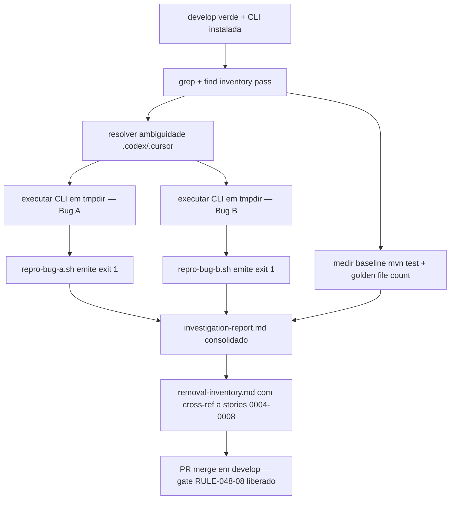

# História: Investigação — inventário canônico + repro Bug A + repro Bug B

**ID:** story-0048-0001
**Chave Jira:** —
**Status:** Concluída

## 1. Dependências

| Blocked By | Blocks |
| :--- | :--- |
| — | story-0048-0002, story-0048-0003, story-0048-0004, story-0048-0005, story-0048-0006, story-0048-0007, story-0048-0008, story-0048-0009, story-0048-0010, story-0048-0011, story-0048-0012, story-0048-0013 |

## 2. Regras Transversais Aplicáveis

> Referência às regras definidas no Épico (seção 4). Listar apenas as regras que impactam esta história.

| ID | Título |
| :--- | :--- |
| RULE-048-08 | Investigation Precedes Removal |
| RULE-048-02 | Non-Language Dimensions Preserved (para evitar marcação errada de dimensões ortogonais) |
| RULE-048-07 | Atomic, Reversible Commits |
| RULE-048-09 | TDD Red-Green-Refactor (os scripts repro serão base dos testes RED-first nas stories 0009/0011) |

## 3. Descrição

Como **Maintainer do gerador ia-dev-env**, eu quero um **inventário canônico** de todos os arquivos, símbolos e mapeamentos associados a cada linguagem não-Java (python, go, kotlin, typescript, rust, csharp) no repositório, **mais** dois scripts reproduzíveis que confirmam empiricamente os Bugs A (pastas vazias no output) e B (CLAUDE.md raiz ausente), garantindo que nenhuma remoção ou fix posterior comece sem uma base factual auditada e que ambiguidades observadas durante o planejamento (ex.: contradição entre agents de exploração sobre `.codex/` e `.cursor/`) sejam resolvidas por evidência — não por suposição.

Esta é a story-gate do épico (RULE-048-08). Nenhuma das stories de remoção (0003–0008) ou fix (0009, 0011) pode iniciar antes que o inventário aqui produzido esteja mergeado em `develop`. O risco de abrir remoção sem inventário é deletar algo ortogonal (RULE-048-02: databases, mensageria, padrões de arquitetura, interface types, compliance frameworks) achando que é língua; ou pior, deixar resíduo (exemplo concreto já identificado: `csharp-dotnet` leftover em `StackMapping.java` sem perfil/golden correspondente). O risco inverso — abrir fix de Bug A/B sem repro reproduzível — é consertar o sintoma em golden e deixar o defeito no código de produção (o autor explicitamente decidiu que é fix estrutural, não patch em golden).

Os artefatos são markdown/shell scripts depositados em `plans/epic-0048/reports/`. Não há mudança de código Java nesta story. Não há mudança de templates, rules, ou resources. O único commit que altera `.claude/` ou `java/src/**` desta story é eventualmente um registro textual de linhas exatas a preservar (nenhuma remoção). Saídas: (1) `investigation-report.md` com narrativa + decisões; (2) `removal-inventory.md` com tabela linha-por-linha do que sai em cada story futura; (3) `repro-bug-a.sh` — script bash que executa a CLI em `/tmp/` e falha se encontrar diretório vazio no output; (4) `repro-bug-b.sh` — script bash que executa a CLI e falha se `CLAUDE.md` raiz estiver ausente ou < 100 bytes.

### 3.1 Inventário canônico de remoção

- Para cada linguagem em `{python, go, kotlin, typescript, rust, csharp}`, listar em `removal-inventory.md`:
  - **Código fonte**: linhas exatas em `LanguageFrameworkMapping.java`, `StackMapping.java`, `StackResolver.java`, `StackValidator.java` (formato `path:lineno` + snippet de 1 linha);
  - **Templates**: arquivos/dirs em `java/src/main/resources/targets/claude/{agents/developers,hooks,settings}/` com caminho absoluto relativo ao repo root;
  - **Skills/Rules/Anti-Patterns**: arquivos em `java/src/main/resources/targets/claude/skills/knowledge-packs/stack-patterns/**` e `rules/conditional/{anti-patterns,security-anti-patterns}/**`;
  - **Goldens**: diretórios em `java/src/test/resources/golden/` (contagem de arquivos por `find -type f | wc -l`);
  - **YAMLs**: `java/src/main/resources/shared/config-templates/setup-config.*.yaml` a deletar.
- Cada linha do inventário é cross-referenciada à story que fará a remoção (0004, 0005, 0006 ou 0007).

### 3.2 Resolução de ambiguidade `.codex/` e `.cursor/`

- Durante o planejamento, agents de exploração divergiram sobre se `.codex/` e `.cursor/` são dirs de entrada (fontes do gerador) ou dirs de saída (output plataforma-específico). Esta story resolve empiricamente:
  - Executar `grep -rn "\\.codex\\b" java/src` e `grep -rn "\\.cursor\\b" java/src` e classificar cada hit como "fonte" (template) ou "output" (criado pela CLI);
  - Confirmar se existe qualquer assembler que escreva em `AssemblerTarget.CODEX` ou `AssemblerTarget.CURSOR`;
  - Documentar veredito em `investigation-report.md` seção "Ambiguity resolution — `.codex` / `.cursor`".

### 3.3 Repro script para Bug A (pastas vazias)

- `plans/epic-0048/reports/repro-bug-a.sh`: script bash portable (`#!/usr/bin/env bash`, `set -euo pipefail`) que:
  1. Cria `TMPDIR=$(mktemp -d)`;
  2. Executa `ia-dev-env generate --profile java-spring --out "$TMPDIR/out"` (assume CLI instalada via `./mvnw -pl java -am install` prévio; o script declara isso no header);
  3. Procura diretórios vazios bottom-up: `find "$TMPDIR/out" -type d -empty`;
  4. Se houver hits, imprime os paths e `exit 1` (confirma Bug A); se não, `exit 0` (nega Bug A).
- Output esperado na execução atual (baseline pre-fix): `exit 1` com `.github/`, `.codex/`, `.cursor/` listados (ou subset equivalente).

### 3.4 Repro script para Bug B (CLAUDE.md raiz ausente)

- `plans/epic-0048/reports/repro-bug-b.sh`: mesma shape de `repro-bug-a.sh`, mas:
  1. Gera projeto idêntico em `$TMPDIR`;
  2. Verifica `test -f "$TMPDIR/out/CLAUDE.md"`;
  3. Se arquivo ausente, `exit 1` com mensagem `"Bug B confirmed: CLAUDE.md not generated"`;
  4. Se presente mas `< 100 bytes`, `exit 1` com mensagem de tamanho insuficiente;
  5. Caso contrário, `exit 0`.
- Output esperado baseline: `exit 1`.

### 3.5 Baseline metrics (feed para RULE-048-10 e métricas de sucesso)

- Medir e registrar em `investigation-report.md`:
  - `mvn test` wall-clock (média de 3 runs) — input para métrica "−30%" da seção 10 da spec;
  - Contagem de arquivos em `java/src/test/resources/golden/` (input para target ≤2.500);
  - Contagem de perfis em `SmokeProfiles.profileList()` (baseline 17);
  - Coverage atual via `mvn verify` (baseline ≥ 95%/90%).

### 3.6 Divergências e riscos destacados

- Seção final de `investigation-report.md` lista divergências entre (a) inventário real e (b) spec `spec-epic-0048.md` (exemplo: se a spec lista 8 YAMLs a deletar mas apenas 7 existem, a story seguinte 0007 deve ser ajustada antes de iniciar);
- Lista riscos operacionais: ex. `GoldenFileCoverageTest` com `PENDING_SMOKE_PROFILES` que pode quebrar em deleção atômica.

## 3.5 Entrega de Valor

- **Valor Principal:** Gate factual do épico estabelecido — inventário canônico + bugs reproduzíveis servem de base única de verdade para todas as 12 stories subsequentes, eliminando retrabalho por ambiguidade e suposição.
- **Métrica de Sucesso:** 4 artefatos depositados em `plans/epic-0048/reports/`; `repro-bug-a.sh` e `repro-bug-b.sh` retornam `exit 1` em `develop` atual (ambos bugs confirmados); inventário documenta ≥ 95% dos arquivos/linhas a serem removidos nas stories 0004–0008 (medido em 0013 pelo `git diff --stat` vs. inventário).
- **Impacto no Negócio:** Manutenibilidade do gerador aumenta — time pode planejar remoções em PRs pequenos e bisect-able, e o release v4.0.0 documenta exatamente o que mudou e por quê.

## 4. Definições de Qualidade Locais

### DoR Local (Definition of Ready)

- [ ] Baseline verde em `develop` (`mvn clean verify` passa)
- [ ] Branch `feature/epic-0048-java-only-generator` criada a partir de `develop`
- [ ] Tag `pre-epic-0048-java-only` criada em `develop` (rollback anchor) antes do merge desta story
- [ ] Branch `backup/pre-epic-0048` congelada
- [ ] `planningSchemaVersion: "2.0"` declarado em `execution-state.json` deste épico
- [ ] CLI instalável localmente (autor confirma `./mvnw -pl java -am install` funcional)

### DoD Local (Definition of Done)

- [ ] `plans/epic-0048/reports/investigation-report.md` com 5 seções obrigatórias (Inventário, Ambiguity `.codex`/`.cursor`, Bug A, Bug B, Baseline metrics + Divergências)
- [ ] `plans/epic-0048/reports/removal-inventory.md` com tabela linha-por-linha cross-referenciada a stories 0004–0008
- [ ] `plans/epic-0048/reports/repro-bug-a.sh` executável (`chmod +x`), `exit 1` na `develop` atual, `shellcheck` limpo
- [ ] `plans/epic-0048/reports/repro-bug-b.sh` executável, `exit 1` na `develop` atual, `shellcheck` limpo
- [ ] Pelo menos 1 teste automatizado N/A nesta story (story é investigativa; `shellcheck` dos scripts e `markdownlint` dos reports cobrem sanidade)
- [ ] Smoke test: N/A (nenhum código Java modificado)
- [ ] Commits atômicos (RULE-048-07) em formato Conventional Commits com escopo `docs(task-0048-0001-NNN)` ou `chore(task-0048-0001-NNN)`

### Global Definition of Done (DoD)

> Referência rápida ao Épico (seção 3). Esta story é investigativa — a maior parte do DoD Global aplica-se às stories que a consomem.

- **Cobertura:** ≥ 95% Line / ≥ 90% Branch (JaCoCo). N/A nesta story (sem código Java).
- **Testes Automatizados:** N/A nesta story; artefatos são feed para stories futuras.
- **Documentação:** 4 artefatos em `plans/epic-0048/reports/`.
- **Persistência:** N/A.
- **Performance:** medição de baseline `mvn test` registrada.
- **Backward Compatibility:** não se aplica (sem mudança de código).

## 5. Contratos de Dados (Data Contract)

> Story investigativa — "data contract" é a tabela de arquivos de entrada (inputs de leitura) e artefatos de saída (outputs produzidos). Seções 5.3 e 5.4 não se aplicam.

### 5.1 Inputs (arquivos/comandos lidos)

| Fonte | Tipo | Uso |
| :--- | :--- | :--- |
| `java/src/main/java/**/*.java` | Código fonte | `grep` + análise AST leve para inventário |
| `java/src/main/resources/targets/claude/**` | Templates | `find` para listar arquivos por linguagem |
| `java/src/main/resources/shared/config-templates/setup-config.*.yaml` | Config YAML | listar 8 YAMLs não-Java a deletar |
| `java/src/test/resources/golden/**` | Golden files | contar arquivos por perfil (`find -type f \| wc -l`) |
| `java/src/test/java/dev/iadev/smoke/SmokeProfiles.java` | Código teste | obter lista atual de 17 perfis |
| `develop` branch em estado verde | Estado git | baseline para `mvn test` timing |
| CLI `ia-dev-env` instalada localmente | Binário | executar repro-bug scripts |

### 5.2 Outputs (artefatos produzidos)

| Artefato | Tipo | Localização |
| :--- | :--- | :--- |
| `investigation-report.md` | Markdown (narrativa + decisões) | `plans/epic-0048/reports/investigation-report.md` |
| `removal-inventory.md` | Markdown (tabela cross-ref) | `plans/epic-0048/reports/removal-inventory.md` |
| `repro-bug-a.sh` | Shell script (POSIX bash) | `plans/epic-0048/reports/repro-bug-a.sh` |
| `repro-bug-b.sh` | Shell script (POSIX bash) | `plans/epic-0048/reports/repro-bug-b.sh` |

## 6. Diagramas

### 6.1 Fluxo de investigação



## 7. Critérios de Aceite (Gherkin)

```gherkin
Cenario: inventário exato de arquivos não-Java é produzido e cross-referenciado
  DADO que develop está verde e CLI ia-dev-env instalada localmente
  QUANDO o maintainer executa os greps e finds do script de inventário
  E grava os resultados em plans/epic-0048/reports/removal-inventory.md
  ENTÃO cada linha lista path:lineno + snippet + story-target (0004|0005|0006|0007)
  E a soma de arquivos listados cobre ≥ 95% dos arquivos efetivamente removidos nas stories subsequentes (medido em STORY-0048-0013)

Cenario: ambiguidade .codex/.cursor resolvida por evidência
  DADO que investigation-report.md contém a seção "Ambiguity resolution"
  QUANDO grep -rn "\.codex\b" java/src e grep -rn "\.cursor\b" java/src são executados
  ENTÃO cada hit é classificado como "fonte" (template sob targets/claude/) ou "output" (criado pela CLI)
  E o veredito declara se .codex/.cursor são pastas de entrada, saída, ou ambos
  E se forem criadas como dirs vazios pela CLI, são explicitamente listados como casos de Bug A

Cenario: Bug A reproduzido em workspace fresh
  DADO que repro-bug-a.sh está executável e shellcheck-limpo
  QUANDO o script roda em /tmp com a CLI atual de develop
  ENTÃO o find -type d -empty encontra ao menos 1 diretório vazio no output
  E o script retorna exit 1 com a lista de paths vazios impressa em stderr
  E essa lista inclui pelo menos um de {.github, .codex, .cursor}

Cenario: Bug B reproduzido em workspace fresh
  DADO que repro-bug-b.sh está executável e shellcheck-limpo
  QUANDO o script roda em /tmp com a CLI atual de develop
  ENTÃO test -f CLAUDE.md retorna falso OU o arquivo tem tamanho < 100 bytes
  E o script retorna exit 1 com mensagem "Bug B confirmed: CLAUDE.md not generated" em stderr

Cenario: divergências entre spec e realidade são destacadas antes das remoções
  DADO que investigation-report.md inclui seção "Divergências entre spec e inventário real"
  QUANDO o inventário encontra arquivo listado na spec mas ausente no repo (ou vice-versa)
  ENTÃO a divergência é registrada com recomendação explícita de ajuste em STORY-0048-000X antes do merge
```

### 7.1 Scenario Ordering (TPP)

Ordem TPP: inventário (transformação simples de leitura) → resolução de ambiguidade (classificação) → repro Bug A (script leve) → repro Bug B (script leve) → divergências (análise comparativa).

### 7.2 Mandatory Scenario Categories

- [x] Degenerate cases (ambiguidade sem evidência é resolvida por `grep`)
- [x] Happy path (inventário produzido e scripts reprodutíveis)
- [x] Error paths (bugs A e B confirmados por `exit 1`)
- [x] Boundary values (divergências entre spec e realidade — edge case do planejamento)

### 7.3 TDD Implementation Notes

- Os scripts `repro-bug-a.sh` e `repro-bug-b.sh` são os testes RED-first consumidos pelas stories 0009 (Bug A) e 0011 (Bug B) — eles viram a base dos acceptance tests `OutputDirectoryIntegrityTest` e `ClaudeMdRootPresenceTest`.
- `investigation-report.md` é a "outer-loop assertion" do épico: o que não foi inventariado não será removido.

## 8. Tasks

### TASK-0048-0001-001: Grep/find inventory pass + gravar `removal-inventory.md`

- **Layer:** Doc
- **Test Type:** Verification (shellcheck + markdownlint + manual spot-check de 10 linhas aleatórias)
- **Size:** M
- **Dependencies:** —
- **Branch:** `feat/task-0048-0001-001-removal-inventory`
- **Testability:** Config + VerificationTest
- **Files:**
  - `plans/epic-0048/reports/removal-inventory.md`
- **Acceptance Criteria:**
  - [ ] Tabela cobre as 6 linguagens (python, go, kotlin, typescript, rust, csharp)
  - [ ] Cada linha tem formato `path:lineno | snippet | story-target`
  - [ ] Cross-ref a stories 0004, 0005, 0006, 0007 presente em ≥ 1 linha cada
  - [ ] `markdownlint` passa

### TASK-0048-0001-002: Resolver ambiguidade `.codex`/`.cursor` + gravar seção em `investigation-report.md`

- **Layer:** Doc
- **Test Type:** Verification (seção existe e contém veredito categórico)
- **Size:** S
- **Dependencies:** TASK-0048-0001-001
- **Branch:** `feat/task-0048-0001-002-ambiguity-resolution`
- **Testability:** Config + VerificationTest
- **Files:**
  - `plans/epic-0048/reports/investigation-report.md` (criação parcial — seção "Ambiguity resolution")
- **Acceptance Criteria:**
  - [ ] Seção "Ambiguity resolution — `.codex` / `.cursor`" presente
  - [ ] Veredito categórico: "fonte", "output", ou "ambos" com grep-evidence citado
  - [ ] Se dirs vazios criados pela CLI, linkar à seção Bug A

### TASK-0048-0001-003: Escrever `repro-bug-a.sh` + validar `exit 1` na `develop`

- **Layer:** Test (artefato shell; acceptance test do épico)
- **Test Type:** Smoke
- **Size:** S
- **Dependencies:** TASK-0048-0001-001
- **Branch:** `feat/task-0048-0001-003-repro-bug-a`
- **Testability:** Migration + Smoke
- **Files:**
  - `plans/epic-0048/reports/repro-bug-a.sh`
- **Acceptance Criteria:**
  - [ ] Shebang `#!/usr/bin/env bash` + `set -euo pipefail`
  - [ ] `shellcheck plans/epic-0048/reports/repro-bug-a.sh` retorna exit 0
  - [ ] Executa `ia-dev-env generate --profile java-spring` em `mktemp -d`
  - [ ] Na `develop` atual: `exit 1` com paths vazios listados

### TASK-0048-0001-004: Escrever `repro-bug-b.sh` + validar `exit 1` na `develop`

- **Layer:** Test (artefato shell; acceptance test do épico)
- **Test Type:** Smoke
- **Size:** S
- **Dependencies:** TASK-0048-0001-001
- **Branch:** `feat/task-0048-0001-004-repro-bug-b`
- **Testability:** Migration + Smoke
- **Files:**
  - `plans/epic-0048/reports/repro-bug-b.sh`
- **Acceptance Criteria:**
  - [ ] Shebang + `set -euo pipefail`
  - [ ] `shellcheck` limpo
  - [ ] Verifica `test -f CLAUDE.md` E `filesize ≥ 100 bytes`
  - [ ] Na `develop` atual: `exit 1` com mensagem "Bug B confirmed: CLAUDE.md not generated"

### TASK-0048-0001-005: Consolidar `investigation-report.md` + baseline metrics + divergências

- **Layer:** Doc
- **Test Type:** Verification
- **Size:** M
- **Dependencies:** TASK-0048-0001-001, TASK-0048-0001-002, TASK-0048-0001-003, TASK-0048-0001-004
- **Branch:** `feat/task-0048-0001-005-investigation-report-final`
- **Testability:** Config + VerificationTest
- **Files:**
  - `plans/epic-0048/reports/investigation-report.md` (consolidação final)
- **Acceptance Criteria:**
  - [ ] 5 seções obrigatórias presentes (Inventário, Ambiguity, Bug A, Bug B, Baseline metrics + Divergências)
  - [ ] Baseline `mvn test` wall-clock registrado (média de 3 runs)
  - [ ] Contagem atual de golden files e perfis documentada
  - [ ] Divergências entre spec e realidade destacadas com recomendação de ajuste
