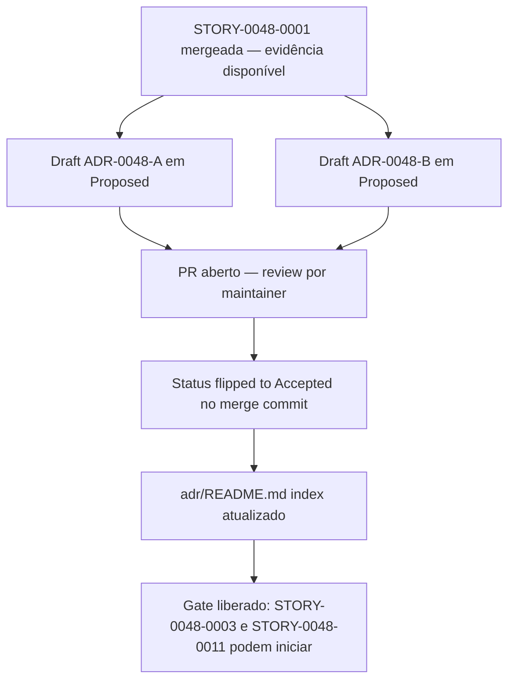

# História: ADR-0048-A (Java-only scope) + ADR-0048-B (CLAUDE.md contract)

**ID:** story-0048-0002
**Chave Jira:** —
**Status:** Pendente

## 1. Dependências

| Blocked By | Blocks |
| :--- | :--- |
| story-0048-0001 | story-0048-0003, story-0048-0010, story-0048-0011 |

## 2. Regras Transversais Aplicáveis

| ID | Título |
| :--- | :--- |
| RULE-048-01 | Java-Only Scope |
| RULE-048-05 | CLAUDE.md é Root-File Obrigatório |
| RULE-048-07 | Atomic, Reversible Commits |

## 3. Descrição

Como **Arquiteto do gerador ia-dev-env**, eu quero **duas ADRs formais** — `ADR-0048-A` documentando a decisão de restringir o gerador a Java-only e o migration path para usuários v3.x, e `ADR-0048-B` documentando o contrato do `CLAUDE.md` raiz (assembler dedicado vs extensão, schema de placeholders Pebble, behavior de overwrite, interação com `FileCategorizer.isRootFile`) — garantindo que decisões irreversíveis (remoção de linguagens; novo assembler no pipeline) tenham rastreabilidade formal antes da primeira linha de código ser tocada.

A decisão Java-only é um breaking change (v4.0.0, RULE-048-01). Sem ADR assinado em `Accepted` antes de STORY-0048-0003 (que começa a restringir `LanguageFrameworkMapping.LANGUAGES`), o épico não tem âncora documental para o release notes, nem para responder "por que python/go/kotlin/typescript/rust/csharp foram removidos" nos próximos 12 meses. ADR-0048-A deve cobrir: contexto (custo multi-linguagem mensurado em STORY-0048-0001), decisão (lista exata de linguagens mantidas/removidas, incluindo `csharp-dotnet` leftover), consequências (branch `legacy/v3` read-only, pinning v3.x, feature flags temporárias `--legacy-empty-dirs` e `--no-claude-md`), e alternativas rejeitadas (plugin system, família multi-linguagem, deprecação gradual por N minors).

ADR-0048-B é o contrato do novo `ClaudeMdAssembler` que entra em STORY-0048-0011. A spec (seção 2, tabela de decisões) confirma "single-responsibility, novo assembler dedicado, não extender `ReadmeAssembler`". ADR-0048-B formaliza isso: escopo do assembler (apenas `CLAUDE.md` raiz, target=`AssemblerTarget.ROOT`, platforms=`{CLAUDE_CODE}`), schema de placeholders Pebble (`{{PROJECT_NAME}}`, `{{LANGUAGE}}`, `{{FRAMEWORK}}`, `{{ARCHITECTURE}}`, `{{DATABASES}}`, `{{INTERFACE_TYPES}}`, `{{BUILD_COMMAND}}`, `{{TEST_COMMAND}}` — mínimos; o ADR define se são todos obrigatórios ou se há defaults), ordem de registro em `AssemblerFactory` (último grupo `buildRootDocAssemblers`), interação com `FileCategorizer.isRootFile(CLAUDE.md)` (já retorna true — sem mudança; o ADR confirma), e comportamento de overwrite (sempre regenera; não preserva user edits — documentado como limitação).

Ambas as ADRs são escritas em `adr/` seguindo o template padrão do projeto (Status, Context, Decision, Consequences, Alternatives Considered). Nenhuma ADR é criada nova desta story além dessas duas — o épico não altera o template ADR em si. O index `adr/README.md` é atualizado para listar as duas novas entradas em ordem numérica.

### 3.1 ADR-0048-A (Java-only scope)

- Local: `adr/ADR-0048-java-only-scope.md`.
- Seções obrigatórias:
  - **Status:** `Proposed` no commit inicial → `Accepted` no merge do PR (edit incluído no mesmo PR que merge para `develop`).
  - **Context:** custo multi-linguagem (cita números de STORY-0048-0001: ~2.835 arquivos golden, 17 perfis smoke, 6+1 linguagens, csharp-dotnet leftover); decisão do autor que 100% do uso é Java (linkar a decisão registrada em plan `quero-que-voce-crie-shimmering-crab.md`).
  - **Decision:** `LanguageFrameworkMapping.LANGUAGES == List.of("java")`. Lista de linguagens removidas: python, go, kotlin, typescript, rust, csharp. Justificar inclusão explícita de `csharp` mesmo sem perfil real (elimina leftover em `StackMapping`).
  - **Consequences:** v4.0.0 MAJOR; branch `legacy/v3` read-only; pinning instruction em release notes; feature flags temporárias v4.0.0-only (`--legacy-empty-dirs`, `--no-claude-md`) removidas em v5.0.0; `UnsupportedLanguageException` introduzida; mensagem CLI exata (RULE-048-06).
  - **Alternatives Considered:** (i) plugin system per-linguagem (rejeitado: alta complexidade arquitetural para caso de uso hipotético); (ii) deprecação gradual por 3 minors (rejeitado: custo de manutenção durante janela excede valor); (iii) manter linguagens com perfil real, remover apenas csharp leftover (rejeitado: não resolve problema estrutural de 2.835 arquivos golden).
- Status final após merge: `Accepted`.

### 3.2 ADR-0048-B (CLAUDE.md contract)

- Local: `adr/ADR-0048-B-claude-md-contract.md`.
- Seções obrigatórias:
  - **Status:** `Proposed` → `Accepted` no merge.
  - **Context:** Bug B reproduzido em STORY-0048-0001 (`repro-bug-b.sh`); `FileCategorizer.isRootFile` já reconhece `CLAUDE.md` (linha 88) mas nenhum assembler produz; contrato Claude-Code requer `CLAUDE.md` auto-loaded (cita CLAUDE.md raiz deste repo como referência de pattern).
  - **Decision:** novo `ClaudeMdAssembler implements Assembler` (single-responsibility), target=`AssemblerTarget.ROOT`, platforms=`{CLAUDE_CODE}`; template Pebble em `shared/templates/CLAUDE.md`; placeholders mínimos `{{PROJECT_NAME}}`, `{{LANGUAGE}}` (sempre "java" por RULE-048-01), `{{FRAMEWORK}}`, `{{ARCHITECTURE}}`, `{{DATABASES}}`, `{{INTERFACE_TYPES}}`, `{{BUILD_COMMAND}}`, `{{TEST_COMMAND}}`; registrado em `AssemblerFactory` como último grupo `buildRootDocAssemblers`; overwrite sempre (não preserva edits do usuário).
  - **Consequences:** 9 goldens Java ganharão `CLAUDE.md` novo em STORY-0048-0011; `ClaudeMdRootPresenceTest` parametrizado nos 9 perfis; feature flag `--no-claude-md` disponível em v4.0.0; `ReadmeAssembler` continua responsável por `.claude/README.md` (sem colisão).
  - **Alternatives Considered:** (i) estender `ReadmeAssembler` para produzir também `CLAUDE.md` (rejeitado: viola SRP, complica testes, mistura responsabilidades); (ii) CLAUDE.md como parte de config YAML declarativo (rejeitado: placeholders dinâmicos exigem template engine — Pebble já em uso); (iii) `CLAUDE.md` estático no projeto gerado (rejeitado: precisa refletir `{{FRAMEWORK}}`/`{{DATABASES}}` do perfil).
- Status final após merge: `Accepted`.

### 3.3 Atualização do index `adr/README.md`

- Adicionar 2 linhas na tabela de ADRs: `ADR-0048-A — Java-Only Scope (Accepted)` e `ADR-0048-B — CLAUDE.md Contract (Accepted)`.
- Se `adr/README.md` não existir como tabela, criar entries seguindo o padrão dos ADRs já presentes (ex.: link, título, data, status).
- Ordem numérica respeitada; ADR-0048-A precede ADR-0048-B por convenção alfanumérica.

## 3.5 Entrega de Valor

- **Valor Principal:** Decisões arquiteturais irreversíveis documentadas com rastreabilidade formal — release notes v4.0.0 e respostas a "por quê" para os próximos anos têm uma fonte autoritativa única.
- **Métrica de Sucesso:** 2 ADRs mergeadas em status `Accepted` antes de STORY-0048-0003 (RULE-048-01 gate) e STORY-0048-0011 (RULE-048-05 gate); `adr/README.md` atualizado; linkadas em `epic-0048.md` seção 2.
- **Impacto no Negócio:** Manutenibilidade do gerador e onboarding de novos maintainers — qualquer pergunta sobre o escopo ou sobre o contrato CLAUDE.md encontra resposta numa ADR, não numa conversa perdida ou commit message antigo.

## 4. Definições de Qualidade Locais

### DoR Local (Definition of Ready)

- [ ] STORY-0048-0001 mergeada em `develop` (inventário + repro-bugs disponíveis como evidência)
- [ ] `investigation-report.md` referenciável pelos ADRs (seção Baseline metrics)
- [ ] Template ADR padrão do projeto identificado (conferir formato de ADR-0001..ADR-0005)
- [ ] `adr/README.md` ou equivalente localizado como index alvo de atualização

### DoD Local (Definition of Done)

- [ ] `adr/ADR-0048-java-only-scope.md` mergeado com status `Accepted`
- [ ] `adr/ADR-0048-B-claude-md-contract.md` mergeado com status `Accepted`
- [ ] `adr/README.md` atualizado com entries para ambas ADRs em ordem numérica
- [ ] Links cruzados: cada ADR linka à outra; ambas linkam a `epic-0048.md` e `spec-epic-0048.md`
- [ ] Pelo menos 1 teste automatizado: N/A (story puramente documental; `markdownlint` dos arquivos cobre sanidade sintática)
- [ ] Smoke test: N/A (nenhum código Java modificado)
- [ ] Commits atômicos (RULE-048-07) com escopo `docs(task-0048-0002-NNN)`

### Global Definition of Done (DoD)

- **Cobertura:** N/A (sem código Java).
- **Testes Automatizados:** `markdownlint` sobre `adr/ADR-0048-*.md` em CI (se config presente).
- **Documentação:** 2 ADRs + index atualizado = entregáveis principais.
- **Persistência:** N/A.
- **Performance:** N/A.
- **Backward Compatibility:** ADR-0048-A documenta explicitamente o migration path (pinning v3.x).

## 5. Contratos de Dados (Data Contract)

> Story documental — "data contract" é schema das ADRs e arquivos tocados.

### 5.1 Inputs (leitura)

| Fonte | Tipo | Uso |
| :--- | :--- | :--- |
| `plans/epic-0048/reports/investigation-report.md` | Markdown | Baseline metrics, evidência de Bugs A/B, ambiguity resolution |
| `plans/epic-0048/reports/removal-inventory.md` | Markdown | Lista de linguagens removidas (consumo em ADR-0048-A Decision) |
| `adr/ADR-0005-*.md` (e anteriores) | Markdown | Template de formato/seções ADR do projeto |
| `CLAUDE.md` raiz do repo | Markdown | Referência de contrato CLAUDE.md (ADR-0048-B Context) |
| `java/src/main/java/dev/iadev/cli/FileCategorizer.java:88` | Código Java | Confirmar que `isRootFile("CLAUDE.md") == true` (cita em ADR-0048-B) |

### 5.2 Outputs (artefatos escritos)

| Artefato | Tipo | Localização |
| :--- | :--- | :--- |
| `ADR-0048-java-only-scope.md` | Markdown (ADR) | `adr/ADR-0048-java-only-scope.md` |
| `ADR-0048-B-claude-md-contract.md` | Markdown (ADR) | `adr/ADR-0048-B-claude-md-contract.md` |
| `adr/README.md` (update) | Markdown (index) | `adr/README.md` |

## 6. Diagramas

### 6.1 Fluxo de aprovação das ADRs



## 7. Critérios de Aceite (Gherkin)

```gherkin
Cenario: ADR-0048-A cobre todas as seções exigidas e endereça migration path
  DADO que o rascunho ADR-0048-A foi escrito consumindo investigation-report.md
  QUANDO um maintainer revisa o arquivo adr/ADR-0048-java-only-scope.md
  ENTÃO estão presentes as seções Status, Context, Decision, Consequences, Alternatives Considered
  E a seção Decision nomeia explicitamente {python, go, kotlin, typescript, rust, csharp} como removidas
  E a seção Consequences documenta branch legacy/v3 read-only e pinning v3.x para usuários

Cenario: ADR-0048-B especifica schema de placeholders e escolha de assembler dedicado
  DADO que o rascunho ADR-0048-B foi escrito consumindo a spec (decisão 3)
  QUANDO um maintainer revisa o arquivo adr/ADR-0048-B-claude-md-contract.md
  ENTÃO a Decision declara ClaudeMdAssembler dedicado (não extensão de ReadmeAssembler)
  E lista os 8 placeholders Pebble mínimos ({{PROJECT_NAME}}, {{LANGUAGE}}, {{FRAMEWORK}}, {{ARCHITECTURE}}, {{DATABASES}}, {{INTERFACE_TYPES}}, {{BUILD_COMMAND}}, {{TEST_COMMAND}})
  E confirma registro em AssemblerFactory como último grupo buildRootDocAssemblers

Cenario: ambos ADRs flipam para Accepted antes do merge e bloqueiam gates
  DADO que PR da story-0048-0002 está aberto com ADRs em Proposed
  QUANDO o PR é mergeado em develop
  ENTÃO ambos arquivos têm Status: Accepted no commit de merge
  E nenhum merge de STORY-0048-0003 ou STORY-0048-0011 pode ocorrer com ADRs em Proposed

Cenario: index ADR atualizado com ambas entries em ordem numérica
  DADO que adr/README.md existe como tabela/lista de ADRs do projeto
  QUANDO as 2 novas ADRs são mergeadas
  ENTÃO adr/README.md contém linhas novas para ADR-0048-A e ADR-0048-B
  E ambas aparecem em ordem numérica (após ADR-0005 ou última ADR existente)
  E cada linha tem título, link relativo e status Accepted
```

### 7.1 Scenario Ordering (TPP)

Ordem TPP: cobertura de seções (verificação estrutural simples) → especificação de schema (verificação de conteúdo) → gate de merge (integração) → atualização de index (boundary case).

### 7.2 Mandatory Scenario Categories

- [x] Degenerate cases (seção ausente em ADR é rejeitada em review)
- [x] Happy path (ambas ADRs cobrem todo conteúdo exigido)
- [x] Error paths (tentativa de merge com status Proposed é bloqueada)
- [x] Boundary values (index atualizado na posição correta)

### 7.3 TDD Implementation Notes

- Story documental; não há TDD cycles. `markdownlint` atua como "test" estrutural.
- Cada ADR é "outer loop" das stories que depende dela (0003 consome ADR-A; 0011 consome ADR-B).

## 8. Tasks

### TASK-0048-0002-001: Escrever `ADR-0048-A` (Java-only scope)

- **Layer:** Doc
- **Test Type:** Verification (seções obrigatórias presentes + markdownlint)
- **Size:** M
- **Dependencies:** —
- **Branch:** `docs/task-0048-0002-001-adr-0048-a-java-only`
- **Testability:** Config + VerificationTest
- **Files:**
  - `adr/ADR-0048-java-only-scope.md`
- **Acceptance Criteria:**
  - [ ] Seções Status, Context, Decision, Consequences, Alternatives Considered presentes
  - [ ] Decision lista explicitamente as 6 linguagens removidas incluindo `csharp`
  - [ ] Consequences documenta pinning v3.x e feature flags v4.0.0-only
  - [ ] `markdownlint` limpo

### TASK-0048-0002-002: Escrever `ADR-0048-B` (CLAUDE.md contract)

- **Layer:** Doc
- **Test Type:** Verification
- **Size:** M
- **Dependencies:** —
- **Branch:** `docs/task-0048-0002-002-adr-0048-b-claude-md-contract`
- **Testability:** Config + VerificationTest
- **Files:**
  - `adr/ADR-0048-B-claude-md-contract.md`
- **Acceptance Criteria:**
  - [ ] Seções obrigatórias presentes
  - [ ] Decision nomeia `ClaudeMdAssembler` dedicado + 8 placeholders Pebble mínimos
  - [ ] Consequences descreve registro em `AssemblerFactory.buildRootDocAssemblers` e feature flag `--no-claude-md`
  - [ ] Linka ADR-0048-A (cross-ref)
  - [ ] `markdownlint` limpo

### TASK-0048-0002-003: Atualizar `adr/README.md` index com ambas as entries

- **Layer:** Doc
- **Test Type:** Verification (entries presentes + ordem numérica preservada)
- **Size:** S
- **Dependencies:** TASK-0048-0002-001, TASK-0048-0002-002
- **Branch:** `docs/task-0048-0002-003-adr-index-update`
- **Testability:** Config + VerificationTest
- **Files:**
  - `adr/README.md`
- **Acceptance Criteria:**
  - [ ] `adr/README.md` contém linha para ADR-0048-A (após última ADR anterior, em ordem numérica)
  - [ ] `adr/README.md` contém linha para ADR-0048-B (imediatamente após ADR-0048-A)
  - [ ] Ambas linhas têm status `Accepted` e links relativos corretos
  - [ ] `markdownlint` limpo
