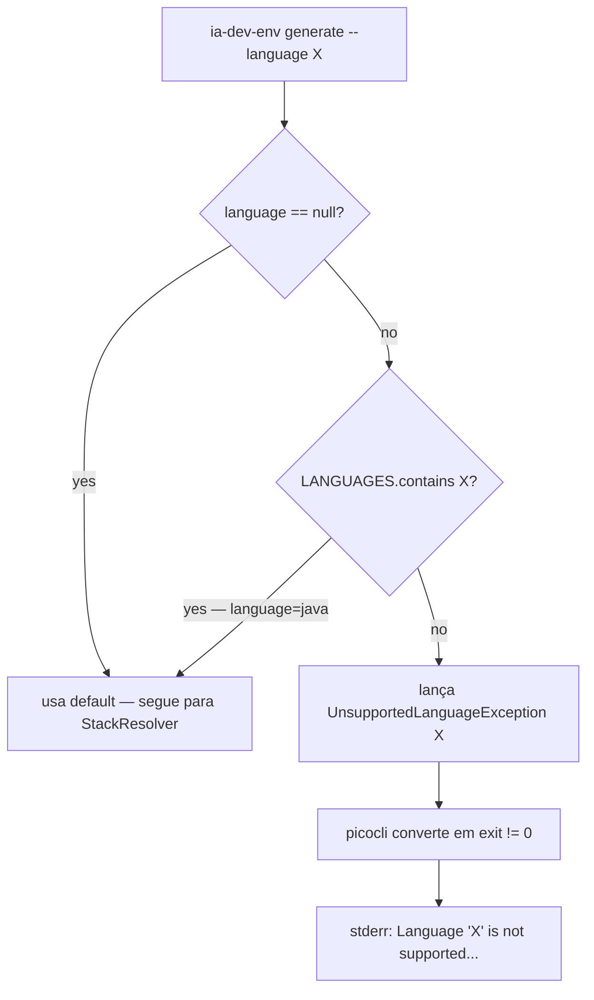

# História: Restringir LanguageFrameworkMapping + CliLanguageValidator + UnsupportedLanguageException

**ID:** story-0048-0003
**Chave Jira:** —
**Status:** Concluída

## 1. Dependências

| Blocked By | Blocks |
| :--- | :--- |
| story-0048-0002 | story-0048-0004, story-0048-0005, story-0048-0006, story-0048-0007 |

## 2. Regras Transversais Aplicáveis

| ID | Título |
| :--- | :--- |
| RULE-048-01 | Java-Only Scope |
| RULE-048-06 | Unsupported Language Message |
| RULE-048-07 | Atomic, Reversible Commits |
| RULE-048-09 | TDD Red-Green-Refactor |
| RULE-048-10 | JaCoCo Coverage Mantido |

## 3. Descrição

Como **Desenvolvedor do gerador ia-dev-env**, eu quero **restringir `LanguageFrameworkMapping.LANGUAGES` a `List.of("java")`**, introduzir uma nova `UnsupportedLanguageException` no pacote `dev.iadev.cli`, adicionar validação early no `GenerateCommand` para `--language` inválido, e ajustar o `InteractivePrompter` para short-circuit quando a lista de linguagens tem apenas 1 item, garantindo que a source-of-truth Java-only seja estabelecida tecnicamente antes das remoções em massa das stories 0004–0008.

Esta é a primeira story de código do épico e age como **source-of-truth technical gate**: a partir daqui, `LANGUAGES == List.of("java")` é verdade no código, e qualquer mapeamento em `StackMapping` que ainda liste outras linguagens passa a ser código morto (removido na STORY-0048-0004). A mensagem de erro exata de RULE-048-06 — `"Language '<x>' is not supported. Only 'java' is available (see CHANGELOG v4.0.0 / EPIC-0048)."` — é implementada aqui via `UnsupportedLanguageException.getMessage()` e validada por um teste parametrizado novo `CliLanguageValidationTest` cobrindo `python|go|kotlin|typescript|rust|csharp|foo|""|null`.

A validação early em `GenerateCommand` evita NPE e silent fallback (RULE-048-06 forbids ambos): o check acontece antes do `StackResolver` ser invocado. O `InteractivePrompter` atual apresenta a lista de linguagens ao usuário em modo interativo; com apenas 1 item, o comportamento UX razoável é pular a pergunta e usar "java" diretamente (short-circuit). Sem esse ajuste, o usuário é forçado a confirmar "java" repetidamente — friction desnecessário. O teste `InteractivePrompterTest` existente é adaptado para cobrir o short-circuit. Nenhum golden file é tocado nesta story (os goldens não expõem `LANGUAGES` diretamente; eles expõem o output do generator que consome o mapping — e como o único perfil válido continua sendo Java, o output permanece byte-for-byte idêntico, preservando RULE-048-03).

### 3.1 Criar `UnsupportedLanguageException`

- Local: `java/src/main/java/dev/iadev/cli/UnsupportedLanguageException.java`.
- Extends `RuntimeException` (alinhado com outras exceptions do pacote `cli`, ex.: pattern observado em `InvalidProfileException` se existir; caso contrário, extends `RuntimeException` diretamente).
- Construtor único: `public UnsupportedLanguageException(String attemptedLanguage)` → `super(String.format("Language '%s' is not supported. Only 'java' is available (see CHANGELOG v4.0.0 / EPIC-0048).", attemptedLanguage))`.
- Método `public String attemptedLanguage()` retorna o valor original para consumidores de teste.
- Sem campos mutáveis; record-like no shape (classe final, imutável).

### 3.2 Restringir `LanguageFrameworkMapping.LANGUAGES`

- Local: `java/src/main/java/dev/iadev/cli/LanguageFrameworkMapping.java`.
- Atual: `LANGUAGES = List.of("java", "python", "go", "kotlin", "typescript", "rust")` (linhas 19-20 conforme `epic-0048.md` referência).
- Novo: `LANGUAGES = List.of("java")`.
- Consequência imediata: `FRAMEWORKS`, `BUILD_TOOLS`, `DEFAULT_VERSIONS`, `FRAMEWORK_VERSIONS`, `ARCH_PATTERN_LANGUAGES` permanecem com shape de map mas apenas entries Java sobrevivem — remoção explícita das outras entries **nesta story** para evitar código morto (RULE-048-10 exige cobertura, e entries mortas diluem coverage).
- Unit tests existentes em `LanguageFrameworkMappingTest.java` são ajustados: cenários com `"python"|"go"|etc.` removidos ou migrados para `CliLanguageValidationTest` onde validam rejeição.

### 3.3 Validação early em `GenerateCommand`

- Local: `java/src/main/java/dev/iadev/cli/GenerateCommand.java`.
- Inserir ponto de validação em método de entrada (antes de `StackResolver.resolve(...)`): se `language != null && !LanguageFrameworkMapping.LANGUAGES.contains(language)` → lançar `new UnsupportedLanguageException(language)`.
- Comportamento de `language == null` (omitido na CLI): manter default atual (assumir "java") — preserva backward compat declarada no DoD Global.
- Comportamento de `language == ""` (string vazia explícita): rejeitar com `UnsupportedLanguageException("")` (degenerate case; evita passar string vazia adiante).
- Exit code: picocli converte `RuntimeException` em exit != 0 por padrão; garantir que a mensagem vai para stderr via handler existente (sem alteração de handler necessária se já funciona).

### 3.4 Ajuste em `InteractivePrompter` — short-circuit

- Local: `java/src/main/java/dev/iadev/cli/InteractivePrompter.java`.
- Modo interativo atual pergunta a linguagem ao usuário. Com `LANGUAGES.size() == 1`, o prompter deve pular a pergunta e usar `LANGUAGES.get(0)` (= "java") diretamente.
- Implementação: `if (LanguageFrameworkMapping.LANGUAGES.size() == 1) { return LanguageFrameworkMapping.LANGUAGES.get(0); }` antes do código de prompt interativo.
- Teste `InteractivePrompterTest` atualizado: adicionar cenário `shortCircuits_whenSingleLanguageAvailable_returnsJava_withoutPrompt`.

### 3.5 Novo teste `CliLanguageValidationTest` (parametrizado)

- Local: `java/src/test/java/dev/iadev/cli/CliLanguageValidationTest.java`.
- `@ParameterizedTest` com `@ValueSource(strings = {"python", "go", "kotlin", "typescript", "rust", "csharp", "foo", "java-17", "JAVA"})` cobrindo variações.
- Cada caso: invoca `GenerateCommand` com `--language <value>` via `CommandLine` picocli em `StringWriter` capture; assert:
  - exit code != 0;
  - stderr contém exatamente: `"Language '<value>' is not supported. Only 'java' is available (see CHANGELOG v4.0.0 / EPIC-0048)."`.
- Cenário adicional `nullLanguage_isAcceptedAsDefault`: `--language` omitido → exit == 0 (ou pelo menos não falha pela validação de linguagem; pode falhar em outro estágio, mas não em `UnsupportedLanguageException`).
- Cenário `emptyLanguage_isRejected`: `--language ""` → exit != 0 com mensagem apontando `''`.
- Cenário `javaLanguage_isAcceptedExplicitly`: `--language java` → passa a validação (sem `UnsupportedLanguageException`).

## 3.5 Entrega de Valor

- **Valor Principal:** Source-of-truth Java-only estabelecida no código; mensagem UX-friendly para usuários que tentam linguagens removidas; gate técnico liberado para todas as remoções em massa das stories 0004–0008.
- **Métrica de Sucesso:** `LanguageFrameworkMapping.LANGUAGES.size() == 1`; `CliLanguageValidationTest` cobre 9+ cenários parametrizados (green); coverage de `UnsupportedLanguageException` e caminhos novos em `GenerateCommand` ≥ 95% line / ≥ 90% branch; `mvn verify` verde; nenhum golden alterado (RULE-048-03).
- **Impacto no Negócio:** Qualidade dos projetos gerados preservada (comportamento Java inalterado) e débito técnico de multi-linguagem começa a diminuir — próximos PRs podem remover código morto com segurança.

## 4. Definições de Qualidade Locais

### DoR Local (Definition of Ready)

- [ ] STORY-0048-0001 mergeada (inventário disponível)
- [ ] STORY-0048-0002 mergeada com ADR-0048-A em `Accepted` (RULE-048-01 gate liberado)
- [ ] `LanguageFrameworkMapping.java` linhas 19-20 confirmadas como source-of-truth atual (não foi movido)
- [ ] `GenerateCommand.java` ponto de entrada identificado para validação early
- [ ] `picocli 4.7` runtime behavior confirmado: `RuntimeException` dentro de subcommand → exit != 0

### DoD Local (Definition of Done)

- [ ] `UnsupportedLanguageException.java` criada com mensagem exata (RULE-048-06)
- [ ] `LanguageFrameworkMapping.LANGUAGES == List.of("java")` + entries mortas removidas de maps derivados
- [ ] `GenerateCommand` rejeita `--language` não-Java com exit != 0 e stderr correto
- [ ] `InteractivePrompter` short-circuit implementado e testado
- [ ] `CliLanguageValidationTest` parametrizado verde (≥ 9 cenários)
- [ ] `LanguageFrameworkMappingTest.java` e `InteractivePrompterTest.java` ajustados sem `@Disabled`
- [ ] Coverage JaCoCo: ≥ 95% line / ≥ 90% branch nas classes novas/modificadas (RULE-048-10)
- [ ] Nenhum golden file tocado (RULE-048-03)
- [ ] `mvn verify` verde
- [ ] Commits atômicos (RULE-048-07) — 1 commit por task

### Global Definition of Done (DoD)

- **Cobertura:** ≥ 95% Line / ≥ 90% Branch (JaCoCo) global e nas classes modificadas.
- **Testes Automatizados:** `CliLanguageValidationTest` (novo, ≥ 9 cenários) + ajustes em testes existentes.
- **Documentação:** `UnsupportedLanguageException` tem Javadoc com link a ADR-0048-A e RULE-048-06.
- **Persistência:** N/A.
- **Performance:** N/A (validação adiciona 1 comparação de lista O(1)).
- **Backward Compatibility:** `--language` omitido continua funcionando; `--language java` continua funcionando.

## 5. Contratos de Dados (Data Contract)

> Story de refatoração + nova exceção — "data contract" é assinatura de classes/métodos e comportamento CLI observável.

### 5.1 Inputs (arquivos modificados — leitura + escrita)

| Fonte | Tipo | Uso |
| :--- | :--- | :--- |
| `java/src/main/java/dev/iadev/cli/LanguageFrameworkMapping.java` | Código Java (modificar) | Restringir `LANGUAGES` + limpar maps derivados |
| `java/src/main/java/dev/iadev/cli/GenerateCommand.java` | Código Java (modificar) | Adicionar validação early |
| `java/src/main/java/dev/iadev/cli/InteractivePrompter.java` | Código Java (modificar) | Short-circuit quando 1 linguagem |
| `java/src/test/java/dev/iadev/cli/LanguageFrameworkMappingTest.java` | Código Java (ajustar) | Remover cenários de linguagens removidas |
| `java/src/test/java/dev/iadev/cli/InteractivePrompterTest.java` | Código Java (ajustar) | Adicionar cenário short-circuit |
| `adr/ADR-0048-java-only-scope.md` | Markdown (consumo) | Cita como fonte da decisão |

### 5.2 Outputs (artefatos novos/modificados)

| Artefato | Tipo | Localização |
| :--- | :--- | :--- |
| `UnsupportedLanguageException.java` | Classe Java (nova) | `java/src/main/java/dev/iadev/cli/UnsupportedLanguageException.java` |
| `CliLanguageValidationTest.java` | Teste Java (novo, parametrizado) | `java/src/test/java/dev/iadev/cli/CliLanguageValidationTest.java` |
| `LanguageFrameworkMapping.java` | Classe Java (modificada) | `LANGUAGES=List.of("java")` + maps limpos |
| `GenerateCommand.java` | Classe Java (modificada) | Validação early inserida |
| `InteractivePrompter.java` | Classe Java (modificada) | Short-circuit inserido |

### 5.3 Comportamento CLI observável

| Entrada | Exit code | Stderr |
| :--- | :--- | :--- |
| `ia-dev-env generate` (sem `--language`) | 0 (continua para demais validações) | — |
| `ia-dev-env generate --language java` | 0 (continua) | — |
| `ia-dev-env generate --language python` | != 0 | `Language 'python' is not supported. Only 'java' is available (see CHANGELOG v4.0.0 / EPIC-0048).` |
| `ia-dev-env generate --language ""` | != 0 | `Language '' is not supported. Only 'java' is available (see CHANGELOG v4.0.0 / EPIC-0048).` |
| `ia-dev-env generate --language JAVA` (case-sensitive) | != 0 | `Language 'JAVA' is not supported. ...` |

## 6. Diagramas

### 6.1 Fluxo de validação `--language`



## 7. Critérios de Aceite (Gherkin)

```gherkin
Cenario: degenerate — language null é aceito como default
  DADO que o usuário executa ia-dev-env generate sem passar --language
  QUANDO GenerateCommand é invocado
  ENTÃO a validação early de --language não lança UnsupportedLanguageException
  E o fluxo prossegue para StackResolver normalmente
  E exit code é 0 (se demais validações passam)

Cenario: happy path — --language java é aceito explicitamente
  DADO que o usuário executa ia-dev-env generate --language java
  QUANDO GenerateCommand é invocado
  ENTÃO a validação early passa
  E exit code é 0 (se demais validações passam)

Cenario: unhappy — --language python é rejeitado com mensagem RULE-048-06 exata
  DADO que o usuário executa ia-dev-env generate --language python
  QUANDO GenerateCommand é invocado
  ENTÃO UnsupportedLanguageException é lançada com attemptedLanguage == "python"
  E picocli mapeia para exit != 0
  E stderr contém exatamente: "Language 'python' is not supported. Only 'java' is available (see CHANGELOG v4.0.0 / EPIC-0048)."

Cenario: boundary — --language "" (string vazia) é rejeitado
  DADO que o usuário executa ia-dev-env generate --language ""
  QUANDO GenerateCommand é invocado
  ENTÃO UnsupportedLanguageException é lançada com attemptedLanguage == ""
  E exit code != 0
  E stderr contém "Language ''" no início da mensagem

Cenario: boundary — case-sensitive: --language JAVA é rejeitado
  DADO que o usuário executa ia-dev-env generate --language JAVA
  QUANDO GenerateCommand é invocado
  ENTÃO UnsupportedLanguageException é lançada (LANGUAGES.contains não é case-insensitive)
  E exit code != 0

Cenario: InteractivePrompter short-circuit quando há apenas 1 linguagem
  DADO que LanguageFrameworkMapping.LANGUAGES.size() == 1
  QUANDO InteractivePrompter.promptLanguage é invocado
  ENTÃO retorna "java" sem imprimir prompt ao usuário
  E nenhum Scanner.nextLine é consumido
```

### 7.1 Scenario Ordering (TPP)

Ordem TPP: degenerate (null) → happy path (java) → unhappy (python) → boundary (string vazia) → boundary (case-sensitivity) → UX behavior (short-circuit). Progressão simples→complexa.

### 7.2 Mandatory Scenario Categories

- [x] Degenerate cases (null, empty)
- [x] Happy path (java)
- [x] Error paths (python, JAVA, foo, etc. via parametrização)
- [x] Boundary values (empty string, case-sensitivity)

### 7.3 TDD Implementation Notes

- **Double-Loop TDD**: primeiro cenário Gherkin ("degenerate — null é default") é o acceptance test externo (outer loop). Cenários parametrizados do `CliLanguageValidationTest` são inner loop.
- **TPP**: começa com `null` (degenerate) → `"java"` (unconditional happy) → `"python"` (conditional error) → `""` (boundary) → `"JAVA"` (case boundary).
- `UnsupportedLanguageException` precede `GenerateCommand` modification (inner-most class primeiro).

## 8. Tasks

### TASK-0048-0003-001: Criar `UnsupportedLanguageException` com mensagem RULE-048-06 exata

- **Layer:** Domain (classe de exceção no pacote `cli`, mas com semântica de domain-error)
- **Test Type:** Unit
- **Size:** S
- **Dependencies:** —
- **Branch:** `feat/task-0048-0003-001-unsupported-language-exception`
- **Testability:** Domain + UnitTest
- **Files:**
  - `java/src/main/java/dev/iadev/cli/UnsupportedLanguageException.java`
  - `java/src/test/java/dev/iadev/cli/UnsupportedLanguageExceptionTest.java`
- **Acceptance Criteria:**
  - [ ] Construtor recebe `String attemptedLanguage`
  - [ ] `getMessage()` retorna exatamente o template RULE-048-06
  - [ ] `attemptedLanguage()` getter expõe o valor original
  - [ ] Cobertura ≥ 95% line / ≥ 90% branch

### TASK-0048-0003-002: Restringir `LANGUAGES` + limpar maps derivados em `LanguageFrameworkMapping`

- **Layer:** Domain
- **Test Type:** Unit
- **Size:** M
- **Dependencies:** TASK-0048-0003-001
- **Branch:** `refactor/task-0048-0003-002-restrict-language-mapping`
- **Testability:** Domain + UnitTest
- **Files:**
  - `java/src/main/java/dev/iadev/cli/LanguageFrameworkMapping.java`
  - `java/src/test/java/dev/iadev/cli/LanguageFrameworkMappingTest.java`
- **Acceptance Criteria:**
  - [ ] `LANGUAGES == List.of("java")`
  - [ ] `FRAMEWORKS`, `BUILD_TOOLS`, `DEFAULT_VERSIONS`, `FRAMEWORK_VERSIONS`, `ARCH_PATTERN_LANGUAGES` apenas com entries Java (entries de outras linguagens removidas)
  - [ ] Testes ajustados (cenários de python/go/etc. removidos ou realocados)
  - [ ] Coverage ≥ 95%/90%

### TASK-0048-0003-003: Validação early em `GenerateCommand`

- **Layer:** Application
- **Test Type:** Unit
- **Size:** S
- **Dependencies:** TASK-0048-0003-001, TASK-0048-0003-002
- **Branch:** `feat/task-0048-0003-003-generate-command-language-validation`
- **Testability:** UseCase + AT (validação é pré-condição do use case)
- **Files:**
  - `java/src/main/java/dev/iadev/cli/GenerateCommand.java`
  - `java/src/test/java/dev/iadev/cli/GenerateCommandTest.java` (ajuste ou criação de cenário dedicado)
- **Acceptance Criteria:**
  - [ ] Validação ocorre ANTES de `StackResolver.resolve`
  - [ ] `null` aceito como default (sem lançar)
  - [ ] `""` rejeitado com `UnsupportedLanguageException`
  - [ ] Demais valores não-contidos em `LANGUAGES` rejeitados
  - [ ] Coverage ≥ 95%/90%

### TASK-0048-0003-004: `CliLanguageValidationTest` parametrizado (9+ cenários)

- **Layer:** Test
- **Test Type:** Integration (invoca picocli `CommandLine.execute` com stderr capture)
- **Size:** M
- **Dependencies:** TASK-0048-0003-003
- **Branch:** `test/task-0048-0003-004-cli-language-validation-test`
- **Testability:** Endpoint + APITest (CLI command é o endpoint)
- **Files:**
  - `java/src/test/java/dev/iadev/cli/CliLanguageValidationTest.java`
- **Acceptance Criteria:**
  - [ ] `@ParameterizedTest` cobre `python, go, kotlin, typescript, rust, csharp, foo, JAVA, ""` (9 valores mínimo)
  - [ ] Cada caso valida exit != 0 + stderr com mensagem exata RULE-048-06
  - [ ] Cenário dedicado `nullLanguage_isAcceptedAsDefault`
  - [ ] Cenário dedicado `javaLanguage_isAcceptedExplicitly`

### TASK-0048-0003-005: Short-circuit em `InteractivePrompter` quando 1 linguagem

- **Layer:** Adapter.inbound (CLI UI)
- **Test Type:** Unit
- **Size:** S
- **Dependencies:** TASK-0048-0003-002
- **Branch:** `feat/task-0048-0003-005-prompter-short-circuit`
- **Testability:** Domain + UnitTest
- **Files:**
  - `java/src/main/java/dev/iadev/cli/InteractivePrompter.java`
  - `java/src/test/java/dev/iadev/cli/InteractivePrompterTest.java`
- **Acceptance Criteria:**
  - [ ] `promptLanguage` retorna `LANGUAGES.get(0)` quando size == 1, sem ler `Scanner`
  - [ ] Cenário de teste `shortCircuits_whenSingleLanguageAvailable` verde
  - [ ] Cenário com lista size > 1 preservado (lógica antiga intacta — futuro-proof, caso lista volte a crescer em nova major)
  - [ ] Coverage ≥ 95%/90%
