# História: Limpar StackMapping + StackResolver + StackValidator (incl. csharp-dotnet leftover)

**ID:** story-0048-0004
**Chave Jira:** —
**Status:** Pendente

## 1. Dependências

| Blocked By | Blocks |
| :--- | :--- |
| story-0048-0003 | — |

> **Nota de simetria:** `story-0048-0004` (limpeza de código Java em `StackMapping`/`StackResolver`/`StackValidator`) e `story-0048-0007` (deleção de goldens + YAMLs) são semanticamente **independentes** — nenhuma precisa da outra concluída para iniciar. `0004` é leaf no ramo paralelo após `0003`. Ver `IMPLEMENTATION-MAP.md` §1 Nota 1.

## 2. Regras Transversais Aplicáveis

> Referência às regras definidas no Épico (seção 4). Listar apenas as regras que impactam esta história.

| ID | Título |
| :--- | :--- |
| RULE-048-01 | Java-Only Scope |
| RULE-048-02 | Non-Language Dimensions Preserved |
| RULE-048-07 | Atomic, Reversible Commits |
| RULE-048-10 | JaCoCo Coverage Mantido |

## 3. Descrição

Como **Maintainer do gerador `ia-dev-env`**, eu quero reduzir as estruturas de mapeamento e resolução de stack em `dev.iadev.domain.stack` ao subconjunto Java, garantindo que o domínio deixe de carregar branches mortas para python/go/kotlin/typescript/rust/csharp e que o leftover histórico `csharp-dotnet` (presente em `StackMapping` sem perfil/golden correspondente desde EPIC-0027) seja removido de uma vez.

Hoje `StackMapping` expõe 5 mapas estáticos multi-linguagem: `LANGUAGE_COMMANDS` (8 entradas), `FRAMEWORK_LANGUAGE_RULES` (16 entradas), `DOCKER_BASE_IMAGES` (7 entradas), `HOOK_TEMPLATE_MAP` (8 entradas) e `SETTINGS_LANG_MAP` (8 entradas). Após esta story esses mapas ficam com 2, 2, 1, 2 e 2 entradas respectivamente (apenas `java`, `java-maven`/`java-gradle`, `spring-boot`/`quarkus`). `StackResolver` perde os detectores `go.mod`, `package.json`, `pyproject.toml`, `Cargo.toml`, `*.csproj` e `build.gradle.kts` quando este último é reintroduzido apenas como variante Java. `StackValidator` perde as constantes de versão não-Java (CPython 3.12, Go 1.22, Rust 1.80, Kotlin 2.0, Node 20, .NET 8).

A story respeita RULE-048-02: databases, mensageria, arquitetura, interface types e compliance permanecem intactos — o corte é cirúrgico no eixo linguagem/framework-de-linguagem. O gate de entrada é STORY-0048-0003 (source-of-truth Java-only em `LanguageFrameworkMapping`), sem a qual o teste RED `StackMappingJavaOnlyIntegrityTest` não tem base para asserir. O gate de saída é STORY-0048-0007, que usa estes mapas limpos para validar simetria YAML↔STACK_KEYS antes de deletar goldens físicos.

### 3.1 Limpeza em `StackMapping`

- `LANGUAGE_COMMANDS`: reduzir de 8 → 2 entradas (`java-maven`, `java-gradle`).
- `FRAMEWORK_LANGUAGE_RULES`: reduzir de 16 → 2 entradas (`spring-boot → java`, `quarkus → java`).
- `DOCKER_BASE_IMAGES`: reduzir de 7 → 1 entrada (`java → eclipse-temurin:21-jre-alpine` ou equivalente atual).
- `HOOK_TEMPLATE_MAP`: reduzir de 8 → 2 entradas (`java-maven`, `java-gradle`).
- `SETTINGS_LANG_MAP`: reduzir de 8 → 2 entradas (`java-maven`, `java-gradle`).
- Remover o leftover `csharp-dotnet` de onde quer que ele apareça (confirmado em `LANGUAGE_COMMANDS` e `SETTINGS_LANG_MAP`).
- `FRAMEWORK_PORTS`, `FRAMEWORK_HEALTH_PATHS`, `INTERFACE_SPEC_PROTOCOL_MAP`: reter apenas entradas relevantes a spring/quarkus + interface types ortogonais.

### 3.2 Limpeza em `StackResolver`

- Remover detectores de arquivo: `go.mod`, `package.json`, `pyproject.toml`, `Cargo.toml`, `*.csproj`.
- `build.gradle.kts` permanece **apenas** como variante Java-Gradle (não Kotlin).
- Detector de `pom.xml` permanece.
- Branches de fallback que retornavam "python" ou "unknown" são removidas — fallback vira `throw UnsupportedLanguageException` via caller (RULE-048-06).

### 3.3 Limpeza em `StackValidator`

- Remover constantes de versão: Python (3.12+), Go (1.22+), Rust (1.80+), Kotlin (2.0+), Node/TS (20+), .NET (8+).
- Reter constantes: Java (21+), Maven (3.9+), Gradle (8.5+ apenas se Gradle-Java).
- Método `validateLanguageVersion(language, version)` passa a só tratar o ramo Java.

### 3.4 Ajuste de testes unitários afetados

- `StackMappingTest` — reduzir asserts para 9 perfis Java-válidos.
- `StackResolverTest` — remover casos de `go.mod`, `pyproject.toml`, etc.; adicionar caso negativo "diretório sem `pom.xml` → `UnsupportedLanguageException`".
- `StackValidatorVersionTest` — remover parametrizações não-Java.

## 3.5 Entrega de Valor

- **Redução de débito técnico:** elimina branches mortas em 3 classes críticas de domínio (~5 mapas × 6 valores removidos ≈ 30 entradas mortas) + elimina o leftover `csharp-dotnet` que ocupava slot sem perfil correspondente desde EPIC-0027 — encerra inconsistência histórica.
- **Redução de custo de manutenção:** cada adição futura de framework Java deixa de precisar considerar "será que quebra python-fastapi?" — superfície cognitiva dos detectores cai de 6 linguagens para 1, tornando code review de PRs em `domain/stack/` triviais.
- **Redução de tempo de build:** `StackMappingTest` e `StackResolverTest` reduzem matriz parametrizada (~60% dos casos eliminados), contribuindo para a meta épica de −30% em `mvn test`.

## 4. Definições de Qualidade Locais

### DoR Local (Definition of Ready)

- [ ] STORY-0048-0003 mergeada em `develop` (RULE-048-08; `LanguageFrameworkMapping.LANGUAGES == List.of("java")`)
- [ ] Inventário canônico de STORY-0048-0001 confirma exatamente quais entradas de `LANGUAGE_COMMANDS`, `FRAMEWORK_LANGUAGE_RULES`, `DOCKER_BASE_IMAGES`, `HOOK_TEMPLATE_MAP`, `SETTINGS_LANG_MAP` remover
- [ ] Decisão confirmada (ADR-0048-A mergeado): `build.gradle.kts` é retido como variante Java-Gradle, não Kotlin
- [ ] Branch `feature/story-0048-0004-stack-mapping-java-only` criada a partir de `develop` atualizado

### DoD Local (Definition of Done)

- [ ] `StackMapping.LANGUAGE_COMMANDS.size() == 2`, `FRAMEWORK_LANGUAGE_RULES.size() == 2`, `DOCKER_BASE_IMAGES.size() == 1`, `HOOK_TEMPLATE_MAP.size() == 2`, `SETTINGS_LANG_MAP.size() == 2`
- [ ] Grep `"csharp-dotnet"` em `java/src/main/java/dev/iadev/domain/stack/` retorna 0 hits
- [ ] `StackResolver` não contém detectores para `go.mod`, `package.json`, `pyproject.toml`, `Cargo.toml`, `*.csproj`
- [ ] `StackValidator` não contém constantes de versão para Python/Go/Rust/Kotlin/Node/.NET
- [ ] `StackMappingJavaOnlyIntegrityTest` (novo, RED-first) passa verde
- [ ] `mvn verify` verde; cobertura ≥ 95% line / ≥ 90% branch (RULE-048-10)
- [ ] Commits atômicos por task (RULE-048-07); 1 commit por task com escopo `refactor(task-0048-0004-NNN):` ou `test(task-0048-0004-NNN):`

### Global Definition of Done (DoD)

> Copiar do Épico. Mantido aqui para referência rápida durante code review.

- **Cobertura:** ≥ 95% Line / ≥ 90% Branch (JaCoCo, RULE-048-10)
- **Testes Automatizados:** 1 teste novo (`StackMappingJavaOnlyIntegrityTest`) + ajustes em 3 testes existentes (`StackMappingTest`, `StackResolverTest`, `StackValidatorVersionTest`)
- **Documentação:** N/A (cleanup puro; comentários/JavaDoc atualizados inline)
- **Persistência:** N/A
- **Performance:** redução de matriz parametrizada em `StackMappingTest`/`StackResolverTest`

## 5. Contratos de Dados (Data Contract)

### 5.1 Inputs (estado anterior à story)

| Artefato | Estado Antes |
| :--- | :--- |
| `StackMapping.LANGUAGE_COMMANDS` | 8 entradas (`java-maven`, `java-gradle`, `python-pip`, `go`, `typescript-npm`, `kotlin-gradle`, `rust-cargo`, `csharp-dotnet`) |
| `StackMapping.FRAMEWORK_LANGUAGE_RULES` | 16 entradas (spring-boot, quarkus, fastapi, django, gin, ktor, express, nestjs, click-cli, axum, commander-cli, dotnet, …) |
| `StackMapping.DOCKER_BASE_IMAGES` | 7 entradas (java, python, go, node, rust, kotlin, dotnet) |
| `StackMapping.HOOK_TEMPLATE_MAP` | 8 entradas |
| `StackMapping.SETTINGS_LANG_MAP` | 8 entradas |
| `StackResolver` detectors | `pom.xml`, `build.gradle.kts`, `go.mod`, `package.json`, `pyproject.toml`, `Cargo.toml`, `*.csproj` |
| `StackValidator` version constants | Java21, Maven3.9, Gradle8.5, Python3.12, Go1.22, Rust1.80, Kotlin2.0, Node20, .NET8 |

### 5.2 Outputs (estado após a story)

| Artefato | Estado Depois |
| :--- | :--- |
| `StackMapping.LANGUAGE_COMMANDS` | 2 entradas (`java-maven`, `java-gradle`) |
| `StackMapping.FRAMEWORK_LANGUAGE_RULES` | 2 entradas (`spring-boot → java`, `quarkus → java`) |
| `StackMapping.DOCKER_BASE_IMAGES` | 1 entrada (`java`) |
| `StackMapping.HOOK_TEMPLATE_MAP` | 2 entradas (`java-maven`, `java-gradle`) |
| `StackMapping.SETTINGS_LANG_MAP` | 2 entradas (`java-maven`, `java-gradle`) |
| `StackResolver` detectors | `pom.xml`, `build.gradle.kts` (Java-Gradle) |
| `StackValidator` version constants | Java21, Maven3.9, Gradle8.5 |
| `csharp-dotnet` leftover | removido de todos os mapas |

### 5.3 Error Codes Mapeados

| Condição | Comportamento |
| :--- | :--- |
| `StackResolver` encontra `pyproject.toml`/`go.mod`/etc. isoladamente | Delegar ao caller que lança `UnsupportedLanguageException` (RULE-048-06) |
| `StackValidator.validateLanguageVersion("python", ...)` | `UnsupportedLanguageException` (RULE-048-06) |

## 6. Diagramas

### 6.1 Antes × Depois (árvore de mapeamentos)

```mermaid
flowchart LR
    subgraph Antes["StackMapping (antes)"]
        A1[LANGUAGE_COMMANDS: 8]
        A2[FRAMEWORK_LANGUAGE_RULES: 16]
        A3[DOCKER_BASE_IMAGES: 7]
        A4[HOOK_TEMPLATE_MAP: 8]
        A5[SETTINGS_LANG_MAP: 8]
        A6[csharp-dotnet leftover]
    end
    subgraph Depois["StackMapping (depois)"]
        D1[LANGUAGE_COMMANDS: 2]
        D2[FRAMEWORK_LANGUAGE_RULES: 2]
        D3[DOCKER_BASE_IMAGES: 1]
        D4[HOOK_TEMPLATE_MAP: 2]
        D5[SETTINGS_LANG_MAP: 2]
    end
    Antes -->|story-0048-0004| Depois
```



## 7. Critérios de Aceite (Gherkin)

```gherkin
Cenario: teste RED detecta entradas não-Java em StackMapping
  DADO que StackMappingJavaOnlyIntegrityTest foi criado na fase RED
  E StackMapping ainda contém 8 entradas em LANGUAGE_COMMANDS
  QUANDO o teste roda
  ENTAO o teste falha apontando as 6 entradas não-Java remanescentes

Cenario: happy path — mapas reduzidos ao subset Java
  DADO que os 5 mapas de StackMapping foram limpos
  E StackResolver perdeu detectores não-Java
  E StackValidator perdeu constantes de versão não-Java
  QUANDO StackMappingJavaOnlyIntegrityTest roda
  ENTAO o teste passa green
  E mvn verify reporta coverage ≥ 95% line / ≥ 90% branch

Cenario: erro — StackResolver encontra pyproject.toml
  DADO um diretório contendo apenas pyproject.toml
  QUANDO StackResolver.resolve() é chamado
  ENTAO o caller lança UnsupportedLanguageException com mensagem RULE-048-06
  E nunca NPE, nunca silent fallback

Cenario: boundary — leftover csharp-dotnet foi removido integralmente
  DADO que a story foi concluída
  QUANDO grep "csharp-dotnet" roda em java/src/main/java/dev/iadev/domain/stack/
  ENTAO retorna 0 hits (nem chave de mapa, nem valor, nem comentário executável)
```

### 7.1 Scenario Ordering (TPP)

> Scenarios MUST follow the Transformation Priority Premise (TPP) order, from simplest to most
> complex: degenerate → unconditional → conditions → iterations → edge cases.

### 7.2 Mandatory Scenario Categories

- [x] Degenerate cases (teste RED reproduz débito atual)
- [x] Happy path (mapas reduzidos, build verde)
- [x] Error paths (detector não-Java levanta exceção)
- [x] Boundary values (leftover csharp-dotnet grep-zero)

### 7.3 TDD Implementation Notes

- **Double-Loop TDD**: `StackMappingJavaOnlyIntegrityTest` é o acceptance test RED-first (outer loop).
- Unit tests ajustados (`StackMappingTest`, `StackResolverTest`, `StackValidatorVersionTest`) guiam o inner loop.

## 8. Tasks

### Valid Testability Patterns (RULE-002 / SD-12)

| Pattern | Content | Test Type |
| :--- | :--- | :--- |
| Domain + UnitTest | Entity/VO/Engine + unit test | Unit |

### TASK-0048-0004-001: Criar StackMappingJavaOnlyIntegrityTest (RED-first)

- **Layer:** Test
- **Test Type:** Unit
- **Size:** S
- **Dependencies:** —
- **Branch:** `feat/task-0048-0004-001-stack-mapping-integrity-test`
- **Testability:** Domain + UnitTest
- **Files:**
  - `java/src/test/java/dev/iadev/domain/stack/StackMappingJavaOnlyIntegrityTest.java`
- **Acceptance Criteria:**
  - [ ] Teste assera `LANGUAGE_COMMANDS.keySet() == {"java-maven", "java-gradle"}`
  - [ ] Teste assera `FRAMEWORK_LANGUAGE_RULES.keySet() == {"spring-boot", "quarkus"}`
  - [ ] Teste assera `DOCKER_BASE_IMAGES.keySet() == {"java"}`
  - [ ] Teste roda RED (falha contra `main` atual); commit conventional `test(task-0048-0004-001)`

### TASK-0048-0004-002: Reduzir 5 mapas em StackMapping + remover csharp-dotnet

- **Layer:** Domain
- **Test Type:** Unit
- **Size:** M
- **Dependencies:** TASK-0048-0004-001
- **Branch:** `refactor/task-0048-0004-002-stack-mapping-trim`
- **Testability:** Domain + UnitTest
- **Files:**
  - `java/src/main/java/dev/iadev/domain/stack/StackMapping.java`
- **Acceptance Criteria:**
  - [ ] 5 mapas reduzidos aos tamanhos-alvo (2/2/1/2/2)
  - [ ] `grep -n "csharp-dotnet" StackMapping.java` retorna 0 hits
  - [ ] `StackMappingJavaOnlyIntegrityTest` passa verde (GREEN)
  - [ ] `StackMappingTest` ajustado para novos tamanhos

### TASK-0048-0004-003: Trimar StackResolver (remover detectores não-Java)

- **Layer:** Domain
- **Test Type:** Unit
- **Size:** M
- **Dependencies:** TASK-0048-0004-002
- **Branch:** `refactor/task-0048-0004-003-stack-resolver-trim`
- **Testability:** Domain + UnitTest
- **Files:**
  - `java/src/main/java/dev/iadev/domain/stack/StackResolver.java`
  - `java/src/test/java/dev/iadev/domain/stack/StackResolverTest.java`
- **Acceptance Criteria:**
  - [ ] Detectores `go.mod`, `package.json`, `pyproject.toml`, `Cargo.toml`, `*.csproj` removidos
  - [ ] Detectores `pom.xml` e `build.gradle.kts` (Java-Gradle) mantidos
  - [ ] `StackResolverTest` contém apenas casos Java + 1 caso negativo para "não-Java → UnsupportedLanguageException"

### TASK-0048-0004-004: Trimar StackValidator (remover constantes de versão não-Java)

- **Layer:** Domain
- **Test Type:** Unit
- **Size:** S
- **Dependencies:** TASK-0048-0004-002
- **Branch:** `refactor/task-0048-0004-004-stack-validator-trim`
- **Testability:** Domain + UnitTest
- **Files:**
  - `java/src/main/java/dev/iadev/domain/stack/StackValidator.java`
  - `java/src/test/java/dev/iadev/domain/stack/StackValidatorVersionTest.java`
- **Acceptance Criteria:**
  - [ ] Constantes Python/Go/Rust/Kotlin/Node/.NET removidas
  - [ ] Constantes Java21/Maven3.9/Gradle8.5 mantidas
  - [ ] `StackValidatorVersionTest` parametrizado apenas sobre Java

### TASK-0048-0004-005: Ajustar testes unitários afetados + validar build

- **Layer:** Test
- **Test Type:** Unit
- **Size:** S
- **Dependencies:** TASK-0048-0004-003, TASK-0048-0004-004
- **Branch:** `test/task-0048-0004-005-stack-tests-sync`
- **Testability:** Domain + UnitTest
- **Files:**
  - `java/src/test/java/dev/iadev/domain/stack/StackMappingTest.java`
  - `java/src/test/java/dev/iadev/domain/stack/StackResolverTest.java`
  - `java/src/test/java/dev/iadev/domain/stack/StackValidatorVersionTest.java`
- **Acceptance Criteria:**
  - [ ] `mvn test -Dtest='Stack*'` verde
  - [ ] `mvn verify` verde com coverage ≥ 95% line / ≥ 90% branch
  - [ ] Nenhum `@Disabled` órfão introduzido
