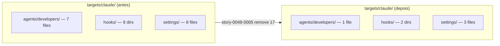

# História: Remover templates `targets/claude/{agents,hooks,settings}` não-Java

**ID:** story-0048-0005
**Chave Jira:** —
**Status:** Concluída

## 1. Dependências

| Blocked By | Blocks |
| :--- | :--- |
| story-0048-0003 | story-0048-0007 |

## 2. Regras Transversais Aplicáveis

| ID | Título |
| :--- | :--- |
| RULE-048-01 | Java-Only Scope |
| RULE-048-02 | Non-Language Dimensions Preserved |
| RULE-048-07 | Atomic, Reversible Commits |

## 3. Descrição

Como **Maintainer do gerador `ia-dev-env`**, eu quero deletar fisicamente os templates de recursos (`agents/developers/*-developer.md`, `hooks/*/`, `settings/*.json`) referentes a linguagens removidas (python, go, kotlin, typescript, rust, csharp), garantindo que a fonte-de-verdade em `java/src/main/resources/targets/claude/` reflita o escopo Java-only e que os assemblers `HooksAssembler`, `SettingsAssembler`, `AgentsAssembler` não tentem mais copiar ramos inexistentes.

Essa remoção é física (arquivos + diretórios apagados com `git rm`), não apenas lógica. São ~17 artefatos: 6 agents markdown, 6 diretórios de hooks (cada um com múltiplos scripts), 5 arquivos JSON de settings. Os assemblers já usam `StackMapping.HOOK_TEMPLATE_MAP` e `StackMapping.SETTINGS_LANG_MAP` (reduzidos em STORY-0048-0004) como source-of-truth, portanto a remoção física é segura desde que esses mapas estejam trimados. A ordem topológica `0003 → 0005` (não `0004 → 0005`) é possível porque os assemblers fazem lookup por chave — chaves removidas de `HOOK_TEMPLATE_MAP` em 0004 não resultam em NullPointer aqui se os arquivos já foram removidos em 0005 (os dois commits podem ocorrer em paralelo; a integração acontece no wave seguinte). Contudo, para simplificar revisão e evitar janela onde mapa referencia arquivo ausente, recomendamos merge de 0004 antes de 0005 (convenção, não técnica).

A story respeita RULE-048-02: nada em `targets/claude/skills/knowledge-packs/{architecture,data-management,infrastructure,compliance,resilience,observability}/` é tocado. Nada em `targets/claude/rules/core/` (rules numeradas 01-17) é tocado. Apenas os sub-diretórios específicos de linguagem.

### 3.1 Deleção de agents não-Java

- `java/src/main/resources/targets/claude/agents/developers/python-developer.md`
- `java/src/main/resources/targets/claude/agents/developers/go-developer.md`
- `java/src/main/resources/targets/claude/agents/developers/kotlin-developer.md`
- `java/src/main/resources/targets/claude/agents/developers/typescript-developer.md`
- `java/src/main/resources/targets/claude/agents/developers/rust-developer.md`
- `java/src/main/resources/targets/claude/agents/developers/csharp-developer.md`

**Preservar:** `java-developer.md` e qualquer outro agent não-linguagem (architect, qa, security, etc.).

### 3.2 Deleção de hooks não-Java

- `java/src/main/resources/targets/claude/hooks/python/` (dir completo)
- `java/src/main/resources/targets/claude/hooks/go/`
- `java/src/main/resources/targets/claude/hooks/kotlin/`
- `java/src/main/resources/targets/claude/hooks/typescript/`
- `java/src/main/resources/targets/claude/hooks/rust/`
- `java/src/main/resources/targets/claude/hooks/csharp/`

**Preservar:** `hooks/java-maven/`, `hooks/java-gradle/` e qualquer hook cross-language (git, format, lint genéricos).

### 3.3 Deleção de settings não-Java

- `java/src/main/resources/targets/claude/settings/python-pip.json`
- `java/src/main/resources/targets/claude/settings/go.json`
- `java/src/main/resources/targets/claude/settings/typescript-npm.json`
- `java/src/main/resources/targets/claude/settings/rust-cargo.json`
- `java/src/main/resources/targets/claude/settings/csharp-dotnet.json`

**Preservar:** `java-maven.json`, `java-gradle.json`, `base.json`.

### 3.4 Ajuste de assemblers

- `HooksAssembler`: remover ramos que referenciavam hooks não-Java (se houver branches hardcoded além do lookup em `HOOK_TEMPLATE_MAP`).
- `SettingsAssembler`: remover lookups a `python-pip.json`, `go.json`, etc.
- `AgentsAssembler`: remover branches que tentavam copiar `python-developer.md` etc.
- Testes (`HooksAssemblerTest`, `SettingsAssemblerTest`, `AgentsAssemblerTest`) ajustados para o subset Java.

## 3.5 Entrega de Valor

- **Redução de débito técnico:** 17 artefatos físicos + branches mortas em 3 assemblers removidos; superfície de source-of-truth para templates de linguagem cai em ~85% (6 linguagens → 1).
- **Redução de custo de manutenção:** contribuidor que adicionar nova hook Java não precisa mais decidir "devo espelhar para python/go/kotlin/…?"; PRs em `targets/claude/{agents,hooks,settings}/` ficam 6× mais rápidos de revisar.
- **Redução de tempo de build:** `mvn process-resources` deixa de copiar ~17 artefatos + dirs de hooks (cada um com 3-5 scripts); reduz tempo de regeneração `.claude/` e golden regeneration.

## 4. Definições de Qualidade Locais

### DoR Local (Definition of Ready)

- [ ] STORY-0048-0003 mergeada em `develop` (source-of-truth Java-only estabelecido; RULE-048-08)
- [ ] Inventário canônico de STORY-0048-0001 confirma lista exata dos 17 artefatos a remover
- [ ] Confirmado via grep que nenhum teste em `java/src/test/` importa ou referencia os 17 artefatos por path literal
- [ ] Branch `feature/story-0048-0005-remove-non-java-templates` criada

### DoD Local (Definition of Done)

- [ ] 6 arquivos em `agents/developers/` removidos via `git rm`
- [ ] 6 diretórios em `hooks/` removidos via `git rm -r`
- [ ] 5 arquivos em `settings/` removidos via `git rm`
- [ ] `HooksAssembler`, `SettingsAssembler`, `AgentsAssembler` não contêm branches hardcoded para linguagens removidas
- [ ] `HooksAssemblerTest`, `SettingsAssemblerTest`, `AgentsAssemblerTest` ajustados e verdes
- [ ] `mvn process-resources && mvn verify` verde
- [ ] Commits atômicos por task (RULE-048-07) com escopo `chore(task-0048-0005-NNN):` para deleções, `refactor(…)` para assemblers

### Global Definition of Done (DoD)

- **Cobertura:** ≥ 95% Line / ≥ 90% Branch (RULE-048-10)
- **Testes Automatizados:** ajuste em 3 testes de assembler; nenhum teste novo obrigatório
- **Documentação:** N/A
- **Persistência:** N/A
- **Performance:** redução mensurável em tempo de `mvn process-resources`

## 5. Contratos de Dados (Data Contract)

### 5.1 Inputs (estado anterior à story)

| Categoria | Artefatos (antes) |
| :--- | :--- |
| Agents | 7 arquivos (java + 6 não-Java) |
| Hooks | 8 diretórios (java-maven + java-gradle + 6 não-Java) |
| Settings | 8 arquivos (java-maven.json + java-gradle.json + base.json + 5 não-Java) |

### 5.2 Outputs (estado após a story)

| Categoria | Artefatos (depois) | Preservados |
| :--- | :--- | :--- |
| Agents | 1 arquivo de linguagem | `java-developer.md` (+ agents não-linguagem) |
| Hooks | 2 diretórios de linguagem | `java-maven/`, `java-gradle/` (+ hooks genéricos) |
| Settings | 3 arquivos de linguagem | `java-maven.json`, `java-gradle.json`, `base.json` |
| Removidos | 17 artefatos total | — |

### 5.3 Lista exata de deleções

| Path | Tipo |
| :--- | :--- |
| `java/src/main/resources/targets/claude/agents/developers/python-developer.md` | file |
| `java/src/main/resources/targets/claude/agents/developers/go-developer.md` | file |
| `java/src/main/resources/targets/claude/agents/developers/kotlin-developer.md` | file |
| `java/src/main/resources/targets/claude/agents/developers/typescript-developer.md` | file |
| `java/src/main/resources/targets/claude/agents/developers/rust-developer.md` | file |
| `java/src/main/resources/targets/claude/agents/developers/csharp-developer.md` | file |
| `java/src/main/resources/targets/claude/hooks/python/` | dir |
| `java/src/main/resources/targets/claude/hooks/go/` | dir |
| `java/src/main/resources/targets/claude/hooks/kotlin/` | dir |
| `java/src/main/resources/targets/claude/hooks/typescript/` | dir |
| `java/src/main/resources/targets/claude/hooks/rust/` | dir |
| `java/src/main/resources/targets/claude/hooks/csharp/` | dir |
| `java/src/main/resources/targets/claude/settings/python-pip.json` | file |
| `java/src/main/resources/targets/claude/settings/go.json` | file |
| `java/src/main/resources/targets/claude/settings/typescript-npm.json` | file |
| `java/src/main/resources/targets/claude/settings/rust-cargo.json` | file |
| `java/src/main/resources/targets/claude/settings/csharp-dotnet.json` | file |

## 6. Diagramas

### 6.1 Árvore de arquivos antes × depois



## 7. Critérios de Aceite (Gherkin)

```gherkin
Cenario: estado degenerado — artefatos não-Java ainda presentes
  DADO que os 17 artefatos não-Java existem em targets/claude/
  QUANDO grep "python-developer.md" targets/claude/agents/ roda
  ENTAO retorna 1 hit (confirma baseline pré-story)

Cenario: happy path — remoção completa + build verde
  DADO que os 17 artefatos foram deletados via git rm
  E os 3 assemblers foram ajustados
  QUANDO mvn process-resources && mvn verify roda
  ENTAO build verde
  E coverage ≥ 95% line / ≥ 90% branch
  E find targets/claude/agents/developers -name "*-developer.md" retorna apenas java-developer.md

Cenario: erro — assembler tenta referenciar hook removido
  DADO que HooksAssembler não foi ajustado após a remoção
  E hooks/python/ foi deletado
  QUANDO mvn test -Dtest=HooksAssemblerTest roda
  ENTAO o teste falha com NoSuchFileException ou assertion explícita
  E aponta o path python/ como ausente

Cenario: boundary — preservação de non-language agents e hooks genéricos
  DADO que a story foi concluída
  QUANDO ls targets/claude/agents/developers/ roda
  ENTAO java-developer.md permanece
  E quaisquer agents não-linguagem (architect, qa, security) permanecem intactos
```

### 7.1 Scenario Ordering (TPP)

> Degenerate → happy → error → boundary.

### 7.2 Mandatory Scenario Categories

- [x] Degenerate cases (baseline pré-story confirma artefatos existem)
- [x] Happy path (remoção + build verde)
- [x] Error paths (assembler não ajustado falha cedo)
- [x] Boundary values (não-linguagem preservado)

### 7.3 TDD Implementation Notes

- Os testes `HooksAssemblerTest`/`SettingsAssemblerTest`/`AgentsAssemblerTest` funcionam como acceptance tests (outer loop): quando passam após as 4 tasks, a story está green.
- TDD clássico não se aplica a deleção de resources (chore); inner loop é ajuste de assertions nos testes de assembler.

## 8. Tasks

### TASK-0048-0005-001: Deletar 6 agents não-Java

- **Layer:** Doc
- **Test Type:** Verification
- **Size:** S
- **Dependencies:** —
- **Branch:** `chore/task-0048-0005-001-remove-non-java-agents`
- **Testability:** Config + VerificationTest
- **Files:**
  - `java/src/main/resources/targets/claude/agents/developers/{python,go,kotlin,typescript,rust,csharp}-developer.md` (6 files deleted)
- **Acceptance Criteria:**
  - [ ] `git rm` em 6 arquivos
  - [ ] `find targets/claude/agents/developers -name "*-developer.md" | wc -l` == 1 (só `java-developer.md`)
  - [ ] Commit conventional `chore(task-0048-0005-001): remove non-java developer agents`

### TASK-0048-0005-002: Deletar 6 diretórios de hooks não-Java

- **Layer:** Doc
- **Test Type:** Verification
- **Size:** S
- **Dependencies:** —
- **Branch:** `chore/task-0048-0005-002-remove-non-java-hooks`
- **Testability:** Config + VerificationTest
- **Files:**
  - `java/src/main/resources/targets/claude/hooks/{python,go,kotlin,typescript,rust,csharp}/` (6 dirs deleted)
- **Acceptance Criteria:**
  - [ ] `git rm -r` em 6 diretórios
  - [ ] `ls targets/claude/hooks/` mostra apenas `java-maven/`, `java-gradle/` (+ dirs genéricos se existentes)
  - [ ] Commit conventional `chore(task-0048-0005-002): remove non-java hook templates`

### TASK-0048-0005-003: Deletar 5 settings JSON não-Java

- **Layer:** Doc
- **Test Type:** Verification
- **Size:** S
- **Dependencies:** —
- **Branch:** `chore/task-0048-0005-003-remove-non-java-settings`
- **Testability:** Config + VerificationTest
- **Files:**
  - `java/src/main/resources/targets/claude/settings/{python-pip,go,typescript-npm,rust-cargo,csharp-dotnet}.json` (5 files deleted)
- **Acceptance Criteria:**
  - [ ] `git rm` em 5 arquivos
  - [ ] `ls targets/claude/settings/*.json` mostra apenas `java-maven.json`, `java-gradle.json`, `base.json`
  - [ ] Commit conventional `chore(task-0048-0005-003): remove non-java settings templates`

### TASK-0048-0005-004: Ajustar HooksAssembler + SettingsAssembler + AgentsAssembler + testes

- **Layer:** Application
- **Test Type:** Unit
- **Size:** M
- **Dependencies:** TASK-0048-0005-001, TASK-0048-0005-002, TASK-0048-0005-003
- **Branch:** `refactor/task-0048-0005-004-assemblers-java-only`
- **Testability:** Domain + UnitTest
- **Files:**
  - `java/src/main/java/dev/iadev/application/assembler/HooksAssembler.java`
  - `java/src/main/java/dev/iadev/application/assembler/SettingsAssembler.java`
  - `java/src/main/java/dev/iadev/application/assembler/AgentsAssembler.java`
  - `java/src/test/java/dev/iadev/application/assembler/HooksAssemblerTest.java`
  - `java/src/test/java/dev/iadev/application/assembler/SettingsAssemblerTest.java`
  - `java/src/test/java/dev/iadev/application/assembler/AgentsAssemblerTest.java`
- **Acceptance Criteria:**
  - [ ] Branches hardcoded para linguagens removidas eliminadas nos 3 assemblers
  - [ ] Testes ajustados para asserir apenas subset Java
  - [ ] `mvn verify` verde com coverage ≥ 95% / ≥ 90%
