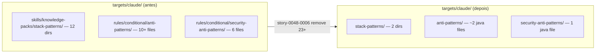

# História: Remover skills, rules, anti-patterns, security-anti-patterns não-Java

**ID:** story-0048-0006
**Chave Jira:** —
**Status:** Concluída

## 1. Dependências

| Blocked By | Blocks |
| :--- | :--- |
| story-0048-0003 | story-0048-0007 |

## 2. Regras Transversais Aplicáveis

| ID | Título |
| :--- | :--- |
| RULE-048-01 | Java-Only Scope |
| RULE-048-02 | Non-Language Dimensions Preserved |
| RULE-048-07 | Atomic, Reversible Commits |

## 3. Descrição

Como **Maintainer do gerador `ia-dev-env`**, eu quero remover fisicamente os stack-patterns knowledge-packs, rules condicionais de anti-patterns e security-anti-patterns específicos das linguagens removidas, garantindo que `targets/claude/skills/knowledge-packs/stack-patterns/` e `targets/claude/rules/conditional/{anti-patterns,security-anti-patterns}/` reflitam apenas Spring/Quarkus + Java, sem resíduos de fastapi/django/gin/ktor/etc.

Os stack-patterns knowledge-packs são diretórios com SKILL.md + references/ (padrões, glossário, exemplos) usados por assembler para enriquecer skills geradas. A story remove 8-10 dirs: `fastapi-patterns/`, `django-patterns/`, `click-cli-patterns/`, `gin-patterns/`, `ktor-patterns/`, `nestjs-patterns/`, `express-patterns/`, `axum-patterns/`, `dotnet-patterns/`, `commander-cli-patterns/`. Preserva integralmente: `spring-patterns/`, `quarkus-patterns/`. As rules condicionais seguem o mesmo padrão: 8 anti-pattern rules (uma por framework/linguagem) e 5 security-anti-pattern rules (uma por linguagem, exceto Java) são deletadas.

Os writers afetados — `SkillsAssembler`, `SkillsCopyHelper`, `FrameworkKpWriter`, `LanguageKpWriter`, `AntiPatternsRuleWriter`, `SecurityAntiPatternsRuleWriter` — precisam de ajuste para não tentar copiar/iterar sobre chaves removidas. Todos eles leem `StackMapping` ou `LanguageFrameworkMapping` como source-of-truth; após STORY-0048-0003 + STORY-0048-0004, esses mapas já estão Java-only, então o ajuste nos writers é mecânico (remover branches `if (language.equals("python"))` se existirem explicitamente, simplificar lookups).

A story respeita RULE-048-02: nada em `knowledge-packs/{architecture,data-management,infrastructure,compliance,resilience,observability}/` é tocado. Nenhuma rule core (01-17, 19) é tocada. Apenas `stack-patterns/` (dimensão linguagem-específica) e conditional rules por linguagem.

### 3.1 Deleção de stack-patterns knowledge-packs

Diretórios em `java/src/main/resources/targets/claude/skills/knowledge-packs/stack-patterns/` a remover:

- `fastapi-patterns/`
- `django-patterns/`
- `click-cli-patterns/`
- `gin-patterns/`
- `ktor-patterns/`
- `nestjs-patterns/`
- `express-patterns/`
- `axum-patterns/`
- `dotnet-patterns/`
- `commander-cli-patterns/`

**Preservar:** `spring-patterns/`, `quarkus-patterns/` (+ quaisquer patterns Java-agnostic que existam no dir).

### 3.2 Deleção de anti-pattern rules não-Java

Arquivos em `java/src/main/resources/targets/claude/rules/conditional/anti-patterns/` a remover:

- `10-anti-patterns.python-*.md` (ex: `python-general.md`, `python-fastapi.md` — exact filenames from inventário 0001)
- `10-anti-patterns.go-*.md`
- `10-anti-patterns.kotlin-*.md`
- `10-anti-patterns.typescript-*.md`
- `10-anti-patterns.rust-*.md`

**Preservar:** `10-anti-patterns.java-*.md` (ex: `10-anti-patterns.java-general.md`, `10-anti-patterns.java-spring.md`).

### 3.3 Deleção de security-anti-pattern rules não-Java

Arquivos em `java/src/main/resources/targets/claude/rules/conditional/security-anti-patterns/` a remover:

- `12-security-anti-patterns.python.md`
- `12-security-anti-patterns.go.md`
- `12-security-anti-patterns.kotlin.md`
- `12-security-anti-patterns.typescript.md`
- `12-security-anti-patterns.rust.md`

**Preservar:** `12-security-anti-patterns.java.md`.

### 3.4 Ajuste de writers

- `SkillsAssembler` / `SkillsCopyHelper`: remover branches hardcoded para languages não-Java, se existirem.
- `FrameworkKpWriter`: já itera sobre `StackMapping.FRAMEWORK_LANGUAGE_RULES` (reduzido em 0004) — ajuste mecânico.
- `LanguageKpWriter`: iteração sobre `LANGUAGE_COMMANDS` (reduzido); remover referência a dirs deletados se houver path literal.
- `AntiPatternsRuleWriter`: remover lookups a `10-anti-patterns.python-*.md` etc.
- `SecurityAntiPatternsRuleWriter`: remover lookups a `12-security-anti-patterns.python.md` etc.
- Testes unitários destes writers ajustados.

## 3.5 Entrega de Valor

- **Redução de débito técnico:** 10 stack-patterns dirs (cada um ~5-10 arquivos markdown) + 8 anti-pattern rules + 5 security-anti-pattern rules = 23+ pontos de source-of-truth eliminados; reduz surface de knowledge-packs em ~83% na dimensão linguagem.
- **Redução de custo de manutenção:** revisão de PRs em `stack-patterns/` deixa de exigir contexto multi-linguagem; contribuidor que adiciona padrão Spring novo não precisa mais checar se FastAPI/Gin têm paralelo; onboarding para knowledge-pack maintainers cai de 6 linguagens para 1 (Java).
- **Redução de tempo de build:** `mvn process-resources` copia ~23 dirs/arquivos a menos para cada um dos 9 goldens; agregado, milhares de operações de I/O removidas por execução de golden regen.

## 4. Definições de Qualidade Locais

### DoR Local (Definition of Ready)

- [ ] STORY-0048-0003 mergeada em `develop` (RULE-048-08)
- [ ] Inventário canônico de STORY-0048-0001 lista exata de stack-patterns dirs + anti-pattern rules + security-anti-pattern rules a remover (o spec do épico cita 10 stack-patterns mas o set exato é confirmado pelo inventário)
- [ ] Confirmado via grep que nenhum teste depende de path literal para arquivos a serem removidos
- [ ] Branch `feature/story-0048-0006-remove-non-java-skills-rules` criada

### DoD Local (Definition of Done)

- [ ] 10 stack-patterns dirs removidos via `git rm -r`
- [ ] 8 anti-pattern rules removidos via `git rm`
- [ ] 5 security-anti-pattern rules removidos via `git rm`
- [ ] 6 writers ajustados (`SkillsAssembler`, `SkillsCopyHelper`, `FrameworkKpWriter`, `LanguageKpWriter`, `AntiPatternsRuleWriter`, `SecurityAntiPatternsRuleWriter`)
- [ ] Testes correspondentes ajustados e verdes
- [ ] `mvn process-resources && mvn verify` verde com coverage ≥ 95% line / ≥ 90% branch
- [ ] Commits atômicos por task (RULE-048-07)

### Global Definition of Done (DoD)

- **Cobertura:** ≥ 95% Line / ≥ 90% Branch (RULE-048-10)
- **Testes Automatizados:** ajuste em 6 testes de writer; nenhum teste novo obrigatório
- **Documentação:** N/A
- **Persistência:** N/A

## 5. Contratos de Dados (Data Contract)

### 5.1 Inputs (estado anterior à story)

| Categoria | Artefatos (antes) |
| :--- | :--- |
| stack-patterns/ | 12 dirs (spring + quarkus + 10 não-Java) |
| anti-patterns rules | 10+ arquivos (java + 8+ não-Java) |
| security-anti-patterns rules | 6 arquivos (java + 5 não-Java) |

### 5.2 Outputs (estado após a story)

| Categoria | Artefatos (depois) | Preservados |
| :--- | :--- | :--- |
| stack-patterns/ | 2 dirs | `spring-patterns/`, `quarkus-patterns/` |
| anti-patterns rules | ~2 arquivos Java | `10-anti-patterns.java-*.md` |
| security-anti-patterns rules | 1 arquivo | `12-security-anti-patterns.java.md` |

### 5.3 Writers ajustados

| Writer | Tipo de ajuste |
| :--- | :--- |
| `SkillsAssembler` | remover branches hardcoded |
| `SkillsCopyHelper` | remover lookups a paths removidos |
| `FrameworkKpWriter` | iteração natural sobre mapa reduzido |
| `LanguageKpWriter` | iteração natural sobre mapa reduzido |
| `AntiPatternsRuleWriter` | remover lookups a rules removidas |
| `SecurityAntiPatternsRuleWriter` | remover lookups a rules removidas |

## 6. Diagramas

### 6.1 Árvore de arquivos antes × depois



## 7. Critérios de Aceite (Gherkin)

```gherkin
Cenario: estado degenerado — patterns não-Java ainda presentes
  DADO que fastapi-patterns/ existe em stack-patterns/
  QUANDO find targets/claude/skills/knowledge-packs/stack-patterns/ -type d roda
  ENTAO retorna ≥ 10 dirs (baseline pré-story)

Cenario: happy path — remoção completa + build verde
  DADO que 10 stack-patterns dirs + 8 anti-pattern rules + 5 security-anti-pattern rules foram removidos
  E os 6 writers foram ajustados
  QUANDO mvn process-resources && mvn verify roda
  ENTAO build verde
  E ls stack-patterns/ mostra apenas spring-patterns/, quarkus-patterns/
  E ls conditional/anti-patterns/ mostra apenas 10-anti-patterns.java-*.md
  E ls conditional/security-anti-patterns/ mostra apenas 12-security-anti-patterns.java.md

Cenario: erro — FrameworkKpWriter tenta iterar chave removida
  DADO que FRAMEWORK_LANGUAGE_RULES foi reduzido (0004)
  E FrameworkKpWriter não foi ajustado (legado)
  QUANDO FrameworkKpWriterTest roda
  ENTAO o teste falha apontando chave ausente com mensagem clara

Cenario: boundary — knowledge-packs não-linguagem preservados
  DADO que a story foi concluída
  QUANDO ls skills/knowledge-packs/ roda
  ENTAO architecture/, data-management/, infrastructure/, compliance/, resilience/, observability/ permanecem intactos (RULE-048-02)
```

### 7.1 Scenario Ordering (TPP)

> Degenerate → happy → error → boundary.

### 7.2 Mandatory Scenario Categories

- [x] Degenerate cases (baseline pré-story)
- [x] Happy path (remoção + build verde)
- [x] Error paths (writer não ajustado falha)
- [x] Boundary values (RULE-048-02 compliance confirmada)

### 7.3 TDD Implementation Notes

- Testes dos 6 writers servem como acceptance tests (outer loop).
- Deleção de resources é chore — TDD clássico não se aplica, inner loop fica em ajuste de asserts nos testes.

## 8. Tasks

### TASK-0048-0006-001: Deletar 10 stack-patterns dirs não-Java

- **Layer:** Doc
- **Test Type:** Verification
- **Size:** S
- **Dependencies:** —
- **Branch:** `chore/task-0048-0006-001-remove-non-java-stack-patterns`
- **Testability:** Config + VerificationTest
- **Files:**
  - `java/src/main/resources/targets/claude/skills/knowledge-packs/stack-patterns/{fastapi,django,click-cli,gin,ktor,nestjs,express,axum,dotnet,commander-cli}-patterns/` (10 dirs)
- **Acceptance Criteria:**
  - [ ] `git rm -r` em 10 diretórios
  - [ ] `ls stack-patterns/` mostra apenas `spring-patterns/`, `quarkus-patterns/`
  - [ ] Commit conventional `chore(task-0048-0006-001): remove non-java stack-patterns`

### TASK-0048-0006-002: Deletar 8 anti-pattern rules não-Java

- **Layer:** Doc
- **Test Type:** Verification
- **Size:** S
- **Dependencies:** —
- **Branch:** `chore/task-0048-0006-002-remove-non-java-anti-patterns`
- **Testability:** Config + VerificationTest
- **Files:**
  - `java/src/main/resources/targets/claude/rules/conditional/anti-patterns/10-anti-patterns.{python,go,kotlin,typescript,rust}-*.md` (8 files, exact names per inventário 0001)
- **Acceptance Criteria:**
  - [ ] `git rm` em 8 arquivos
  - [ ] `ls conditional/anti-patterns/` mostra apenas `10-anti-patterns.java-*.md`
  - [ ] Commit conventional `chore(task-0048-0006-002): remove non-java anti-patterns rules`

### TASK-0048-0006-003: Deletar 5 security-anti-pattern rules não-Java

- **Layer:** Doc
- **Test Type:** Verification
- **Size:** S
- **Dependencies:** —
- **Branch:** `chore/task-0048-0006-003-remove-non-java-security-anti-patterns`
- **Testability:** Config + VerificationTest
- **Files:**
  - `java/src/main/resources/targets/claude/rules/conditional/security-anti-patterns/12-security-anti-patterns.{python,go,kotlin,typescript,rust}.md` (5 files)
- **Acceptance Criteria:**
  - [ ] `git rm` em 5 arquivos
  - [ ] `ls conditional/security-anti-patterns/` mostra apenas `12-security-anti-patterns.java.md`
  - [ ] Commit conventional `chore(task-0048-0006-003): remove non-java security-anti-patterns rules`

### TASK-0048-0006-004: Ajustar 6 writers + testes

- **Layer:** Application
- **Test Type:** Unit
- **Size:** M
- **Dependencies:** TASK-0048-0006-001, TASK-0048-0006-002, TASK-0048-0006-003
- **Branch:** `refactor/task-0048-0006-004-writers-java-only`
- **Testability:** Domain + UnitTest
- **Files:**
  - `java/src/main/java/dev/iadev/application/assembler/SkillsAssembler.java`
  - `java/src/main/java/dev/iadev/application/assembler/SkillsCopyHelper.java`
  - `java/src/main/java/dev/iadev/application/assembler/FrameworkKpWriter.java`
  - `java/src/main/java/dev/iadev/application/assembler/LanguageKpWriter.java`
  - `java/src/main/java/dev/iadev/application/assembler/AntiPatternsRuleWriter.java`
  - `java/src/main/java/dev/iadev/application/assembler/SecurityAntiPatternsRuleWriter.java`
  - `java/src/test/java/dev/iadev/application/assembler/{SkillsAssembler,SkillsCopyHelper,FrameworkKpWriter,LanguageKpWriter,AntiPatternsRuleWriter,SecurityAntiPatternsRuleWriter}Test.java`
- **Acceptance Criteria:**
  - [ ] Branches hardcoded para linguagens removidas eliminadas nos 6 writers
  - [ ] Testes ajustados para asserir apenas subset Java
  - [ ] `mvn verify` verde com coverage ≥ 95% / ≥ 90%
