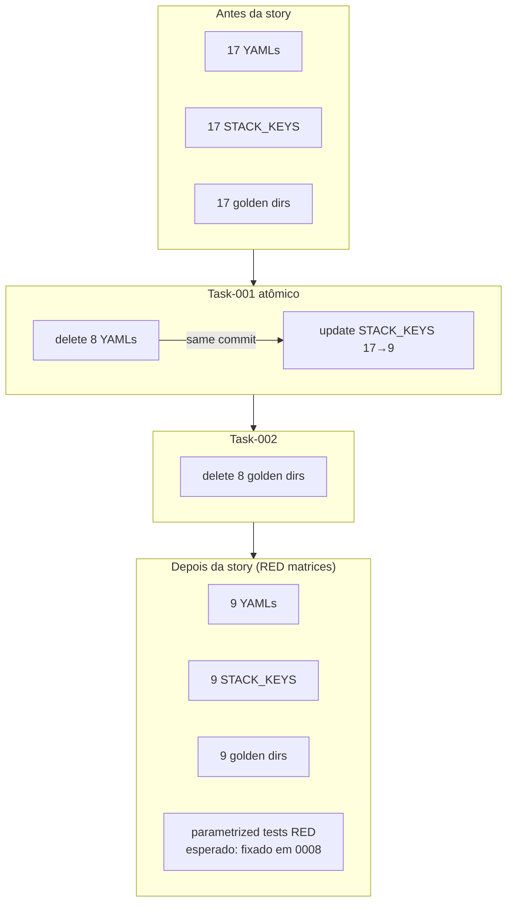

# História: Remover 8 goldens + 8 YAMLs setup-config não-Java (atomicamente — simetria YAML↔STACK_KEYS)

**ID:** story-0048-0007
**Chave Jira:** —
**Status:** Pendente

## 1. Dependências

| Blocked By | Blocks |
| :--- | :--- |
| story-0048-0003, story-0048-0005, story-0048-0006 | story-0048-0008 |

## 2. Regras Transversais Aplicáveis

| ID | Título |
| :--- | :--- |
| RULE-048-01 | Java-Only Scope |
| RULE-048-03 | Golden Byte-for-Byte Parity (9 Java Profiles) |
| RULE-048-07 | Atomic, Reversible Commits |
| RULE-048-08 | Investigation Precedes Removal |

## 3. Descrição

Como **Maintainer do gerador `ia-dev-env`**, eu quero deletar atomicamente os 8 diretórios de golden files não-Java (~2.835 arquivos) e os 8 YAMLs `setup-config.*.yaml` correspondentes, garantindo que a simetria `YAML ↔ STACK_KEYS ↔ SmokeProfiles` validada por `ProfileRegistrationIntegrityTest` permaneça consistente durante e após a remoção — a atomicidade é o que define esta história como **high-risk**.

A simetria funciona assim: `ProfileRegistrationIntegrityTest` falha se `setup-config.X.yaml` existir em `shared/config-templates/` mas `STACK_KEYS` (em `ConfigProfiles`) não o referenciar (e vice-versa). Se deletarmos os 8 YAMLs em um commit e atualizarmos `STACK_KEYS` em outro commit, teremos uma janela onde `mvn test` está RED — quebrando `develop` para quem rebase naquele ponto. Portanto esta story força **atomicidade hard**: a remoção de cada YAML + sua remoção no `STACK_KEYS` vão no MESMO commit (task-001), e só depois os 2.835 arquivos de golden são deletados (task-002) — nessa ordem os testes ficam RED durante o commit intermediário, mas a simetria já está resolvida; ou alternativamente os 3 passos (YAMLs + STACK_KEYS + goldens) vão num único commit maior, o que é aceitável por esta história ser explicitamente high-risk.

**Importante:** testes parametrizados sobre os 17 perfis (SmokeProfiles, GoldenFileTest, ConfigProfilesTest, GoldenFileCoverageTest) QUEBRARÃO após esta story. **Isso é esperado** e é a fase RED de STORY-0048-0008, que trima todos os testes parametrizados no wave seguinte. STORY-0048-0008 é Blocked By 0007 exatamente por isso. A janela RED é minimizada mergeando 0007 → 0008 em sequência contínua (um após o outro, sem delay).

A story depende de 0003 (source-of-truth estabelecido), 0005 (templates agents/hooks/settings removidos — evita inconsistência triangular), e 0006 (stack-patterns/rules removidos — idem). Respeita RULE-048-08 (inventário de 0001 é gate).

### 3.1 Deleção de YAMLs setup-config não-Java

Arquivos a deletar em `java/src/main/resources/shared/config-templates/`:

- `setup-config.go-gin.yaml`
- `setup-config.kotlin-ktor.yaml`
- `setup-config.python-click-cli.yaml`
- `setup-config.python-fastapi.yaml`
- `setup-config.python-fastapi-timescale.yaml`
- `setup-config.rust-axum.yaml`
- `setup-config.typescript-commander-cli.yaml`
- `setup-config.typescript-nestjs.yaml`

**Preservar:** 9 YAMLs `setup-config.java-*.yaml`.

### 3.2 Atualização atômica de STACK_KEYS em ConfigProfiles

- `ConfigProfiles.STACK_KEYS` (ou equivalente) reduzido de 17 para 9 entradas.
- Mudança committed junto à deleção dos 8 YAMLs para preservar simetria bidirecional.

### 3.3 Deleção dos 8 diretórios de golden files não-Java

Diretórios a deletar em `java/src/test/resources/golden/`:

- `go-gin/`
- `kotlin-ktor/`
- `python-click-cli/`
- `python-fastapi/`
- `python-fastapi-timescale/`
- `rust-axum/`
- `typescript-commander-cli/`
- `typescript-nestjs/`

Total: ~2.835 arquivos. **Preservar:** 9 dirs `java-*/` listados em RULE-048-03.

### 3.4 Validação local pré-push

- Executar `ProfileRegistrationIntegrityTest` localmente após task-001 — deve passar (simetria preservada).
- Executar `GoldenFileTest` — deve falhar (esperado, será fixado em 0008).
- PR body explicita: "testes parametrizados quebrarão em 0007; fixados em 0008 (RED→GREEN across stories)".

## 3.5 Entrega de Valor

- **Redução de débito técnico:** ~2.835 arquivos golden deletados + 8 YAMLs de configuração + 8 entradas em `STACK_KEYS` = maior deleção física do épico em volume; elimina ~60% do footprint do repositório em arquivos de teste por perfil.
- **Redução de custo de manutenção:** golden regeneration em CI deixa de processar 8 perfis não-Java (~2.835 arquivos); cada rodada futura de `GoldenFileRegenerator` será proporcionalmente mais rápida; redução significativa de falsos positivos em PRs (diffs cross-linguagem causavam revisão manual cara).
- **Redução de tempo de build:** `mvn test` reduz matriz de 17 para 9 perfis apenas nesta story — contribuição direta para meta épica de −30%; estimativa: 40-50% de redução isolada em tempo de smoke tests parametrizados.

## 4. Definições de Qualidade Locais

### DoR Local (Definition of Ready)

- [ ] STORY-0048-0003, 0005, 0006 mergeadas em `develop`
- [ ] Inventário canônico de STORY-0048-0001 confirma exatamente os 8 YAMLs + 8 golden dirs + localização da constante `STACK_KEYS`
- [ ] Tag `pre-story-0048-0007-goldens` criada em `develop` (rollback anchor extra por ser high-risk)
- [ ] Baseline medido: `find golden -type f | wc -l` documentado como métrica pré
- [ ] Branch `feature/story-0048-0007-remove-non-java-goldens-yamls` criada

### DoD Local (Definition of Done)

- [ ] 8 YAMLs `setup-config.*.yaml` removidos
- [ ] `ConfigProfiles.STACK_KEYS` reduzido a 9 entradas (no MESMO commit dos YAMLs ou commit imediatamente posterior mas antes de qualquer outra mudança)
- [ ] 8 dirs de golden removidos (~2.835 arquivos)
- [ ] `ProfileRegistrationIntegrityTest` passa verde localmente após cada task commit (simetria preservada)
- [ ] PR body documenta explicitamente: "parametrized tests breaking here; fixed in story-0048-0008"
- [ ] Commit atômico por task (RULE-048-07) com escopo `chore(task-0048-0007-NNN):`
- [ ] Baseline pós medido: `find golden -type f | wc -l` ≤ 2.500 (Metric 1 do épico Seção 10)

### Global Definition of Done (DoD)

- **Cobertura:** ≥ 95% Line / ≥ 90% Branch (RULE-048-10) — medida será ajustada em 0008 quando matrizes param reduzirem
- **Testes Automatizados:** `ProfileRegistrationIntegrityTest` valida simetria durante a story; outros testes parametrizados ficam RED (esperado)
- **Golden Parity:** 9 goldens Java intactos byte-a-byte (RULE-048-03)
- **Documentação:** PR body com explicação da janela RED; CHANGELOG entry preliminar

## 5. Contratos de Dados (Data Contract)

### 5.1 Inputs (estado anterior à story)

| Artefato | Estado Antes |
| :--- | :--- |
| `shared/config-templates/setup-config.*.yaml` | 17 arquivos |
| `ConfigProfiles.STACK_KEYS` | 17 entradas |
| `java/src/test/resources/golden/` | 17 dirs (~5.347 arquivos) |

### 5.2 Outputs (estado após a story)

| Artefato | Estado Depois |
| :--- | :--- |
| `shared/config-templates/setup-config.*.yaml` | 9 arquivos (todos `java-*`) |
| `ConfigProfiles.STACK_KEYS` | 9 entradas |
| `java/src/test/resources/golden/` | 9 dirs (~2.500 arquivos, métrica alvo do épico) |

### 5.3 Lista exata de deleções

| Path | Tipo | Arquivos aprox. |
| :--- | :--- | :--- |
| `shared/config-templates/setup-config.go-gin.yaml` | file | 1 |
| `shared/config-templates/setup-config.kotlin-ktor.yaml` | file | 1 |
| `shared/config-templates/setup-config.python-click-cli.yaml` | file | 1 |
| `shared/config-templates/setup-config.python-fastapi.yaml` | file | 1 |
| `shared/config-templates/setup-config.python-fastapi-timescale.yaml` | file | 1 |
| `shared/config-templates/setup-config.rust-axum.yaml` | file | 1 |
| `shared/config-templates/setup-config.typescript-commander-cli.yaml` | file | 1 |
| `shared/config-templates/setup-config.typescript-nestjs.yaml` | file | 1 |
| `golden/go-gin/` | dir | ~350 |
| `golden/kotlin-ktor/` | dir | ~350 |
| `golden/python-click-cli/` | dir | ~330 |
| `golden/python-fastapi/` | dir | ~360 |
| `golden/python-fastapi-timescale/` | dir | ~380 |
| `golden/rust-axum/` | dir | ~340 |
| `golden/typescript-commander-cli/` | dir | ~360 |
| `golden/typescript-nestjs/` | dir | ~365 |

### 5.4 Testes que ficarão RED durante a janela 0007 → 0008

| Teste | Motivo | Fix Em |
| :--- | :--- | :--- |
| `SmokeProfilesTest` (via `SmokeProfiles#profileList`) | Itera 17 perfis, 8 sem YAML/golden | 0048-0008 |
| `GoldenFileTest` | Itera 17 perfis sem goldens de 8 | 0048-0008 |
| `ConfigProfilesTest` | Parametrizado sobre 17 YAMLs | 0048-0008 |
| `GoldenFileCoverageTest` | `PENDING_SMOKE_PROFILES` inconsistente | 0048-0008 |
| `ProfileRegistrationIntegrityTest` | Se STACK_KEYS não alinhado c/ YAMLs | preserved atomicamente em 0007 |

## 6. Diagramas

### 6.1 Simetria YAML↔STACK_KEYS↔golden (atômico)



## 7. Critérios de Aceite (Gherkin)

```gherkin
Cenario: estado degenerado — 17 perfis ainda registrados
  DADO que ConfigProfiles.STACK_KEYS tem 17 entradas
  E 17 YAMLs existem em shared/config-templates/
  QUANDO ProfileRegistrationIntegrityTest roda
  ENTAO o teste passa verde (baseline pré-story)

Cenario: happy path — remoção atômica preserva simetria
  DADO que task-001 removeu 8 YAMLs E atualizou STACK_KEYS no mesmo commit
  QUANDO ProfileRegistrationIntegrityTest roda após o commit
  ENTAO o teste passa verde
  E os 9 YAMLs restantes são todos java-*

Cenario: erro — deleção não-atômica quebra simetria
  DADO que 8 YAMLs foram removidos mas STACK_KEYS ainda tem 17 entradas (violação da regra atômica)
  QUANDO ProfileRegistrationIntegrityTest roda
  ENTAO o teste falha apontando as 8 entradas STACK_KEYS órfãs
  E o commit é rejeitado pelo pre-commit chain

Cenario: boundary — 9 goldens Java permanecem byte-for-byte
  DADO que a story foi concluída
  QUANDO find golden -type d -maxdepth 1 roda
  ENTAO retorna exatamente 9 dirs, todos java-*
  E GoldenFileTest nos 9 perfis Java ainda passa byte-a-byte (RULE-048-03)
```

### 7.1 Scenario Ordering (TPP)

> Degenerate (baseline) → happy (atomic) → error (non-atomic) → boundary (Java parity).

### 7.2 Mandatory Scenario Categories

- [x] Degenerate cases (17 perfis pré-story)
- [x] Happy path (atomic removal + integrity passa)
- [x] Error paths (non-atomic quebra simetria)
- [x] Boundary values (9 Java goldens intactos)

### 7.3 TDD Implementation Notes

- **Outer loop (AT)**: `ProfileRegistrationIntegrityTest` valida simetria em cada commit intermediário.
- Inner loop: N/A (chore de deleção; não há RED-GREEN-REFACTOR aqui, apenas atomicidade).
- A janela RED entre 0007 e 0008 é explícita e documentada — não é anti-pattern TDD, é sequenciamento inter-stories.

## 8. Tasks

### TASK-0048-0007-001: Deletar 8 YAMLs + atualizar STACK_KEYS atomicamente

- **Layer:** Config
- **Test Type:** Verification (ProfileRegistrationIntegrityTest)
- **Size:** M
- **Dependencies:** —
- **Branch:** `chore/task-0048-0007-001-remove-yamls-stack-keys-atomic`
- **Testability:** Config + VerificationTest
- **Files:**
  - `java/src/main/resources/shared/config-templates/setup-config.{go-gin,kotlin-ktor,python-click-cli,python-fastapi,python-fastapi-timescale,rust-axum,typescript-commander-cli,typescript-nestjs}.yaml` (8 files deleted)
  - `java/src/main/java/dev/iadev/config/ConfigProfiles.java` (STACK_KEYS reduced 17→9)
- **Acceptance Criteria:**
  - [ ] 8 YAMLs removidos via `git rm`
  - [ ] `ConfigProfiles.STACK_KEYS.size() == 9`
  - [ ] `ProfileRegistrationIntegrityTest` verde após o commit
  - [ ] Commit único (atomic) conventional `chore(task-0048-0007-001): remove non-java yamls + align STACK_KEYS`

### TASK-0048-0007-002: Deletar 8 dirs de golden não-Java (~2.835 arquivos)

- **Layer:** Test
- **Test Type:** Verification
- **Size:** L (volume)
- **Dependencies:** TASK-0048-0007-001
- **Branch:** `chore/task-0048-0007-002-remove-non-java-goldens`
- **Testability:** Config + VerificationTest
- **Files:**
  - `java/src/test/resources/golden/{go-gin,kotlin-ktor,python-click-cli,python-fastapi,python-fastapi-timescale,rust-axum,typescript-commander-cli,typescript-nestjs}/` (8 dirs deleted)
- **Acceptance Criteria:**
  - [ ] `git rm -r` em 8 diretórios
  - [ ] `find java/src/test/resources/golden -maxdepth 1 -type d | wc -l` == 10 (9 java-* + golden/ raiz)
  - [ ] `find golden -type f | wc -l` ≤ 2.500 (métrica alvo épica)
  - [ ] Commit conventional `chore(task-0048-0007-002): remove non-java golden dirs`

### TASK-0048-0007-003: Validar simetria local (dry-run test suite)

- **Layer:** Test
- **Test Type:** Verification
- **Size:** S
- **Dependencies:** TASK-0048-0007-002
- **Branch:** `test/task-0048-0007-003-symmetry-dry-run`
- **Testability:** Config + VerificationTest
- **Files:**
  - (no code changes — verification run only)
  - PR body documentation
- **Acceptance Criteria:**
  - [ ] `mvn test -Dtest=ProfileRegistrationIntegrityTest` verde
  - [ ] `mvn test -Dtest=GoldenFileTest` RED esperado (documentado no PR body)
  - [ ] `mvn test -Dtest=SmokeProfilesTest` RED esperado
  - [ ] PR body contém parágrafo explicitando a janela RED e link para 0048-0008 como fix
